# Unix&Linux快速入门超详细教程：P4：02-2-1 内核版本介绍 🧠

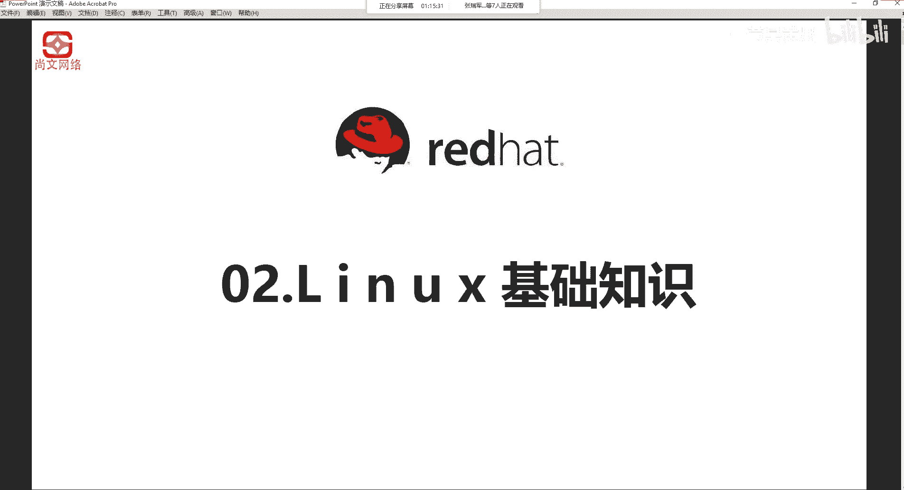

在本节中，我们将学习Linux内核版本的基础知识。了解内核版本的命名规则和含义，对于选择合适的系统版本至关重要。

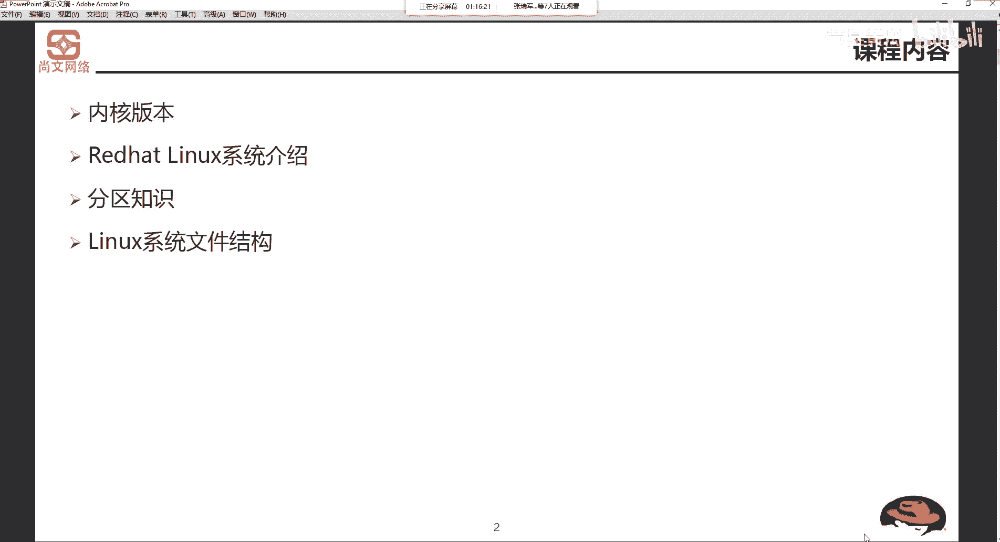

Linux内核的开发和规范由Linus Torvalds及其领导小组控制，其版本是唯一的。开发小组会定期发布新版本或修正版。从1991年10月Linus Torvalds公开发布0.02版本（0.01版本因功能简陋未公开发布）至今，内核版本已发展到5.x系列。随着版本更新，其功能也日益强大。

无论版本如何演变，Linux内核的版本号都遵循特定的命名规则。

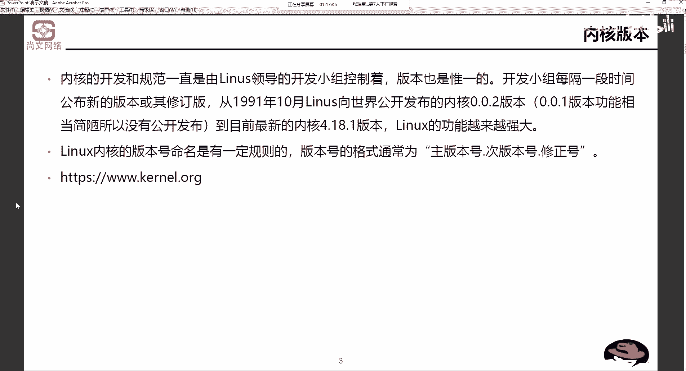

## 内核版本命名规则

Linux内核版本号通常由三部分组成，格式为：**主版本号.次版本号.修正号**。

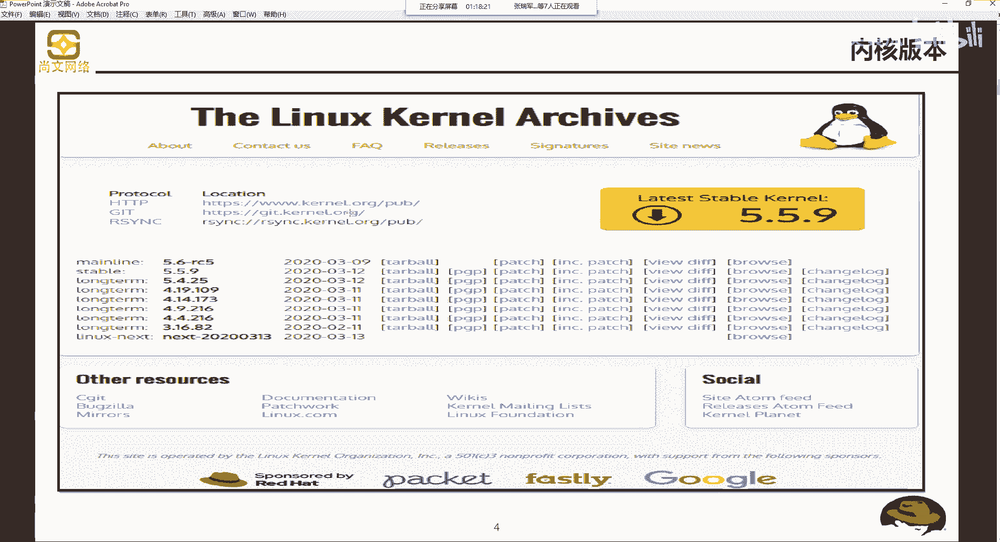

其具体含义如下：
*   **主版本号 (R)**：代表当前发布的内核主要版本。例如，在版本 `5.5.9` 中，`5` 就是主版本号。
*   **次版本号 (X)**：这个数字至关重要，它决定了版本的稳定性。
    *   如果次版本号是**偶数**（如 2, 4, 6），则表示这是一个**稳定版本**，适合用于生产环境。
    *   如果次版本号是**奇数**（如 1, 3, 5），则表示这是一个**开发中或测试中的版本**，可能包含实验性功能，稳定性无法保证。
*   **修正号 (Y-Z)**：代表修补错误或安全漏洞的次数。例如，在版本 `4.14.173` 中，`173` 就是修正号。

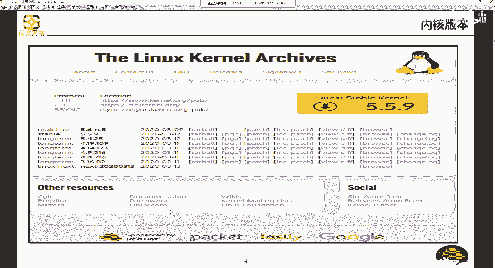

## 如何获取内核

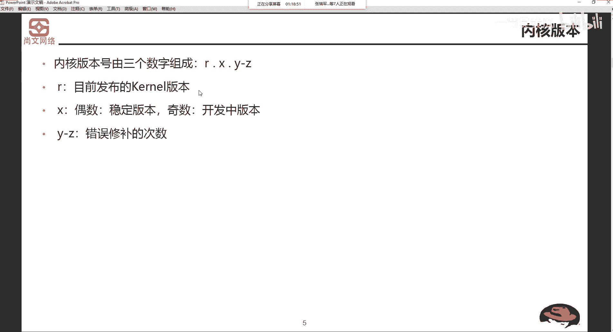

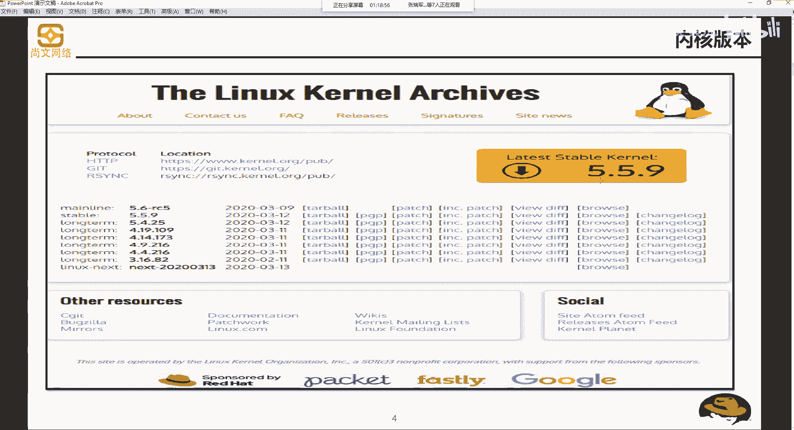

官方内核源代码发布在 `https://www.kernel.org` 网站上。访问该网站，你可以找到最新的稳定版本以及长期维护的版本。

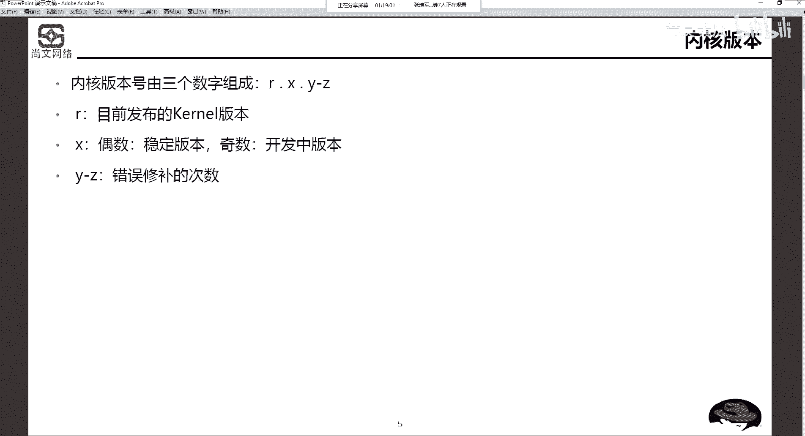

例如，网站可能显示：
*   `Latest stable kernel: 5.5.9`
*   其他可用版本如：`5.6`, `5.5`, `5.4`, `4.19`, `4.14`, `4.9`, `4.4` 等。

## 版本选择建议

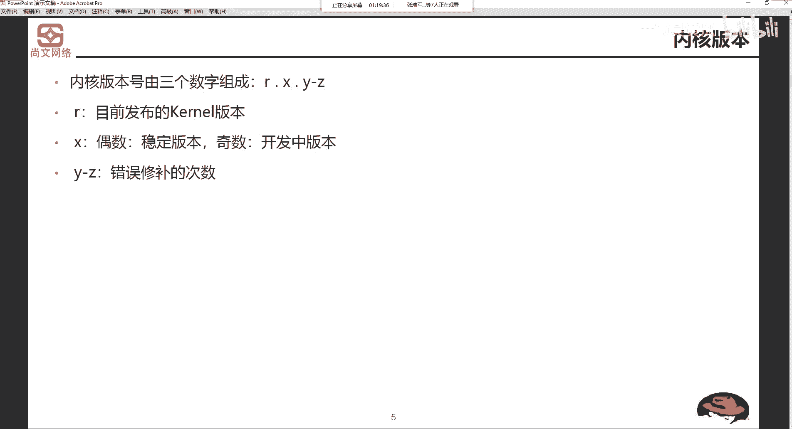

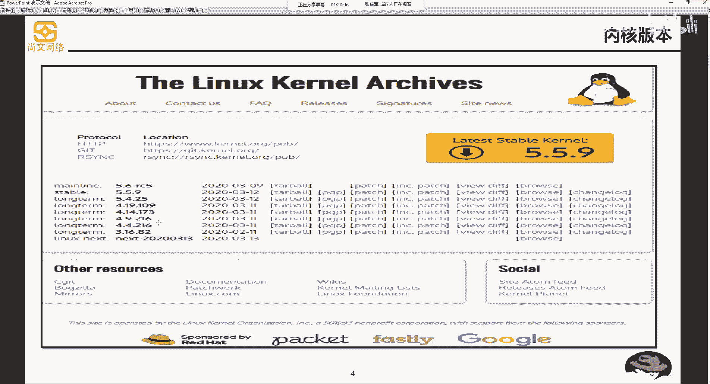

了解命名规则后，我们在选择或升级内核时就需要进行审慎评估。

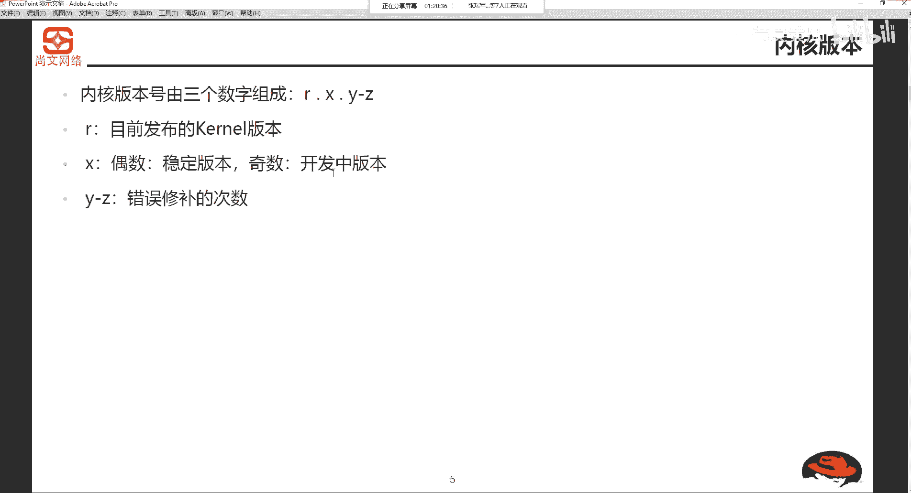

以下是选择内核版本时的考量点：
*   对于生产环境服务器，应优先选择**次版本号为偶数**的稳定版本（如 `4.14.173`）。
*   对于次版本号为奇数的开发版本（如 `5.5.9`），建议仅在测试环境中进行试用和评估，确认其稳定性和兼容性后，再考虑是否应用于生产环境。
*   直接使用最新版本的内核可能存在风险，务必根据次版本号的奇偶性进行判断。

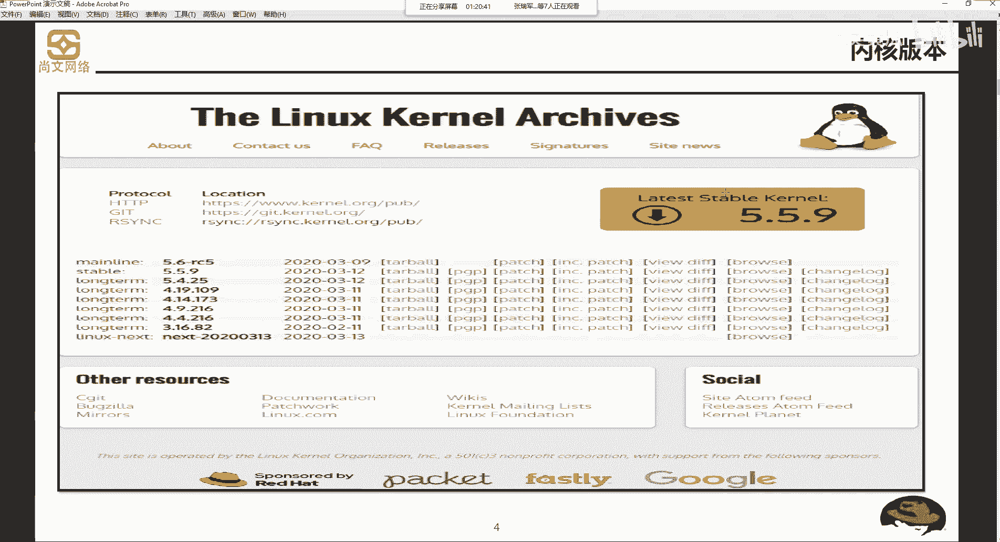

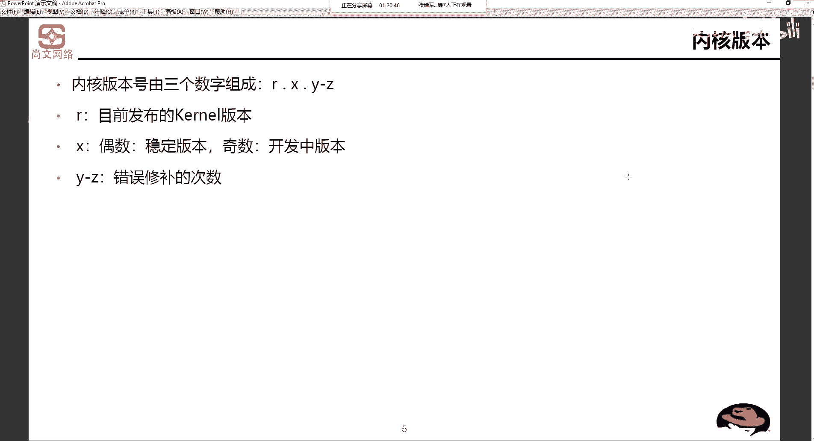

## 总结

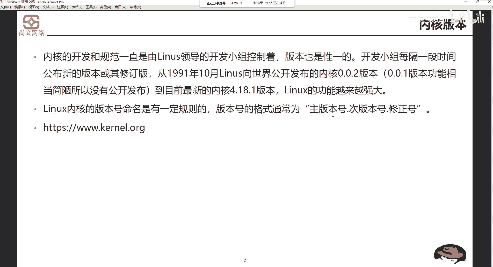

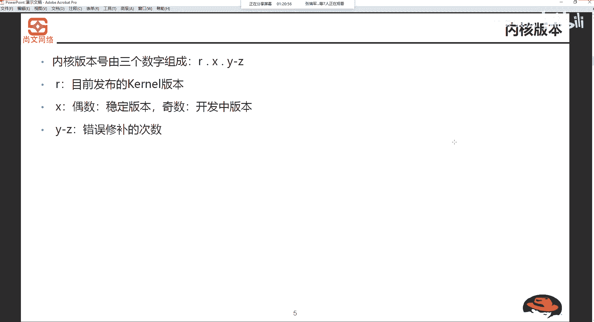

本节课我们一起学习了Linux内核版本的核心知识。我们掌握了内核版本号 **R.X.Y-Z** 的命名规则，特别是**次版本号X的奇偶性决定了版本的稳定性**。我们还了解了如何从官方渠道获取内核，并获得了针对不同环境选择合适版本的重要建议。理解这些是安全、高效管理Linux系统的基础。