# Unix&Linux快速入门超详细教程-7天通关RHCE：P5：02-2-2 RHEL7.x介绍 🚀

在本节课中，我们将要学习红帽企业版Linux（RHEL）的发展历史、产品线以及RHEL 7.x版本的核心特性。我们将重点理解发行版本与内核版本的关系，这对于系统部署和兼容性至关重要。

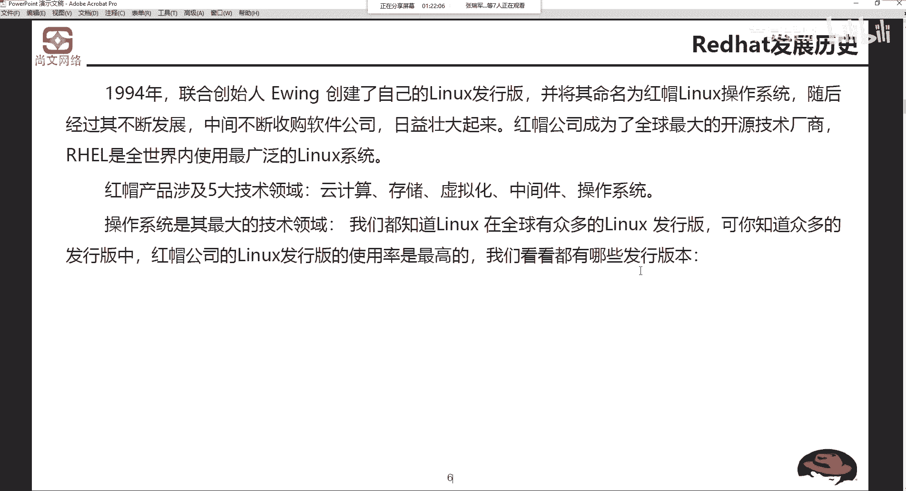

## 红帽发展历史与产品线

1994年，联合创始人Ervin创建了自己的Linux发行版本，并将其命名为红帽Linux系统。红帽的产品目前涵盖五大技术领域：云计算、存储、虚拟化、中间件以及操作系统。红帽现已被IBM收购，双方正在进行资源整合。

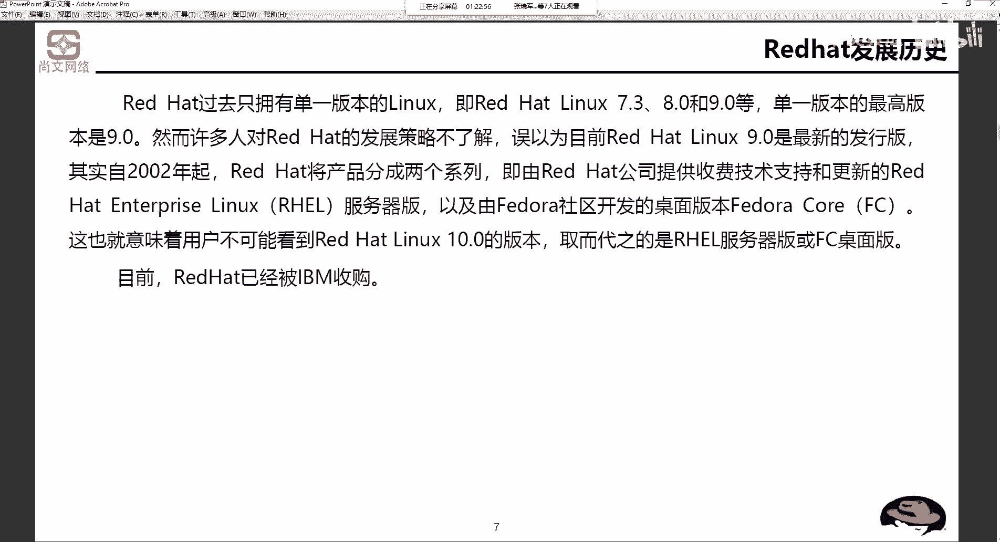

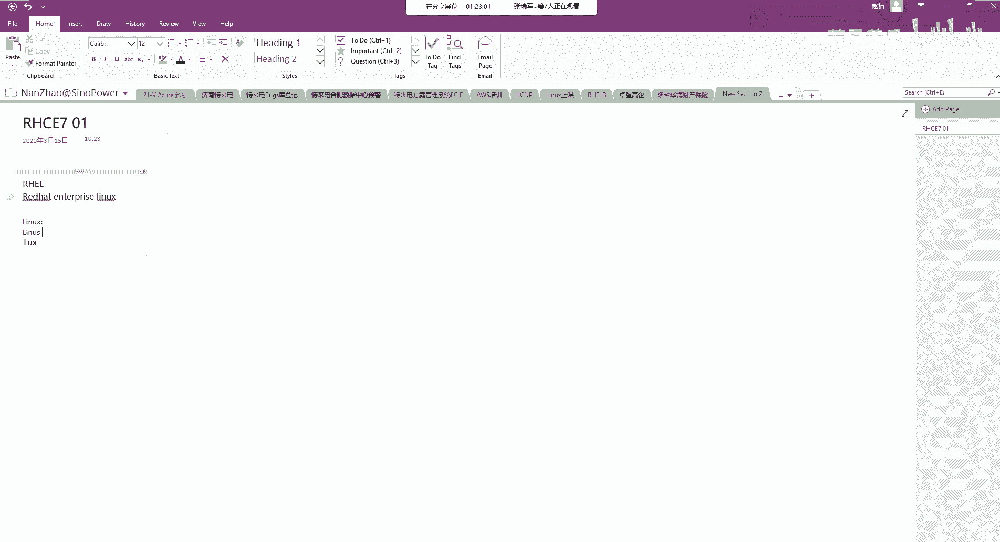

在众多Linux发行版中，红帽的Linux发行版本是全球使用率最高的。

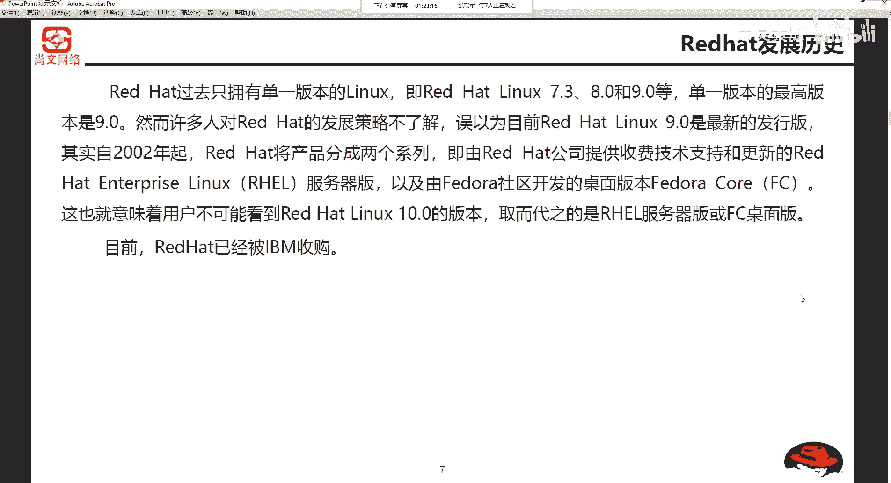

## 红帽Linux版本演变

最初，红帽Linux是单一版本系列，例如Red Hat Linux 9.0。从2002年开始，红帽将产品线分为两个系列：

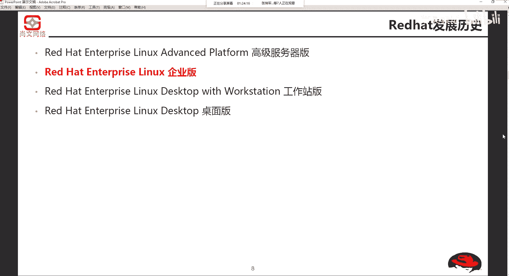

以下是两个主要的产品分支：
*   **Red Hat Enterprise Linux (RHEL)**：提供收费技术支持和更新的企业级版本。
*   **Fedora Core (FC)**：由社区开发的桌面版本。

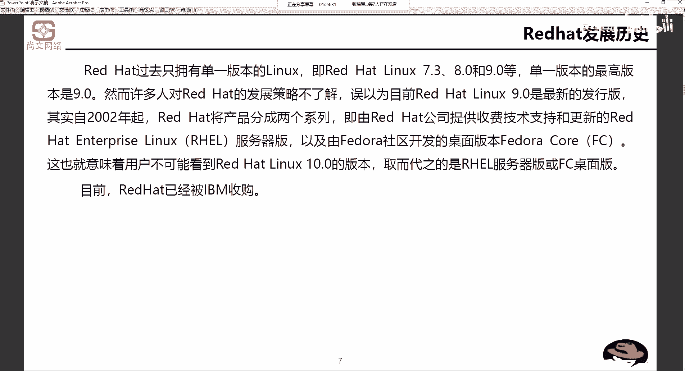

目前，红帽已被IBM收购。在Red Hat Enterprise Linux这个分支下，又细分为多个级别：
*   Red Hat Enterprise Linux AS (Advanced Platform)：高级服务器版本。
*   Red Hat Enterprise Linux ES (Enterprise Server)：企业服务器版本。
*   Red Hat Enterprise Linux WS (Workstation)：工作站版本。

我们的课程将重点关注 **Red Hat Enterprise Linux (RHEL)**。

## 发行版本与内核版本

上一节我们介绍了红帽的产品分支，本节中我们来看看版本号的具体含义。为了及时添加新功能和修补错误，红帽在主要版本发布后会不定期推出更新（Update）。

例如：
*   Red Hat Enterprise Linux 4 Update 1
*   Red Hat Enterprise Linux 4 Update 2

在本教程中，我们将接触 **Red Hat Enterprise Linux 7 Update 6**，简称为 **RHEL 7.6**。这里的“7”是主版本号。目前RHEL的最新主版本是8，但RHCE认证考试（在本教程制作时）仍基于7.x版本。

每个RHEL发行版本都对应一个特定的Linux内核版本。例如，RHEL 7.6 对应的内核版本是 **3.10.0**。

内核版本的格式为：**主版本号.次版本号.修正号**
*   主版本号：3
*   次版本号：10（偶数为稳定版本）
*   修正号：0-862（代表第862次修正）

理解发行版本与内核版本的对应关系非常重要。在部署系统前，需要与开发或业务人员沟通，确认其应用程序或模块所支持的内核版本或RHEL发行版本，以避免兼容性问题。

## RHEL 7.x 新特性

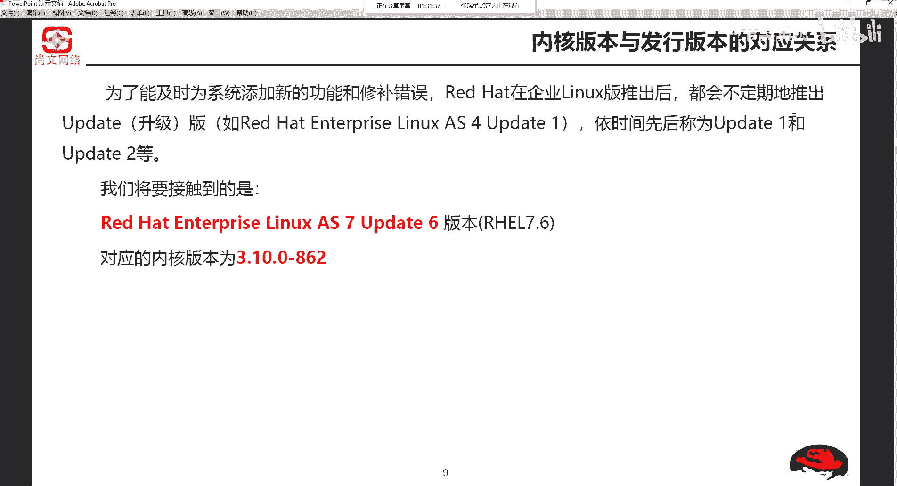

了解了版本规则后，我们来看看RHEL 7.x版本带来了哪些新特性。RHEL 7.x 整体改善了系统安全性能，尤其增强了安全层以满足当前云环境的标准，并为**混合云**环境提供支持。

混合云是指将本地数据中心（on-premises）与公有云（如AWS， 阿里云）连接起来的环境。确保这种跨环境连接的信息安全和数据安全是核心议题。

此外，RHEL 7.x引入了**可信平台模块（TPM）**，进一步强化了**网络绑定磁盘加密（NBDE）** 功能。对于许多IT部门而言，在复杂的混合云与多云环境中保障安全是一项持续性的挑战。

## 如何获取内核信息

如果需要获取最新的内核信息，可以访问官方网站 **www.kernel.org**。回顾一下，内核版本号由主版本号、次版本号和修正号组成，其中次版本号为偶数代表稳定版本。

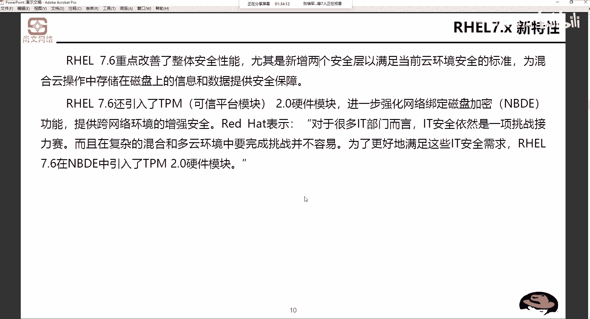

红帽Linux系统的最新版本目前已演进至RHEL 8。

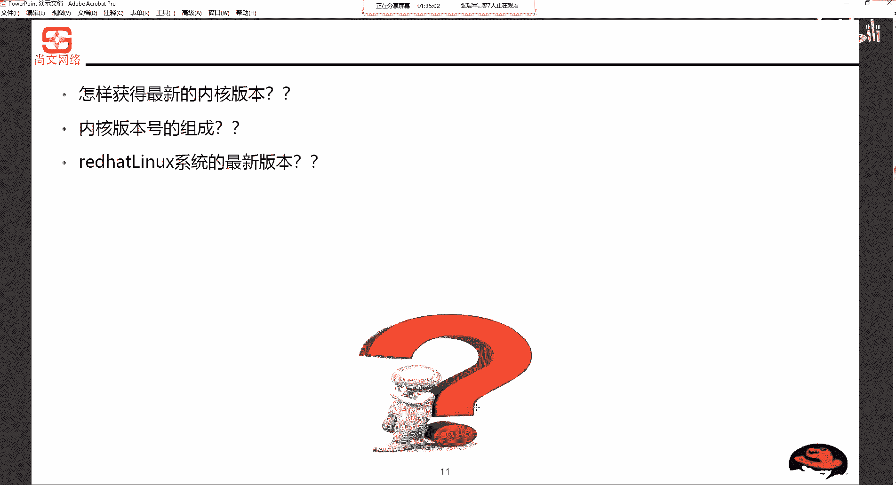

## 总结

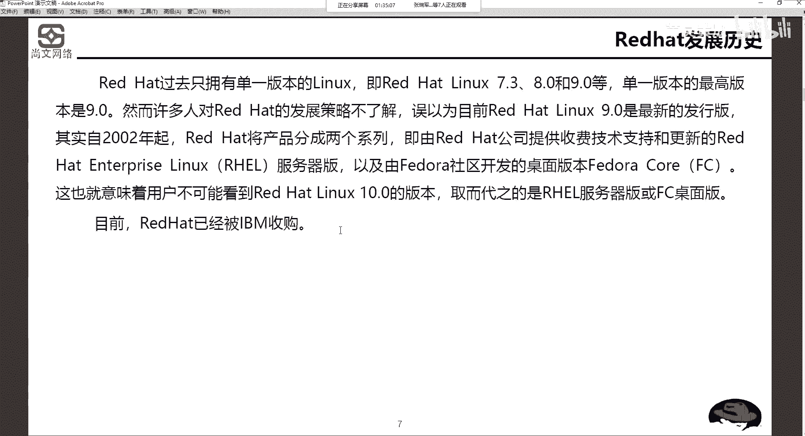

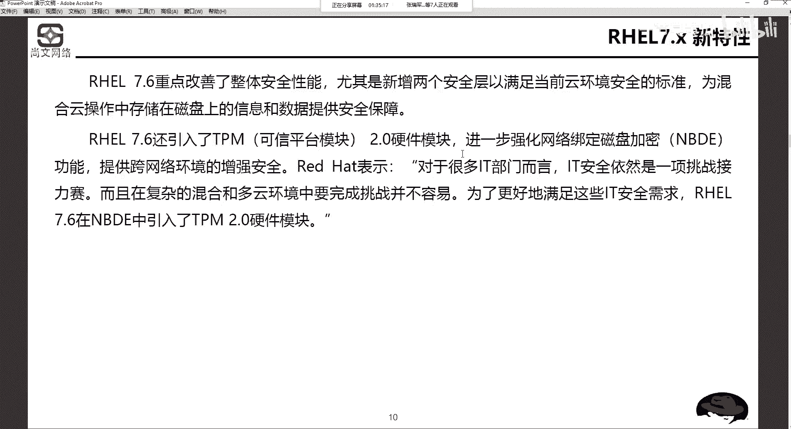

本节课中我们一起学习了红帽Linux的发展历程和主要产品线，重点剖析了RHEL发行版本与Linux内核版本的对应关系及其重要性。我们还介绍了RHEL 7.x版本在安全性，特别是针对混合云环境的新特性。理解这些概念是后续进行系统规划、部署和运维的基础。