# Unix&Linux快速入门超详细教程：P6：02-3-1 硬盘分区知识讲解 💾

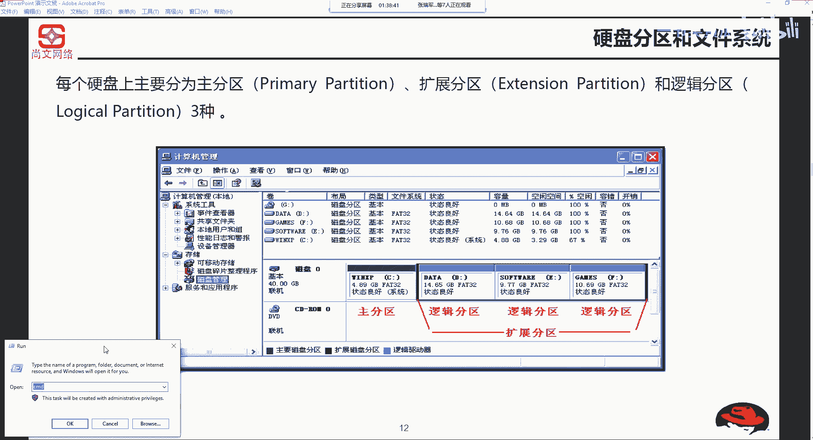

在本节课中，我们将要学习硬盘分区的基础知识，包括主分区、扩展分区和逻辑分区的概念，以及它们在Windows和Linux系统中的不同表现。

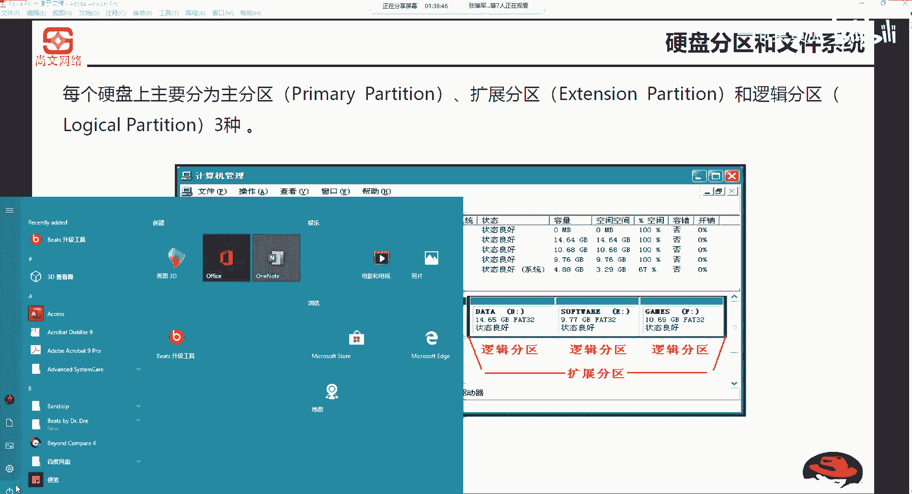

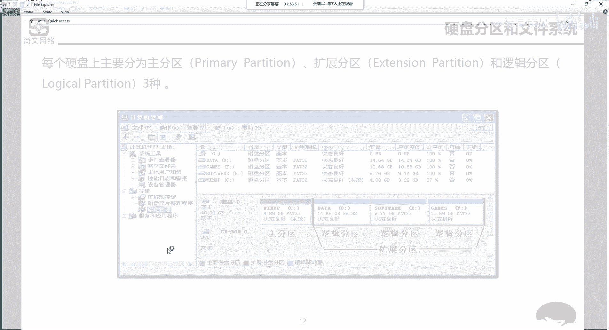

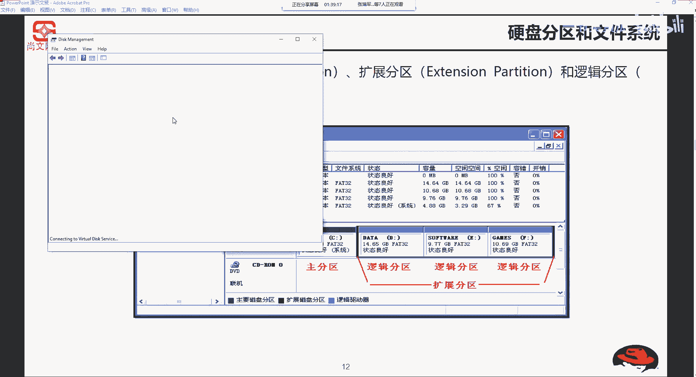

---

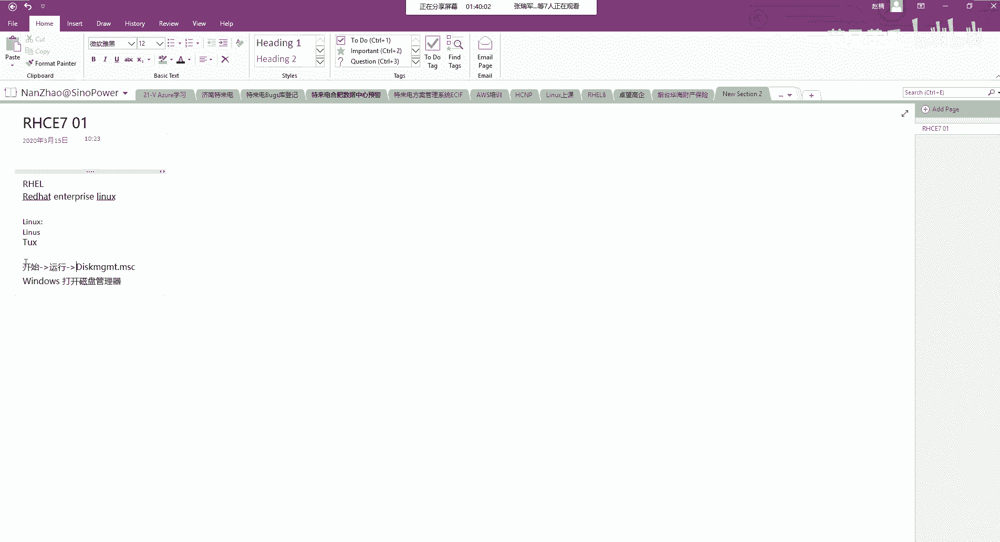

上一节我们介绍了课程的整体结构，本节中我们来看看硬盘分区的基础知识。

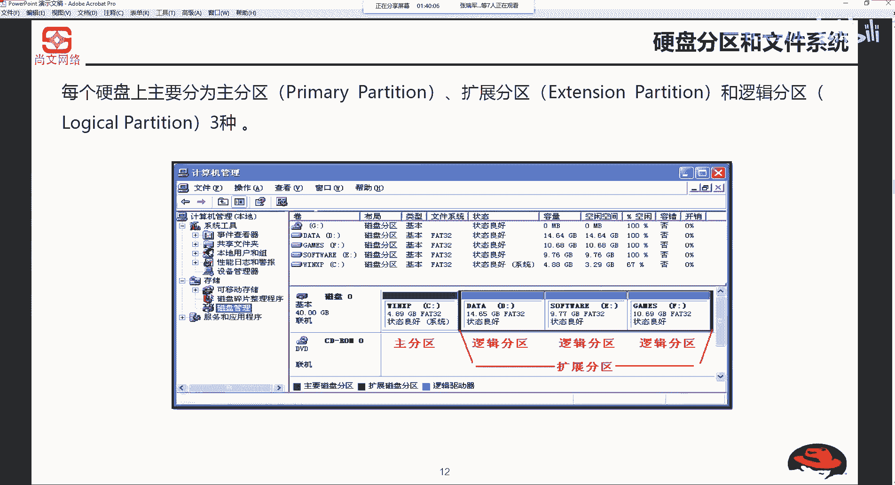

每个硬盘可以分为主分区、扩展分区和逻辑分区。这是磁盘管理中的核心概念。

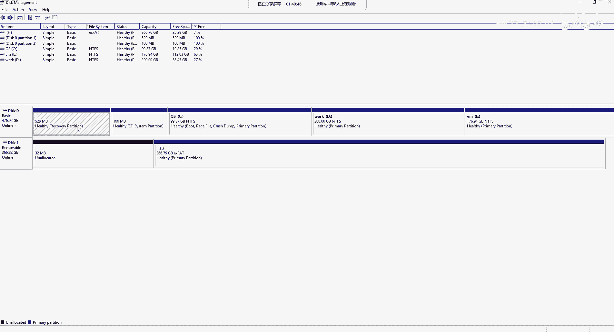

以下是关于分区类型的基本说明：
*   **主分区**：用于安装操作系统或存储数据的基本分区。一块硬盘最多只能创建**4个**主分区。
*   **扩展分区**：一种特殊的主分区，它本身不能直接存储数据，其作用是在主分区数量限制下，创建更多的分区。扩展分区内部可以划分多个逻辑分区。
*   **逻辑分区**：建立在扩展分区内部的分区，用于存储数据。逻辑分区的数量没有严格限制（受操作系统和磁盘容量影响）。

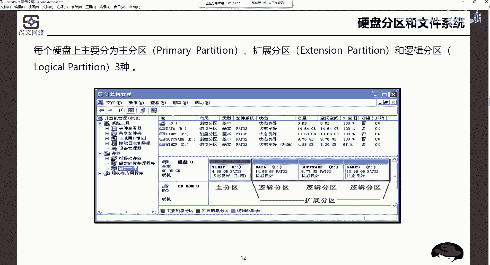

---

上一节我们了解了分区的类型，本节中我们来看看它们在Windows系统中的具体表现。

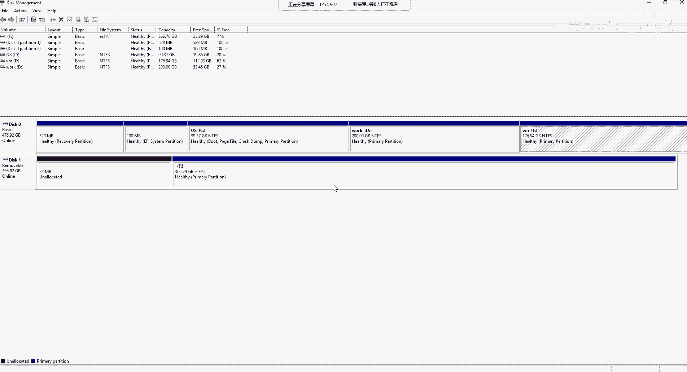

在Windows系统中，可以通过磁盘管理器查看和管理分区。打开磁盘管理器的方法是：按下 `Win + R` 键，输入 `diskmgmt.msc` 并回车。

在磁盘管理器中，可以看到磁盘的物理结构（如“磁盘0”、“磁盘1”）和分区情况。主分区会直接显示盘符（如C:、D:），而扩展分区本身没有盘符，它只是逻辑分区（如E:、F:）的容器。

---

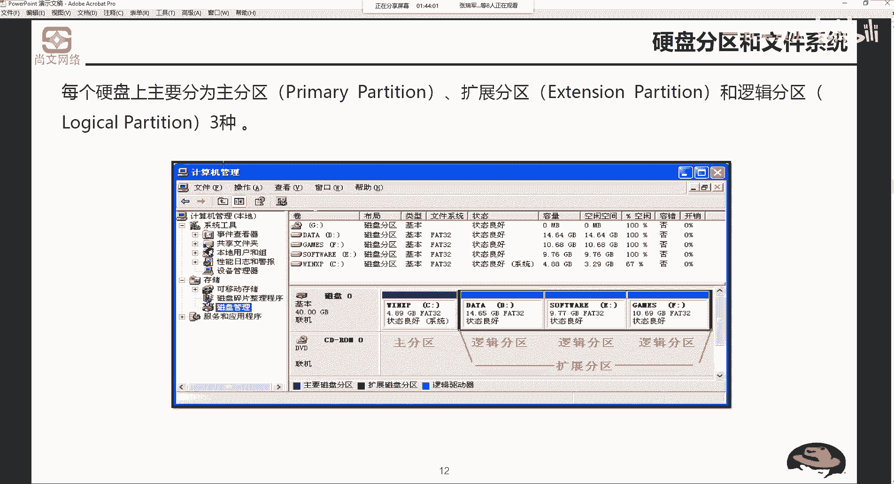

上一节我们看到了Windows下的分区，本节中我们来看看Linux系统是如何标识分区的。

在Linux系统中，使用“设备名称 + 分区编号”来标识硬盘的各个分区。这与Windows使用盘符（C:， D:）的方式不同。

以下是Linux分区编号的重要规则：
*   对于**主分区**或**扩展分区**，其编号为 **1 到 4**。一块硬盘上这4个编号由主分区和扩展分区共用。
*   **逻辑分区**的编号从 **5** 开始。

这意味着，无论前4个编号（1-4）是否被主分区或扩展分区占满，第一个逻辑分区的编号始终是5。

---

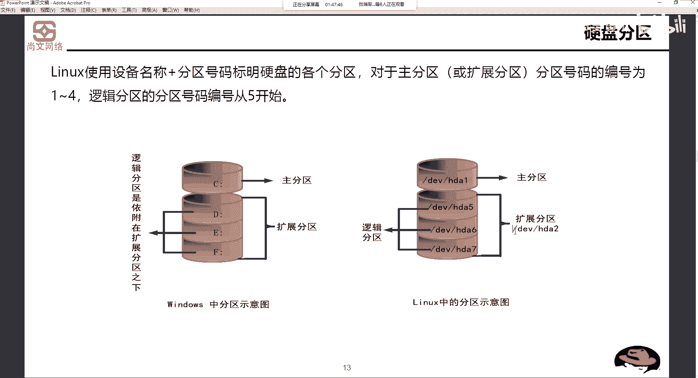

本节课中我们一起学习了硬盘分区的基础知识。我们明确了主分区、扩展分区和逻辑分区的定义与关系，了解了Windows系统通过磁盘管理器查看分区并分配盘符的方式，以及Linux系统使用“设备名+编号”的规则来标识分区，特别是主/扩展分区使用1-4编号，逻辑分区从5开始编号的核心区别。这些概念是后续进行磁盘管理和系统安装的重要基础。