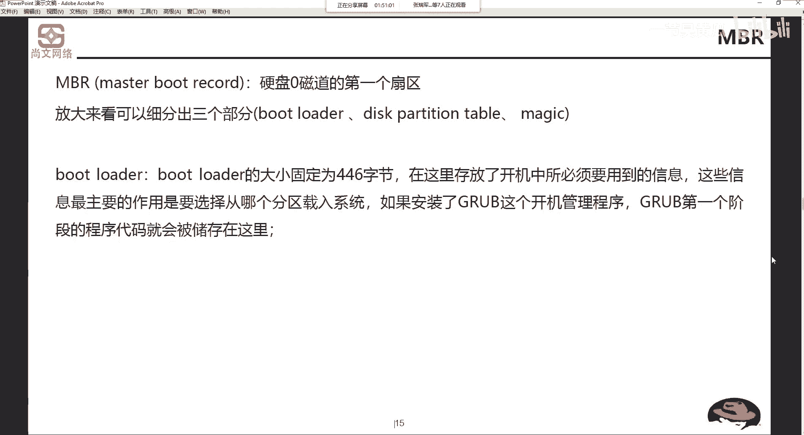
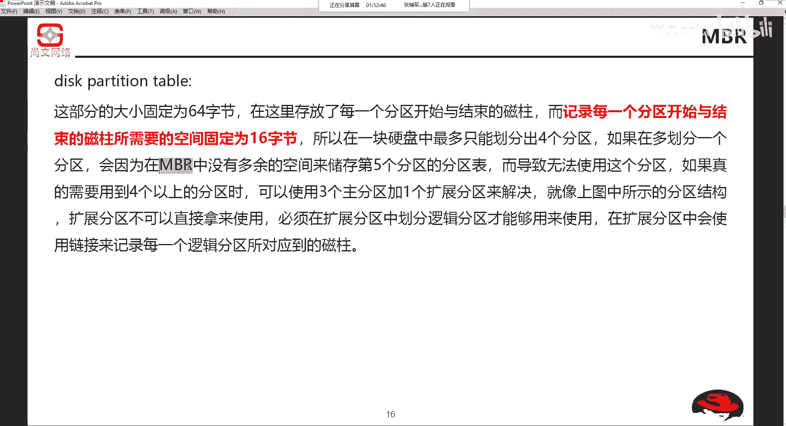
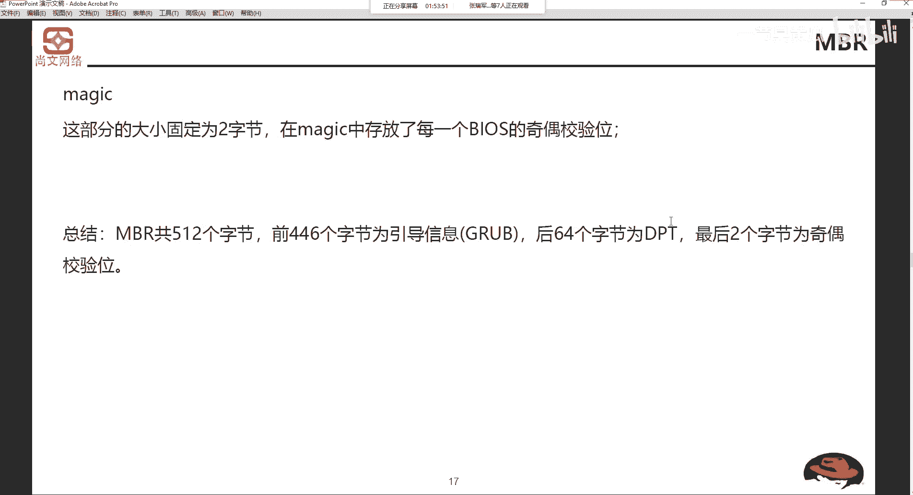
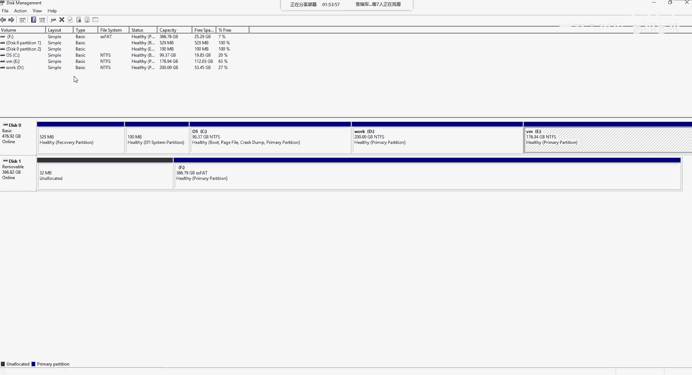
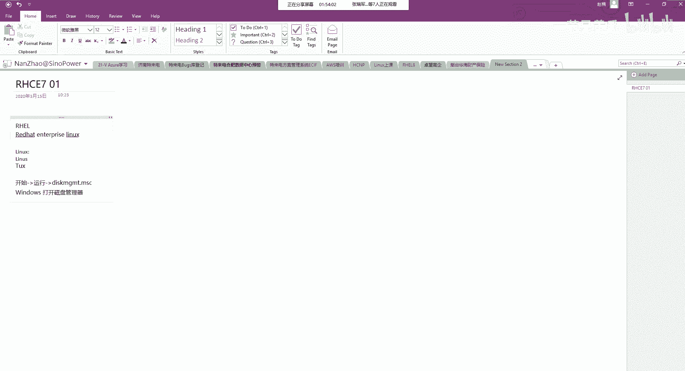
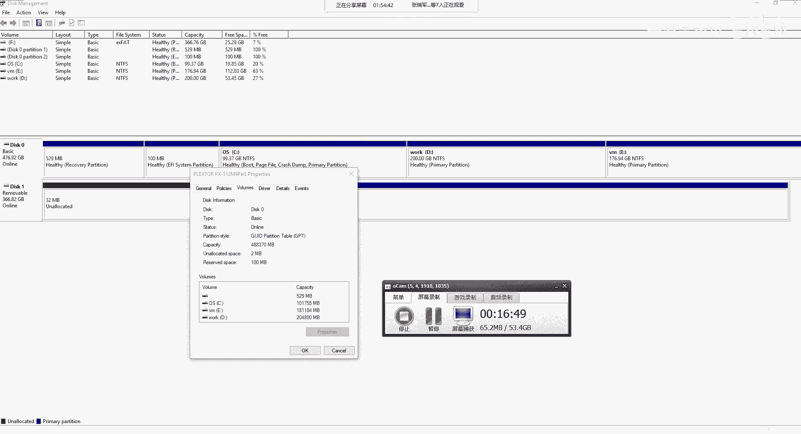
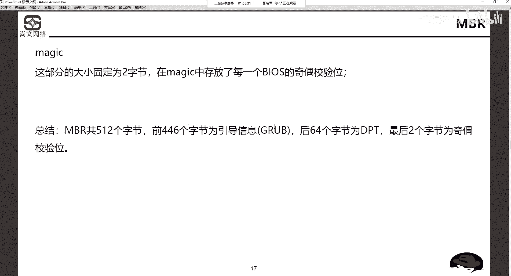
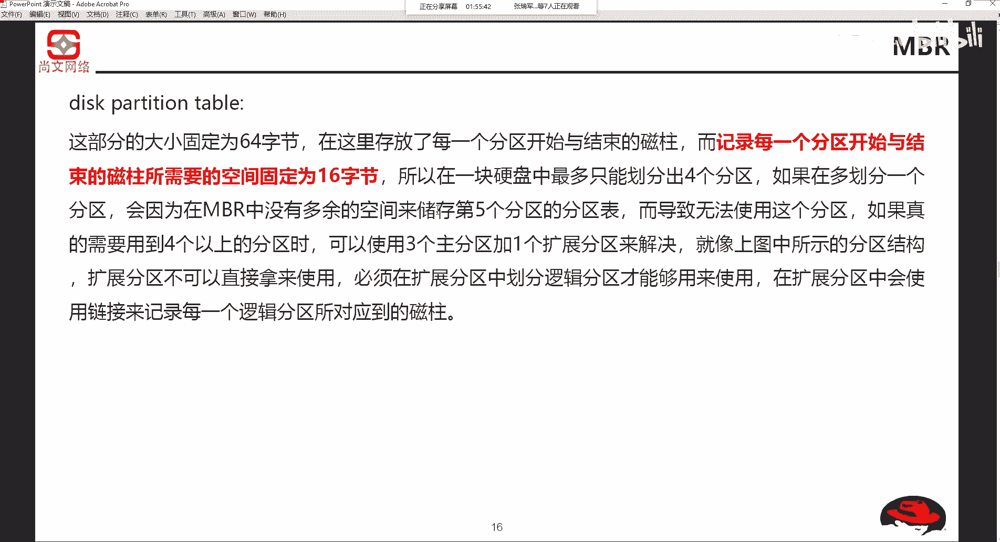

# Unix&Linux快速入门超详细教程-7天通关RHCE：P7：02-3-2 硬盘分区模式讲解 🖥️💾

在本节课中，我们将要学习计算机的启动顺序以及两种主要的硬盘分区模式：MBR和GPT。理解这些概念对于后续的磁盘管理和系统安装至关重要。

## 启动顺序

上一节我们介绍了计算机启动的基本流程，本节中我们来看看启动顺序的具体步骤。

启动顺序首先通过BIOS进行初始化。BIOS是基本输入输出系统（Basic Input Output System）。BIOS主要完成以下工作：
1.  检测硬件。
2.  选择引导设备。
3.  检测硬盘零磁道第一个扇区，即MBR。

## 主引导记录（MBR）

MBR是Master Boot Record的缩写，即主引导记录。它位于磁盘零磁道的第一个扇区，大小为512字节。MBR的结构可以放大来看，包含三个部分：
1.  **Boot Loader**：启动引导程序。
2.  **DPT**：磁盘分区表（Disk Partition Table）。
3.  **Magic**：魔术数字或校验位。

以下是MBR三个部分的详细说明：

**Boot Loader**
Boot Loader的大小固定为446字节。它存放了开机所必需的信息。例如，在安装双系统（如Windows 7和Windows 10）后，开机时出现的系统选择界面，其启动信息就存放在这里。如果安装了GRUB（Linux的开机管理程序），其第一阶段的程序代码也会存储在此。

**磁盘分区表（DPT）**
DPT的大小固定为64字节。它存放了每个分区开始与结束的磁柱信息。记录一个分区信息需要16字节。因此，64字节除以16字节等于4。这意味着，在MBR模式下，一块硬盘最多只能划分4个主分区。

如果需要划分超过4个分区，就需要使用扩展分区来引申出逻辑分区。常见的解决方案是使用三个主分区加一个扩展分区，或者一个主分区加一个扩展分区。在扩展分区中，会使用链接来记录每个逻辑分区所使用的磁柱。

**Magic**
Magic部分固定为2字节，用于存放BIOS的基数校验位。

我们对MBR做一个总结：
*   总大小：`512字节`
*   Boot Loader：`446字节`，存放引导信息。
*   DPT：`64字节`，存放分区表。每个分区记录占`16字节`，因此最多支持`4`个主分区。
*   Magic：`2字节`，校验位。

## 另一种分区模式：GPT

除了MBR，还有另一种磁盘分区模式，即GPT。我们可以通过系统工具查看当前磁盘的分区模式。

在Windows系统中，可以打开磁盘管理器，右键点击磁盘选择“属性”，在“卷”标签页中查看“分区样式”。你可能会看到两种类型：
*   **主启动记录（MBR）**
*   **GUID分区表（GPT）**

GPT模式打破了MBR对分区数量的限制。它最多可以划分128个分区。这种模式在苹果系统等环境中使用较多。

## 总结

本节课中我们一起学习了计算机的启动顺序和两种硬盘分区模式。我们了解到，MBR模式因其分区表大小的限制，一块硬盘最多只能有4个主分区，更多分区需借助扩展分区和逻辑分区实现。而GPT模式则提供了更大的分区数量和更灵活的管理方式。理解这些基础知识是进行磁盘分区和系统管理的重要前提。