# Unix&Linux快速入门超详细教程-7天通关RHCE：P8：02-3-3 硬盘接口介绍 💾

在本节课中，我们将要学习硬盘与主板连接的关键部件——硬盘接口。了解不同接口的特点有助于我们选择合适的存储设备。

上一节我们介绍了MBR分区表，本节中我们来看看硬盘是如何与计算机主板连接的。

## IDE接口

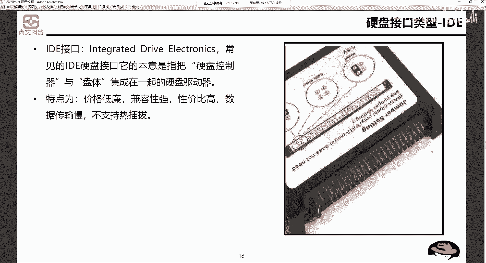

IDE（Integrated Drive Electronics，集成电子驱动器）是最早的硬盘接口之一。它的特点是接口控制器与硬盘盘体集成在一起。

以下是IDE接口的主要特点：
*   价格低廉，兼容性强，性价比高。
*   数据传输速度较慢。
*   不支持热插拔。热插拔指在硬盘通电工作状态下直接插拔的操作。

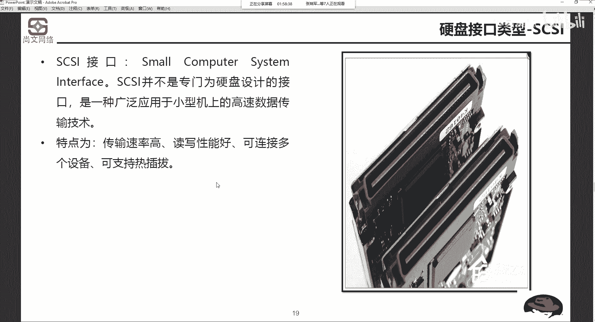

## SCSI接口

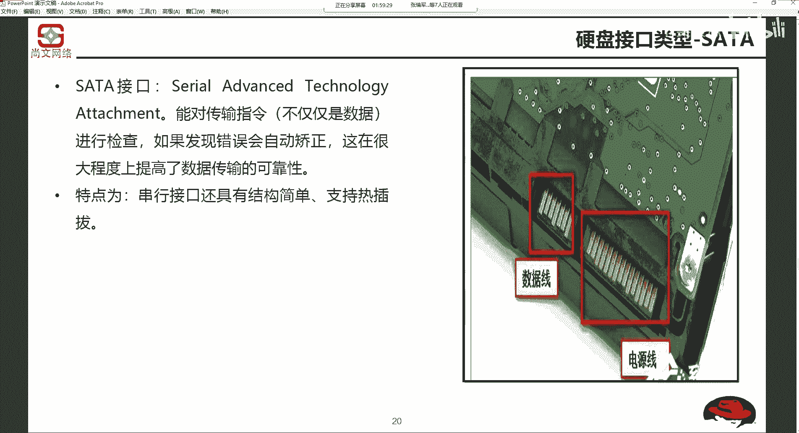

SCSI（Small Computer System Interface，小型计算机系统接口）是一种用于小型机的高速数据传输技术，在传统企业级服务器中较为常见。

以下是SCSI接口的主要特点：
*   数据传输速率高，读写性能好。
*   可连接多个设备。
*   理论上支持热插拔。

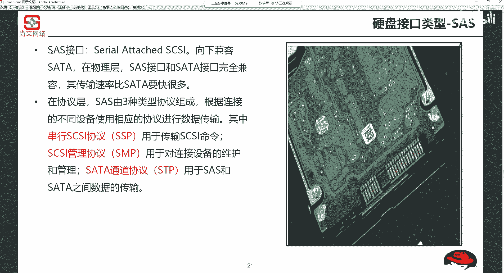

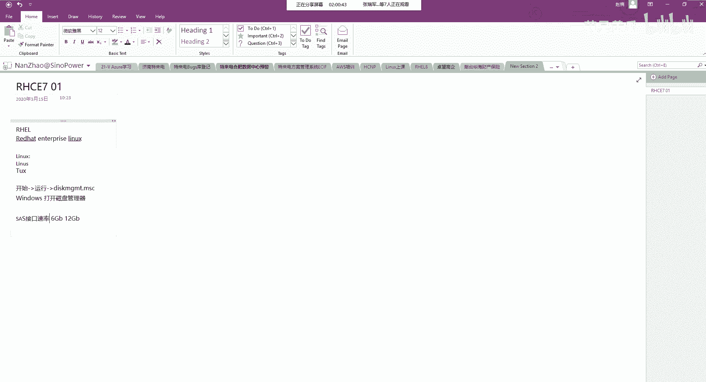

## SATA接口

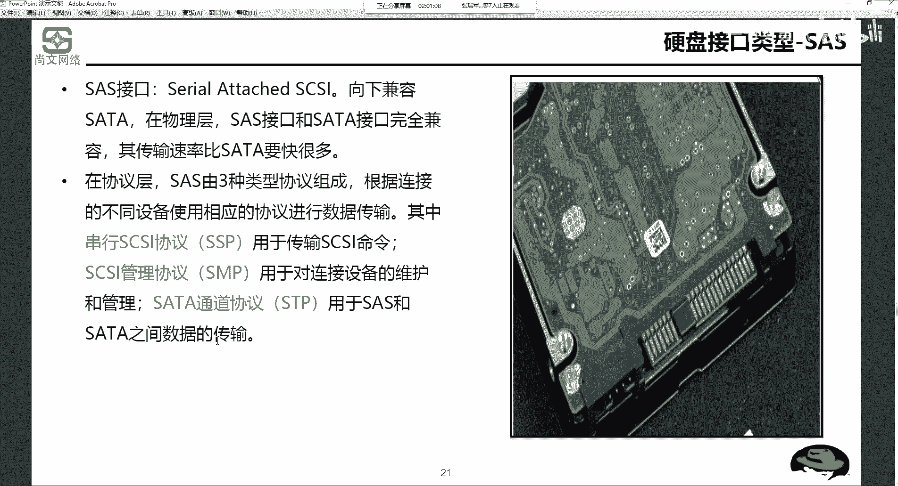

SATA（Serial ATA，串行高级技术附件）是目前个人电脑中最常见的硬盘接口。它采用串行方式传输数据，并能对指令进行检查和错误校正。

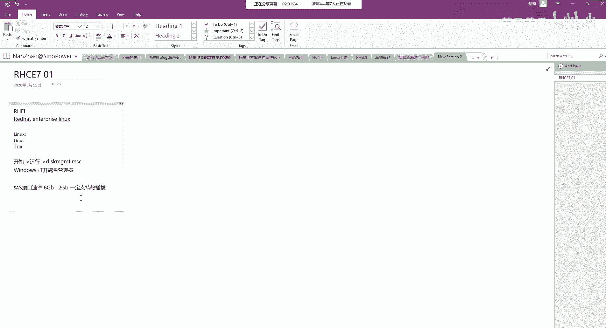

以下是SATA接口的主要特点：
*   串行接口，结构简单。
*   支持热插拔。
*   接口包含数据线和电源线两部分。

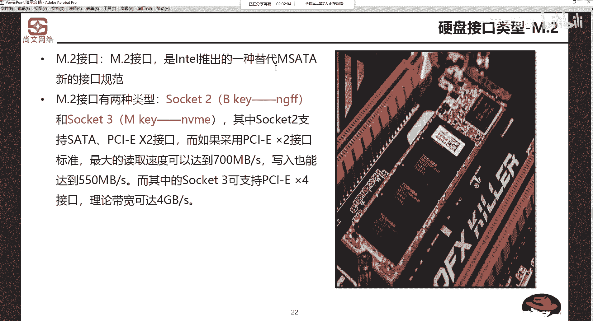

## SAS接口

SAS（Serial Attached SCSI，串行连接SCSI）是服务器上广泛使用的高速接口。它在物理层与SATA接口完全兼容，因此支持SAS和SATA硬盘混插。

以下是SAS接口的主要特点：
*   传输速率高（常见有6Gb/s或12Gb/s）。
*   物理兼容SATA接口。
*   协议层包含SSP（传输SCSI指令）、SMP（管理维护）和STP（与SATA传输数据）三种类型。
*   一定支持热插拔。

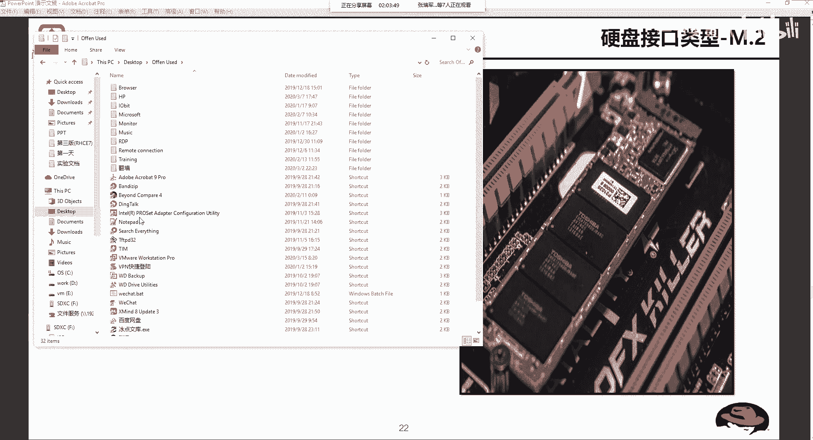

## M.2接口

M.2是一种新型的接口规范，用于替代mSATA（迷你SATA）接口，常见于超薄笔记本和高端主板。

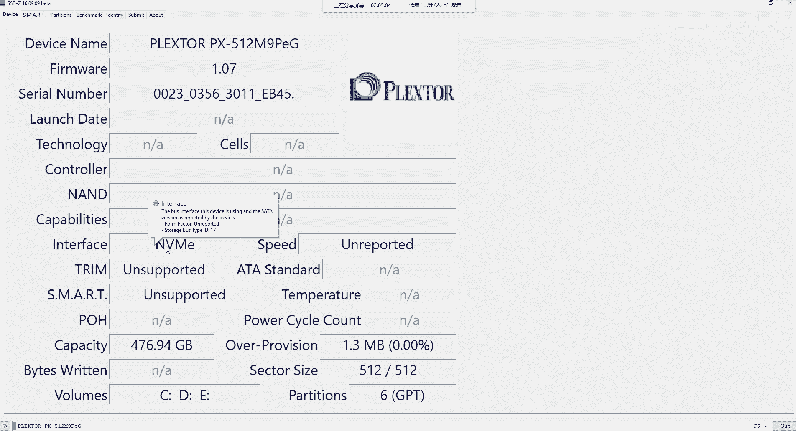

以下是关于M.2接口需要了解的核心信息：
M.2接口支持两种不同的协议和通道，这直接影响其速度：
*   **SATA协议**（通过NGFF/ Socket 2）：走SATA通道，速度与标准SATA接口相当。
*   **NVMe协议**（通过Socket 3）：走PCIe通道，速度远高于SATA。

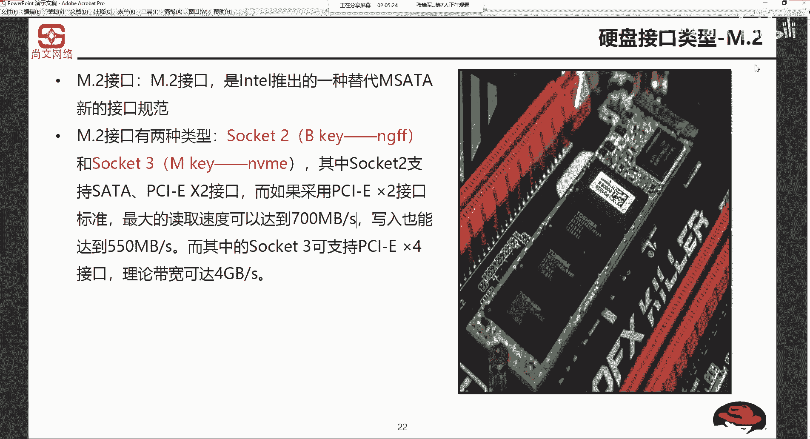

关键点在于，M.2仅代表物理接口形式。购买时需注意其支持的协议，NVMe协议的M.2固态硬盘性能远优于SATA协议的M.2固态硬盘。许多出厂笔记本配备的M.2硬盘可能仅支持SATA协议。

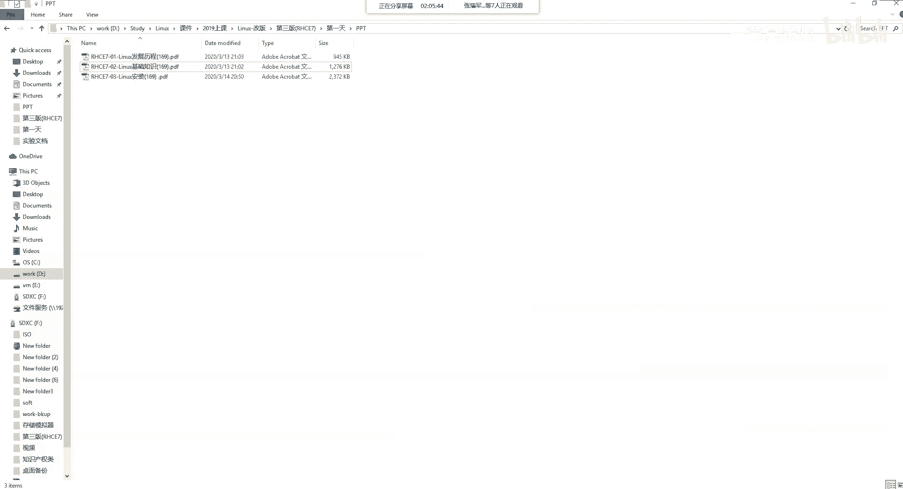

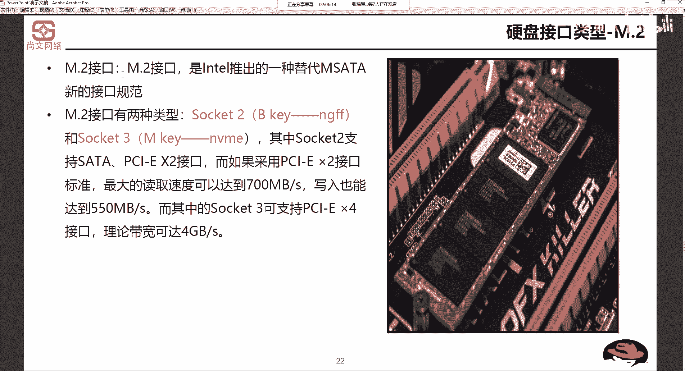

本节课中我们一起学习了五种主要的硬盘接口：IDE、SCSI、SATA、SAS和M.2。我们了解了它们的特点、应用场景以及关键区别，特别是SAS与SATA的兼容性，以及M.2接口下SATA与NVMe协议的性能差异。这些知识是理解计算机存储架构的基础。