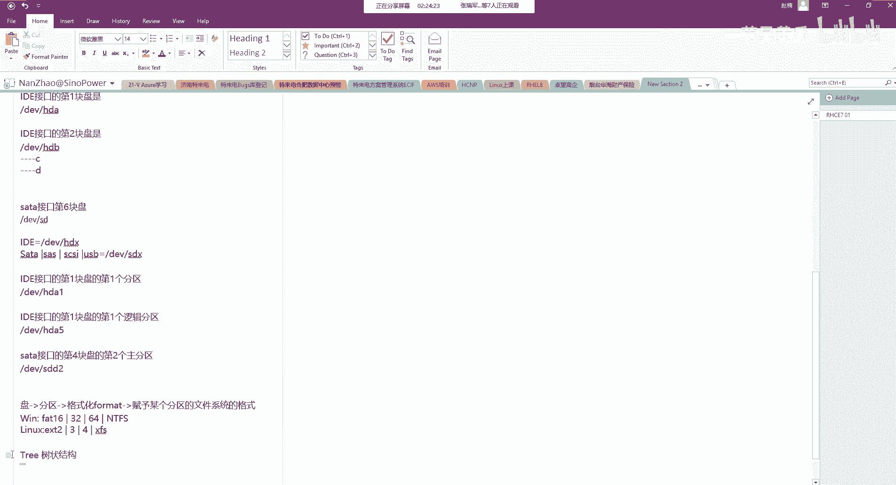

# Unix&Linux快速入门超详细教程-7天通关RHCE - P10：02-4 Linux系统文件结构 - 尚文IT教育 - BV1JC4y187nr

最后一个我们来看一看这个linux的文件系统的结构啊。这个文件linux文件系统的结构呢，它是实际上linux它是一个树状的结构，就是一个tre tree啊，叫te啊树状。

啊，是一个树状的结构。

那么它的这个树状的一个大的一个根，叫就叫斜杠啊，叫斜杠啊，它是。脚经。然后根下面会有什么呢？有BBN有US2有BETC。🤧天僻。然后这个lab叫LIBVRYho。OPD。

那么每一个二层目录下面会有一些更有有自己的一些分支目录。比如说USR上面有loc考有RC有B是吧？比如说R上面有nameHDBFTB那么FTB下面又有一些binEDC等等等等等，这些东西啊。

巴拉巴拉这些东西有很多啊，太多了。所以说它就是一个什么呢？就是一个这种竖状的啊这种结构。

那我们要知道啊，就是呃跟。他是个大总统是吧，他一个将军一个将军啊，他下面有有有很多的这种兵。那么在lininux磁盘中会有许多的这种目录。会放置了这些特定的文件。首先这个根啊啊斜杠斜杠是个根。

包含了linux系统中所有的目录和文件。然后并。这个并下面是放置了操作系统运行时候所用到的各种命令程序啊，比如说什么样的命令啊，比如说CPP是一个copy是吧啊，是复制的意思。

比如说kill KIL shea kill是杀死的意思，就是杀进程。比如说LRM是用来这个删除一些文件。然后再往下呢，这个boot。BOT是用来启动时候必须读取的文件啊，包括这个系统内核。

我们刚才也说了，这个bu loader，bl loader也好，b也好。他实际上啊对于linux系统来讲，都是放在BOT啊bot这个。这个这个这个目录下面。然后DEV我们刚才也说了。

DEV这个呃下面会有硬盘嘛，是吧？IDE接口的sfa也好，sta的sars的这种接口都是放在这个DEV下面DEV下面。那么除了这个硬盘之外，还有什么一些其他的设备，比如说基于我们这种啊字符设备啊。

这种字符设备，就我们的键盘。然后基于就是我们的这种块设备，就是我们这种硬盘。啊，还有我们的硬盘的那个那个光驱，我们都放在DEV下面。然后ETC呢就是啊跟系统设置管理相关的一些文件啊，ETC。

还有呢就是这个呃home啊，比如说子目录啊是用来默认放置账号的加目录linux系统和windows系统我们都是一样的，都是一个多用户多任务的这么一种操作系统。所以说对于一些你自己创建的这种用户。

它的加了目录啊，默认的加目录是用来放在home。当然你也不一定非要放在home，你可以自定义啊，只不过说操作系统给你带来的一个默认的用来放放置自己加目录的这么一个文件lab啊放置公用的函数库啊，函数库。

然后这个lab下边mods是用来放置于系统内核的一些模块啊模块。然后还有一个呢叫lastst加放的是用来存放一些碎片啊，一些不开化的文件数据都放在这里啊，通常为空。

MNT呢是默认含有MNTCDro和啊flock呃flocky两目录。MNT是用来作为光盘和软盘的一个挂载点啊挂载点。PROC是一个虚拟的文件系统，它是放在内存的一个硬象。

主要是用来在不重启机器的情况下去管理我们这内壳。除此之外呢，还有vaVR啊，va是用来仿放置这个存放日志的啊，存放日志的。然后USR一般情况下，我们装一个linux软件，放在USR下。那么除此之外。

US2还有OPT是是另外一个放置linux软件的一个路径。呃，TMP啊TMP是template，tlate是这个这个那个那个模就是临时的啊，用来放置一些临时的这种文件的。也就是说。

整个根下面会有包含这一些病。boott0EVETC。ho。L。MNTPROC。呃，YUSROPTTIP。就是这么一些二级目录，那么二级目录下面就会有很多来了，是吧？比如说我们就USR有loc考。

有SRC有B啊等等等等。这是呃linux系统一个大概的一个目录结构啊，文件系统的一个目录结构哪些是重要的呢啊哪些是重要的呢？首先根肯定就重要是吧？没有它是不行的。

那么根下面会有什么包含了根下面有什么bebo DVETC实际上第一这一张PPT里面所有的这个bin也好，bo也好，DVETETC也好啊，都是非常重要。然后再往下啊，MT也是比较重要的啊。

也算是比较重要的一个一个一个目录POC。oneUSROPT和TMP啊。那么如果我想放置一些临时文件，放到另行，可以考虑放在什么位置，是不是这个TNP就可以。🤧考虑。

那如果我想在link系统上去安装PDF啊，这种软件我可以考虑装装在哪，装软件的路径，1个USR1个OPT对吧？啊，都可以。然后我想知道我的linux系统结构，文件系统结构怎么办？这个呢啊。

对我们现在这个知识的积累可能稍微有点难啊，我们可以就是我们。

可以考虑啊。就是怎么样。知道。lininux的文件结构。我们可以通过命令啊，通过一个命令。或者是通过搜索。查找的。机制。进行。就是通过命令啊可以进行这个指导文件系统的啊做文件结构。

或者通过搜索和查找啊来进行。

操作。好，然后这个这张PPT我们就讲完了啊，这张PPT我们就讲完了。我们来简短的回顾一下是吧？其实内容也挺多啊，内容也挺多。第一个是内个版本，我们要知道主版本号点侧版本号点修整号。

然后那个侧版本号那个地方，我们要注意，如果是偶数的，如果是基数的是吧？然后第二个呢是。呃，红帽的操作系统一个整体的一个发展一个介绍分区。MBRGPT。🤧然后这个那个格式化是吧？

硬盘的接口，然后分区的这种对应关系啊，其实整张PPT里面最重要的一个点就是分区的这一块知识啊，我们一定要把这个。呃，首先我们也要知道lininux下怎么去标明一个分区，对吧？我们是通过设备和分区号啊。

那么你设备又分。又分这个这个就是你的这个分区号码又分。接口。

🤧我们把接口也都捋了一遍。那么最后通过接口和啊这种。

设备的顺序以及分区的这个号啊来进行这个命名。那么最后一个呢就是这个文件系统是吧？包括啊linkux一个整个整体的一个结构啊一个结构。对于这个linkux文件系统，我们后期还会再去详细说啊。

我们现在就是说通过PPT的大概知道哦，B目录是用来放命令的是吧？bot是用来放内核的，然后ETC是用来放一些跟系统设置相关的一些文件啊等等等等啊，我们做一个了解啊，后期的话我们会继续这个慢慢的深入。

