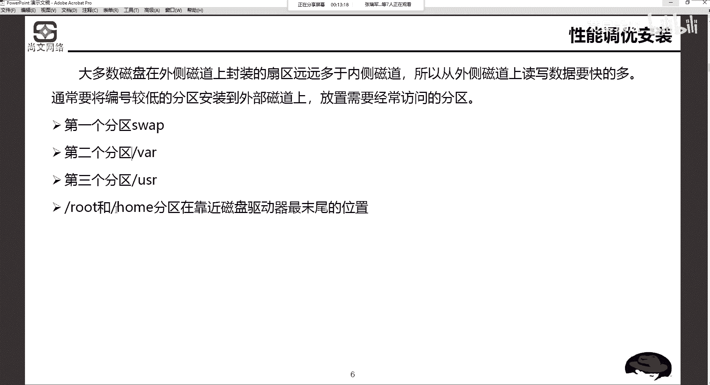

# Unix&Linux快速入门超详细教程-7天通关RHCE - P11：03-1-1 Linux系统安装分区方案规划 - 尚文IT教育 - BV1JC4y187nr

好，那我们开始。首先呢我们来看一下，就是这个系统的安装。嗯，在安装之前呢，我们要去了解一下这个。呃，关于安装的时候有一些系统分区的一些方案，就是怎么样给我们的linux系统进行这个分区。

能给他做一些规划啊，这个很这个是比较重要的啊。其实在人整个安装的过程中，这个是比较重要的。然后呢，再一个呢，就是我们要学会两种安装方式。就是第一种呢就是也很简单的啊，就是很简单的那种。

基于这个图形化的安装啊，单一的啊，就是我我我用图形化是吧？我不管用这个光驱也好，还是U盘也好，进行这个可只要有可移动的这种可引导的这种设备。然后我们通过图形化进行安装啊。

安装单个linlininux系统。但是如果说我们要进行这个多个安装的话，我们这个时候就需要用到了批量啊，自动化了批量部署linux系统。那么对于这个硬件的要求，安装。操系统呢这个大概过一下啊。

就是CPU的话，奔通以上的处理器。这个这这个现在我们都是之强了，知吧？然后内存至少500兆，然后推荐使用2GB以上的这个内存啊，当然我们现在肯定都没问题啊，这个硬件方面的配置啊肯定是没问题。

然后硬盘的话大约需要5GB的空间啊，显卡VG减少显卡光驱。然后这个特别要强调了一点呢，就是。如果我们没有自己的这个啊真实的环境的话，我们一般都是基于我们自己的笔记本，我们的PC去安装一些。

就像我今天我之前发了那个VMM的 works啊，VMM works那个是属于一个。啊，虚拟化的软件，它属于是那个它是那种就是。急需架构就是你必须要有你的宿主机啊，就是你必须要你的速操作系统啊。

宿主机完了之后在其之上呢去装一些这个虚拟化的软件，然后我们去驱拟出windows的也好，或者是linux也好这种系统。那么如果是这种应用场景的话，我们的内存你在给虚拟机配内存的时候，一定要注意。

至少不能低于500兆。啊，我们刚才说。安装套的系统首先是基于图形化的是吧？如果你那个虚机配置内存配置如果低于500兆，你很有可能图形化起不来。啊，很有可能左左一会起不来了，这个要注意。啊。

然后这个分区的方案啊分区的方案。我们上午说过了啊，lins系统的文件结构，首先它要有一个根，对吧？在这个地方有一个根。有一个根呢，然后下面会有，比如说bo分区啊，ETC，然后有USR，然后有va。

有home，有TMP。有各种啊各种这种分区。那么在安装linux的时候呢，需要在硬盘建立linux使用的分区，大多情况下，至少啊至少需要为linux建立以下三个分区。首先跟不用说了，这必须要有的是吧？

linux系统将大部分的文件系统用户保存在跟上，所以该分区一定要足够大，一定要足够大，这是一个分区。第二个分区bo BOT。bo分区是用于引导的。如果没有bo分区，我们操作系统是起不来的对吧？

它包含了操作系统的内核和在系统启动过程中所用到的文件。呃，那么该分区的这个文件，该分区它的这个大小。我个人建议。200兆就可以。啊，200兆，因为多了你也没有用啊，多了你也他也用不了啊，200兆就可以。

那我们现在是是我们我们接下来要去装的是7点啊7版本，就是7点X的linux啊，红帽的啊I11。那如果是老版本的，比如说6点X，那么100兆就可以了啊。这个地方呢就是说新版本七版本和老版本一个区别啊。

老版本100兆。如果说你你安装7。X还是用100兆的话，会报错啊，步骤分区会报错啊。我建议大家就是200兆，你也没有必要动不动设置个5个G10个G啊，没有必要啊，200兆足够。

然后12部分区12分区SWAP啊，12分区它的作用是充当了虚拟内存啊，虚拟内存。其大小通常是物理内存的2倍左右。比如说我们的这个虚机，然后我配置这个虚机给他这个内存是4G，那你的这个。

samp部分区啊就要是4G的1。5倍到2倍。比如说6G或8G。啊，6倍6G或8G通常就是说是1。5倍啊，到2倍左右。啊，物理内存的1。5倍到2倍左右。那么他他是干什么呢？就是充到了虚拟内存。

什么叫虚拟内存？虚拟内存实际上就是我们的磁盘空间的一块分区啊，一个空间。当我们的物理内存不够用的时候，我们会去充当，我们会把虚虚拟内存。激活啊，并且去。启动啊，并且使用它。那么对于windows的这个。

我们先看看windows啊这个虚拟内存敲一个命令啊，还是一样的，开始运行是吧？然后敲1个CDM点CPU。CDM点CPU。然后在hotware啊硬件呃在 once这个地方就是高级了这个地方呢会有一个。呃。

performance啊，不是应该是启动和恢复啊这个位置。也不是，应该是在。我看一下啊。啊，是在这个地方啊，就是在高级的这个地方啊，有一个adance。

这个地方大家看wat memory就是一个虚拟内存是吧？一个page file啊是应 is an error on the hard disk，就是在硬盘上的一个区域，一个pion file。

然后经常如果这个啊。我们把ramRM就是我们内存是吧？你可使用就用金的时候啊，它会去激活磁盘上的一个分区来去充当我们的配件费。那么他默认的话，你这个大小应该是什么？

在现在是什么toto pay size or drive是2。游戏。啊，差不多是2。4个G啊，从这个地方，当然你也可以去去这个东西是吧去改变。应该变成。对。这是我们的这个呃windows的话。

就是我们我们来写一下，就是windows的虚拟内存怎么去去找是吧啊？

问。虚拟。开始。运行。CD。点CPU啊，然后去找到这个呃高级。选项。然后呃虚拟。内存的。那个设置。然后这个linux呢也是啊linux就叫srap lSWAP啊，刚才我们说了物理内存的1。

5倍到2倍左右。

没有就是说你要去规划一个啊，就你你你要去规划一个这个lininux啊，至少要建立三个分区。那么刚才我我这个时候可能会有人问。我们上午不是说过了吗？有什么ETC有哇，有USR，有什么什么各种各种。

那么你规划了这三个分区，至少规划这你规划完了之后，那么其他的ETC也好，什么USRETC然后各种USRR什么去哪了呢？他都在跟项目。啊，都在别人项目。那么对于bo分区实际上也是一样。

你看跟它实际上描述意义什么的？跟下面有1个BOT的一个，也就是说其实bo分区啊。如果你不去设它啊，如果你不去单独去设置它，建立它，它也都包含在个人项目。只不过说我们是把它单独摘出来而已啊。

单独摘出来而已。这个要知道啊，这个要去理解。不是说你规划了这三个分区，其他的我们就不要了啊，不是这个意思，就是根下面会包含了ETC也好，就根下面会有ETC有home哇那个TMP。

bootDV等等等等是吧？啊，就是在这儿，这个要注意。最小分区方案。规划以上两个分区，我们知的模觉得根是一定的sve也是一定的。那么bot呢，是不是刚才我说了，它是包含了什么根下目？

那如果要US2呢跟项目ETC呢跟项目DEV项呢跟项目。是这个啊最小的一个分区方案。

这个我们要知道啊，一定要理解。然后这个呃。做一个性能调优的一个安装建议，做一个这样的一个建议。呃，大多数磁盘在外侧磁道上封装的扇区要远远多于内侧。所以从外侧磁道上读写的数据要比内侧快得多啊。

当然这个东西指的是HDD。

啊，性能调优这个地方。我们是指的什么HDD啊，什么叫HDD呢？啊而。非SSD啊，就是是我们的机械硬盘是吧？HDD叫机械硬盘。然后SSD是什么？固态硬盘是吧？我们是指的是。

HDD啊，它外侧封段战区要远远多于内侧。所以说我们建议将。这个编号较低的分区安装了外部磁道。也就是说我们经常需要频繁的去访问，频繁的去使用了这种分区。我们建议放到外侧磁道上。那么什么样的一些这个。

分区他是经常访问频繁的。首先sp有可能。

这是第一个。然后第二个叫万。袜是干什么用来的？袜是。我们上一课说上午说过了是吧万是。专门用于。存放。一些日志的，比如说什么日志。系统日志。安全审计日志。应用程序这个。抓包 shootingoting啊。

抓包收听时候的，就是排错时候。日志。但这个这个日志会经常的去频繁的访问，对吧？频繁的用了，所以说UR啊是一个那个，然后USRUSR是什么呢？USR是。安装。软见。我们也会经常去装一些这个软件是吧？啊。

去装一下这个软件。然后这个。

也会啊也是一个经常访问的。那么对于root和home啊，home我们上午说过了，home是一个。

父母。ho某是默认用来存放。普通用户的加盟。这是默耳。当然。用户也可以嗯自定义。到其他目录。啊，比如说。TNP项目有个。user一啊这样一个目录啊，就是把它作为一个。账目录来制定。那么管理员。管理员。

对于win来讲，windows来讲叫呃的。Miinistature。叫addmin。那么linux的话或者是unux的话。么叫ROT叫root是吧啊，叫root。所以说那么对于。诶lin。

或者说我们直接root用户。的加目录只有一个。就是。跟下面1个ROT啊有个跟下面ROT你说这个管理员用户root，他可不可以是比如说TMP下的ROT这个是不行的啊，这个是坚决不行的。

它只有一个叫ROT专。

他们的这两分区呢是靠近在磁盘驱动器最末尾的一个位置啊，这个呢就是说一个性能调优的一个安装的建议。我们把经常需要访问的一些这个分区发到。外侧丝道上他读写的数据要比内侧丝道快很多。

啊这个地。