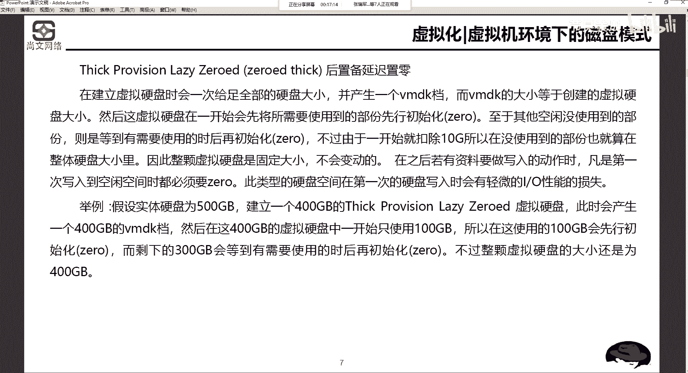
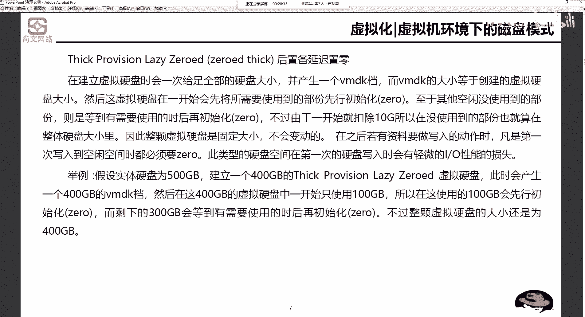

# Unix&Linux快速入门超详细教程-7天通关RHCE - P12：03-1-2 虚拟机环境下的磁盘模式设置 - 尚文IT教育 - BV1JC4y187nr

好，然后我们刚才在提一直提说，就是我们要去搭建我们自己的实验环境，测试环境。我们基本上就是说基于VI面的啊，就是那种呃你用VI面的work session也可以用微软的那个wat box也可以。

或者是or呃用oracle的那个wa box也可以，或者是。或者是那个什么呃用其他的一些也可以啊。那么我们基本上就是用VIY的。왜有没了我睡下。那么对于虚拟化或虚拟机环境下的一些磁盘问题，因为我们。

这都是虚嘛啊虚出来的。那么虚拟出来这种磁盘模式呢，我们需要这个东西，磁盘模式和MBR和刚才我们上午说过的MBR和那个GPT，那就完全是两回事了啊，完全是两回事了。那么这个一个叫啊后置被延迟制令啊。

叫zero的 sick啊，zero的 sick。你看这个zero是一个过去式是吧？就是。以后我们再说对吧？或去式就是我先给你的Z了，就是先给你清零了啊，做了一个零了，完了之后做一个啊延迟和制被。

我们来看这是什么意思呢？啊，zero six啊zero six。我们说在建立虚拟硬盘的时候，会一次给足全部的硬盘大小啊，并产生一个叫VMDK的文档。

这个VMDK呢是指VM organization的一个虚拟磁盘文件。就是说我们建一个虚拟机，肯定要去指定磁盘的大小，比如说100个G。你建完了之后。

它就会在这个虚拟机里面去闪生一个叫点儿什么什么点儿VMDK啊，YVMDK是一个扩展名。VMDK。的一个文一个一个文件啊，这个文件就代表了那个虚拟机的磁盘。啊，这个要理解。

那么VMDK的大小呢是要等于创建的虚拟硬盘大小。比如说我们刚才说了。

我们来看这个啊，来看。

来看我这个地方。我们打开磁盘管理器。

呃，我的习惯呢就是说一般把虚拟机啊放在E盘上啊，放在这个E盘上。然后E盘现在是176。94个G，就大概不到200个G吧啊，不到200G。假如说我要去去新建一个虚拟机是吧？新建一个虚拟机是100个G。

那么这个100个G就问题决来了，这100个G我是不是就所有的这100G我新建完了之后，就就就要从这个分区从E盘给我摘掉100个技能，或者是我占直接占用我100个技能啊，不是这个人啊，不一定。

那我们继续来看。这个ze的s我们来看这个例子啊。假如说我们的实体硬盘有500个G，然后建立了1个400G的啊zero的 sick，就是后置被延迟制定了虚拟硬盘。

此时会产生1个400G的VMDK的这么一个文档或者文件。然后呢，如果说我们一开始往里面填充，就是往里面写数据，写，可能只只用了100个G。所以说这100个G里面会先进行初始化啊。

就是zero啊进行初始化，而且剩下的300个G会有需要的时候再进行初始化。而不是说我们。直接把这个我1个500G的盘啊，直接我用400个G产生400G的VMDK啊，直接会把那400个G。给吞掉。

不会啊不会。

第二个呢就是。aggger0的 sick就是后置位。延时治令啊，就要后置位治理。后置被指令，我们还是来看这个例子。500G的盘建了1个400G的这个后置备制灵的虚拟硬盘。

此时会产生1个400G的VMDK。然后这400G的VMDK。直接初始化。等到下次使用的时候就可以直接使用。不过整颗硬盘大小还是400G这种模式，后置备制零和后置备延迟制令有什么区别？400G的VMDK。

我是我是稳稳的就要去拿了，对吧？完了之后呢，我只不过是说我先用多好，比如说先用100G，那我就先对100G做ze入，那么后置备置定，就是我不管你用多好，我不管你是不是先用的。

我只把400G的先进行初始化了啊，先ze入。

等到下次用的时候，我就不按照我100G的空间，200G的空间，300G的空间来进行使用啊，它直接使用。所以说它是直接去占用了我实体硬盘的400个G的大小。

那么这个后置被延迟制能就是我有100G的初始化，那我就100G，剩下的时候我需要的时候进行介入。那不管是后置被制零和后置被延迟制零。我们通通都是会占有我们实体硬盘的400G。空间。

那假如说我现在是一不到200G的空间，我说我要建1个100G的VMBK我不管是用后置配还是后置备延迟指顶，是不是我现在可用空间就剩下。不到76个就是76亿了，是吧？🤧那100个G就给了那个虚拟机。

最后一个性的。Provision， single provision。叫精简制备。来看举例。还是500G的实体硬盘，建立了1个400G的sinpro精简制备的虚拟硬盘。在完成后使用了100个G。

也就是相当于说我的VMDK是100个G。那么有的人会有说剩下的300个G呢，300G就会留在实体硬盘。啊，3个G实际上就是说我要去建立1个400G的空间，对吧？我用多少，我就给你做多少的这个接入。啊。

用多好就给你留到这。比如说我我现在500G是吧？500G的空间可用空间。我现在要建400G的这个盘。那么我一开始用了10个G，那我真真正正占用了我们500G的导航，就10个G。

然后继续往上20个G、30个G、40G、50G、100G等等等等，对吧？啊，等使用的时候再进行逐渐的增加，直到我们规定了400个G空间，都满了之后就不会再增加了。所以说s个pro要比。

不管是后置被治疗和后置被延迟治疗。

我们都会去。这个这个优化或者是节省我们的啊物理硬盘的400公斤。

所以说我们在进行这个这张截图呢，就是一个VM organization。我们去在新建一个虚机的时候。啊，我们会看到就是你建1个20G的磁盘大小。如果你是。这个精简制备的话，就不要勾选这个地方。

就是立即分配所有次办公间。如果是要做后置备的或者是后置位延迟的，我们就要去怎么样去勾选成立即分配错的怎么东样。你看我现在一盘，比如说有100个G，我现在要去给它直径20个G大小。那如果我点上了啊。

我不管你是延迟置备还是不延迟，是吧？2个G就没了。那如果我是经验之辈的话，我有开始有可能会我虽然建了20个G，但有可能一开始只只用了一个G或两个G。那我实际占用我的自然供电大小就是一个G或两个G。

这个地方要注意。无论是我我们基于VM面 was这种裸集聚架构，还是那种VM面的vispher也好，那种裸金属架构，我们都建议。啊，在一般的这种应用测试里面，我们会去用这个啊叫精简制备。

那如还有一些这个呃一些应用场景，比如说我们要做大数据。

我们到大数据的时候，我们就不建议去采用精简制备的，而是用什么后制被。

治理我给你一个空间是多少就多少啊，我们不我们不做这种精简的这种操作。如果做精简的操作会发现很慢。

啊，会怎慢。因为它大数据大数据数据量非常多，要进行数据挖掘、分析、清洗很多这种操作对磁盘要求非常高啊非常高。所以我们啊不我们不做这种经理这理啊，直接去立即分配所有这的这种磁盘空间。

这是呃虚拟化的这种。这种瞬息环境下的自拍模式啊自拍模式。

在。安装linux的时候，至少需要分几个分区。首先根分区肯定要有是吧？啊，然后bo分区我们也是建议说把它给单独分出来。然后再一个分区呢，就是这个swapSWAP。哦SWP。

lininux的哪些分区会频繁的和磁盘进行数据交互？首先日志的W是吧，然后这个装软件的USR也好和OPT也好。然后然后还有一些这个SWAP也有可能会频繁的和磁盘进行这个数据交互。因为有时候你会发现。

那这个。对于这个操作系统原理的方面，会有一些这个叫buffer啊，一个叫buuffffer，一个叫叫叫cash。他都会去和磁凡进行。频繁的数据交互啊，他们的这种管理模式是在SWAP啊s那个地方。

所以说s也是要考虑的。当部署虚拟化环境的时候，我们会节省空间。硬盘的模式应该选择哪一种？我们为了节省空间，应该是选那个精简制备是吧？send啊THIN send啊provis。

而不是那种。这个后置辈。zero的 seek或者是这种。这这种后置被延迟指令是吧？我们不会用这种。

