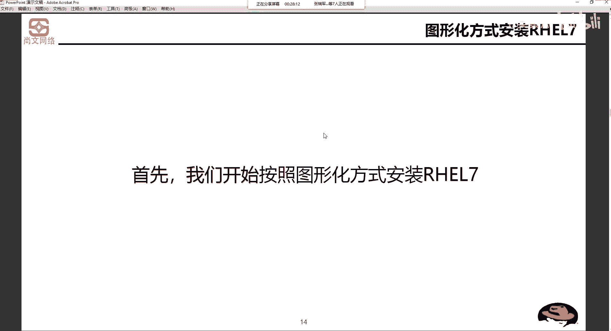

# Unix&Linux快速入门超详细教程-7天通关RHCE - P13：03-2 RHEL7.x基于图形化安装流程 - 尚文IT教育 - BV1JC4y187nr

接下来的话，我们去开始正式的去安装我们的这个这个这个linux操系统。然后呃，我们。按照两种方式，第一种就是基于图形化的一就是图形化的那种下一步下一步啊那种安装单一节点啊，这是第一个啊比较简单的。

第二个呢就是根据自动化批量部署啊，多台虚拟机啊，多台的。那不管是怎么样，那我们具体的安装安装一个操作系统的一个linux操作系统思路就是这个样。首先呢第一步选择一个安装的位置。

所谓的安装位置就是你是装在本地。的硬盘上还是装在来自于外部的存储上啊，什么叫外部存储？就是我我可能会通过一些这个这个光纤的机制，或者通过这个FCCOE。

或者是通过这个ICgay通通过英那个那个英太网或一以太网或者是internet啊去认到一块外部的存储，然后把操系统装在那个位置上。那第二个呢就是选择分分区的方式啊，这个我们刚才也提过了。

你到底是怎么规划的呢？是吧？你是有有跟有boat，有s，还是说直接。呃，一步一步都一个一个都把它单独罗列出来啊，这个呢也是选择分区方式。第三个呢是选择时区，根据我们现在所在的时区来进行选择。

第四个呢是选择软件包的这个种类，你要装哪一些软件包？首先呢我们会按照这个图形画的方式啊来安装。

Y小气。第一步启动计算机，然后基入bios设置为这个呃。DVD啊DVD进行这个启动。DVD的话就是我们的这个DVD光驱啊，你但是我们呢一般的这种如果是做这种测试环境，或者说说这是搭建实验的话。

我们一般咱的笔记本可能也现在基本上都不支持，就是没有这种内置的DVD。所以说我们直接通过什么，就通过SO啊，通过这个SO文件进行这个启动，然后把。操作系统啊，我们假设就是说通过DVD来启动。

首先肯定bios里面让让DVD设置为第一启动顺序是吧？然后把操作系统的光盘放到网区里面。引导成功之后会进入这个界面。这个界面呢引导引导这个地方，首先DVD的光驱是带引导功能的。那么现在通过那些U盘啊。

U盘的话也是可以进行引引导的。就不管你是通过DVD也好，通过USB的U盘也好啊，你只必须要有可引导的这种设备引导成功之后就会进入到这个界面。这个界面还是做的比较简洁的。

red hat enterpriselin7。6。然后第一行呢是install啊，是安装。操作系统是吧，安装操作系统。然后第二步是什么？test this meeting。这是一个暗的符号啊。

并且啊安装。那个。操作系统。第三部分呢是叫troubble shootingoting啊，troubles shooting。trouble是遇到了问题，遇到了困难。

然后shooting shootingoting是解决是吧？troubble shootingoting就是。我们要去调错嘛，对吧？然后去排错。哦。

然后这个automatic是automatic boot，是如果你你你什么也啥也不动，是吧你啥也不动，它会在一分钟之内按照默认了这个。顺序选择啊，哪一个是它默认的选择啊，应该是第二个。

你看它的第二行这个test dis andin installt right。按照prolin7。6，它是白色的，说说明它是亮的，就是高亮。啊，就是高亮。也就是说啥意思。我们在装操作系统之前。

先要把你的DVD光驱或者是你的SO文件进行一下检测，等叫test this mini。如果发现你的DVD光驱有问题，或者是你的光盘有问题，或者你的SO有问题。对吧这样的话有好处就是避免了你在安装过程中。

万一遇到了问题之后，相当于重新就是。你还要去重新去安装，对吧？所以说我们这个。一般的话是进行这个test的密，先测一测，如果没什么问题的话，再去进行这个安装，而不是说上来直接就是install啊。

分析的方案啊分析的方案。刚才我们说过了是吧啊，这样PPT也是说过了，boat swap跟。

好，然后这个回车了之后啊，比如说我们去t test meeting，然后回然后安装啊，回车了之后，然后再回车开始这个安装程序啊，开始进行这个安装程序。然后这个开始安装了，它就会去检测一我们的一些设备。

比如说我们的内存，我们的南桥北桥的芯片，包括去检测我们的一些总线，我们一些设备的总线。然后这个看有什么东西，然后就选择我们来看我们的硬盘。

然后在这个地方呢，我要特别强调一点，就是磁盘的缓存写模式啊，磁盘的缓存写模式这个地方已经用红色的圈给圈起来了。

大家看这个地方，SDE还有印象吗？SD。在这个地方SDA。SDE代表的是什么呢？我们就以他为例是吧？嗯，SDE。首先，SD是代表了什么？就是非IDE接口。的硬盘。啊。

SDA那就是第一块非IDE接口的硬盘，有可能是沙塔，有可能sars，有可能是CC。

然后看。drive cash嗯drive是驱动的意思，cash是缓存的意思。然后它的缓存后面来了个冒号叫read through。Right through。545。

这个地方呢要特殊要特别强调一下啊。对于这个磁盘缓存写模式的话，一般分为两种，一个叫r through，一个叫r back。red through是止写模式。什么叫止写？就是。在做数据更新的时候。

同时写入cash和后端的存储。这个模式的优点是操作简单。而且是什么提供了一种双向的所谓的冗密性质，就是我的开始缓存端既有一份，我的存储端也有一份。那么缺点就是因为我们数据修改就同时写入存储，写要ca始。

所以它的速度会比较慢一点。但。但对于这个。数据的一致性。That what。是。要比其他的模式要好。那么第二个点re back回写模式，数据更新时先写到开始。所以说他先写到开始时候。

他速度会比边速要快一点，要快一点。如果有需要的话。我们进行这个写到后端的存储。啊，就是back回写到。后来的陈述。那么它的缺点就是说它的优点就是射油速度快。嗯缺点就是。

如果一旦更新后的数据未必写入存储时，出现了系统掉电，系统一掉电开ash就没了啊，开始就没了，数据将无法转回。这种数据啊这种数据我们指的不仅仅只是一些结构化和非结构化的数据。什么叫结构化数据？这个数据啊。

这个。结构化。非结构。那么还有一个呢是。叫read的信息啊，叫瑞的信息。🤧这个这里这里这个地方指的这个数据是指。结构化数据非结果和和锐的信息。所谓的结构化数据是我们的一般。比如说。

这种这种这种这个比如数据库里面的一些啊字段的信息。那么非结构化数据指的就是什么？比如说文。图片、视频等等。那read的信息是什么？REID啊readREIDread。是廉价的。具有冗余性的。磁盘水液。

其实言为继续就是将1到。多块儿。相同规格的。这种所谓的相同规格，比如说接口。都是sars的。然后色盘大小。都是比如说600G的。然后速度。速率。比如都是6GB的。啊等等等等，就是他们是兄弟啊，就是兄弟。

接口一样，大小一样，速率一样等等。这是这个这么多的规格的磁环。我们通过一些啊。数组。排列。方式。这些。团的。一起。小虫。比如说我现在有有5块是吧，有5块。600G的ss。上。我要去做一些read啊。

做一下REID做read。比如说。做u。为了我。那么最终。瑞的阵列。会。给我们一块儿。大的逻辑。啊，什么叫逻辑牌？就是我们我们这个东西叫300G的。star的就是物理盘是吧？就是这个盘是实实在在的。

我们如果要做read5啊，最终read的正力亚会给我们一块大的逻辑盘，就把这555块600G的盘，把它们容量穿在一起。啊，当然做re5的容量是N减1，也就是也就是5减1是吧，也就是等于4块啊4。创业。

600，比如说呃。2。4个T的。当然这个硬盘是指的什么？就是。read的组。画过来的。逻辑。当然对于服务器啊，对于我们这个对于我们用户来讲，它就是一块盘。啊，这边好像是一个逻辑款。

但实际上它底层用的是什么？就是5块600G的sar斯盘。来做了这么一个运。那么对于这样的一些锐的信息，这个东西也叫数据啊，也算数据。那么如果你的瑞的信息。实际上是分布在每一块盘。那如果瑞了信息。

数据丢了。那么你的这种阵列的信息也就给丢了。实际上他们就这盘就散了嘛，对吧？就就被打散了。就或降级了啊，就是通过这种方式。所以说这个地方指的这个数据。除了那种常规的，我们呢说这个。啊。

结构化数据非结构化数据还有包含这个信息啊，就是阵列的这种这种信息。要注意呢，就是说如果小伙伴们我们是在做是从做传统IT服务器实是走过来的。比如说像我这样是吧？呃，做传统IT这种服务器的实施或者运维。

那么我们就续一定要去会去配到read的这个阵列卡。这个read的阵列卡呢实际上是在主板上的1个PCIE的一个插头上插了这么一个卡。然后他会把这个盘就我们就以这个为例是吧？把5块600G的ss盘。

做成一个逻辑盘。那么这张图呢，就是说我们在做。配瑞的的时候。会遇到的就是在这个地方。default right default right这个模式，你看有这个right through啊。

有什么啊always right back，还有right back，对吧？有这两种方式。这种就是。嗯，这种磁盘的缓存的这种写的模式。嗯。接下来这两个磁盘缓的宽存写的模式的一个流大概的一个流程图。

我们主要是看右边这个位置。因为读嘛大家都是一样的东西，主要是写这个right写的时候。写的时候他会有一个。这样一个选择。是否要往就是这个cash是否要写到lower memoryory啊。

lower memory。他不管如果是的话，我们会写到什么c block啊，我们把数据写到c block，然后同时写给memory。那么如果否的话，它同时也会写给这个low lower memory。

最后形成一个数据的一个down数据这个down。所以说就是说对于这个写的部分。我不管你是否要cash gate啊，是否要进行这个cash的一个命中。我两边同时我都会写写到一个地方，就是我记忆开始怎么有。

然后我的这个date啊，lower memory里面这个地方也会有。啊，就是他同时会。写两个部分。那么re back的话就是这个样，有好多的这种。这种问题了是吧？如果是要进行开始的黑实的话。

我们可能会直接达拉到拉到这里到进行这个block的写。如果不是的话，我们首先还要去看是不是一个dirty，就是是不是一个脏的缓冲缓冲数语。如果是的话，我们还要怎么去处理是吧？写到loer memory。

如果不是的话，会怎。然后最后写到这个档里面，这是。re through和 right back的一个一个流程。我其实对于我们很好的一解专速就是我两边同时写。你re back就是先写缓存。

然后有必要的时候再写，再回再回到这个后端存序。好，这是这个。

嗯。遇到了这个rd soup啊，或者是red back。那么对于一般的这种服务器，要实施这种服务器的时候，再配置本地针列卡的时候，这个这个模式一般就会写软输。

but we should don't respect back。然后配完了之后呢，可能会去指定一些锐的级别。这个呢就是我们。以后我们会去讲这个数据啊，就是存储磁盘管理这一块，我们会去去去去。去讲。好。

接下来的话我们就开始啊，然后启动完了之后啊，这些地方我们启动完了之后呢。就来到了一个所谓的突性化啊，我们终于看到了一个突性化的一个一个界面是吧？首先第一步让你选什么english。

让你选英语或者是各种你擅长的语言是吧？都有啊，葡萄牙语、法语、日语、韩语、各种各种语都有。然后下一步。如果你想让这个lininux操作的系统支持中文。

那么会选择这个中文的这种简体中文、繁体中文等等等等啊，通过这种方式啊来进行选择。

那么接下来的话，对于一个一个linux操作系统的一个配置呢。就是这样的一些步骤吧。第一个指定我们本地化的日期时间。第二个呢设置一个键盘，第三个是语言，第四个是安全策略，第五个是软件安装语。

第六个是软件选择。然后下一个是磁盘分区。然后网络主页名设置这几步最最最最最最重要的就是四范问区。所以说我们刚才在讲这么多是吧，跟磁盘有关的这些东西啊，跟磁盘有关的这些东西就是为了要好合理的去规划。

🤧我们的操作系统。根据示范分区啊，是怎么进行这个规划的？看是右边这个图。日期和时间。这些时间，他这个地方没有亚洲北京，只有离着你最近的就是亚洲上海啊，没有亚洲北京，你选不了北京那个市区。

最近的是一二洲上海。键盘是吧，我们是美式键盘还是各种什么样的键盘语言啊，是中文还是英文还是什么文？然后这个软件的安装源这个地方本地介指啊，所谓的本地介指就是。

就是这个呃你的那个DVD光驱的光光盘或者是SO，然后软件选择软件选择的时候会会有几个选项你选。比如说最小安装啊，比如说这个虚拟化的这种。工序。比如说安装这种这种呃基于这个呃图形化的这种啊工具。

就是你装完了一个操作系统，就是它带不带图形，我们这个地方都可以去选。然后再往下呢，这个这个地方呢就是一个安装的位置啊，我们说了。你既可以安装到本地的硬盘上，也可以安装到来自于外部的啊这样一些这个。

位置。这个是设置时区和时间，我们来看了这个地方。你只能去选到亚洲、上海，你选不了加州北京。而且在这个地方啊右上角会有一个网络时间啊，什么叫网络时间呢？网络时间叫NTP。

NTP啊。叫网络。时间同步服务器。就网络时间同步服务器。也就是我们基于internet网上，我们连到internet网上，我们去找最标准的这种。

，时间。然后呢，我们继续再往下看啊，如果不是基于网络事间的这个更新和同步，我那么我们现在看到的这个16点冒号34，这个时间是我们的主板上那个bios的，就是我们主板上的。这个时间。啊。

主板和bios这件事情，如果你的bios电视没电的话，它有可能就初始化了。比如说20比如说2000年1月1号了啊，相信大家应该会会会经历过这个东西。嗯。

所以这个时间的问题就是要不然你NTP啊通过网络进行同步啊同步，要不然就是基于你本地的啊这种啊时间。然后这个地方会有一个atation，就一个警告，就是如果您需要使用NTP首先是需要设置网络，你得上网。

对吧？啊？你得首先要能上了网。好。重点呢来说一说。这个分区的啊这一部分。我们来看一个例子啊，我们来看一个例子。比如说我的CPU主屏是2。4个G赫兹，内存是1个G，然后硬盘是27的Cy。哎。

一看C拉y就知道肯定是将来是SD是吗，对吧？啊，是SD。那么按照这样的一个现有的环境，我们怎么对它进行一个规划呢？首先SWVPSWV我们刚才说了，它是物理内存的1。5到2倍。

所以索性我们直接设2倍就好了啊，所以它是两个G。啊，因为我物物理它是一个G，所以它这个sp啊就是设置为两个G。第二个bo分区。标准形式的200兆。标准形式的200M。第三个。根分区啊，这个肯定要有。

而且。后面我特意写的叫LVM的形式，15个G啊，LVM的形式15个G为什么有的是标准形式，有的是LVM呢啊这个呢我们待会儿去要去详细的说一下。那么最后一个呢叫斜杠APP啊。

也就是说在根下面会有1个APP分区，然后去匹配剩下所有的空间。啊。第1个SWVP我们没什么可说了对吧？啊，就是物理内存的1。5到2倍。然后波动分区我们也没什么可说的。但是要说的是。

为什么它叫标准形式的200兆，而不是说和根分区也是采个采用过LVM。那么什么叫标准形式。什么叫LVM的形式呢？我们还是打开一个这个磁盘磁盘管理器。这个是我那个物理机的一个磁盘管理器，对吧？啊。

磁盘管理器。好，然后还是可能在磁盘管理器里面会看到2块盘，我们还是以第一块盘为例。第一块盘我们分了几个区CDE看到了吧？CDEC盘100个GD盘200这个，然后剩下的都是200个G是E盘。

也就是说这三个分区大小是固定的。没错吧，我们打开一个看看。啊，这三个分区的大小是固定的啊，看一下这个属性啊，对吧？这个一共是100个，1一共是99。3，然后使了80。1，还剩19。2。

那我们假设我们假设，如果说我的C盘或者我D盘或者E盘马上就要写满了，或者空间已经不够了，是不是我们没有办法再往里写了。如果说这三个这个我整块有个500G的盘啊，SSD啊。如果磁盘空间都写满了。

那么我们一般的这种情况下会怎么样？可能会是不会想办法。再加一块大的盘，比如说来1个ET的啊这个这个盘。是吧来了ET的盘，完了之后，把D盘，把E盘先。copy啊先备份啊，首先要备份，把数据备份好。

然后有可能会把E盘先右键。删除是吧啊。D盘右键删除，然后删完了之后，他们俩是不是就成了一个可谓用的分配空间，完了之后再重新去。去创建一个valueum啊，再去重新value。实际上这个步骤非常的繁琐。

第一步要把每个分区的数据copy出来啊，备份一下，然后去想办法。我原先比如说我200个G，我想让它为400个G，那我肯定要看看整个整个磁盘空间有没有可用的空间呗。那如果说我400个G。

想要400个G就是不够的话，那没办法，只有把E盘给合并了呗。这样的话，这个借款才有有可能是400个G，对吧？啊，但是前提是什么？你必须要把每个分区的数据把它copy出来，然后做delete的。

然后做excent的，或者是重新去建一个D盘。这样的话，我们的地盘就从从200个G。升到了400个斤，对吧？很麻烦啊，可以说很麻烦，而且会有数据丢失的风险啊，这个是一定的啊，这个是一定的。

所以说这种形式就叫标准形式。这种方式就叫标准形式。那么第二个。LVM啊，我们来说LVM。2VM。2VM是啊逻辑。卷管理器。逻辑资缘管理器LV指的是logic。Loic，然后V指的是valueum。

然后那个管理器。Managerr啊。逻辑剧院管理区。这个逻辑经验管理器呢。我们来简简单的画一个画个图吧，来示意图来看一下。就是这个。我们来看一下。首先呢你有一块盘是吧啊，比如说这一块盘。

我们把它想象成一块盘。比如说500个G。对吧。如果你是标准的形式的话，我可能会进行这个分区嘛啊比如说C。100。比如说第一。200。然后一。200。对吧。如果说你这个呃E盘往里写数据马上就已经不够了。

对吧不够了，我们没有办法，我们只能怎么着。我们再去加一块盘。啊，比如说一个T的啊一个T的。那好，你加盘的时候，你要想这样一些东西。比如说我们的笔记本，我们的笔记本一共就一个slot。

就是我们的这个硬盘啊，插槽就一个slot。那你如果一个个st，你是不是要先把这500G数据先把它给。D盘E盘首先要做一个什么做。back up是不是？然后。DE没问题了。那么我们的C怎么办？

我们的C是不是要做？比如说做ghostGHOST。我们要把我们的。做一个ghost是吧？那么做完gst了。好，没问题。你的这个盘。关机，然后把它拔上来，然后呢，我把把它换了一，把它换成这个ET的盘。

对吧？那么我们这个500G就可以放到闲鱼上把它卖了。然后这个这个ET的新盘，我们要去又要去花去花花呗，把它把它分期，对吧？因为EET的SSD是非常贵的。啊非常贵了。然后这个我们继续分是吧。

C盘可能我现在空间够了，我可能给200个G。然后我第一盘我可能会给500个G。然后我可能一盘。这个。300个G吧啊。是这样吧啊，一体是300个G。好，然后我们又开始往里写，又开始往里写。

总会这300个G或者是这500个G总会又会要写完，对不对啊，又会写完，这时候你再怎么办？还是要这么来一套啊，这个东西就是基于标准的这种形式。是吧。所以你就你要不然你基这种方式的话。

你要不然就是在闲鱼卖咸这个咸鱼这个卖硬盘的路上，要不就是在采购新硬盘的路上啊，就是这个样。那么我们来看一下，那么LVM的形式，它和标准形式有什么有什么区别呢？啊，有什么区别？我们还是这个样子。

一块盘500个G。啊，500G。首先第一个呢。它会有一个概念叫PV。啊，PVPV指的是物理卷。啊，指物理学。然后第二个概念叫VG。指的是卷组，叫veman group。然后第三个呢是LV啊。

这个LV指的不是你给女朋友买的那种LV的包，指的是逻辑军。Logic value啊 logicic value。你这样理解啊，我们这500个G空间，我们就不按照不按照上面的这种方式了啊。

不按照上面的方式，我们就是把这个盘。做这样一些操作。首先呢我们把这500G的盘作为一个转化成一个对象，叫PV。首先我们要把它作为转化成1个PV啊，叫物理卷。然后第二步。

我们把这个物理卷放到这个一个卷组里面。啊，当然你的这个卷组是不是可以有多个这样的物理卷，就是多个这样的四盘，对吧？多个这样的资盘。那么在这个卷组里面。我们去分别的去创建逻辑局。呃。

在做卷组的时候在做卷组的时候会有一个概念。就像我刚才画的这个样，我把每一个磁盘。化为总同大小的格子，你就理解为这个格子啊，这个格子啊，这个格子就是大小都是一样的啊，这个格子呢叫PE。啊。

叫physical extent啊，physical extent。就是物理分区。就是每一个格子总成大小都这样，比如说32周。好。那么我们接下来我们去创建这个LV。那么创建完L创建LV的时候。

我们在创建LV的时候。我们就是要按照我们这个PE的大小。比如说我要指定100个PE。那很好理解了，那就是32乘以100。啊，比如说是啊100个G啊，举个例子啊，比如说是100个G。

那我们对于这100个G的LV进行格式化。对吧然后你个人画完了之后。格化完了之后，你是不是应该赋予这个什么？呃，赋予。文件系统对吧？赋予文件系统。然后文件系统应该是比如说这个呃E叉。

T4啊这样一个文件系统。然后。这个LV我们就可以用。啊，这个LV我们就可以用了。啊，这个二维5就可以用。那好。我们再来看我现在这个LV是100个G，对吧？比如说我用了这个PE用了这个PE用了这个PE。

我还可以从这个PE上去取这个PE上去取这个PE上去取。你会发现LVM形式的形，这种形式和标准形式有一个最大的区别，就是你的标准形式，你的block是要连续的写，就是我往C盘写写写写满了。

然后继续往D盘写。然后继续往E盘写。就是它的这种连数据连续性是就是继续连续的这种这种机制是有的啊，就是往里面写连续写。但是我如果是LV的形式，我可以啊不一定非要从啊必须必须不一定非要从这儿里面去。

并排的啊，我要连续的去拿这个PE，不是这样的，我可以从这拿，我可以从这拿，我可以从这拿，我可以从这儿拿，我可以从这拿，随便啊随便。好，如果100个G往里开始用，如果快点不够的时候。

我会我会看这个卷组里有没有可用的皮E，就是有没有这样的一些空余的格子。哎，比如说这个地方有。比如说这个地方有比如说这个地方有，那我就可以继续把这3个PE进行ex寸的叫扩充。ENT。而且不需要格式化啊。

就是不是说格式化，就不需要像标准分去那我先把数据备份备出去啊，然后那个就然后再去找一个盘大一点的盘把它替换上，不是不需要这个样。那么如果这个危机里面没有已经没有这些可用的。这个什么呢？已经没有可用的。

呃，这种P衣的话，那么我就再加一块盘，同样的把它们做成这些格子啊，同样的把它做成格子，然后把它加到vem group里面。啊，同样的把它加到外面功里面。那你的弯轮钩P的整个大小是不就多了？

然后我们可以继续做ex寸的，而且不光可以做一次的。如果说我现在是200个G的LV。我现在用了150个G，我觉得我不想再就是剩下的50G，我觉得不会再用了，就是不会再往里面写东西了。

我们可以把这50个G抽出来啊，叫做reduce。REDUCEre。那么做完reduce之后，150个200个G的空间，最后就剩下150个G。那么多出来这50个G的这个空间就可以给。啊，别的LV啊。

比如说这个叫LV1，然后可以给LV2。进行一个存。做就这么一层。这个就是呃呃LVM这么一个概念。那么LVM还有一个好处呢，就是我在做一寸的时候，在做reduce的时候。

我不需要我不需要怎么着那个那个就是不会说呃考虑这个风险数据风丢失的风险性是比较小啊，当然也会有，但是它没有像传统的这种就是那种标准方式。他的风险那么大。好。所以我们。继续来看。2VM。是吧第一个叫PV。

第二个。叫危机。第3个。9。然后第四个概念就。提议。啊，叫PE。做拼音。那么这是基这是基于这是基于这个这叫linux啊，叫linux。那么对于windows的这种，有没有类似于这种的一机制呢？

有它这个东西叫动态卷。动态卷动态卷的前提。是。windows上的。磁盘要从基本磁盘转化为。动态。我们来看死亡管理器。大家看这个地方，这个地方有个叫basic，看到了吧？basic叫基本磁盘。

点击右键看到了吗？有个conver to dynamicna啊，dynamicy disk转化成动态磁盘，看到了吧？啊，转化成动态磁盘。那么我我们有了多个这样的基本磁盘，我可以把它转化为动态磁盘。

然后在动态磁盘之间去画。去。创建简单卷。条带话卷。镜像卷。瑞了5卷。这个券实际上你就可以理解为LV。啊，就是理解LV。那如果我的这个券如果这个LV不够不不够了，那我就从那个什么从这个动态磁盘。

从它这里面去找看有没有可用空间。如果没有的话，那还要再去扩扩磁盘，但是这种扩磁盘和标准的这种扩磁盘是不一样的对吧？啊，这种方式是不一样的。这个叫逻辑经验管理器，希望大家能把它。暂时搞明白啊暂时搞明白。

所以说逻辑均LVM一个好处啊，优势。一。非常方便的进行扩充。2。不太用考虑。数据丢失的风险。就是。在做。扩充。或者。这个收缩的时候。不用太考虑。数据的风险。但是呢这个不无论是动态卷。还是LVM啊。毕竟。

是基于。操作系统。你如果操作系统，如果操作系统挂了之后，你这些LVM你再怎么做的，最好还是没有用，是吧？啊，所以说我们还是要为什么说。要在。底层要把。磁盘的。冗余性。进行提高和加强。怎么样对底层做？

其实很简单，就是re。但是这种read就属于什么硬件啊，我的我的PCIE我的PCI或者PCIE那个有一个read卡是吧？然后我的盘有多块。一样的是吧？通过readd。所以底层这完readd之后呢。

我们要。保证了底层的这种运性。然后同时操作系统，我们要经常什么备份也好。是吧啊各种方面，然后保证我们的LVM啊，就是这样一层一层进行这个做的这容啊。保护。所以说对于。这个根粉区我们是建议什么？用LVM。

而就不是用这种标准形式了。如果你根本区用标准形式的话，是5G它早晚会写完，写完之后怎么办？没有办法了，对吧？所以我们用LVM来进行这种。方便了扩充或者是手作。

那么在这个地方呢，就是。啊，一个这个。扩虫就是对对对于一个呃红帽操系统，我们怎么去进行这个分区啊，当然这个这张图呢是一个手动的分区啊，我们待会去会做一些详细的这个演练啊演示。好，分区就这个样。

然后再一下再一个呢就是往下就是这个选择我们的这个操作系统的安装包啊，有这样的几个选项，基最小安装，然后基础设施的服务器，文件打印网页服务器虚拟化主机和GUI的服务器。其实就是两个点。

最小安装就是一些基本功能。你可以选择它啊。再一个呢就是说如果我要想去使用带图形的，就是说我装完操作系统之后，要带一个像windows一样的这种图形化的这种窗口，你就选带GUI的服务器，就选最后一个。啊。

其他的我觉得可选可不选啊，主要就是两个。你要一个最小的基本功能，那就是就就就选第一个。如果要带这个图形的话，就是选最后一个。选这两个。然后这个安装员安装介指，这是基于本地的是吧？

本地我们的那个DVD光驱或者是RSO或者是U盘。

然后开始装装完了之后，在安装的过程中呢，我们可能会这个啊遇到你要去创建一个普通用户啊，或者是给root用户设置一个密码，而且给root用户设置密码，一定要符合密码复杂程度。没要负责炒度。

他这个是有安全性要求的啊，是有一定这个安全性要求。好，然后这一个呢就是开始这个安装啊，安装完了之后。

啊，会让你去啊同意啊，就是license agreement啊，是license agreement，就这个地方啊，license agreement。就是我我们要去遵循这个许可协议嘛，是吧？啊。

遵循这个许可协议。然后呢去这个啊同时你在装的时候呢，你可以去设置一些跟于网卡有关，就以太网有关的一些，比如说IP地址。指网验码DNS服务器，然后这个这个这个网关什么的啊，包括你的hosing你的主机名。

装完了之后呢，会有呃会有一些这个小的一个向导啊，会有向导。比如说啊让你选语言是吧？选语言，然后选择这个键盘，选择时区选择你的在线账号。如果你有谷歌或者是微软的portal啊。

就是统一这个统一的这个门户的一个啊账号，我们可以去进行这个在线的啊，进行这个啊登录。然后设置完密码登录进进来之后呢，就是大概一个这样的一个啊这个东西就就是所谓的啊linux下面会有一个图形化的这种啊。

就和windows一样啊，一个图形化的这种带窗口啊这种这种桌面。🤧嗯。

