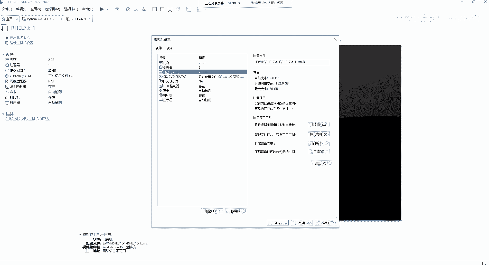
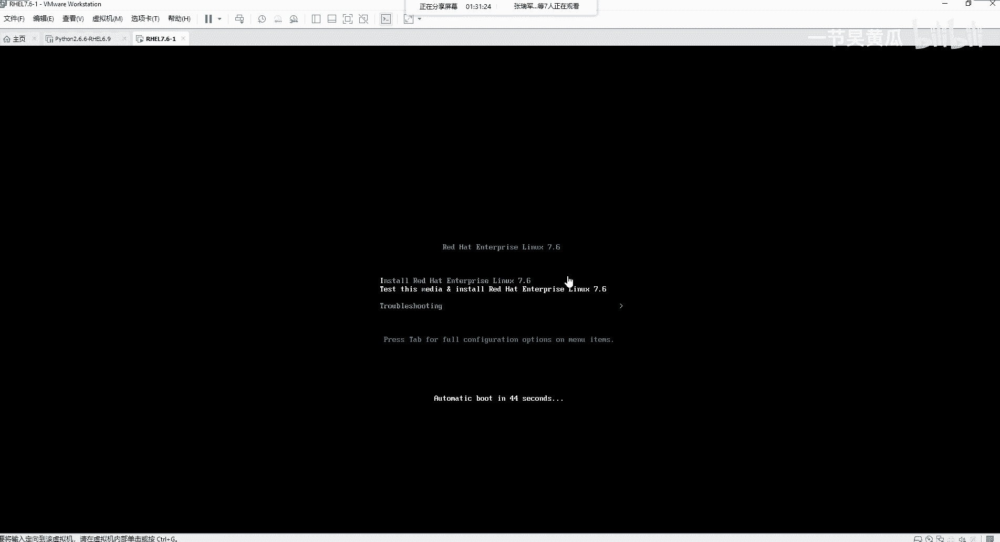
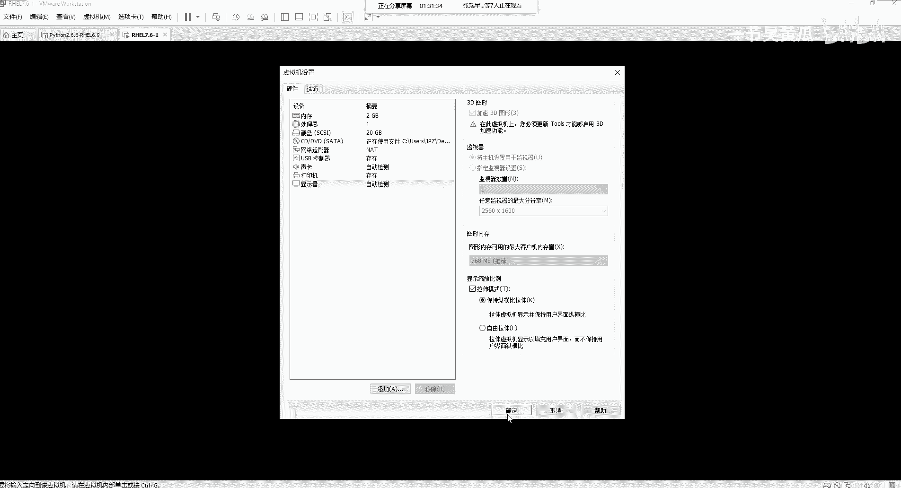
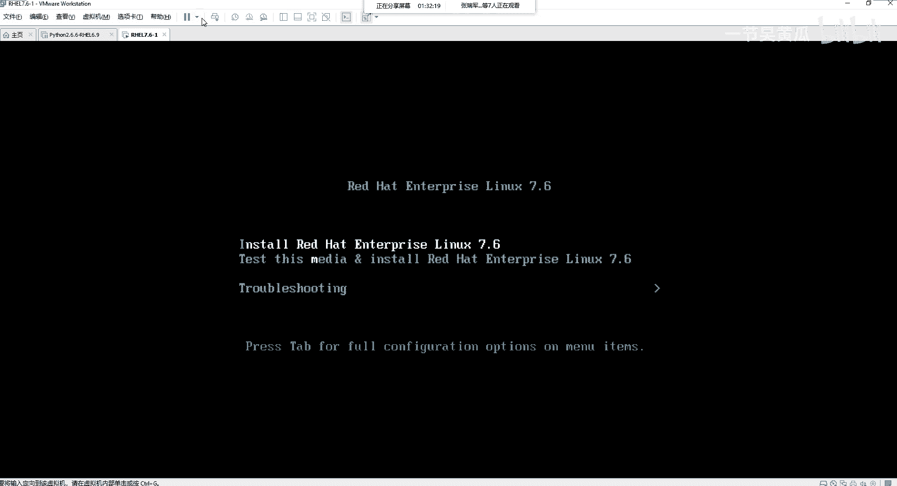
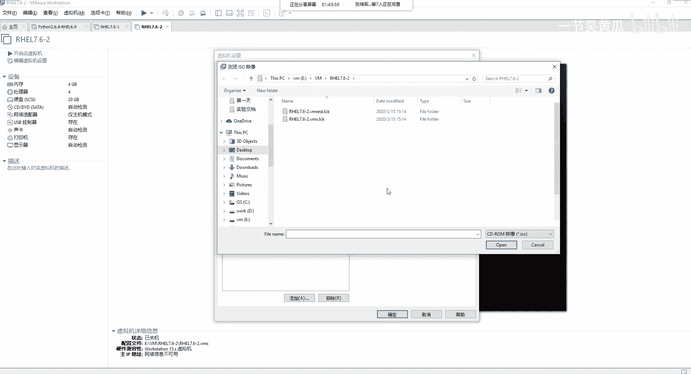
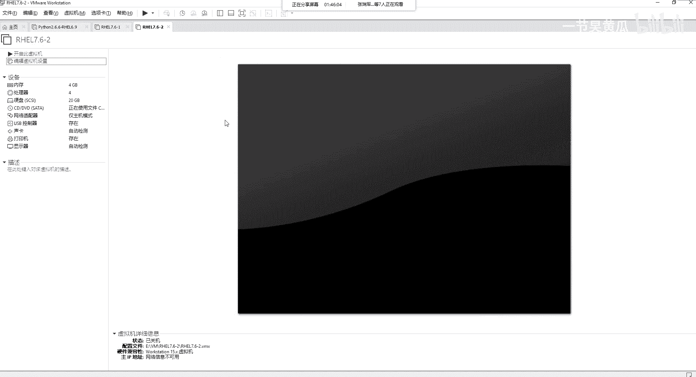
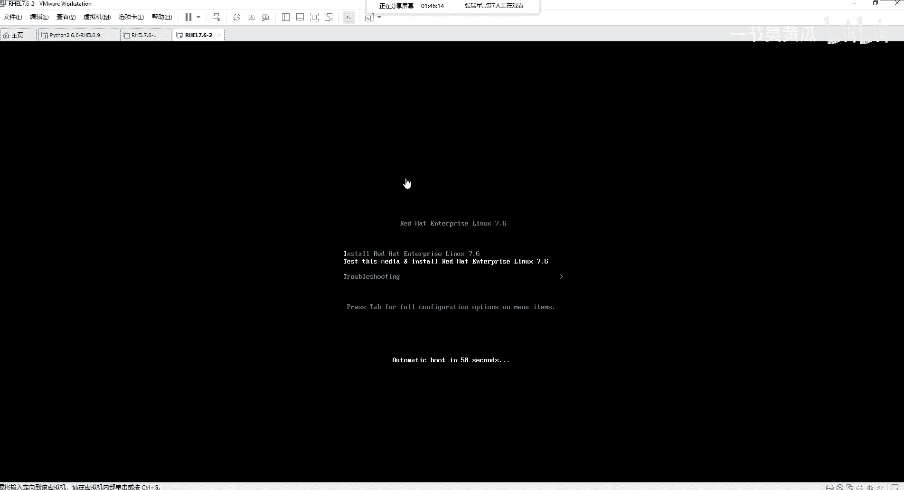
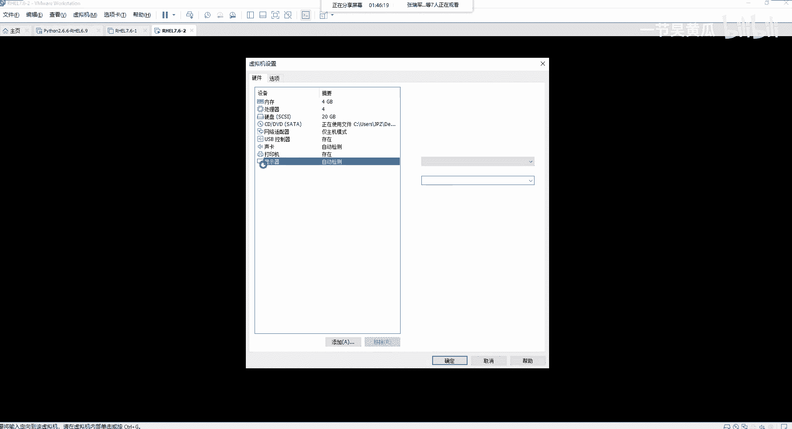

# Unix&Linux快速入门超详细教程-7天通关RHCE - P14：03-3-1 使用Vmwareworkstation安装RHEL向导讲解 - 尚文IT教育 - BV1JC4y187nr

然后我们开始这个正式的去安装操作系统啊，安装操作系统。嗯，第一个呢就是首先呢我们要去安装VIM的workation，这个之前都拷给大家了，下一步下一步是吧安装应该也是很简单的。

然后这个打开VIM works的时候，建议大家就是。点击右键。点击右键，然后以管理员的这个身份进行运行。啊，就是你不要双击了啊，不要双击。要点击右键啊，以管理员这个身份啊进行运行。

因为有时候在做实验的时候，发现。啊，有的时候在做实验的时候发现。这个呃有声音是吧？啊，就是再说一下啊，就是你在打开这个在安装安装 works的时候。很简单是吧？然后装完了之后呢。

你再点击你再打开这个vemer what时候，建议大家点击右键啊，以管理员这个身份运行，就是不要双击啊不要双击打开，就是点击右键啊，以管理员这个身份。啊，进行这个运行。

然后给到大家的这个应该是VM最新的啊，15。5的pro啊，15。5的这个pro。那么接下来的话，我们就开始正式的啊进行这个操作系统的这个安装。第一步，我们要去新建一个区机啊，在这个地方啊在这个地方文件。

新建一个虚集。啊，新建一个虚拟机，for者是你按快捷键啊，cl加N。啊，新建一个熏机。新验虚积的向导有两种，第一种是典型的，也是他推荐的。第二种是自定义的高级的。我们分别来看一下第一个典型。下一步。啊。

我们先以典型推荐的这个通过几个简单的步骤来创建呃waation首点X的寻集。我们会来对比一下啊，两者有什么区别啊。第一个啊以推荐的方式。下一步。安装客户机操作系统啊，它的安装的来源。

第一个安装驱动程安装程序光盘，它这边有提示说无可用的驱动器是因为我的笔记本没有内置光驱。啊，我的笔记本是没有内种去的。然后第二个呢。安装操作系统光盘IO。🎼呃，在百度语音同步的时候。

会有一个RHEL就在这个位置先关掉。有这个东西是吧？叫呃reIIH12serv杠7。6，然后叉867064DVD点SO我们是以它啊，我们可以以它作为一个引导啊，创建一个虚机。推荐啊，下一步。

那么还有一种呢，就是可以说稍后去安装操作系统。那么对于我们来说，我们就选最后一个啊，创建的虚机将包含一个空白的硬盘。我们选最后一个，稍后安装操作系统，点击下一步。那么让你选的时候。

你看有win不有windows的是吧？啊，win10也好，win8也好，win7也好等等等等，包括windows server啊都有。linuxlinux就更多了，是吧？有这个森图S的76。

然后有德边的，然后有这个oraclelinux啊，OLE啊叫oraclelin。然后red hat啊，你看现在新视新的版面都有864位，然后764位等等等等，包括苏usy的，是不是啊？包括无斑图了。

包括其他的。那么对于我们选我们选哪个呢？我们就选这个red hat enterprise limit7，然后空格64位选这个。选这个版本，当然你还可以模拟什么VI面的ESI就是VI面的 vware啊。

基于裸金属架构的那个那个虚拟化平台。然后选回来啊，继续我们选linux，然后去选这个这个啊764位下一步。然后呢，给这个虚拟机名称命个名，并且把它放到一个位置啊。当然这个呢是按照每个人的习惯。

那我我的习惯就是啊会把它统一的放到E盘，然后有1个VMM的一个文件夹，我会新建一个啊，比如说。啊，RHEL然7。6-1啊，选了。选择它作为我们这个虚拟机的一个位置。确定。这个虚拟机的名称啊。

你可以自己改。比如说RHL啊7。6-1无所谓。然后点击下一步。然后呢，这个指定指定出盘的容量。指定这个磁盘的容量呢，磁盘的大小啊。嗯。虚拟机的硬盘作为一个和多个文件存储在主机的物理磁盘中。

这些文件最初很小，随着您的这个虚拟机的添加整理程序文件而逐渐变大。我们这个地方呢我们去指定一个最大的磁盘大小，比如说就选20G啊，我们随便啊就有20G，以它作为实验。

然后大家看这个地方有有一个是又设为单个文件有多个文件，那么单个文件和多个文件有什么区别呢？而且它默认是选择了什么多个文件。将虚拟机磁盘拆分成多个文件的好处，就是可以轻松的在计算机之间移动虚拟机。

比如说我们在我的这个笔记本上创建了一个虚拟机，我们就可以把它移动到你的笔记本上的啊VM。进行这个使用。而且并且。因为他是把。你就这么理解，把单个的一个啊这个这个磁盘拆成多个文件，我们来找一个看一看啊。

找一个看一下。比如说这个E盘VVM，然后这是我之前的啊，比如说python啊，python的这个。这个虚机是吧，python的这个虚机我们来看，我们说了是吧。

那个VMme它的虚拟磁盘的文档的这个大小这个文件的块名叫VMDK从这个地方到到到到这个地方它都叫VMDK看到了吗？包括这个地方都叫VMDK你会以发现。安希6。9-2。

0点VMDKS001S00200300400哒哒哒哒这么多是吧？那有这么多，然后你看有2-1点VMDKS001888就这么多啊，这种呢就是说将多将一个磁盘文件，实际上他们都你就理解为什么。

就1个20G的磁盘。但是他们把这个20G的磁盘给拆分了多个VMDK好处，一是方面。计算机之间的移动。第二个啊，如果你拆分成了一个单个的文件，它就是一个1个1个20G的1个VMDK。

如果这个VMDK文件受损了，损坏了或中病毒了。对吧嗯怎么弄？没办法。所以说你通过这个VMDK把它拆分成多个磁盘。啊，的好处就是。如果其中有1个VMDK受损，可以通过其他的VMDK来进行这个恢复。啊。

就是这样的一个好处。这个要注意。所以我们对于我们来说，我们就是把这个虚拟磁盘拆分成多个啊文件。下一步。好了，没没有了完成。就这么简单是吧？这是基于这个呃。简单的就是这种推荐了他那种典型的方式。然后呢。

我们这个如果要启动这个虚机点这个开启此虚拟机，但是我们我们没有配这个引导，可引导了这个选项，对吧？首先编辑一下啊，编辑虚拟机。好，然后我们在这个地方啊CDDVD沙塔，我们去加载ISO使用的文件啊。

加载ISO我的那个ISO是放在了C那个桌面上，就是这个地方啊。OK好，确定。实际上这种方式是非常简单的啊，有什么样的步骤呢？选操作系统。对吧然后指定你那个磁磁盘的大小，对吧？

然后去加加载这个ISO的文件啊，就这几个步骤。好，我们现在先把它展示开起来啊，把它开起来，我们看一下。

好。然后需要注意的呢，就是呃它一开始启动的时候，这个文字很小是吧？很小，我们可以点击右键，就是在这个虚拟机的这个选项卡，点击右键有一个设置啊，点击设置。

然后显示器。在这个地方显示器选择显示缩方比例，选择拉伸模式。你可以保持纵横比拉伸或者是自由拉伸。我们就以第一个比例点确定。

你看它的这个是吧，它就根据啊纵横比啊保持一个比例。那么这个地方是不是就是我们我们在PPT里面看到了那个安装界面是吧？第一个是安装，第二个是叫test。并且你看我按我按住的是上下键。

按住上下键那个高亮的就那个highlight，高亮的这个白色的这个这个显示是从第二行第一行往下走，看到了吧啊。所以他默认的话，应该是让你先test mini，然后安装去安装这个操作系统。

OK那我们的话先不去去安不限去安装。我们继续来看第二种这个部署模式，我们先把它给。关闭啊，点击这个地方选择让它给关闭。

关闭客户机。好，然后我们再去新建一个许机。我们这个时候呢选择自定义高级，而且你会他说创业带有C控制器类型、虚拟磁盘类型，以及旧版VMM兼容性等高级学校虚拟机。

第一个啊通过几个简单的步骤去创建voc15点X的寻机。比如说15。015。115。5。那如果从我的这个笔记本可能配置比较高啊，性能比较高，我可能会选最新的事故电路。如果你的你的设备啊，你的这个这个环境。

可能配置比较低，性能也比较低。那你只能选个比如说十啊VVM washing12版本或10版本。那么这个问题这个时候就会产生一个兼容性的问题。啊，那么你第一个就不太好使了。

所以说我们要选择第二个啊自定义高级。我们点击下一步。首先来到了什么硬件兼容性，我们来看一看。15点X包含了兼容的产品是什么呢？VESSI的设物。也就是说我们把1我们通过15点X里面创建了这个虚机。

比如说就是我们刚才创建的这个虚机，我们可以把它切放到啊，就是把它上传到ESSI的这种。啊，虚拟化平台啊一样可以去运行，这就是一个兼容性的问题。那我们接下来看。那个比如说140X。

那么14点X的话可以兼入什么ESSI6。7U2ESS6。7，对吧？包括华为的啊，当然EESSI都是VM面的。然后华为的那个虚拟化平台叫functionction啊，叫functionpher。

functionpher。包括对这边有一个限制，64GB的内存，多少个处理器啊，包含多少T的这个硬盘，多少个网卡对吧？那么你在网上看12。6。是不是也是有有很多这种兼容性。

那么比如说我们就是还是说以VMM为例。那么VMMESI我们都知道现在可能已经出到了7。0的RC版本啊，7。0的RC版本RC版本就是未发布之前的一个测试版本，它还不是demo啊。

就是一个未发布之前的一个测试版本。叫7。0的RC。所以说我们将来对于这个呃更新的一个这个veve尔，要也要去兼入什么7。0的这种版本。所以说我们这个地方要注意。好，我点击下一步，然后还是一样的。

选择操作系统是吧？选择这个选择lininux。然后指定一个位置啊。E盘VM我再新建一个，比如说2H17呃。ICL7。6-2吧。好，OK然后这边我也可以去编辑是吧？I只要7。6-2。下一步。

那么再往下的话，就比刚才那个典型的时候又多了这样几步。第一个让你选择处理器，你看到了吧？有处理器的配置啊，为此虚拟机去指定一个处理器的数量啊，在那个典型里面是没有这个设置的。那么处理器的数量第一个啊。

他写了个P，看到了吧？写到了个P，这个P指的就是physical，就是指的你的。你虽然是我是虽然是给虚拟机去创建这个这个指定这个处理器，但是对虚拟机这个层面来讲。我还是要理解为什么？

就是真实的那种物理CPU的个数，我们可以选，比如说。一个两个是吧，四个、8个、16个，我们选一个看一看，没问题，选两个没问题。然后再选选4个没问题。选8个也没问题。然后再选选16个。他就会什么说什么呢？

开启迅拟将会失败，原因是什么呢？该讯集配置使用的虚拟处理器内核多于主机所支持的数量。我们再来。我选择了两颗物理CPU，然后每一颗CPU的内核就是这个C指的是ca，就是那个ca数是4核。

那么2乘以4等于8啊，2乘以4等于8是8核。如果我再多选一个。超了。什么意思？就是我选择了这个处理器的内核总数，一共是12个12CO啊，12个内核数总数12CO。Spell。原因是什么？

你选的这个配置要多于主机所支持的数量。所以我们要去看一看我们本机支持的这个数量。你点击右键。选这个任务管理器。权证关系。然后呢，我们把它放大来看这个地方。

在performance啊performance这个性能这个地方，我们来看CPU这个位置啊。嗯。看这个地方。sock啊scase指的是我的物理CPU的个数。

就是我的物理CPU的那个sockck那个那个插槽有几个啊，就一个。其实也就说明说白了什么，咱这个笔记本都是只支持一颗物理CPU对吧？你从来没听说过笔记本有支持两颗物理CPU的，没问题吧。

那么这个ca CREco啊，就是这个核数啊，核数是。4。啊，也就是说我的这颗物理CPU啊叫。英特尔的酷睿在这个位置啊，英特尔的酷睿I58250UCPU，然后1。6GUG就是这个8代的。

因为I5-8250U是8代的那个英特尔的CPU对吧？啊，然后是I5。那么我这个CPU是几核的呢？是四核的。哦，是四盒。但是为什么你看这个logic processor写了个8。

按理说8除以4等于2就是按理说是不是应该是我的scus应该是2，然后cos4，它的总的logic processor是8。是这个样，是因为。我的物理我的物理CPU就是一个啊，它就是一个。

那这个这个他的也是四核的，这个这也是一个44ca的啊，四核的这个CPU。但是它是它是双线程的。你有听说过1个CPU是比如说几核几线程，几核几线程，听到了吗？对吧？我们这个是属于四核双线程。

所以说1乘以4乘以2就等于part。那么怎么去验证你的这个CPU到底有几个logic processoror呢？我们点开这个地方开始运行，敲1个DEVMGMP点。叫dvisman怎媒。Yeah咩事。

打开了什么呢？硬件管理器。啊，硬件管理器我们在这个pos在这个地方。呃，在这个地方，processors。大家看12345678，看到了吧？啊，这个指的是8个logic processorcesor。

但是我一个物理CPU是四核的，是双线程。所以说1乘以4乘以2等于12345678有8个。所以说为什么这我们再去再去新建了这个新建这个虚机的时候，我如果是24把，哎，这个是没问题的，或者是我。

我如果4乘以2，你看四颗物理CPU，但是我是双核的，这个也没问题。如果超了到了三就不行，对吧？啊，就是这个原因，因为我总的物理CPU的logic process一共是8个，你不能超过8个，超过8个。

我就失败了。啊，所以说这个要。那么我们为有做实验，我们选一个选一颗物理CPU，原来选个4C啊就可以了。下一步。内存的话，我们选。两期也好，这个根据我们自己的大小。因为我的这个呃。

我的这个笔记本内存是16G的。嗯，在这个地方啊是16个企。对吧啊，十六节。这个8。5乘以8。5加上7。3嘛，差不多16个G。啊，在这个地方一共是16G啊，所以我我就可以比如说我大一点，不选4个G啊。

选4096啊，选4个G下一步。然后再往下呢是选择这个网络类型。选择这个网络类型。Vairm work works给我们啊这样三种类型。第一个叫使用桥节网络bridge啊bridge。

bridge就是桥接网络，这个是啥意思呢？它生成了一个虚拟网卡，但是它是巧接在我们的物理网卡。说白了也就是说他要跟我们的物理网卡在一个网段。第二个叫NAT啊，网络地址转换。这个我们相信学网络的人。

我们都知道NAT啊网络地址转换。对吧然后第三个呢叫紧主机模式啊，仅主机模式呢就是说我的这个虚拟网卡。这个虚拟机啊，我要去指定一个网卡，这个网卡呢是只能和我这台笔记本啊，只就我自己的宿主机可以相连连通。

你想想你如果是。做了桥街，那你。和你整个网络其他的机器是不是也可以通过那个调接的方式是吧？可以去可以认到你的这个虚访问到你这个虚机。那么NAT呢就是说相当于通过地址转换啊。能上网是吧，能上网。

然后第三个呢就是仅主机模式，就是我只能和我虚拟，只能和我的这台。呃，速主级的最后我和我的这个win10啊进行这个访问。其他的这个你的笔记本和其他的笔记本。虽然在一个网段里面，但是是访问不了这个续机的。

第四个呢是不使用网络连接。那我们为了做实验呢，我们就暂时选择使用仅主机模式网络啊，点击下一步。好，再来IO控制器的类型啊，IO控制器类型。

这个IO控制类型呢有比如说呃LI logic和或者是LOSSI logicss啊，对于15。5pro增加了一个准虚拟化的啊叫C咖。那么这个LI呢是指的我们刚才说过了，在这个地方。讲那个呃。

read through和read back的时候会有一个read是吧？你的这个read卡的芯片的类型就叫。就是LS。啊，LSI是一种瑞德卡的芯片啊，叫LI。我们点击下一步。然后让你选是吧。

让你选择这个磁盘的类型，也就是说你这个磁盘的接口，你是IDE呢，是sta的，是Cgaci了，还是M点2的NVME啊，都可以。我们做实验就选择推荐了C加RC啊，下一步，然后创建一个新的啊虚拟磁盘。第二个。

使用一个现有的虚拟磁盘。我们刚才看第一个新建虚拟磁盘，这个不能理解，对吧？第二个，使用现有的虚拟磁盘。刚才给大家看过了一个python的一个续集，是吧？我这不是有有VMDK嘛，对吧？

这个东西就是相当于是现有的这个VMDK的文件。那么我们就通过选择它，我们就可以去把这个什么，把这个perthon的啊现有的VMDK去给加载上。第三个呢是使用物理子。所谓的物理酸就是直接虚拟机提供。

直接访问本地硬盘。就是就就。就是直接去去访问我们这个硬盘的一个权限。等我选了第一个。创建新的啊迅集磁盘下一步同样的也是大小指定的是20个G，对吧？然后是将我们的磁盘拆分成多个文件。

但是它比刚才那个分那个那个经典呢。模式多了一个就什么立即分配所有空间。还记得我们刚才说过了这个东西吗？这个。嗯。后置备之零是吧？后置备至0后置备延时之零以及这个精简。治病啊，选择这个经年治病。

如果我们选了立即分配的话，那是不就是相当于什么？要不然就是后置备，要不然就是后置辈延时之类。所以我们为了这个最大程度的这个刺盘的空间的优化，所以我们选了什么精简之位，那我们就啥也不选啊，就什么也不选。

下一步好，下一步完成。这个呢就是通过两种不同的这种模式啊来进行这个嗯去新建一个虚拟机。所以说如果让你选的话，你会选哪种？如果让我选的话，我还是会考虑选择什么。第二种就是这种。高起了。

🤧选择这种自定义是高级的啊选择这种高级的。好，我们同样去把ISO把它加载上。点击这个地方啊，使用SO的。硬向文件，我们去找这个ISO。

确定。

好，开启虚拟机。同样的啊，我们去把我们的这个屏幕拉伸一下。

