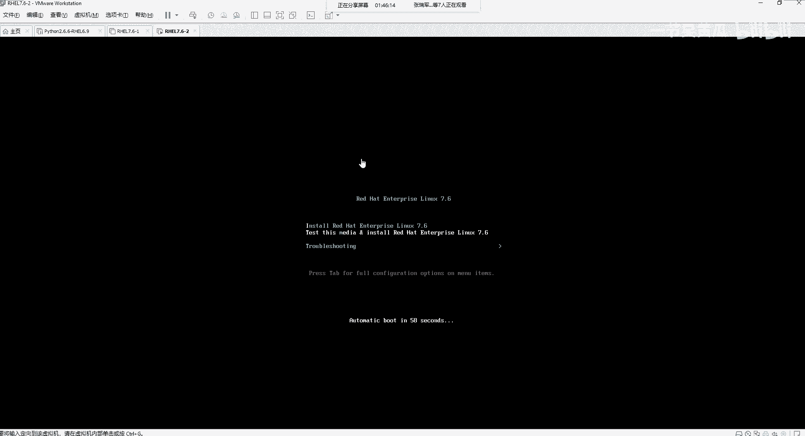
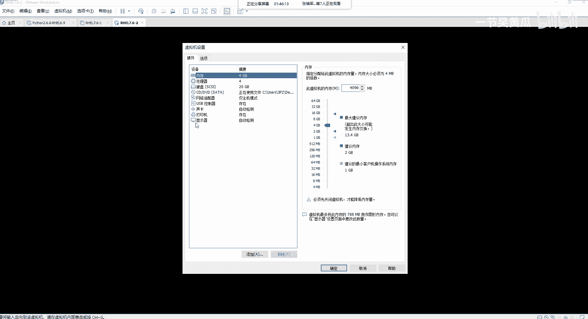
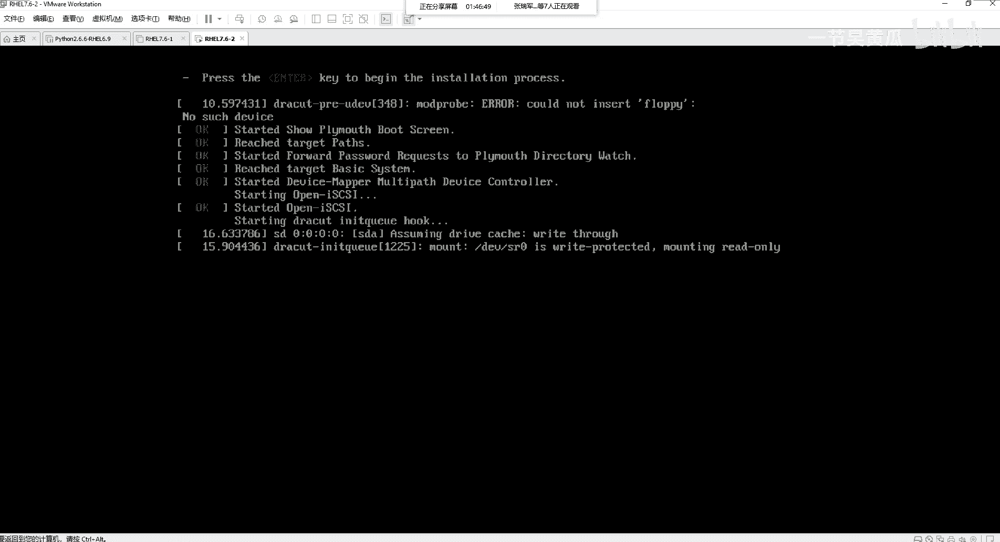
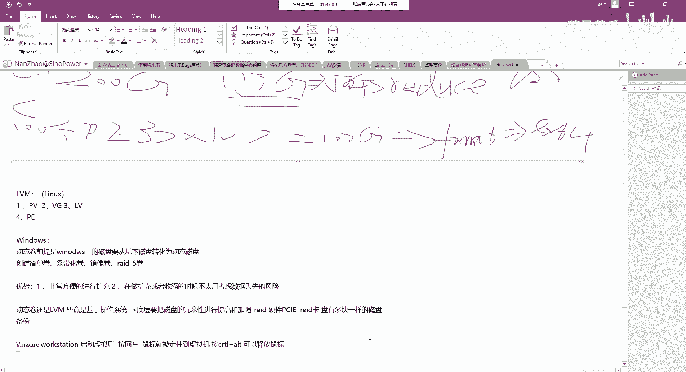
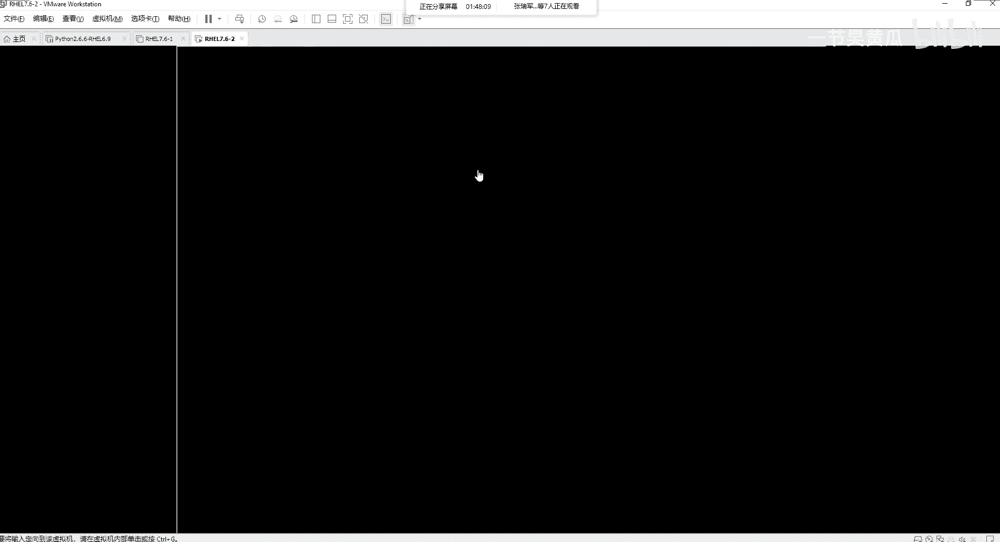
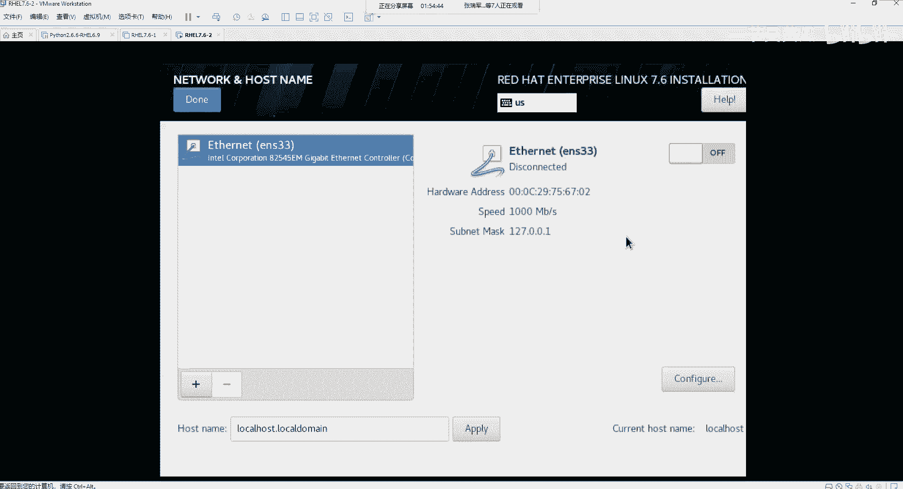

# Unix&Linux快速入门超详细教程-7天通关RHCE - P15：03-3-2 引导介质安装RHEL - 尚文IT教育 - BV1JC4y187nr

这个屏幕拉伸一下。

那么我就直接按回车啊，直接按回车啊，让他怎么着先测试这次 meeting，然后去安装操作系统。然后。他的这个地方呢啊他的这个地方呢，大家注意啊，就是。呃，如果没有玩没有之前没有用过这个VM的work。

你按了回车之后，你发现鼠标没有？你看到没有？你发现鼠标没有了，你按住左边的ctrorl和alt键。

然后可以释放鼠标。可以释放鼠标。我们在这边写一下，就是。We。启动虚机后。按按回车。鼠标。9。譬如。定住。到虚拟机。嗯，control。这样out。可以释放。鼠标。否则的话。

你要不然你你你可能就不知道这没有鼠标了，就不知道怎么怎么办了。

那么他现在这个地方就开始在进行这个checking啊，checking checking。如果如果没有问题的话，他就会继续走到那个下一步的那个安装方式。

好。呃，这样的话就来到了这个图形界面啊，基于图形界面的这种安装。再次强调一下啊再次强调一下。我们之前说过了。如果你的内存小于500兆，如果你的内存这个地方小于500兆，你看不到图形啊，你是看不到图形了。

这个要注意。那我们看这边地方这个语选的语言是吧，有中文的，然后有。有这个英文的啊。呃，我建议大家就是直接用英文啊，用直接用英文就不要选中文啊，强行锻炼自己的这个水英文水平。点击英文。好听继续。

接下来的话就要对这个操作系统进行一个。安装的时候要进行一个配置的是吧，进行配置。好。我们来看第一个啊。Datime太。我们选择。这个地方你随便选，你看你随便选，它都是什么亚洲上海，看到了吗？

随便选都是亚洲上海。你选青岛这个地方，这个也是亚洲上海。这个我们刚才也说过了，所以说我们选的就是市区reaion亚洲从事上海。当然他也是UTF呃，就是那个呃也是杠8的那个时区。

然后右上角不是有一个这个network嘛，对吧？有一个network啊，有network就是NTP。当然你要去配的，你要去配NTP server的地址啊，当然我们现在也没有联网。

所以我们直接用什么我们自己的这种。这个主板上的那个bios的一个时间，然后。到。然后键盘也是一样的，有们一般都是用英英式的那个键盘是吧？用英英式那种，然后语言的话也是一样。如果你想要。支持中文的话。

你选这个地方选上它就可以了啊。好，然后software这个地方啊安装源instalulation source是安装源，我们来看一下。他这个地方指的是什么呢？实际上指的就是。DyS20DyS20指的是。

dice的S20指的就是这个。本地的光驱啊，就是你本地的光驱这个和光盘。那么你也可以什么基于network啊，可以基于这种network。所以对于我们现在这个环境来说。

我们现在是通过什么通过光驱里面光盘，或者是通过我们的这个SO引导起来的。所以我们对于这个install source指的就是什么？就是我们的光驱里面那个光盘，或者是说我们刚才加载的那个SO。好。

然后这个地方操作software selection是操作系统，就是不是你那个软件的这个选择。说过了是吧，你你就记记住俩就行，一个是minim installs就最小安装啊。

就是最基本的一些最经简的一些这个功能啊，basic function啊function就最基本的这个功能。然后第二个呢就是什么呢？server啊。VGUI啊是带这个什么呢？

是带于这个图形界面的那有的人可能会问，就是说你看这有一些文件打印服务，如果我装了选了它或者是选了它，那么这些文件服务带不了啊，这些东西所有的这个软件包，我们随便选，我举个很简单的例子。

如果我选了min ofinst。好，装操作系统，装完了之后，可能同一化的东西没有，我们起不了通销。但是我们依然可以通过一些。手段啊去装上这些图形，这不是没有问题。所以说我们不需要太记。

啊这个文件和打印里面包含了什么东西，没有什么东西是吧？然后虚拟播出来后的是没有什么东西，我们不需要记，我们就要你只要要么就他啊，要么就塌就可以了。那么对于我们来说，作为如果是一个初学者的话。

我们选选这个啊，选servericeGI。O。然后你重新选择了这个软件的这个软件包的源的话，它会再一次去检查啊软件的这种依赖关系啊，叫dependence这种依赖关系。Good。嗯，他在检查的时候呢。

会会有一些处理，这个地方会有叹号啊，我们等他这个走完了之后啊，我们再进行这个。呃，这个操作当然你也可以同时去做别的事啊，也是可以去干别的事。比如说最重最重要的一步就是这个。我还是稍微等一等吧。

就是比如说你这个呃选的这个分区的这一块啊，我们再再稍微等一下。

