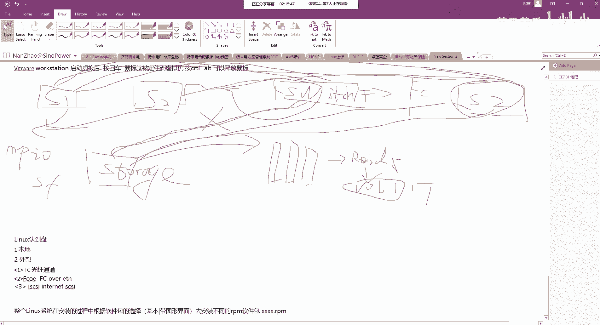

# Unix&Linux快速入门超详细教程-7天通关RHCE - P16：03-3-3 硬盘分区演示 - 尚文IT教育 - BV1JC4y187nr

嗯，稍一等啊。好了，他自己这个已经选选完了。那我们接下来来到最重要的一步啊。这个installation的 destination啊。我们来看这个地方。就是我我选择了这个地方是吧啊，选择这个地方好。

然后呢，我们来看它有这样一个几个这个这个几个选项啊。第一个就是。这有一个盘叫SDA啊SDE。呃，因为我们在选在配置的时候，我们是选的sacic接口的盘，还记得吧？对吧？

按照它的这个默认线导一步一步走选的C，它所以它就是一个s。然后呢，这个呢它的空间这个空间20G就是我们当时设置的那个VMDK啊，就那个新建的虚拟资盘。啊，所以说这个地方你看到了就是我们新建的那个盘。

而且这个盘叫本地盘，叫local stand组啊，本地的标准字盘。这是一部分。第二部分。spececially和 network disk。

specialize和net is这个呢就是一个来自于外部的一个磁盘。我们来去看一看啊，我们去添加一个磁盘来看一下。这些磁盘呢会包含什么样的什么样类型的这个盘呢？首先。

Multi pass device。什么叫m pass呢？叫多路径设备。

啊，啥叫多路机？我们来简单画一个看一看。多路径就是。我这有一个服务器，然后这儿有一个服务器。然后呢，这个。这个地方呢会有一个就是server啊，角S1。然后这个地方呢叫S2。

这个地方呢是一个存储的一个设备。叫storage啊。Don't。然后呢，我们可能会画出一个把，比如说把前三个盘啊，我们可能会做出一个read。比如说你的舞。然后呢，我认出了一个value。一个卷是吧。

比如valom一。我呢通过一个东西啊，通过一个switch。通过一个switch，而且这个switch呢是。FCFC指的就february channel啊。

february channel february channel指的就是光纤通道。光纤通道，也就是说这个存储啊，我会拉一根光纤线拉到了这个交换光纤交换机上。那么我有可能我还再来一个switch啊。

S这个是S2吧，然后这个是S一，我又有一个存储连到了这个交换机，光线交换机上。那么这个光线机上会多出一个光纤线接到了这个服务器上。那么与此同时，这个光纤交换机也会接到这个交换这个服务器上。那么与此同时。

它也会去接到它，然后它也会去接到它，那么我们认到了这个valueume一，实际上是这个存储划过来的一个盘，比如说一个T。那么这个路我们就可以从他这边走啊，从这个地方走。然后可以走到。好。

那么也可以从这个地方走。从它走到它，也就是说我这个valueum一实际上对于这个服务器来讲，有两条路可走，对吧？一个是一个是这条路，一个是这条路，两条路都可以走。如果这条路是中的任何一条路，比如说它。

这个关这个关源线被老鼠咬了，对吧？断了断了之后，那么这个是不是这条路就断了，但是有这一条路来进行这个支撑啊，所以说这个东西就叫m pass啊，叫多路性。当然你要实现读口进入。

你的你的这个服务器的操作系统要去装MP。I older。软件。装software啊，要去装MPIO的软件啊才可以。这叫mti pass。

啊 devicey。第二个sign的 device啊也是一样的道理。s啊SN。SA呢是这个。呃，存储区域网络啊叫sttorage error network啊。

s storage error network是。呃，存储的网络啊存储区存储区域网络啊，基于这个存储技术，我们会会有单专门的1111一节课是讲那个存储磁盘管理。我们这边先做一个了解。

然后NVMDIM deviceice就说把我们的NMNVME的这个设备，因为它快嘛，把它认为是什么1个DMM的一个设备。然后这个地方大家看这个地方有添加S加的 targetge，有添加FCCOOE的s。

有添加NVDIMM啊，实际上就是我们可以我们这个外外部的磁盘，我们可以理解为是什么呢？这个。

这个呃linux啊。电脑盘。一个是本意。第二个是外部。这个外部呢又分。第一个是比如说FC。然后第二个。就是从这个光纤。通道。第二个呢是需FCCOEFCCOE。这个是指什么叫？就是FC over。一提是。

就是说我们将光纤通将光纤的这条协议变成为什么电啊，变成这个RG45，就变成RG45这种。这种。我们走的实际上走的是什么以太网。啊，第一个就是FC就是走的光线通道。然后还有一个可以类似于外部磁盘的是。

做 i 嗰时。是。internet的习瓜性。我们也就是说在这个IC呢指的就是说在internet上去封装C的这种协议，然后把这个ICRC的。嗯。

这个叫taarget啊，taarget指的就是SCIC的servserv端。啊，我们通过连络so这啊，他可以给我认到一块盘。FCOE就是相当于是什么通过。把你的光纤转化为这个这个这个以态啊，转换以太网。

那么还有这个什么NVDMM这种方式啊，所以说外部磁盘有很多啊有很多的方式。好，然后再往下往下看。这个其他的存储配置。首先第一个是automatic configurationfipartition。

是自动配置partitiontion。第二个呢是我将要去配置partition啊，就要进行这个分区。我们先来看它默认是什么，是选的这个地方是automatic是吧？然后如果我点击了当啊，大家看。

我选这个地方，如果我我点我选中了一个盘，它这个地方会会有个对勾是吧啊，会有个对勾。如果没有选的盘，就是相当于说我没有选择任何一个盘，对吧？那我选了它。然后如果它是自动的去配置partition的话。

我们去。看一下。好，它自动的去选择了。选择完了之后呢，我们再来看啊我们再来看。第二个我将要去啊相要相当于是什么手动的去配置这个partition。好，点击还是选择这块盘，对吧？啊？选择这块盘。

然后点击到。然后这个时候呢，它就出现了一个东西啊，出现一个手动配置东西。你看到了一个熟悉的名字叫LVM对吧？啊，LVM你还看到了一个什么标准standard的partition标准分区，对吧？啊。

然后还有BRBRBTRFS这个是啊启动用了这种文件系统，以及基于LVM send精简支备啊，精简制备。好，那么当然这个地方呢，它也会有一个说你点击这儿啊，就选择automatic，你选了它。

你会发现我20个G的空间，它自动给我去分配好了，比如boat1000兆呃，1000兆，那就是一个G。我们之前也说过了，bo分区只要200兆就可以了，对吧？那么跟17个Gs多少啊。

但显然这个地方是我们是我们不需要的对吧？啊，不是我们需要的好。那么我们继续啊，我们将手动的去创建一个添加一个啊，点击这个加号啊，添加添加一个。

然后在这个挂载点的地方，我们去选择。第一个呢我们去选择一个bo分。然后desed的desed的是期望的呃capivitycapity是什么？capivity是容量是吧？比如说200M啊，添加到800点。

然后这个时候呢，你就发现什么呢？哎，这个容量大小是不是就是我们希望的那个量排兆。然后同时你的这个呃。dice的t，你看它自动给你归到什么标准回去。自动给你放到了标准分区。然后你的这个文件系统是什么？

是最新的这种叉FS。找最新的叉2S。那么对于这个文件系统这个概念啊，对于7。X里面，我们既我们要不然就用71叉74，要不然就是用叉FS。那么我们先选择什么？我们选择这个。啊，E叉T4嘛啊，选择E叉T4。

好。

我们再来添加。第二个呢，我们选的这个sp啊选的sp在这个地方sp。那我们的这个物理内存是4个G，那我们就选我们就写65G吧啊，添加到拐来点。

那么swamp呢我们会看到。哎，这个地方不再是什么标准分区了，而是他让你选什么LVM。然后LVM在这个地方选的有一个叫valueum group啊，就是这个volume group的名称叫RHEL啊。

你看到吧？就Vume group微机的名称叫H1那么。他起了个名字叫s。所以说在这个地方你会以发现。sp实际上是一个基于LVM的这么一这么一种。这个呃这个这个分区是吧？然后他是在哪个哪个卷组里面呢？

是在RA112这个卷组。那么它的这个LV的名称是什么？叫SWAP。当然你这个地方也可以改，你看这个改，不说改成22是吧？我改完了之后，这个地方就是就它的名称叫什么？就叫star22。好。

那么有人可能会问，那么你这个ve group可不可以自定义，也可以啊，我们去起个名字，比如说testtest VG对吧？好，然后取消哎，这个地方就是testVG的s。

所以说这个ve group也名字都是都可以可以变的。那么接下来我们再来去添加一个。

对。我们。我们这个跟比如说啊12G啊12个G。

爱老外来点。那么添加完了之后呢，也是一样的。文件系统我们可以选叉E叉T4或者是叉FS。然后呃device的type一定是LVM啊，当然你也可以标准分区。

但是我们建议什么是LVM你在哪个卷组里面testV这个卷组，你起这个名字叫什么，就叫root。你比如说我这个地方我改根。好，我再请讲。哦。你看这个地方原先是叫root是吧，那么他现在名字就叫跟了。好。

那么我们来看PPT这个。

在这个地方。我们多说了一个分区叫斜杠APP。啊，叫斜杠APP。

这个斜杠APP我们添加的时候，你看它有没有。

它显然是没有斜杠APP的对吧？斜杠APP呢是我们自定义的一个名称。你你你叫他斜杠123，叫他斜杠test12test456都没问题。

所以说这个分区呢是我们自定义的去添加了一个分区，比如协放APP。好，然后我去呃，如果这个地方你不写这个容量的话，就将所有可用的空间啊统一的去分配给这个分区。我们直接添加添加到这个挂载点里面。

你看这个天涯挂载点之后，它自动认为你是什么？这是一个date啊，这是一个数据，用来做业务数据的这么一个文件系统。那么文件系统的格式一查T4，你的是选择了LVM里面，然后在哪个卷组tVG。

你起这个名叫APP啊，比如我叫APPLV是吧？也是可以的。好。等。

那么这个呢就是按照了我们自己的这个规划来进行分区了，对吧？bo是标准的200兆。根换区域LVM的形式，然后sLVM形式。那么也些个APP我也是通过啊。

这个LVM形式。直接读。然后进行这个。access 어。Change。同意我们去改变。好了，那么这个地方呢就从原来的automatic变为了什么自定义的partpartition啊进行这个选择。

这就这一块呢是整个这个安装操作系统里面一个重点啊一个重点。K dumpK dump呢是当我们的 kernel呢如果发生了crash，就是发生了崩溃的时候，我们可以通过K dump来进行这个恢复。

K dump一般就是enableable，然后自动去去去选这个reservreservation的这个保留这个大小的一个空间。自行进行自定义，但是一定要什么enable。然后网络啊网络网络的话。

我们来看一下网络。因为我们这个点击这个设置啊，我们能看到。它是一个虚拟网卡的对吧？在这个地方。网络识配器仅主机模式，这是只有一个啊只有一个网络识配器。所以这个地方我们只能看到一个意思ment啊。

一个而且它是虚拟的，什么是基于我的本地的物理机的那个操作系统了。英特尔的corration的82845EM的千兆网卡。速度是什么千兆的对吧？那么我们在这个地方给我们去可以配置什么呢？主机名啊。

主机名啥叫主机名？脚后置内。就像我们的这个windows一样是吧？在这个地方会有一个呃computer name叫。GPC杠PC是吧啊，这就是我的ho name。或者说我打开一个power。

我敲了一个hose name。是吧需要有后视令有面的。你就能看到，这是我的hose name啊，这个东西就叫hose name。而且hosse name是在我们整个网络中是应该是唯一的。

那么在这个地方点击configury用的是什么呢？去配置我们的网卡是吧？呃，我们的MTU啊，学学会网络的人都知道默认应该是15000是吧？然后这个选择基于IPV4的或者是IPV6的这个设置。

那么IPV4的话，它默认是什么automatic也就DCP。通过DCP啊自动去获取。那么我们也可以去什么去manu啊，去手动的去添加1个IP啊，比如说10点60点100点，我们来确认一下啊。

跟我的这个虚拟网卡。

对。同一个网段啊，因为我们指的是指定的是什么呢？紧主机模式啊，在这个地方仅的是紧主机模式。

这个地方是紧属机模式，那么金属机模式呢是在VMM里面会有自动默认生成一个叫VM1，就是说和他这个网卡进行通信啊，和他这个网卡进行通信。那么和它进行通信的话，我们看看这个IP啊，10点60点100点段。

那么我们就和它保持一致啊，和它进行这个保持一致。

嗯，比如说我们设置。100点。2吧，然后。指网掩码啊，我们可以根据这个不同的这种算法啊。然后网关比如说10点610点60。100。1啊。然后DS啊，因为我们现在没有DS服务器，啊，我们就不指定了。

那么现在这个地方配好了之后呢，那我们将来操作系统装完了之后，它默认的IP地址就是10。60。1。2。好，点击保存。到。最后一个呢叫呃secured policy啊，这是一个安全策略。

安全策略的话默认的话，我们都是要去进行这个。啊，这个开启的。安全策略。但是这个安全策略呢也会有影响到一些正常业务这些使用。我们先啊让他们默认为这个啊开启了security policy。好。

整个的这个操作系统安装啊，其实很简单。你可能要需要改的地方，就是一个是我们的这个侧盘分区。对吧。我们再来看一下。是吧根据我们的这个要求啊来进行这个划分的。然后再一个呢就是这个这个软件包这个选择是吧？

你是min model了，这最最小的基本安装还是带图形的这种。然后网络你设不设置在这个地方倒无所谓啊，其实主要的就是我们的这个分区啊，主要的就是这个分区。好，那我们接下着就开始啊开始安装。开完商的话。

我们就等着呗。然后期间的话，我们可以给管理员用户。设置一个。比较复杂的这个口令是吧啊，到时候。装完之后，我们进行登录的时候，就是按照这个口令啊来进行。那么你也可以去创建一个。创建一个这个普通用户啊。

那我们需要关注的呢就是这个位置是这一安装的一些进度啊，需要关注一下它实际上。整个这个呃linux在安装的过程呢，实际上它就是在装一些叫RPM包啊，RPM包。

整个啊linux系统。在安装的过程中。嗯。根据软件包的选择。比如说。基本。或者是。在图形界面。那么去安装。不同的。2 PMM。这个RPM呢指的是一种扩展名啊，就是什么。什么什么什么什么点RPM啊。

就是安装这样的一些包。

好。他现在就开始装了是吧，一共要装1363个，然后一个一个开始装啊。等于装完的话呃，装完的话，那我们就可以进行这个登录和使用了啊，登录和使用了。

那我们就等着他的这个这个安装进度。