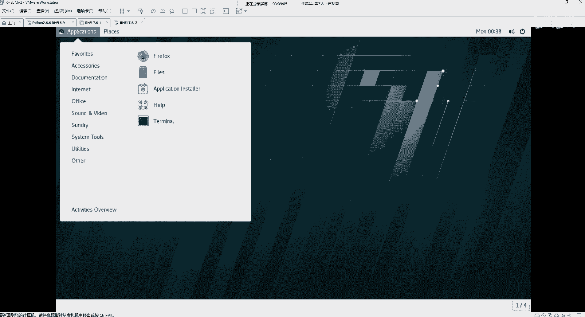
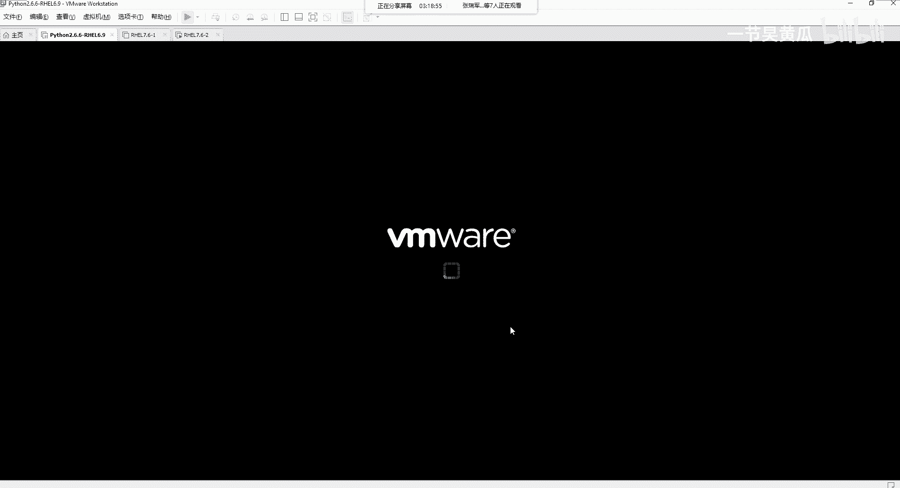

# Unix&Linux快速入门超详细教程-7天通关RHCE - P17：03-4 安装完成后设置向导 - 尚文IT教育 - BV1JC4y187nr

好，已经安装完成了啊，然后首先有一个complete是吧，有个完成了。然后这个说你必须要去重启啊，叫reboot一下啊，我们点这个重启。

那个重启完了之后呢，我们会进入到这个红帽的这个操作系统的一个，就相当于是一个开机引导启动的一个界面。然后他应该会5秒钟之内，如果你不做任何的操作的话，也是啊也是这个自动进入。然后这个这一块呢。

接下来的话就会有一些。

呃，向导啊一些向导。比如说这个license啊，license这一块。我们点开之后去肯定要去acces是吧？呃，accept要去同意。然后这个。网络这一块，因为我们之前。

这个地方我们之前已经配过了是吧啊，已经配过一次，我配的是10。60。100。2啊，大家根据自己啊不同的这个环境来进行这个相关的这个配置。而且并且设置了我们这个主机名啊，我们设置一下主机名，比如说IH。

啊也需要7。7。6。杠一啊。好。到，然后这一块呢有一个。subscription manager就是一个订阅管理啊，这个订阅功能管理订阅管理是是这个样啊，订阅管理是这个样。

因为红帽呢它是一个7运1这个商业化的一个一个linux的一个版本，就是他需要去参与到那个红帽的官方的订阅。啊，并且才可以去呃享受到你比如说做一些这种。啊，工新员的一些这样的服务啊，是这样。那么订阅的话。

你首先这个你得联网。然后第二步呢就是呃你通过订阅呢去进行这个注册啊，去注册我们的这个。红帽的操作系统啊，就相当于是什么呢？就相当于你你买了一个耳机，对吧？你买了一个正版的耳机。

你必须要到他的官网去进行这个注册，他才能给你查出来你这个东西是不是个正品是吧？啊，所以包括对于这个红帽也是一样的。你既然买了人家的这种服务的话，你必须要去进行这个订阅。进行注册。

然后这一块呢就是user setting啊，少年一个用户啊。好，这一块我们就直接啊finish configurationfiration完成这个配置。

接下来的话，我们通过这个这个这一块呢是指这个welcome是指你的这个向导来选择这个语言，而不是说你选择哪一种啊，选择哪一个英文啊，我们是通过这个welcome啊，是比如我还是用默认的这个英文啊。

下一步，然后去选择我们的这个键盘是吧啊，然后pricy是privacy是我们的一个私引，就是你是否要打开你的location service啊，是否要打开你的那个那个就相于你本地的那个啊定位的服务啊。

是或者是不是，那我们就把它先先勾了去啊，然后呢，这个time zone呢，我们也是一样去选择这个。另外是什么上海是吧啊，我们需要。说一下啊，上海。定位到这个亚洲上海这个位置下一步。

然后是否要连接你的online的 accounts。我们之前说过了，你就如果你有谷歌的netclo或者是微软的，你像我可能有谷歌的，有有micsoft的portal。

的认证。那我们可以进行这个online的连接。

然后skip啊设置一个。关于你自己的啊，我们需要设应一个自定你自己的这个用户。然后这个关于这个登录的这一块呢，我们可以是通过企业登录啊，企个企业登录。如果你的企业是在一个域里面。

那你就要输你的这个什么了啊，输入你的这个域名了啊，而且是一个完全有效的域名，叫FQD。我们比如说这个啊比如说啊test at。阿普文点儿com。比如我们现在在我们这个这个这个培训里面是吧。

培训学训机构里面，那么我们通过这个up普文啊，这是我们的一个名称啊，一个域名。那我当前的这个这个用户叫test啊，所以说我们通过这样这样的一个啊UNC这种方式来进行这个。

那么或者是说我们通过我们设置一些这个。嗯。你自自己去设置一个账户啊，设置一个账户啊，比如说t。给这个t的指定一个密码是吧？好，然后ready to go啊进行这个开始啊操作系统。但是你进来了之后呢。

你会发现它是基于你刚才设置的那个用户啊，就是说你刚才新建了一个test的用户，对吧？啊，通过这个你那个test的用户的这个身份进行登录到这台。

那个linux操系统，我们从这个地方就能看得到，看这个地方有个test是吧？啊，这是一个普通用户。那么我们首先呢需要做的是log out啊，我们去通过管理员用户，我们先登录啊，通过管理员用户。

然后点击这个notote list是在其他的列表啊，我们去输入root，然后下一步。把我们当时在安装操作系统的时候去设置的那个用户名的。密码啊，我们去进行这个登录。

好，也是一样的啊，按照这个向啊按照这个向导。嗯。下一步。啊，是否要去选择无所谓啊，然后这个开始。

那么我们在这个地方呢，就看到了是谁是root了啊，是root了。那么这个呢就是说是我们红帽的啊零理操系统。给到了我们一个基于图形化界面的东西，实际上就和我们的windows操作系统差不多。

比如说这有一个tralash有一个垃圾桶是吧？啊，是一个垃圾桶回收站。然后这个呢就是我们的这个用户的这个项目录啊，用户的这个项目录。

做了很像我们的windows的东西是吧？啊，一个用户里面有桌面的，有文档的，下载的，有那个视频的啊模板的tlate的临时的啊，图片的音乐的对吧啊？

那么再一个呢，就是我们看这个地方相当于是一个任务栏的一个进一个任务栏的条是吧？它集成了默认器有什么fire fox啊，默认的这个b浏览器就是Fair fox。那么还有一些其他的calculator。

然后各种这个工具啊，test editor包括。这种。安全fawall啊，然后s toolss。对吧所以从时包括监控的啊log的软件的。然后再一个呢就是有一些打关于打印的磁盘的管理工具。

这这个地方都有是吧？那么。那么我我们。可能一般基于图形的这个。

图形界面的话，我们可以看到啊。嗯。

在。

这个地方啊fis啊fis里面应该会看得到。我们的。

啊，这有个computer啊，我们点开这个computer，这computer上面里面就会啊罗列出你所安装的这个操作系统的目录。还记得这个APP吧啊，斜杠APP是我们当时自定义的一个文件系统，对吧？啊。

自定义有bin有boot有DVETChoMTOPT啊，root。

SBTNPUSR这些是不都是我们在上午的那个PPT里面会会说到了，对吧？1个linux文件系统的结构说包含了这么多啊，但是我们在规划的时候，对吧？我们在规划的时候，是不是只规划了有跟有APP有bo有s。

那么那些。Home。POCts这些这些one这为什么还会有？是因为这些都集成在哪些。集中在了根里面，而且它是以什么LVM的这种形式啊，是以LVM的这种形式存在。嗯。

这个呢就是一些我们简单的这个基于图形的这个啊这个图形化的东西没有什么可太多说，因为太简单了啊，因为太简单了。

那么我们接下来的话，我们要看啊我们要看。呃，我们刚才在装操作系统的时候，已经。把我们的网络好像已经配好了是吧？啊，那我点击右上角这个位置有一个where off，我们来看一下。

我们来看一下这个地方。啊。我们点开一个on啊我们点开一个on。你点你你你它默认是是关掉了，对吧？我们点开这个。图标按钮。啊，然后呢我们可以在我们的这个我们打开一个power share。

我们来去拼一下啊，来去拼一下，看能不能拼工。

拼10点610点100点。农品通看到了吧？他是农品通的对吧？啊，是农品通的。

能平通的话，这个时候呢我们就要我们有考虑啊。

从我们的这个呃比如说我们从我们的这个机房，或者从我们的远端啊，我们可以在我们办公室啊，或者我们自己家里就可以通过。这个通过网络啊进行这个连接。那么连接的话需要用到是什么？需要用到的是。

通过啊中端工具。进行。对，lininux。服务器的。远程连接和访问。需要用到。TCP的。22端口。也就是SSH。服务啊，SSH是服务。需应了SSA是服务。好，SSA是服务的时候。

那么我们需要说通过终端工具啊，通过终端工具，终端工具有很多种啊，终端工具是有很多的种的。呃，我之前分享给大家的是一种是那个叫security CRT啊securure cRT。然后另外一个呢是。

那个X manager啊，这两种都可以。当然还有一些其他的，比如说final shell或者是putty啊等等等等，有很多。我我们有一两个够用了就可以了啊。然后我们打开一下啊打开一下。

比如说呃打开secure CRRT。我们来去新建一个啊去新建一个这个呃SSSH的一个连接。我们点击这个闪电的这个图标啊，叫quick connect啊，快速连接。把IT写上。然后用户名是root。

通过这个portal，大家看这个中央工具SSH的tnet的r log in的串口的啊都支持。那么我们直接conect啊，点conect这个地方呢，它会生成一个新的一个主机的一个K啊，一个个一个K啊。

我们说他问是否要进行这个永久的啊进行这个这个这个同意并且保存。我们点一次或者是啊永久的啊进行这个保存。然后我们去把这个用户名和密码写口令啊，把它写上。

那么在这个地方呢会有一个se password word啊，我们可以选上它。好。那我们现在就相当于是呃这个。通过终端工具啊，SSH到我们的这台。linux。虚机也好，或者服务器也好啊。那么这个CRT呢。

你按住左边的cttrol键啊，你滑动你的滚轮向上滑动或向下滑动，你会发现它的这个字体在变大或者是变小是吧啊，你按住cttrol键啊，来进行这个调整。好。那么这个样的话。

我们就算是把一台linux装完了啊，装完了之后，那么我们啊接下来的话对吧？啊，接下来的话我们需要通过。啊，将来就会在这种啊。光标在闪动的这种啊这种交互这个东西叫交互式登录界面啊，交互式登录界面。

来进行啊查看操作啊，来进行查看操作。好。那么再一个呢，就是。

我们现在因为这是用Vmere vaccination这个虚拟机啊，用vemere虚拟机的这么一种。适验环境。然后VI呢给我们这个地方有提供了好几个选项，第一个是我直接关机是吧？第二个是重新启动。

然后中间有一个挂起啊，当我们在做操作系统啊，就是在配置的时候。因为我们可能要配很多的一些东西，对吧？我们可能可能在一天之内配不完，所以说我们可以怎么着可以做一些这个叫挂起的操作啊，做一个挂起的操作。

我们在重新装一个装完一个操作系统之后啊，装完一个操型之后，我们先来试一试，就是我们可不可以挂起啊，把比如说我们今天就学到这是吧？然后我们吃完饭之后，我们再去去去去研究它，我们就不用就不需要重新关掉机器。

然后再重新这个开启了。我们就挂起之后就让它保持我们当前这个状态，对吧？啊，这是我们可能平常会用的一个一个功能。那我们点了这个挂起。啊，大家要注意啊大家要注意。点了它之后呢，他这个好像一直就是在做一个。

然后再做一个操作。我们稍等吧，看一下。大家看它会提示一个啊我发到群里啊，会提示一个什么呢叫。

未能挂起虚拟机。

叫未能挂起虚拟机。好，然后我点开这个确定。我要点开这个确定。我点完确定之后，他有没有挂起，好像是没有挂起是吧？他应该是没有关系的。那么你在挂起的时候，你会发现啊就是挂起完了之后，我们点了确定之后。

你会发现这个100兆的这个开关好像是被关掉了。然后这会儿我们再通过CRT。

或者说我们去通过P的命令。是不是好像已经拼不通了？

是不是拼不通了，已经对吧？为啥？是因为。这个地方关掉了，对吧？好，我再打开。那么我打开的同时。

我打开的同时。

把网络打开了，同时在这个地方。会发现一个网络连接这个图标，对吧？啊，会发现一个网络连接投标。我再来一次挂旗。然后他是不是又提示说你这个东西不能未能挂起啊，续机好，我点击确定。

然后我们再来看啊，然后我们再来看。

现在是不？海东平通啊，现在是海东平通。

🎼那么是什么原因导致了你这个挂起不了了？是不是因为可能是不是因为我们是因为我们的这个虚机的，是我们配置的问题吗？还是因为我们的虚机的问题？我们看这个啊一个正常的一个挂挂起的一个状态。

是不是应该就是这个样？

这个地方会是一个两个黄色的出线，然后这边会有这个那个啊就是你当时停留在你的这个界面的一个状态，是吧？啊，应该正常的话，应该是这个样。好，那我就我就我点开我之前的这个python啊。

点开它。呢行。还原了对吧？没有任何的问题。

啊，这个是没有任何的问题。

然后我再点一下挂起，它是不是自动就给挂起了？很快。那么位是什么原因导致了我们的这种。

就是。无法啊挂起我们的虚拟捷是是这个样啊，原因是这个样，是因为。我们要有两个地方要判断啊，要有两个地方判断。第一个，我们首先要去判断一下。

相信大家以后可能会也会遇到这个问题啊，也会遇到这个问题。我把它我把它放到这个one note里面。遇到。呃。虚拟机无法。挂企的解决。思路。第一个。任务管理器里面。查看。有没有？关于。

VI面reVMX点EXD这样的进程。我们点击右键任务管理器啊，然后我们把它放大，我们我们去通过关键字去找啊去找。然后去找。这里面应跟VM面的有关的服务都在这儿。第一个是认证的auation的。

第二个是ATT的，第三个是USB的，第四个是D是CP的。第五个是hoD的。有没有关于这样的一个资源叫VMX的这样进程。有的时候可能会是VMM或者杠啊，这个是我们目前来看这个是没有，对吧？啊，我们再搜。

各外页面的就是这个服务啊，没有。第一步我们把它排除了，然后。第二步。判断。网络断开的原因有可能是跟。新的linux。系统的安全策略无关啊。有可能是什么SElinux啊，有可能是XElinux。

所以呢我们要去。临时的关掉。SElinux进行。和测试。那么怎么去关SElinux呢？我们现在是不是已经通过。我们现在是不是已经通过这个。这个这个CRT啊连到了我们的这台linux。

首先我我做一些操作啊，我要敲一个命令啊，比如get。多水。然后我敲了这么一个命令之后，get enforcing会发现它它提示叫什么inforcing啊。

inforcinginfor就是一个强制的意思是吧？inforcing就是一个重在强制，也就是说它正在。这个这个开启某些这个安全策略。那么怎么样去临时的去关掉SElinux呢？我来做一个操作。V案。

e t c 加一。Linux co。靠fi啊这么一个配置文件啊这么一个配置文件。🎼然后呢，我们要想去想办法去把我们的这个地方大家这个地方。我们要把inforcing改为什么呢？叫diable啊。

叫diable。好。E t c s二0。咖啡。也就是说我们做一下对比啊，原先它是inforcing的状态是吧？inforcing的状态。然后现在我们把它改成了dceeible的。

接下来第三步set enforce。最后get。你会发现这个那个原先我们敲get enforcing的时候是get in的时候是inforcing。然后我们改了完了之后，它会变成一个。

permissive啊改成个permissive。那么这个时候呢，我们再尝试我们再尝试。

大家看我现在的这个是不是已经处于挂起的一个状态了，对吧？啊，已经处于一个挂起的状态。啊，那这个呢就是呃关于我们的一个啊。临时的去解决。临时的去解决那个我们这个SElinux啊去关掉它啊。的一个。操作。

这就是一个啊去关掉啊SElinux的一个一个操作啊一个操作。好。

然后我们继续把它开起来啊，继续把它开起来。

开完了之后，他现在又回到当前这种啊这种状态。但是要发现。这个网卡又掉了是吧？啊，我们再再次把它记一个。然后我们再进行这个呃挂起，我们来看。

这个。再打开啊，挂起完了之后再打开看这个网络还会不会丢。

他又丢了是吧啊，又丢了啊，我们再把它再次把它打开。所以这一些东西呢是有可能是跟SE类是有关的。那么需要完整的这个去呃去解除。最好呢就是说我们通过重再重启一次啊，重启一次我们这个操作系统啊，我们再试一下。

那么这个呢就是说呃我们对于一个操作系统之后登录进来之后呢。我们相当于是第一步已经重功了啊，已经重功了。那我们回再回到这个。

PPT。