# Unix&Linux快速入门超详细教程-7天通关RHCE - P18：03-5 基于自动化批量安装部署思路 - 尚文IT教育 - BV1JC4y187nr

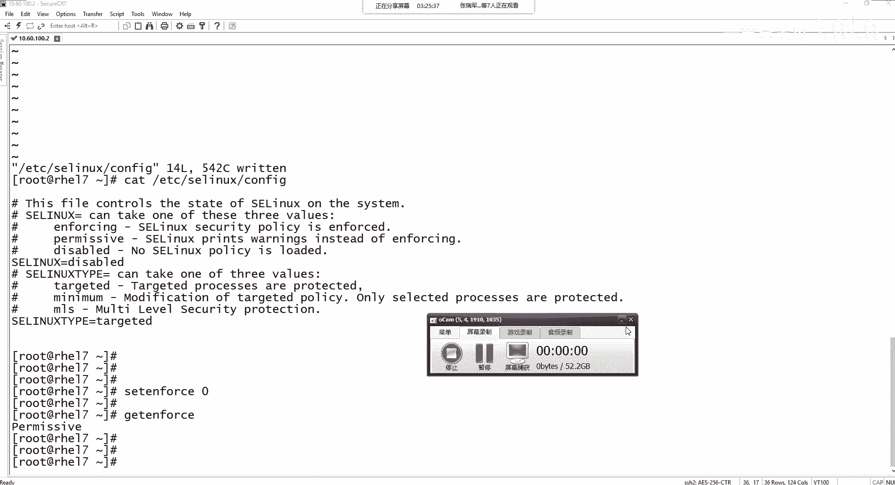

咱们回到这个PPT。

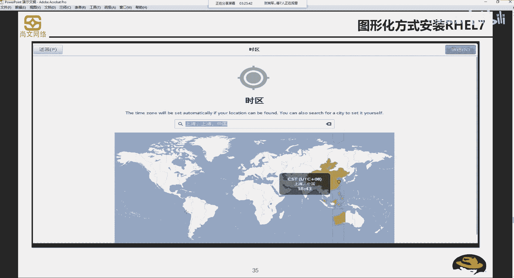

我们来看一下啊，来看一下。第二种就是我们第一种基于图形方式进行安装单一的一台这个红帽的操作系统是没问题了，对吧？啊，光盘或者是可引导设备启动手来之后啊，去安装这个安装，应该是现在来说是比较简单了。

那么如果说是在我们的网络环境中会遇到了。需要多台啊，需要去批量全安能多台这个红包操作系统。啊，这个时候我们就不能拿着光盘，拿着光盘一台一台的装是吧？费时费力啊。

所以说我们要考虑怎么样去根据自动化的这种方式去批量的部署啊，我们的安装的这个红帽的操作系统。我们来看一看啊，今天呃接来看一看这个安装的一个思路啊，安装的一个思路。首先呢他需要一些一些服务啊一些服务。

有哪几个服务呢？第一个是叫DCPserv。第一个呢叫DHCPserv。啊，叫第一是CPserv。第ECCPserv呢是指呃。叫第一是CP是动态的主机可分配的协议。

就是我们可以通过这个它可以把我们的那个网络的IP。IP地址网网掩码网关，包括DNS的这这样一些网网络的这些相关的这个IP的地址信息。来自动的啊进行分配给我们的这个客户端啊，这个是DCP。

也就是说我们要去批量的去安装。这个红包的操作系统。首先第一个你得有1个D1CPserv是吧，对吧？你得有个低1Pserv，然后这个批量的这些客户端，你得给他们分配到1个IP地址。他们才能进行通信，对吧？

这是第一步。第二步，TFTP啊，TFTP是要简单的文件传输协议啊TFTP然后有这么一个东西是负责传输文件，传输什么文件，比如说。我们要进行批量的啊部署自动化部署。

首先你得有一些一所谓的统一的啊应答的这种模板。就是我我我这一批操作系统，我比如说操作系统，我选的软件包是呃basic呢，还是work出来work来 host，还是这种呃 webbGUI的啊，这是一个。

然后你这个语言，你是要选法语的是吧？那个葡萄牙语的，还是日语的还是韩语的啊等等等等。就是它有一些这样的一些应答的这种信息的文件，你要给它传过去啊，而且是要传到每一个客户端这边。来进行响应。

然后再往下HTTPDHTPD呢就是一个负责来搭建外部应用平台的啊这么一个东西。我们把我们的呃操作系统的一些镜像，就操作系统一些需要安装的一些文件。我们要把它传到这个FTP啊呃就是传到我们的这个web啊。

把它。传到web上，然后进行这个web发布。啊，信用外部发布。然后最后一个呢叫PXE啊，PXE叫preboot啊exec environment是预启动执行环境。我们想一下，刚才我们在通过。呃。

光驱也好，光盘也好，再进行安装的时候。肯定是要通过一个器可引导或启动的这么一个东西，对吧？比如说光驱，比如说U盘，那么这个PSE呢指的就是可以把我们的通过网络来进行预期中执行。那么有了DCP也好。

我们拿到来P通过TFT我们获得到一些应答的信息。然后HDP我们能抓到能访问到呃这个这个呃操作系统的一些。必要的一些文件，然后通过PSE来进行启动啊。

通过PSE来启动我们的这么这个这个这个这个机器的啊一些那个启动的方式。然后这样的话就通过静默或者是无应答的方式来自动的。来，批量的进行这个部署。当然我们要做这个呃要做这个批量的安装的话啊。

当然有一个刚才我们说过，通过一个传输一个应答的文件，那个应答文件就叫cakeickstar啊，就叫cakeickstar啊那个文件啊，我们上午在说那个课程和提纲的时候。

里面会有提到一个叫kickstar啊，进行批量的。安装了这么一个无响应的啊这么一个硬答文件。那么我们要去再去装这个批量的安装操作系统。呃，我我觉得现在就是对于我们我们来说可能还。还还还可能还。

有些问题啊有些困难，因为我们要先学要去学会了怎么样去装配置管理DCDPservPFTPserv。HTP的啊这种。啊，这种就是相关于最针对于服务方面的一些这个配置啊。

包括还有我们还需要需要怎么样去copy啊，去copy一些文件啊，这些东西都是需要一个积累啊，所以我们对于我们现在来说就是。刚刚接触啊，这个我们会基于。本地的这种是吧，这种光驱也好，光盘也好。

或者是通过U盘也好啊，来进行这个安装。啊，那么这个呢就是对于我们现在来说啊，我们现在这个阶段想暂时我们先了解一下就可以了啊，了解一下。然后等到我们最后是吧等等最后我们也会搭建第Pserv了。

我们也会用这个了，包括我们也会装XE包括linstar这些东西怎么去配，包括我们怎么会用VI去编辑是吧？包括一些基本的操作啊，怎么去赋予权限，然后去copy等等等等。这样的话，我相信我们得去批量啊。

去做这种批量的这种操作系统来应该是非常简单了啊，非常简单的。那么我们来看一下这个呃启动引导分区啊，要设置多大啊，引导分区我们之前说了，boott分区对于7版本200兆啊，6老一点的版本。

100兆就可以了。然后smarp分区是可以通过LVM的形式可以划分嘛，是可以的啊，这个是可以的。那sp既支持那个LVM也可以用标准的，但是有一个分区叫boot。大家一定要记住，它是不支持sp啊。

它只支持标准分区。那么我们作为初学者，软硬包应该选择哪一种啊？那么我们选择这个基本的啊最小安装或者是带啊就是serv的 webGUI啊，这个也是可以的。那么今天的最后呢，我们来呃把这个。

基于啊自动化批量安装的这个文档啊，实验文档我们来简单来过一遍啊，来简单来过一遍。呃，首先呢我们除了刚才说了啊，我们这几个基本要点，是么要有DCPTFTPHDPPXE那么周边的一些配置我们也要懂。

首先第一个你要会去配主机名。

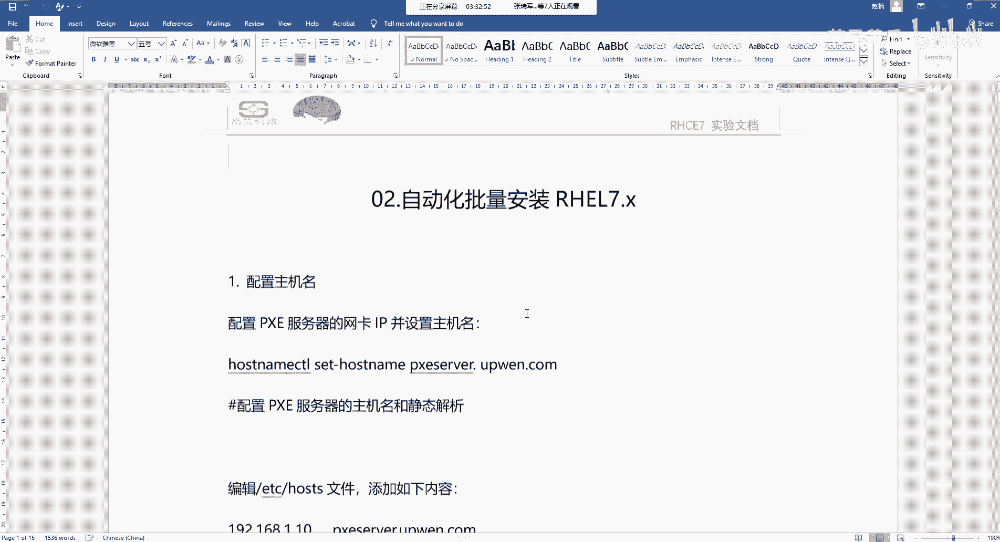

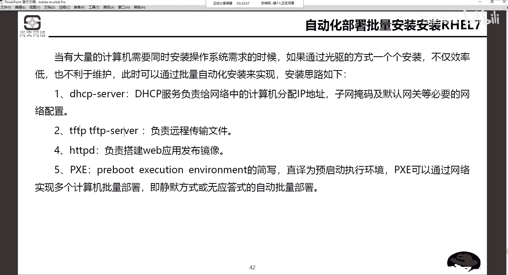

通过什么样的命令来进行这个配主机名，而且这种主机名是叫完全有效率域名，叫FQDN啊，叫FQDN。叫完全的。有效的。那个域名。解析啊，完全的余效的域名解析。那如果我们的我网络里面暂时没有DNS服务器。

因为我们要靠域名解析的话，一是一定是DNS啊。如果没有DNS服务器，我们可以在本地的ETChoS里面去添加这样一个内容。第二个，我们要去把防火墙给关掉啊，怎么样去关掉我们的防火墙。第三步。

怎么样去配置部署我们的服务器。呃，在安装这些呃PS也好，slin也好，包括呃HDPD还有那个呃这个这个DCP啊，包括TFTP你一定要去学会搭建一个亚么的安装云。啊，去安装一直要要去做一个样的安装语。

那么怎么去做样么的安装员这些东西我们后期在讲软件安装的时候，一定会都说出来啊，一定会讲的非常细。然后再一个呢就是安装啊PSE套件需要装这么些东西是吧啊，需要装这么些东西。然后抓完了之后呢。

我们就要开始配置每每每一些服务了。DCP的TFTFTP的HDP的怎么样来进行这个配置。怎么样进行这个配置？在配置的过程中，我们可能还需要用到VI命令啊，我们需要用通过VI编辑怎么样去编辑啊。

保存退出某一些配置文件。然后再一个呢是通过一些命令创建目录的啊mDR，然后通过CP这个命令去copy啊，去copy一一批这样的一些slin相关的一些启动的这种啊boot启动的一些这种这个这个文件。

那么再接下来的话，我们要去装HTPD啊，阿帕奇业的这个相关的一个外部服务。啊，然后怎么样去把一些这个文件copy到哪个目录下，然后copy完了之后，我们怎么去启动它啊，作为一个发布。然后启动完了之后呢。

我们还要去。去配置kickstar，就是跟kickstar相关的一个硬料文件啊，保存到哪个位置。那么怎么去编辑，对吧？这么多的编辑是代表什么意思？那么编辑完了之后。

我们要去通过s controll这个命令去启动各个服务DPTFTPHDP等等等等。然后来进行啊去去检测一下相关服务有没有启动。

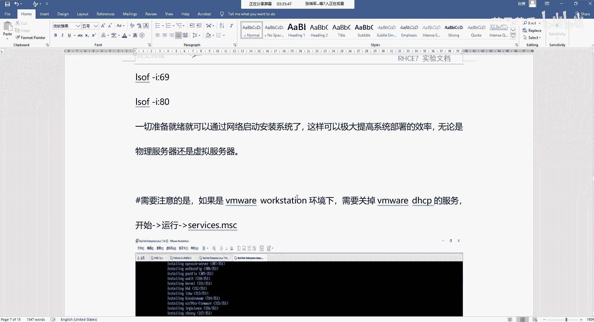

如果启动完了之后呢。那个嗯。我们通过这个什么通过这个。

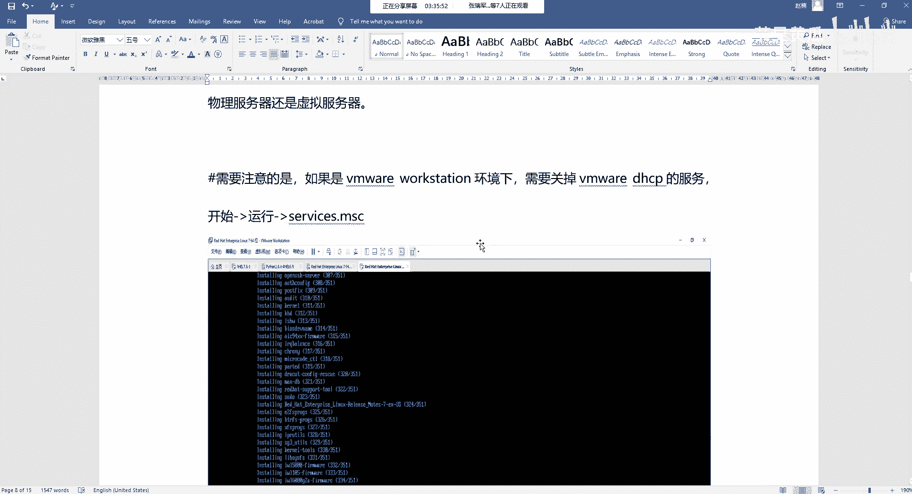

啊，训机啊，我们再去新建多个训拟机，对吧？清建完了之后，我们通过PXE来进行启动啊，通过PXE来进行启动。然后正常的这种啊，如果前面配的都没有问题的话，正常的这个界面应该是。

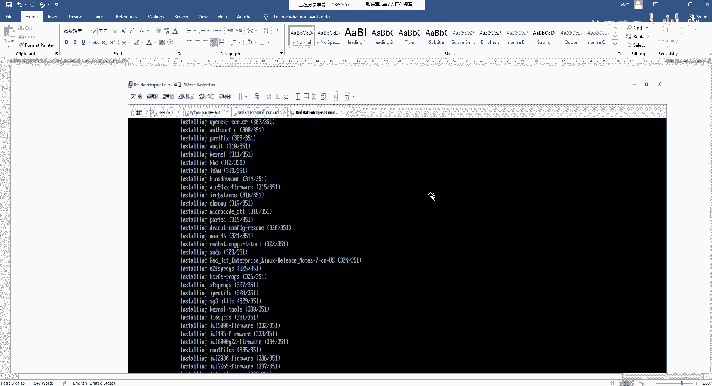

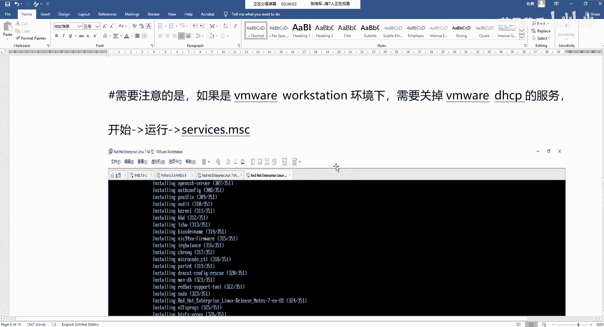

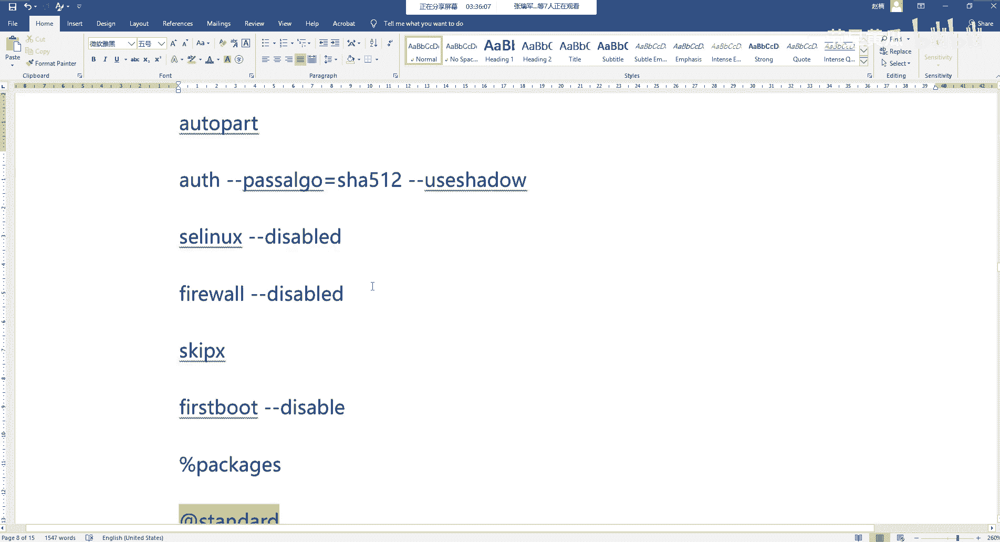

在这个地方。

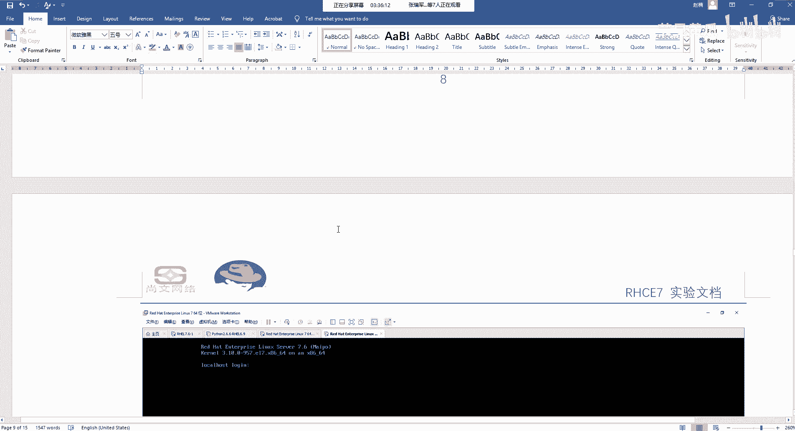

就是。他会从PXE去读导某一个引导的操作系统，然后去安装insting看安装这些软件包啊，安装这些软件包安装完了之后呢，最后就会。

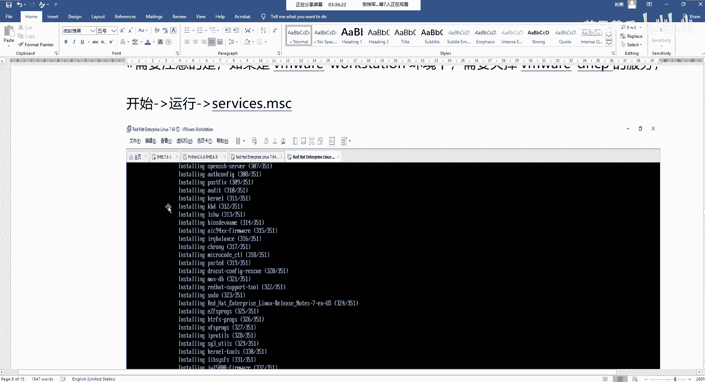

形成一个什么形成一个安装好后的一个登录交布式登录界面。

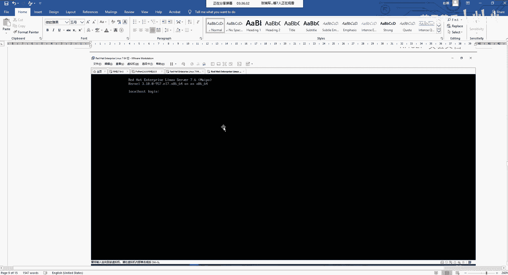

那么。

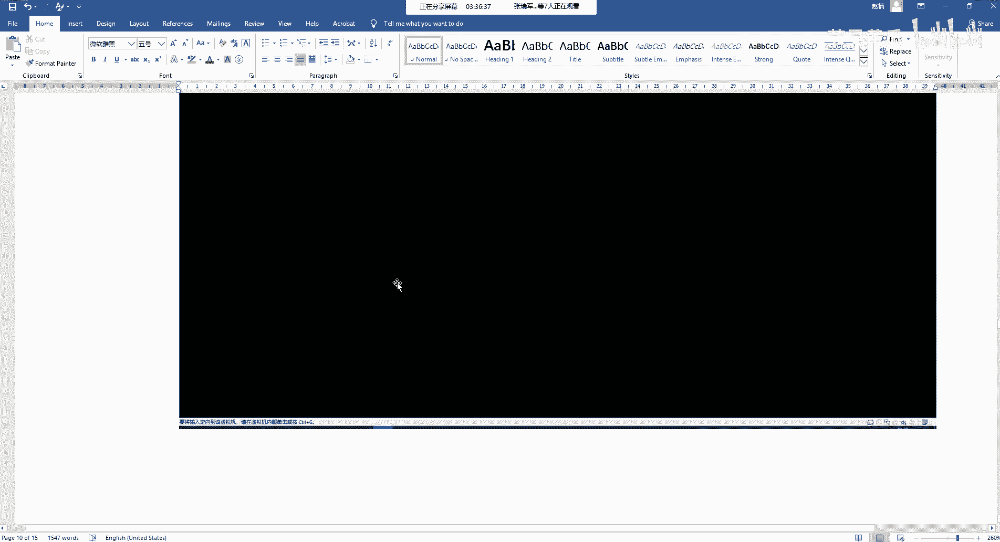

对于这个cakeickstar呢啊kickstar。是有很多的这种配置的一些写法啊配置的写法。那么根据配置的写法的话，包括我们可以通过给大家做了两个附件啊，做了两个附件K42的写法。

第一个是基于这个原生的啊，就是进行直接分区的一些方法啊，直这种方的。第二种呢是基于这个LBM的。就是说我们在Kstar的时候，我们可以再详细一点，就是哦我一我可以通过LVM对吧？

通过设置LVM的这种方式啊，然后去自定义的去指定那个整个文件系统啊，它的大小啊格式啊等等。然后这一个呢是就是嗯Kstar里边去支持安装包的一个列表啊，比如说你要去支持那个桌面的啊。

比如说genome desktoptop。呃，基于基本的base，基于核心的core啊，基于这个其他的一些这些东西，我们都按照这样的一些写法来进行这个相关的这个配置。

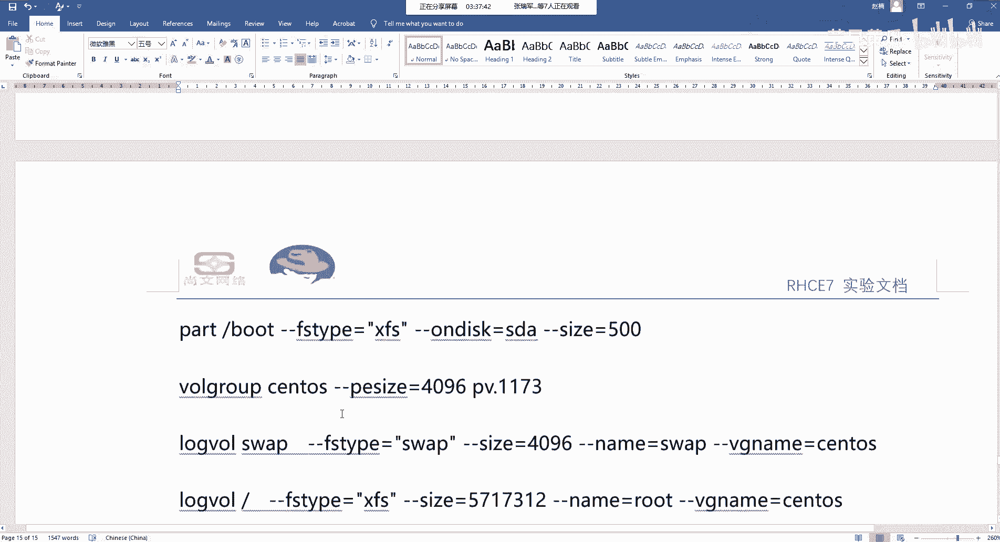

嗯。这个呢就是说今天我可以发给大家啊，发给大家，我们可以先先展示了解一下啊，了解一下之后呢，后期我们会啊到最后我们会再回个头来啊，去把这个批量的啊去安装这个操作系统啊，我们把它这个文档啊实验给它完成。

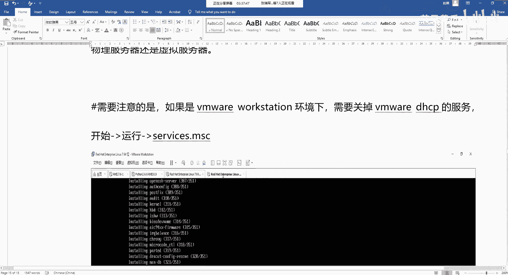

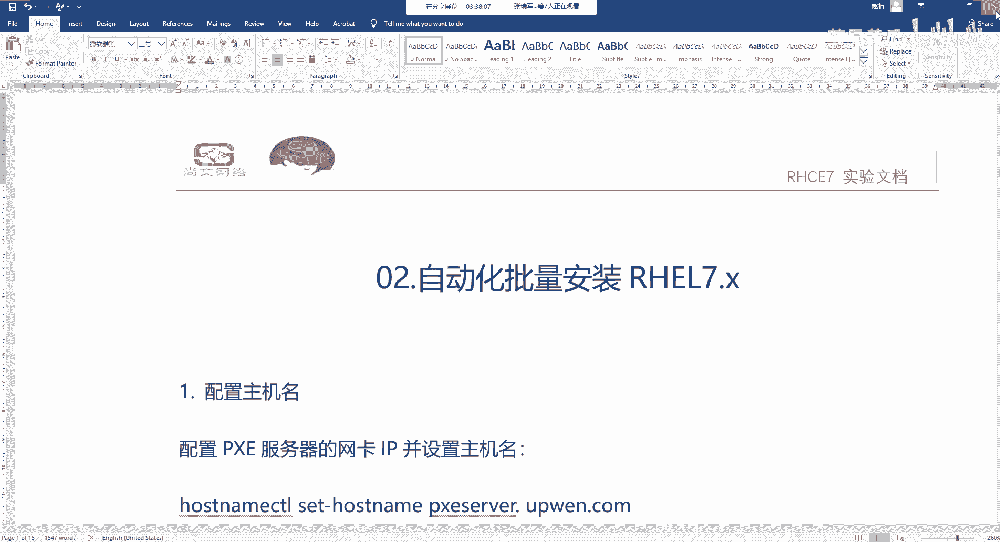