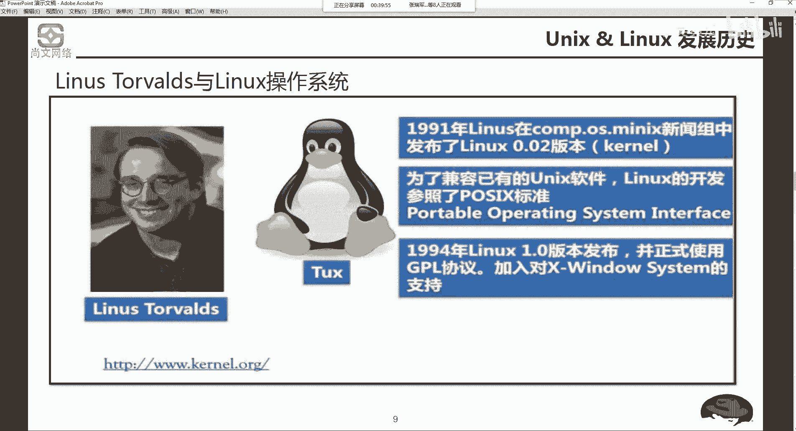

# Unix&Linux快速入门超详细教程-7天通关RHCE - P1：01-1 Unix&Linux发展历程介绍 - 尚文IT教育 - BV1JC4y187nr

Okay。首先呢我们来看一下啊linux的一个发展历程。有四个部分啊，第一个是unix啊，UNRX啊unux。and和linux的一个发展历史。第二个呢就是linux的一个系统的一个特点。第3个。

lininux系统的一个发行版本的一个介绍。第四个呢是linux系统，它应用的范围啊，其实第一个就很简单了，是吧？就是我们知道linux是它是怎么来的，是吧？啊，它的发展历史。然后呢。

这个第二个呢是什么是利尼子啊，它的系统它有什么样的特点？然后第三个呢，就是它linux系统啊。在我们业界啊，lining系统有非常多的发行版本，为什么说会有这么多的发行版本是吧？我们要去了解。

然后第四个呢就是leaing系统我们能用在哪啊，应用在哪，我们来一个一个来看。

首先第一个呢是。呃，unux和linux的一个发展历史。其实这个linux操作系统呢，它是由谁来发展？是由unix UNNIX操作系统。From Uniix to B SD或 minutes。

这张图是呃。有这样三个机构，一个叫贝尔实验室。然后一个叫通用电器，然后还有一个叫麻省理工。也就是说贝尔实验室麻省理工和我们这个谁。那个通用啊通用电器。开发了啊合作，开发了一个操作系统，就叫什么？

就叫这个unix啊，unix操作系统。

这个用力操系统呢是于1969年啊通过汇编语言。汇编语言。进行写了一个啊unix的原型啊，69年这个unix是干什么用的呢？最一开始它是用于这个美国的一个军方的一些这个实验啊测试来用的。

那么这个unix呢，有一有一个当时呢有一个非常好的特点就是很稳定啊，非常稳定。但是它也同与此同时也会有一些缺点啊，有一个最大的缺点就是可一致性非比较差。什么叫可一制性比较差。很简单。

比如说我们从一个平台，我们想把一个东西。对吧啊。从一个平台到另外一个平台啊，我们希望到另外一个平台也可以这个使用这个东西就叫一致性。所以说unit当时这个这个有个weent，也就是它的一致性非常差。

那么在过了差不多4年之后，也就是1973年。有一个东西叫C语言。呃，相信咱群里肯定有很多小伙伴都是学计算机专业的是吧啊，学计算机和学和跟计算机有关的一些。大家在上学的时候可能会学到一个东西啊，叫C语言。

啊，有可能会学到有可能会学到，就我们那个时候学到了，咱可能就是学一些，比如说面向对象的一些，比如说java的啊，studud的啊这些东西啊。那么他通过C语言呢，对unix啊进行了第一个版本的一个优化。

大家注意，69年只是一个unix的个原型啊，这是个圆型，它不是一个完整的操作系统。那么73年，我们通过C语言对unice进行一个优化。所以说刚才我们提到的这种可一植性差的问题，就得了很好的解决。

那么大概又过了差不多45年的时候，78年。这个时候呢嗯unix呢出现了两个分支啊，出现了两个分支。1978年，加州伯克利大学。U see Bory。提出了一个东西叫BSD啊BSD。

breaky software distribution啊BSD它开创了unix的一个分支叫BSD系列。那么他的这个呃创始人是谁呢？叫bull joy啊，buau draw。

好，我们来看一看这个文字上的一个叙述啊。刚才我们也做过了介绍是吧？1969年unix斯诞生了，然后是贝尔实验室、麻省理工和通用电器。我们共同开发了一个新型的un套系统。

评借了良好的稳定性和多用户性以及多任务。这个稳定性我刚才说了，多用户就是一个操作系统里面可以有多个用户来进行管理和使用是吧？然后一个用户是不是可以对他进行做一些多任务的一个处理是吧？多任务啊。

啥有多任务，我们就以我们的这个windows为例是吧？我点击这个人务管理器。

当前当前我们肯定是一个用户，对吧？啊，你你在windows里面去。

怎么样去看一个用户啊，我们敲一个命令叫who am I。我 am I。大家看。GPZ啊GPZ是我当前这个登录的操系统用户，是吧？这个用户。

这这么多的啊这种进程。这个呢就叫多任务啊，就叫多任务。那当然我这个系统是windows了，大家可能会看起呃是那个英文了，可能会看起来有点稍微有点不适。

习惯就好了。然后呢，一经问世就被行业所青睐。但是它的缺点刚才也说了，一人性很差是吧？那么在73年的时候，C语言诞生了啊，当然C语言也是那个贝尔实验室啊，也是贝尔实验室来开发的这个东西。一种编程语言。

对unix进行了加工和代码的一个编排啊，编写和优化。那么一致性得到了杠杆。78年，unix出现了分支，一个叫BSD啊，就刚才我们说了这个buaudy啊，加州伯克利大学啊。

提出了一个东西啊，叫BSDunix。另外一个分支呢叫unixunix的 systemtem V啊。也就是说出现了两个。两个两个派系是吧，出现两个派系，两个分支。然后一年之后呢。

这个时候因为我们刚才刚才说了贝尔实验室发现了这哎这个操作系统。好像挺有商机了是吧？想从中大赚一笔，所以说就停止了对unix的一个原代码的开放。那当然之前你这个unix原代码是开是是是open的，是吧。

是是开放的。那么停止了对un的这个原代码的开放之后呢。呃，贝尔实验室宣布了对unux产品拥有了叫corpy right啊，copyright就是拥有的所有权。那么在79年和1992年。

我792年我刚上小学一年级。这个这这一个时间段呢，BSD这个BSD的啊unix是发展的非常快的。那么我们刚才说了，unix有两个分支是吧？一个叫unix systemV，一个叫BSD的啊unix。

那么我们来看一看啊，属于unix system V的版本。呃，刚才我在做我自我介绍的时候，说，我我我接触过IBM的啊power啊，什么IBMpower它上面跑的操作系统是什么呢？不是windows。

也不是linux，而是什么AIX啊，这个东西呢是属于unix system v的啊延生版本。那么于此之外呢，还有惠普惠普也有自己的小型机啊。

它上面操跑的操作系统叫惠普UX以及啊serv啊这种unux操作系统。那么属于这个另外一个这个呃BSD的一个呃延伸版本呢，叫open或者是fr的啊BSD。这是两种。

这个呢呃这张PPT大概呃大家了解一下就行了。就是沃son7的un就是到了最后一个真正的unice，大概79年的时候，它是支持叉86的架构的。你看一下，比如说像这个sris，它就是支是这个叉86啊。

叉6叉86我们应该都知道是吧？就是我们的英特尔的。啊，或者我们这种。呃，服务器也好啊，PC的服务器也好，PC的个人计算机也好，它所支持的这个插86。就像我们的这个像我我这个笔记本。

包括大家的那个笔记本肯定基本上可以说百分之百是插8率是吧啊，X86。那么unix system3啊，三的这个第一个unix的商业版本啊诞生了。82年发行版本呢就不不再可以包含这个源代码。

好，那么这张图啊详细的又罗列了一下。

基于BSD的。

基于 system为了。刚才我们说过了是吧RBM了EX。啊IBMAX有人可能会问IBMAX我们能不能用一些虚拟机的方式把它虚出来是不可以了，现在是不可以了啊，现在是不可以了啊，但是呢它现在的AX呢。

因为嗯因为IBM和这个就是把red hat就是我们学到的这个CE的课程把red hat经给收了啊，收了收了之后呢，也就是说在IBM的一些呃power的机器上还可以跑这个。

linux啊可以跑红帽的呢linux也就是 for power的一些这个操作系统。那么刚才也说过，惠普的UX是吧，惠普UX以及s，这是基于 systemV的右边。

你肯定会从一从这些logo里面会看到很多。有一个这个好像题。

大家比较常见说macOS啊，像mac OS啊，就是我们的苹果系统，它也是一种unix。那么它是哪个版本啊，是基于BSD的unix。

啊，BSD。所以说对于我们。我们自己来说，RBM可能包括unix也好，U呃这个这个惠普UXARX service可能。可能嗯咱们小伙伴以后可能不会接触，因为它的这个应用的一个特殊性啊，用场特殊性。

比如说政府的不是说银行的是吧？那么可能嗯没太有机会。但是平常的我们这个基于BSD的unix，我们能见到这些，就是我们苹果操系统是吧？这是我们的苹果操系统。

好，然后刚才也说了啊，这个这是unix的一个简短的一个介绍是吧？啊，贝尔实验室啊、麻省理工啊，通用电系我们把它给开发出来了，然后通过C进行这个优化。

啊，与此同时呢，我们出现了两个分支是吧？啊，BSD和unic sixV。

那么我们再来看这个PPT。有一个人。叫tman啊，richard。Marroom。stormman啊，这是一个黑客啊，它是一个黑客。啊，他是黑客，但是他不是一个只会用工具的黑客。啊，他会写自己的工具。

这个黑客呢他挺有意思。为什么这么说呢？你看这个这个人和这个牛长得是不是很像，好像有有一些相似是吧？这个牛的这个logo，它是一个就是一个组织叫GNU啊，叫GNU。进有进入了组织。大家看这个地方啊。

精NU的project精NU的项目GNU is not unix，它不是unix啊，它不是unixstoreman这个人嘛，他搞了一个东西，就是说我要建立一个自由的开放的类似于unix。我们刚才也说了。

unix是不是在1979年已经这个corpyright的进行后期再进行这个商业化了是吧？啊，这种版本。所以说就像我们刚才说了，你的IIBM的这个EX操系统，这是unix所你必须要去卖啊。

随着啊IBM小型机。你才可以去使用，对吧？啊，那么这个他就提出这么一个概念，说建立一个自由的开放的类似于unix，就我不买IBM小机或不买特殊的设备。

我是不一样可以应用于类似于这种unix造型的呢freeunix是可以的啊，现在来说是可以的。所以说他他搞了一个组织叫GU。然后有两个概念，一个叫FSF叫自由软件基金会啊，FSF。

fred software foundation啊FSF以及GNU的通用许可证啊，叫GPL啊，general public licenseGPL。那么为什么说要有一个这个。

这个这么一个组织呢啊我们来看啊其用的project有哪一些东西。有个东西叫GCC啊，叫GCC。随着我们学习的深入，我们知道它是一个用于来进行编译的啊，进行编译。

在操作linux或unux上进行编译的这么一种工具。em em是一种也是一种编辑工具，就不管GCC也好，或者是im也好。当然还有很多的project。啊，这些东西包括我们刚才也说了。

我们在lading操系统上去。去这个呃编辑一个文件，我们可能用到VI或VIM啊，这些东西都是G因U的一些project。所以说。呃，它建立这个经营 unit project。

但它不是is not unix是吧？它为什么要去做一些这样的一些事情呢？啊，刚才我们说了，它就是为了建立一个自由的开放的啊类似于unix系统。

那么之后呢，有这么一个帅哥是吧啊，有这么一个帅哥叫le纳托瓦斯。利雷拉斯托瓦斯。他19991年在芬兰的1个FTP上啊，叫芬兰的1个FTP上发布了linux0。02的版本。但是大家注意看啊。

打了个括弧是吧，叫科nalKERNEL叫科nal科，我们把它翻译过来，中文叫什么叫。内核是吧啊， kernel。他在芬兰的FTP上发布了一个linux0。02的一个科的版本。啊， kernel能的版本。

有的人可能会问0。01，为什么不是0。01，是因为0。01，当时那个版本太简陋了，和它的帅气程度啊不在一个频道上。所以啊他发布了0。02啊科。那么为了兼容已有了unux软件。

leux的开发参照了啊一个标准啊，这个标准也是这个精英优组写出来的啊。post pushex啊ex啊。

porttable operating system interfaceterfaceport是可怎么样可插用或可用的啊操作系统的接口。然后呢，1994年linux1。0的版本发布了啊，linux1。

0版本，并且正式使用了GPL，并且加入对X window system的支持。可能X杠windows是怎么这大家可能不熟悉啊，一看windows就知道了哦，它有可能会什么有图形化的一些东西啊。

有图形化的一个X window。那么中间这个tax嗯TUX啊，这个U是发道8V的R是吧，叫tax啊，tax。tax什么？是一个企鹅是吧？啊，翻译过来就是企鹅。那么企鹅我们都知道象征什么象征着自由。

象征着和平啊，象征自由和象征和平。所以说雷纳斯托瓦斯把企鹅作为了linux操作系统的一个。一个一个一个logo。啊，象征了我们这个这个操作系统是什么自由的开放的啊，和平了是吧？啊，咱们可以这么去理解。

有一个网站呢需要大家记住啊，叫3W点科闹点ORG啊，3W点科闹点ORG需要大家记住这个网站。没事，经常翻上去去看一看。这里面是存放了我们刚才说了linux的 kernel。

嗯就是linux kernel的版本。你有它会不定期的进行这个升级更新。如果我们要对一个linux store系统进行一个Kel的升级，我们首先第一步要去到这个网站去下载。然后把它传到linux操系统。

然后再执行一些什么样的命令进行这个操作啊，所以这个网站比较重要啊，cur点ORG。

好了，我们刚才说了啊，再回头这个地方。呃，GU的project有GCC，然后E我们再来看这边啊，这边GU的 projectject。

GCC也好，E也好，VIM也好，阿帕奇也好啊，刚才说了阿帕奇是做在link上去搭建一个外部应用的时候，我们需要用到它啊，这是一个中间件的一个东西。对要提供这个外部的发布。

那么sna mail mail发送邮件一看就知道是跟邮邮箱服器或者邮件服务器有关的一个一个东西，是吧？当当然除此之外，还有很多啊，那么这些呢是GNU的project。我们刚才也说过了啊。

linux斯托瓦斯干了一个非常重要的事，什么？linux的 kernel啊，他发布了 kernel。那么如果只有GNU的project。

它是等不等于完完全的一个unix也好，或者linux，他自己都说了，Grois not unix，它不是一个完整的unix，它只是一些项目，只是一些软件是吧？那么呃托马斯发布了一个东西叫科呢。

那么它能不能代表一个完整的操作系统也不能。你如果只有了你的。

精神灵魂，你有没有软件。不支持。我们用它也也也也也没有什么用是吧？啊，所以说。

精优的project加上linux的 kernel呢，才等于一个完整的linux操系统。啊。是这个样。软件加内核啊，才登一个完整的操作系统。

那么我们来有几个问题啊，我们来看一看。通过刚才的我们的一些了解。首先第一个啊unix的。编辑语言是谁？应该是C语言是吧？啊，应该是岁缘。那么unix的分支呢？一个叫BSD的unux。

另外一个叫systemwe Uni。列举到目前为止，我们还能看得到un那，就是我们平常还能看得到face统，我们在商场都能看得到是什么，肯定是那个mac是吧啊，m克的OS。呃。

为什么会要有这样的G因U的这么一个组织呢？它的目的就是建立一个类似于和un利一样的这种操型，但是它是开放的。它是自由开放的啊自由的开放的这种啊类似于unux的。证明操系统。

那么雷拉斯托瓦斯刚才我们说了那个帅哥是吧哈，他和。links先发布了一个什么东西啊？发布了一个。lininux的一个。可能是吧啊，发布了一个可能。那么一个完整的linency应该包含什么？应该是包含了。

Project。软件加上。可el对吧？

