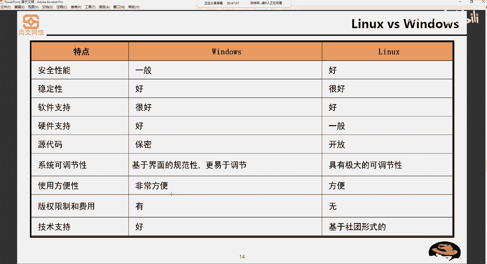

# Unix&Linux快速入门超详细教程-7天通关RHCE - P2：02-1-1 Linux系统定义和特点 - 尚文IT教育 - BV1JC4y187nr

好，我们刚才说了这个unit操作系统是吧？啊，unit操作系统。然后这个unux操作系统。他是。这个呃lininux操系的一个前身啊是linux操系一的个前身。那么我们来看什么是linux操系统。

简单的来说，linux操系统是一种是一套免费使用和自由传播的，类似于unux的这么操系统。然后它主要是基于这个叉86啊叉叉6系列这种CPU架构的啊计算机。当然我们刚刚刚才也说了。

也可以for power啊，也可以for power。就是在power在。CPU的加构厂。的服务器上的机器上可以用。那么它的目的是建立不受任何商品化软件的版权制约和全世界都能使用的啊。

有点这是当时我们在设计呃设计这个linux造型龙的一个初衷啊是一个初衷。我特意把这个免费使用和自由传播和类un啊，通过关键字把它标红了啊，大家需要知道。

那么它的一个特点就是开源叫open source啊，开源open source开源。开源也就是说我们的系统和源代码提供给所有人使用。那么它的特点啊，linice系一种特点。

刚才除了这个免费使用自由传播类啊，它的特点是自由分发系统和源代码。你可以在这个源代码的基础上去创建个性化的，或者是创建自己的衍生系统。但是你要遵循1个GPR的原则啊，遵循什么原则呢？

你要把你个性化的或者是自定义创建了延生系统。交给金友的组织啊，就需要你要交给一个组织。我们要遵循这个GPR的原则。lininux操作系统的诞生和发展以及成长过程，始终依赖着5个一个重要的支柱啊。

这个简单的一下，第一个是啊lininux是由unix来的啊，minux来的。然后第这个呢是这个精U的一个计划是吧？啊，it not unix。然后要遵循这个p就是可用的操作系统这种。

interface这种标准，以及基于我们的internet网络啊来进行这个依赖着5个重要支柱。那么我们VS啊VS一下windows啊，VS一下windows。呃，左边的是是windows。

右边是linkxwindows从我们从安全性能、稳定性、软件支持、硬件支持、源代码、调节性、方便性、版权限制和技术支持这几个维度来看啊，windows安全性能上。我们一般都呵呵一下，是不是啊啊。

它都是一般的啊，非常一般的。为什么经常。你各种漏洞，然后各种漏洞完了之后要打KB要去打那个windows update的一些KB的安全补丁是吧？然后第二个稳定性相对来说要好一些啊，相对来说好一些。

但是也不是那么的好，是吧？因为经常可能会出现一些跟应用程序跟驱动之间的一些摩擦，导致了蓝屏。是吧到德蓝屏。然后软件支持啊软件支持当然是非常好了，是吧？咱什么软件，你必须得支持windows。

那么硬件方面知是更不用说了啊，硬件方面的更不用说了。如果没有驱动的话是吧？没有驱动的话，你这个肯定没法用。那么原价码肯定是保密的啊，当然现在微软windows出了一个东西叫donnet call啊。

点net call啊，这个东西呢。是可以啊。跨平台，甚至你可以在linux上去运行，但是稳定性怎么样啊，现在还是个问号。然后系统可调节性啊，基于界面的规范性予于调节，我们就勾勾选选，点上图标啊。

点上就就OK使用的方便性，那肯定是非常方便是吧？图形化的东西啊，for们当然了，windows东西也有一个东西叫power shell啊，我打开了一个windows power shell。

就撬门随便。巧面咧啊。大家看这个L啊，L实际上呃实际上是一个linux的一个一个命令。但是在window上，我我我们也可以去运行，是因为这个power share是集成了一些啊，这方面的一些这个命令。

那么基winds，比如说DR是吧，去查看一个目录啊，DR啊directy啊directyL就是list啊，查看LST啊，查看DR也是看其实大家大家看的东西基本上都是一样的是吧？

 copypy eitherac callWDC是吧 copyithWC，大家都是都是一样的啊，只不过说一个是在windows上，你说你在link上敲DR行不行，肯定不行。但你在上可以需LS。考试。

然后这个呃版权限这个费用，这个肯定是要收费的。windows是一定要收费了啊。然后技术支持，那肯定是微软的团队是吧？那么我们再反过来来看linux安全性能上肯定要比这个windows要好啊要好。

这就是为什么说啊。很多的应用场景啊，很多的这种项目上还是啊以leings为主。稳定性啊要比这个温速要好，至少不会说出现。啊，蓝屏的这种现象是吧？啊，不会说出现这种情况。那么软件支持的话。

那可能就要比windows要稍逊一筹啊。当然你现在有一些笔记本。啊，他的厂商为了节约一些成本是吧？我要不给你装windows操作系统，我要给你出出厂叫乌班图啊，乌班图这种操作系统它也是一种link。

但他对这种link侧对硬件方面的一些支持就比较差了是吧？啊，比较差了。那么原代码上也开放了。我们也说了linux本身就是啊它的初衷就是要做一个open source操作系统。系统可调节性啊。

也是一些具有比较大的啊可调节性，使用的方便性。也方便，但是没有这个windows那么的方便。然后这个版权方面啊是它是是没有的啊。当然你像lininux也也已经有一些这个发行版本也已经这个啊开始。

这个商业化了。那么技术支持的话是一种基于社团的形式啊，就是有一帮的人是吧，来进行这个免费的进行这个维护。好，这是linux VS windows。

