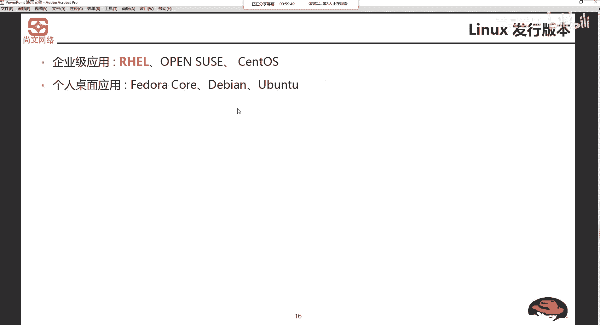
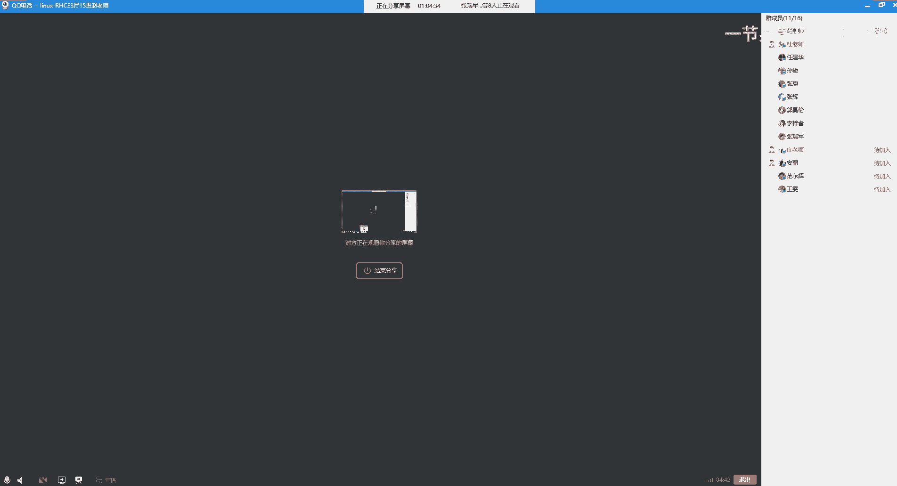

# Unix&Linux快速入门超详细教程-7天通关RHCE - P3：02-1-2 Linux系统发行版本介绍 - 尚文IT教育 - BV1JC4y187nr

那我们刚刚说了。呃，lininux实际上它的一些版本是比较多，比较乱的啊比较多。比方说就在如果你将来深入的去接受lininux，你发现它有很多的版本啊，很多的发行版本。首先我们来讨论一个问题。

就是他为什么说会有这么多的发行办。你看windows啊，个人说个人用个人这种级别用了啊thatstop级别了。可能就是比如说啊win7，我们就说从win7开始，win7win8win8。1win10。

那么serv就是这个样，windows server2012、20162019是吧？🤧他比较这个。设计的有规律性。那么las呢，它这个版本就比较多了。那么为什么会有这么多的发行版本呢？

我们再回个头来看这个地方啊，什么是linux。说。你这个系统和源代码是自由分发的。对吧你可以去创建衍生系统，但是你创建完了以后，必须要提交啊，把你的这个这些东西提交给GPL。啊。

遵新GPR啊提交给相关的这个组织。所以说正是这个原因导致了linux在业界里面去啊，它的版本是非常多的。那么版本多。杂乱我们怎么样去挑着去学？首先。要找出linux发行版本的一个业界的权威代表是谁？

就是我们今天要啊现在要学习的这个red hat。red hat是红帽的意思是吧？啊，小红帽啊，red hat。那么第二个呢，我们要知道的叫CENTOS啊，叫sentOS。

SalS和red hat几乎一模一样，只不过是说red hat。的，CS是基于社团形式的啊reckhead，就是大家的东西都是一样的。社团形式它免费问啊，社团形式免费。那么反着来推。

rehead是不是要收一些费用？对吧啊，要收一些费用。那么redhead和 simple S。是一伙的。啊，他们是一伙。然后我们再来说说啊，这个东西想的有点像这个。像这个这个壁虎也好，或者什么也好。

是吧？叫susy啊，susie。苏usi呢也是一种linux操作系统，但是它的这些整体的这种，不管是这个一些运行的机制呢，和stoS也好，和re好是不一样的。

然后这个stoS呢呃这个susi呢一般应用在哪一些场景呢？就是。嗯。呃，我现在能我我就是通过我这几年能接触到的了，一个就是说。你比如说买一些。嗯。这个这个配置高一点，就配置好一些的这个机器啊。

这种机器啊服务器。它呢是需要一个配1个EU的啊，就是配也是要配一个小的一个啊，就是性能不是特别高啊，配置比较小的啊，比较少的这种服务器来进行管理啊进行管理。呃。

我们的这个啊配置高的啊或者是性能高的这种服务器。那么这个这个服务器这种管用来又用于管理的这种服务器。上面营业在装操作系统。比如说啊就是说IBM的小型机。他要随着配一个什么叫HMC啊，HMC。啊。

HMC就是一个硬件的管理cocil啊一个中心。那么HMC。一个服务器啊EU的啊小服务器就OK了。但上面找的操跑的这个操作系统就是苏ic啊，就是苏C是基于这个si的。啊，再比如。

大家可能以后会经常接触到VImre的vispher。啊，VM的微pher。是吧。VI面的维斯菲啊是是业界是在虚拟化这个领域里面一个权威啊VI面。那么这个VNware呢的vispher它也需要啊。

因为我我可能会装好多的机器是吧啊，因为装好多的机器来做一个集群，或者是把所有的这种计算节点的资源，计算节点CPU的也好，存储也好，内存也好，我们要把它放到资源，做一个池化啊，铺POOL铺做一个池化啊。

大家把大家自己的东西都放在这个池子里啊来进行这个分摊来使用。那么怎么样去啊去制服，去管理。这些计算的资源，它也得有一个东西叫VC啊，叫V centerer啊V centerer。或者叫叫VCSA。

那么它上面的也是基于谁open su。啊，所以这个open so呢就是用来管人管事的是吧？啊，来进行一个管理啊方面的一些这个使用。那么再一个呢就是这个无斑图啊UBUTU啊。

我我我们我们因像我我可能一直都是在这个软件公司啊，从这个一开始毕业到现在就一直都在软件公司。那么软件公司肯定有软件的开发人员是吧？软件开发人员他要做开发的话，那windows上我们可能是吧？

这个就是用windows啊，上面做一些跑一些运行一些开发工具来开发。那么如果我习惯了话用用用用这个这个unux呃linux呢。

我我就不太可能说在red hat或者在s S上来进行这个去去去运行一些开发工具。而我们是什么是用啊去装一些无斑图，然后上面去装一些GDK。那个exlips啊，包括一些这个各种各样的一些开发工具。

来进行这个啊开发啊，所以说所以说为什么我们这个咱们这个笔记本，你你你你你出装预装的时候。嗯，他为什么不装红帽？他为什么不装深索S，他装不斑图，就是这个原因啊，我们装用了它之后。

它可以我们可以运行一些开发工具来进行开发啊，或者其他的一些设计使用。那么除此之外呢，一些我们就里简单了解一下，叫德边。啊，deb啊debdeBDEBIN的边。然后这个斐洲啊啊这边的斐洲啊。

包括我们国内呢这个之前有一个叫中科红旗，不知道大家有没有听过啊，叫中科红旗，它也是一种lins的发译版本。但是。很不幸呀是吧？基于一些原因啊，停止了这个更新。啊，所以说我们要知道啊。

一谈linux首先想到的权威是谁？where hat。然后其次是谁？C屠S。送头完。这是啊linux的一个一个一个发行版本啊。啊，就这么说，你学会了红帽，或者是你学会了syto S，你就会红帽啊。

或者是你会红帽，你就会sinto S。那么除此之外，如果你的精力足够的话，你可以研究研究苏usy啊，研究一下苏usy。因为我们将来肯定要去接触VMM的一些东西。啊，苏西也是要去接触的。好。

对于企业级的应用啊，什么叫企业级的应用？比如搭建个服务啊，搭建个外部服务啊，搭建个文件服务啊，搭建个邮箱服务啊等等等等。所以说企业级的这种服务，红帽RH12啊RH12。这个2111号呢是。

我们来打开我的这个windnot啊，打开我的window，我们来看一下记一下。嗯。这是我们第一天是吧啊，比如说这个R112。2月1号肯定是谁不read hat是吧？red hat，然后这个EL是什么呢？

ENTRRP。还可以。entterprise，然后。也就是说是红帽的企业版的啊linux啊，叫R141啊，就对于这些简称，我们要去要去要去知道。然后对于企业级的说吧，我们刚才也说了。呃。

星图S啊信图S以及这个open速。那么对于个人桌面来用的话，刚才也说了，详细的是重点的是无斑图，然后再去德编和非洲尔啊，德你只要只我认为你只要去了解无斑图就行啊，无版图就OK了。好。

这是这个呃两个方向的一些这个应用。

那么它的一个应用范围，首先服务器大家看这是一个什么，这是一一个一台比较大的服务器啊，一台比较大的服务器。而且这个是属于什么？属于一个。深度啊整合啊，或者是计算资源深度集合的这么一一种服务器。

从这个地方能看这个有12345678910，差不多10个。但是每个10个你发现就像一个抽屉一样的东西把它抽出来。那么每一个抽屉的东西就相当于一个服务器，你就可以这么理解。所以说1234。呃，5678啊。

这个应该是有14个吧，12这么多。然后这么多的这个服务器整合成这么一个大的服务器。然后我们把它。怼到机架上。那么这个每个服务器的一个操作系统，如果你要装linux，你装谁，你装无斑图吗？肯定不是是吧？

首选呢，我们可能会如果你我们买了哦红帽，那我们就用红帽。如果如果没有，那我们可能就会多更多的采用stoS。

这是服务器领域啊服务器领域。也就是对于我们将来一些这个一些使用的这个服务器领域，就是你要去做一些实施或运维的项目。首先你得把服务器给它怼上是吧？怼上，然后加了电进行测试，测试完了之后开始装操系统。

第二个，嵌入式系统，我们的安卓手机。对吧我们的这个这个这个智能化的这种手机。其实也是运行也是运行了什么？也是运行linin操系统。那么这个软件开发桌面应用，我们刚才也说了是吧？无斑图啊来进行这个开发。

所以这个linux的一个应用的范围啊，就是首先对于企业级的服务用啊，在linux上去搭建一些外部应用也好，各种应用也好，我们需要用lininux，然后这个嵌入式的一个开发啊，然后软件的一些开发。

包括桌面上的应用啊，差不多就是这么这么多。

那么这个linux嗯。怎么学呢？是吧啊，lins怎么学呢？首先第一个有要有态度啊，要有态度。其实不管学lins学什么，你得都有态度，而且要做到坚持，要做到坚持。然后呢，再一个就是不断的去练习。

我们现在踏上了学习linux这个这条路，就要摒弃。呃，像我们windows一样，对吧？我点个图标，对吧？嗯，我我右键选一个什么东西是吧？啊，就是要放弃这种基于图性化的这种。

操作。转转为什么？我要查看一个文件，我要敲一个命令，对不对啊？我要去创建一个文件，我要去我要做一个命令啊，我们要去学习这种枯燥的啊这种命令。

反复的敲击命令和实验。

学会举一反三啊，比如说我学会我学会创建一个文件。那么我同时我也去想我怎么去学会创建一个目录是吧啊？

这是一个学会一个举一反三。那么再一个呢就是参加一些这个培训。像我们这种啊，当然现在可能不能face to face是吧？不能面对面的。但是我们可以。啊，通过远程的这种方式，我们参加一些这种培训。好。

那么如何呃几个问题啊，如何去定义lads操系统？刚才我们说过了是吧？呃。这个定义类系统是建立一个自由传播和啊这个这个免费使用和自由传播的这么一种类似于unix。那么它的特点啊最大特点就是开源是吧？啊。

开源。那么你开了源之后，你就可以去拿到这些东西。拿到之后，那你是不是要去创建或延收系统。那么创建完了之后，我们要提交给相关的组织，然后遵循1个GPL啊这个原则。GPR呢你可以理解为就和TCPIP是一样。

和这个协议是一样，它是一种标准啊是一种标准。你在这个业界里面，你想玩，那你就要必须去遵循这些标准。然后另一次的发行版本，刚才我们说过了，权威的啊，就是这个红帽，以及它的社区版本叫sintoS。啊。

Cto。那么除此之外呢，还有open sui斐dora的边欧班图啊，包括中国红旗啊等等。最后呢我们啊还记得这个人是吧？啊，刚才说了lin娜斯托瓦斯啊。现在也现在也很帅是吧？

然后这个linux托瓦斯和tax啊，tax是linux的啊这个这个logo啊，一个代表来探索啊，等着你来一起探索linux的世界。那我们再来看啊，就是这个linux啊叫。他叫什么叫。lininux是吧。

Lux。tax啊，那个linux是怎么来的嘛？它相当于就是linux托马斯是这个人是吧？是这个人linus。然后那个ts是不是企鹅的标志，也就是说他把lins和ts做了一个整合啊，做了一个整合。

叫linux。啊，叫linux啊，这种有操作系统。就这么来的啊，这个名字叫这么来的。啊，当然也有也有人叫鲁n啊，也有叫鲁nix啊，反正都一样啊。Linux。

OK那么这一张PPT我们就结束了啊，我们再做一个简短的一个回顾。首先第一个是unix和的的一个这个发展历史，对吧？啊？unix的一个发展历史。是由贝尔实验室麻省理工和通用电系做了一个原型。

然后通过C语言对unux做了一个优化。那么linux呢是由unux演变过来的啊，它的目的是特点是开源的对吧啊？昨天晚上开放了。然后发行版本是吧，红帽的stoS的sy。无斑图的啊等等应用范围。

首先服务器领域是吧？服务器范围啊去对于这个服务器上装一些操作系统。啊，配置一些应用。那么第二个呢就是手机啊，我们手机第三个呢就是这个开发方面的一些东西，是吧？以及桌面啊体验啊。这个。好。

那么这张PPT呢，我们就就啊暂时到这儿。

