# Unix&Linux快速入门超详细教程-7天通关RHCE - P4：02-2-1 内核版本介绍 - 尚文IT教育 - BV1JC4y187nr

好。然后第二张PPT呢，主要就是说我们在呃安装之前呢，我们会有一些技术知识啊技术知识。

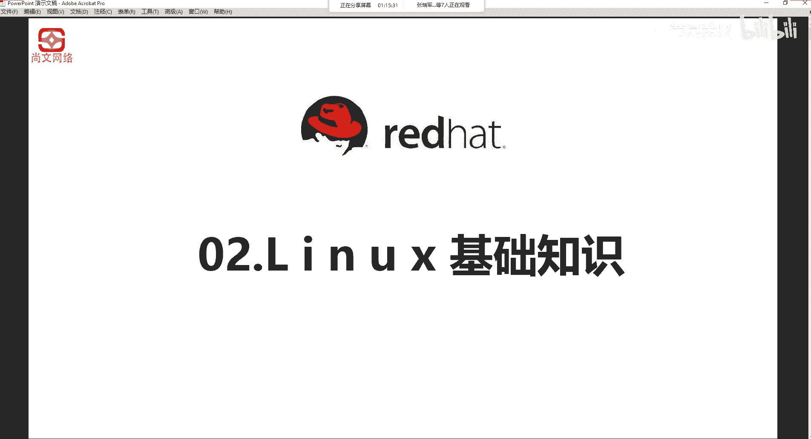

首先有这样一些东西啊，这第一个是内核版本啊，刚才我们说了内核是linux托瓦斯啊，他当时是发布了一个这个由他开始发布了一个那个 kernel的版本。

然后这个第二个呢是关于red hat啊linux系统的一些一个一个介绍啊，刚才也说了啊，linux啊，我们上一章是讲linux的一些啊这个这一些方面的一些东西。然后关于linux的form。

 red hat lin啊一些一些介绍。然后第三个呢就是说呃。关于呃这个磁盘的分区。的一些知识。第四个呢是关于linux系统的一个文件的结构啊，就lins系统它里面是有什么样一些文件。

它的这是怎么构成的啊，这个我们要知道。

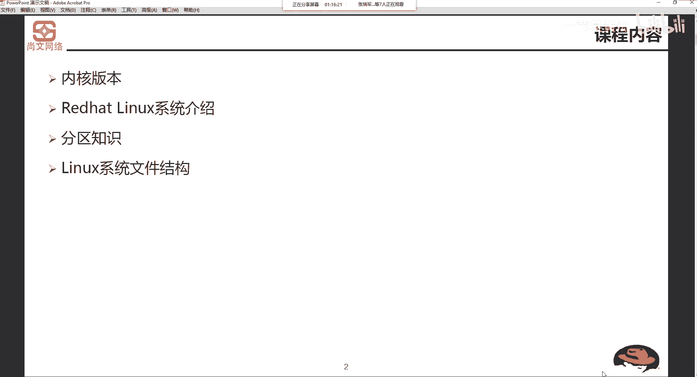

linux这个可el啊，它内核的开发和规范一直是由Lla斯托瓦斯啊，它的领导小组控制着，而且它的版本也是唯一的。那么开发小组会每隔一段时间去更新新的版本或修正版。从1991年10月，雷纳斯托瓦斯。

公开了啊，0。02刚才也说了，0。01，因为公开那个功能简陋，所以没有公开发布。那么到目前啊这个地方也不是最新的了，是吧？啊，这个也不是最新的啊。现在最新的是已经5点X了啊，5。X的一个版本了。

那么随着我们版本的这个更新，它的功能啊会越来越强大。那么不管怎么样去更新。linux它的内核的版本号是一定是有一定的命名规则。他的版本号正常是这个样啊，主版本号点次版本号点修正号。刚才我们说了啊。

需要大家记住这个科 now点ORG啊，3W的科闹点ORG这个网站啊，你去下载一些啊最新的或者是稳定的。这个linux可呢。他的版本。

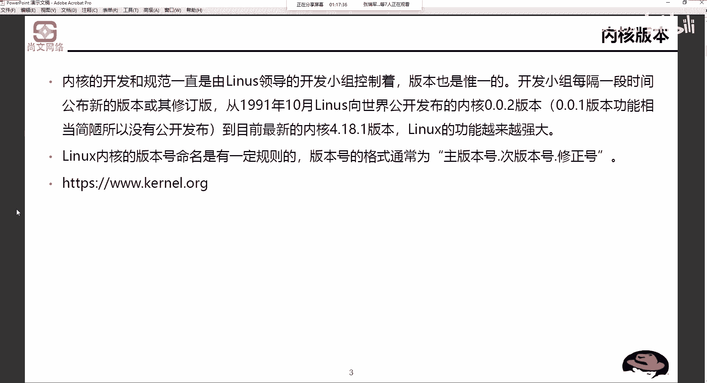

那么这个图呢就是啊前前段时间刚刚截的啊，刚刚截的。呃，你打开3W点 kernelelORG大概就是这么个样子是吧？啊。

他会说lastsses啊lastsses stable kernel是最近的可用的 kernelel版本是5。5。9。5。5。9。然后从这个地方呢，你还能看到一些其他的版本，比如说5。65。55。44。

194。144。94。43。616。82啊这些啊除此之外还有很多啊还有很多。啊，所以我们去这个这个下载 kernelnal版本，我们要从3W点ORG啊点 kernel。啊。

带clener挖G啊进行这个下载。

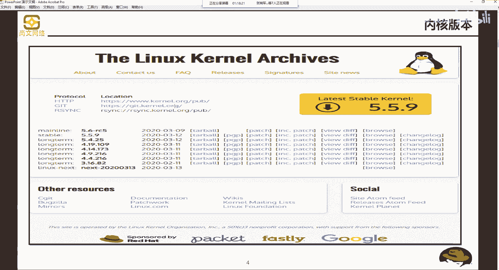

好，那么下载归下载。

是不是所有的cardnal版本我们都可以去用，或者是我们都可以去这个下载去去去去这个更新，也不一定。

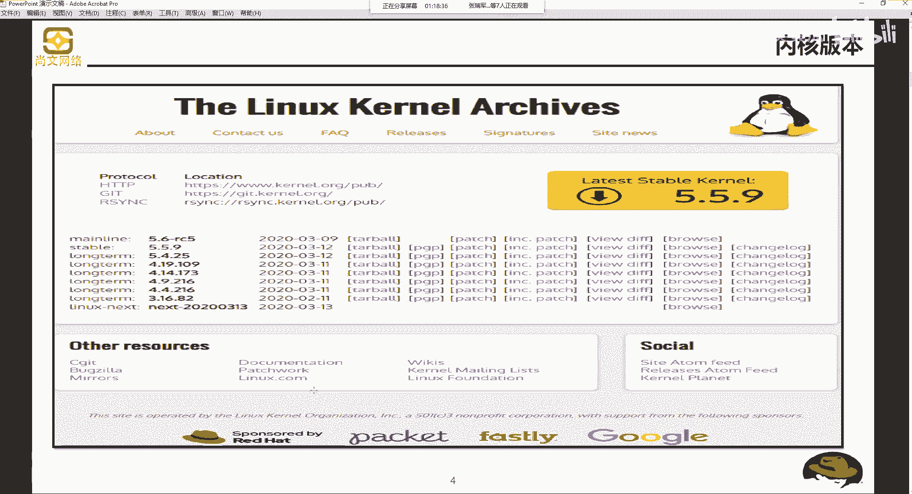

他有一些这个也有一些一些一些规也许一些一些规定嘛。我们说有几个数字啊组成R点X点Y杠GR是代表了目前发布的 kernelnal的大版本。所以我们刚才以这个为例啊，就以最新的5。5。9为例。

那么这第一个5就是我们的刚才说的那个X是吧？就是目前发布的 kernelnal的版本。

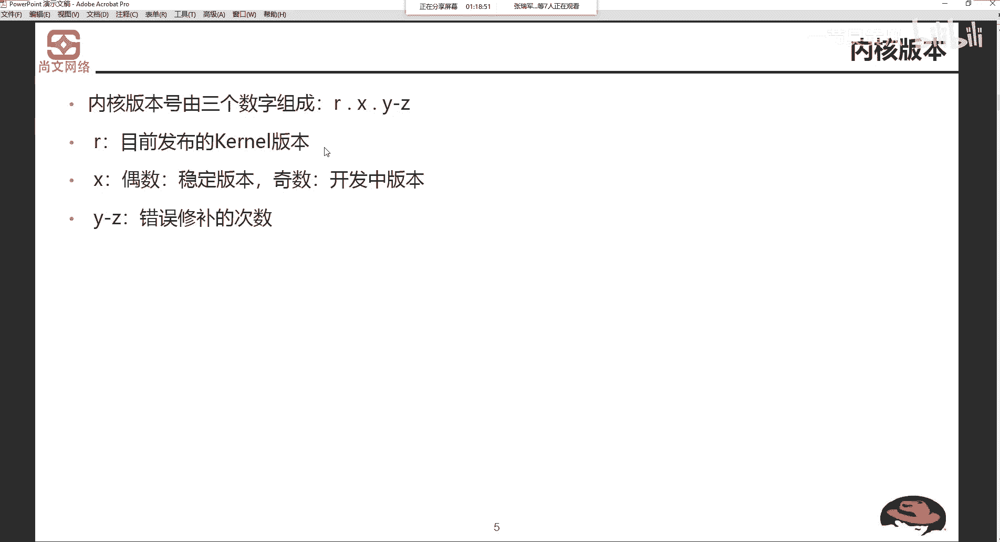

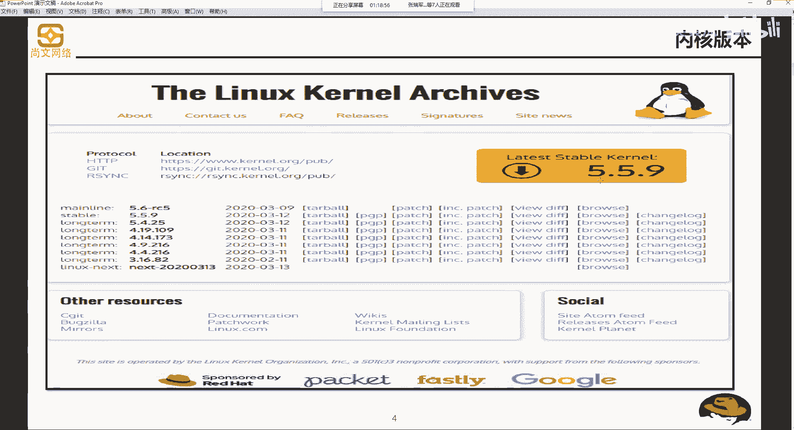

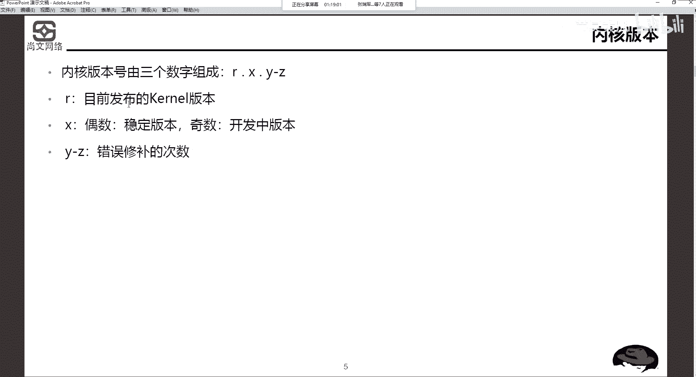

啊，目前发布的科的版本。也就这个五啊，也就是他的大大版本。

X。那么X这个地方如果是一个偶数版本，什么是偶数？24680是吧，什么是基础？13579。那如果你是一个偶数的版本的话，它一定是一个稳定版本。那如果是一个基础的版本，可能是在开发中。

可能是在demo测试中。啊，这边有版本。那么第三个呢是这个Y杠Z是修补错误的，是修补呃这个错误修补的次数。所以我们看这个地方啊，5。5。9，大版本是5，次版本是55是一个基础。我们要思考一下啊。

我们要思索一下。

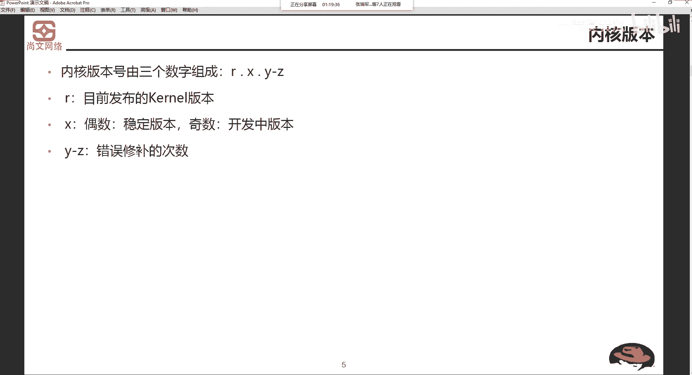

敢不敢在我们的生产环境中去具体使用？为什么它是个基数。那你如果你看这个地方，4。14。173，主版本号是44版本号是14，哎，14是一个偶数，肯定是个放心的。173是修补的这个次数。

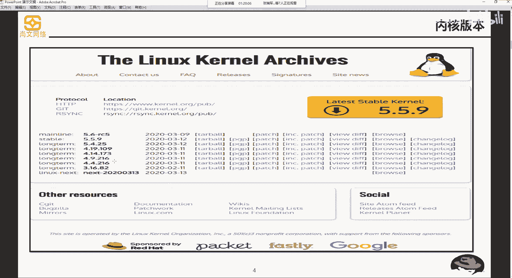

所以我们。嗯，在这个科的使用上，我们要去去去主要看一下这个X啊，这个次版本号。测牌证号它分偶数和基数版本啊，如果是偶数的话，我们肯定会放心的去。如果基数的话，我们在我们的测试环境中去测一测。

测试一段时间，如果没问题的话，那我们再把它投入到真正的生产环境。这块儿。

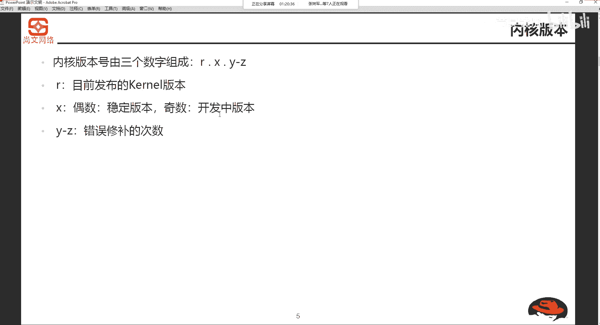

大家要明白啊大家要明白，不是说。我拿了一个下来一个新的，我就我就用啊，我们要思索一下是吧，思考一下，评估一下。

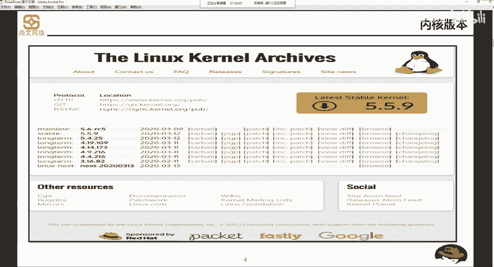

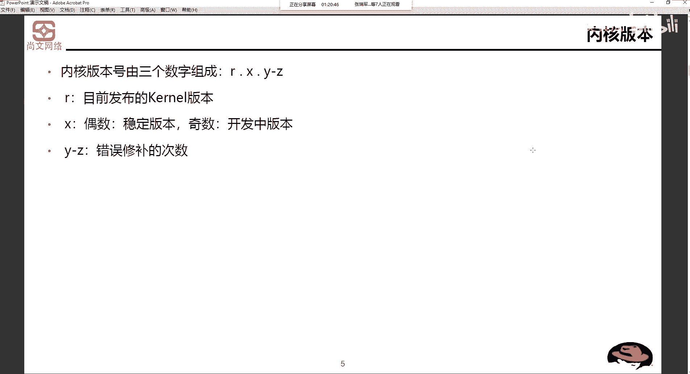

好，这是内核版本号啊，主版本号点次版本号点修正号是吧？啊，就要记住这个啊，就记记住这个。

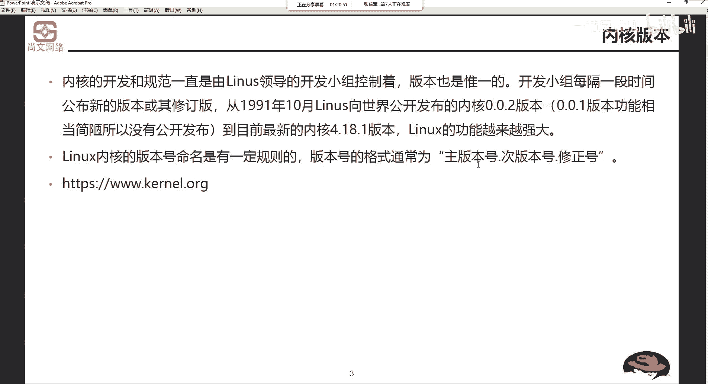

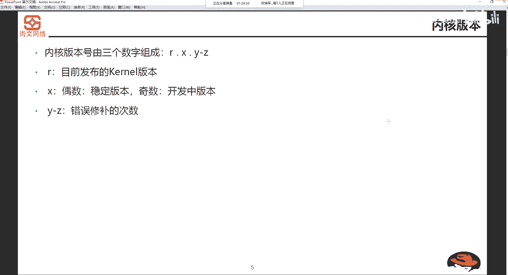

这是内核版本啊内核版本。