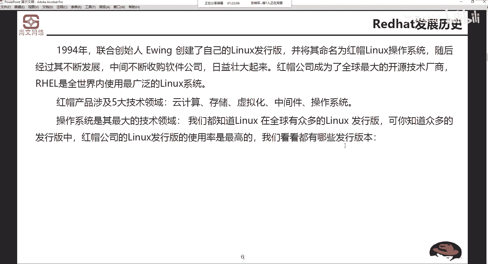
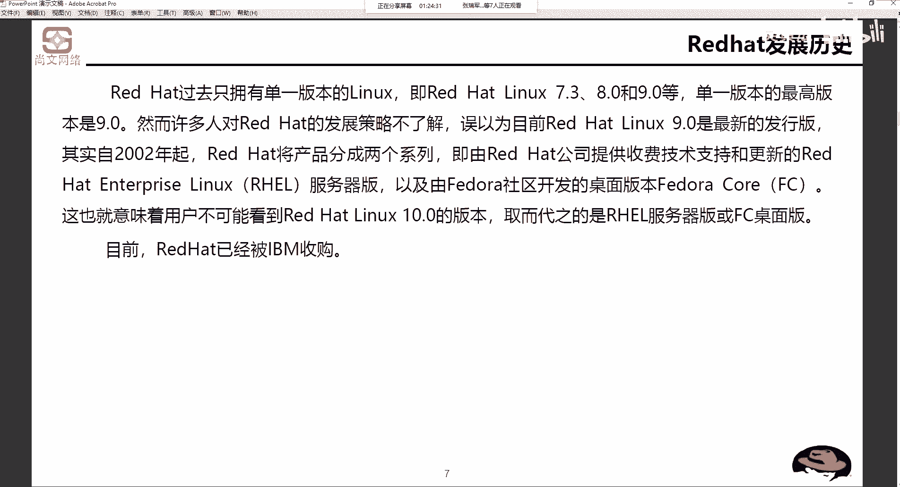

# Unix&Linux快速入门超详细教程-7天通关RHCE - P5：02-2-2 RHEL7.x介绍 - 尚文IT教育 - BV1JC4y187nr

那么re hat啊，它的一个发展历史。94年，联合创始人ervin啊ervin创建了自己的linux发行版本啊，并且去命名为红帽linux系统。那么红帽呢，它的产品啊现在来说。现在来说。五大领域。

第一个是基于云音计算的啊，基于云计算的。第二个是基于存储的虚拟化的中间件的以及操作系统。这是红帽的一个技术领域。当然红帽我们刚才也说了，现在已经被IBM已经给收购了啊，已经给收购了。P。收购了之后呢。

他会和IBM之间一些这个相关的一些资源啊进行这个整合。操作系统是最大的啊一个技术领域。我们都知道linux在全球有众多的发行版本，但是红帽的linux发行版本是使用率最高的。那我们来看看红帽的lin。

有哪些版本？

呃，我当时我当时在接触linux的时候呢，是red hat linux9。0。很很老的一个版本了。那么在过去啊，linux只有一个单一的版本，比如说7。38。09。0，我接受的是9。0开始。

呀一下暴露了我的年龄是吧？啊，其实我也不大啊，其实我也不大，还是很年轻的。那么单一的版本的最高。版本是9。0。那么然而，很多人对于专害的发展策略不是特别的了解。从2002年开始。我那时候上初三啊。

red hat分成两个系列，第一个是由提供收费技术支持和更新的。叫red hat enterpriselin。也就是我们刚才在w one note里面去写的一个东西。

叫red hat Enterpri links叫RHEL是吧？啊，RRHEL。

好，那么第二个呢就由匪do rush去开发了一个桌面版本就FC那fedo callFC。那么目前啊red hair已经被IBM已经被收购了。刚才也说过了。

那umb么 red hat。entterpri这个分支这个级别。有。linuxadance platform，就是adance是高级的意思是吧？Patform是平台，也就是说它是一个什么高级服务器版本。

第二个啊。red hat enterpriseterprilinux啊是entterprise本身就是一个企业的意思是吧？啊，企业版本。然后再往下呢。

有什么desktop桌面with relaxation，也就是说它是一个工作站啊，工作站吧，那么还有desktop吧。那后我们把这个什么我把这个啊re展生press lin啊，把它标红加粗了。

我们要关注的是谁？角RHEL啊。原来还是他的企业吧啊原来还企业吧。

好。刚才我们说了啊re也好，其他的也好。呃，有有7。38。09。0，然后把这个呃。分成了两个系列啊，这个企业的red hat啊linux。

还是什么桌面板，高级版，还是什么工作站板。那么每一个保安板都会对应的。一个东西叫内核啊，每一个版本都可对应个每内核。我们来看啊，为了能够及时为系统添加新的功能和修补错误。

red hat在linux推出后都会不定期的推出update，就是升级版。我们看这个例子，比如说red hat enterprise link S4update1。或者是4upate2。

那么我们将要接触的是什么呢？我们要接触的是。red hat enterpriselin s7upate6，也就是说我们把它再做一个简称叫RHEL7。6。啊，7。6。那么这个7。6之后有没有7。77。8。

这个是没有的啊。在首先我们定一个主题啊，定一个基调，大版本就是什么？七版本。啊，当然7版本现在已经不是最新的版本，是8版本啊是8版本。因为我们。红帽啊，目前这个。如果是2CE的话啊，考试的话。

还是700本啊，那么差不多在。咱们今年啊5月份也好，6月份也好啊，就会推出关于8版本的2CE的考试。就是你你去考2CE。啊，比如在5月份之前，他可能还是7啊还是77。X。但是你如果到了56月份之后啊。

我们可能要换了啊，后包就要换成8。X啊，8。X。好，那么这个。我们接触的说这个是7。6，这个这个7呃RHEL7。6啊，或者说RHEL7。2啊，或者说RHL6。9。这个呢只是说红帽的一个版本啊。

就是说红帽的一个版本。那么它一定要对应。一个内核版本叫3。10。比如说7。6，我出厂了，哎，对应的这个内核版本是3。10。0。我们刚刚又说了，内核版本呢有主版本号点儿次版本号点修正号是吧？

主版码号大版本是3，对吧？然后这个次版本是个1，一看是个偶数，是不是可以放心的用？然后0-862修修复这个86862次。所以说我们要记住啊我们要记住。这个东西啊，当然我我们不是说要让你记啊，红帽7。

6对应是3。10。0，不是这个意思啊，就是说其红帽的7。6，可能我们我们可能还会有一些其他的发行版本，比如说swoS的。啊，叫生成S77。比如说160几啊这种版本。

那么它对应的内核版本是多少多少多少少啊，为什么要说希望大家要记住这个东西呢？是因为。再有很多的这种开发公司，就是开发人员他们做出来的一些。他们做出了一些这个开发的一些东西啊，开发了一些东西。呃。

首先呢他会告诉我们这个呃基础架构的这种实施人员和运维人员来说说。我的这个GDK啊1。8，我要我要支持这个。我要支持这个什么嗯支持这个。嗯，刚才说到这个内刻版本是吧，就是有很多这个开发人员。

他比如说GDK1。8是吧，1。8那我。一定要要支持在，比如说红帽的啊，不是也不是说红帽啊，比如说这个linux啊，红帽也好，s透S也好，比如说7。2。然后他开发这些东西，一些模块或业务上的一些东西。

可能他他说他我我我这东西我只支持内核版本为3。20点多好多好多好这种东西。所以说我们在搭建这个操作系统的时候，首先肯定要前期要跟我们这个开发人员也好，或业务人员去沟通。对吧你不是说我我懂啊。

比如我熟悉六版本，我们就不装七了啊，或者我熟悉五版本，我就不装六了，不是这个样，就是要跟他们沟通一下，就是你这个东西支持的内核版本是多少，或者说。你的这个这个东西是不是在70版本上就可以支持啊。

所以说两个维度，一个是内核版本，你支持哪一种？那我就去对应的去找。比如说那个红帽的6。9，它可能是。2。6点多毫啊，内核版本是2。6点多毫，那我就那他的开发这些东西，我就只是2。6点了。

那你不能给他装7了是吧？那你只能考虑给他装6点几啊，6。6。X。啊，是这个样。所以说我们呢就是说这个。要把这些东西啊，就前期的东西要跟这个开发人员去去或者业务人员去讲清楚啊，把这东西讲清楚。

要不然就是一种资源上的浪费啊，浪费我们的时间是吧啊？好，这个呢我们要注意啊，就是内核版本和发行版本的一个对应关系。

70X的一个new feature啊，new feature它的新特性。改整体改善安全性能，尤其增强了两个安全层和满足当前云环境的一些标准啊，为混合云啊，这是个东西叫混合云。所谓的混合云就是。

我们的机房在本地叫on premises啊on premises，就是我们的本地的啊环境。那么到了云这那个那个那个公有云是公有云是吧？啊，我不管是阿里也好，还是挨er也好，还是EWS也好等等等等。

那么混合云就是说我们怎么样去把on premises和public cloud啊就是我们的公有云上的这些。首先我们做一个链一个一个一个一个一个通信方面一个打通。比如说用最基本的VPN啊。

或者是通过MPRS的这种专线啊，我们把本地和公有云打通，这是啊组成一个混合云。或者说啊有一些这个呃专有云啊，所以专有云和公有云上之间的一些衔接，或者是说公有云和公有云之间的衔接，它都叫混合云啊。

都叫混合云。那么不管是你本地的专有的还是公有云的，和我们的公有云之间这个连接。信息安全和数据安全保障一定是无可避免的一个话题。啊，所以说他怎么样去整体改善一些。保障一些公用in一些安全保障。

那么除此之外，还引入了TPM叫trust啊，plform啊modous叫可信的平台模块。进一步将呃强化了这个NBDENBD叫网络绑定磁盘加密啊，网络绑定磁盘加密的功能。啊，实际上说白了就是。啊。

我很多这种安全性能就是为了在。跨网络环境的一些这个安全啊，及对它进行这个增强。而且还表示啊，很多IT部门啊而言，IT安全依然是一项。啊，接力赛。那么在复杂的混合和多云的环境中，大家注意。

多云将来一定是在云环境中的一个趋势啊，一定是一个趋势。所以说如果将来可能会接触到一些公用云也好，一些这些这些东西啊，我们一定要去了解多云。怎了。完成挑战。

这是这个70X的一个。新特性。好。呃，怎么样获得最新的内核版本？有个网站是吧？3W点科点ORG啊去获得。一盒版本号的一个。它的一个组成。啊，一个组成。比如说主版本号点儿次版本号点修正号。

而且我们要注意的是那个次版本号，如果是偶数的话。是稳定版本，如果是基数的话，我们要去评估是吧啊去评估。那么readd hat linux系统的最新版本啊，当然啊现在不是7了啊，不是7。X是8了啊。

是8了。嗯。

好。那么关于这个呃。

内核版本的一些知识啊，red hat的一发展历史，产品线，包括这个呃。发行版本和内核版本之间一个对应的关系。

这一块。