# Unix&Linux快速入门超详细教程-7天通关RHCE - P6：02-3-1 硬盘分区知识讲解 - 尚文IT教育 - BV1JC4y187nr

好。呃，我们接下来来看关于磁盘的一些知识，磁盘的一些这个基础知识。说每个硬盘有主分区。扩展分区和逻辑分区。啊，有这么一个东西。啊，大家如果说自己去去去去装机。是吧去装机。肯定会遇到这个东西是吧？

每一个排行分为主分区。扩展分区和逻辑分区。我们看这个图啊我们看这个图。这个图呢是计算机管理，也就是说我们的这个这个这个呃windows的啊磁盘管理器。那么怎么样去打开这个磁盘管理器呢？啊。

我们作为1个SA级别的一个人，他直接敲命令啊，直接敲命令。比如说你点开了开始是吧，然后点这个或者是crl加呃那个那个windows windowsdows加2。

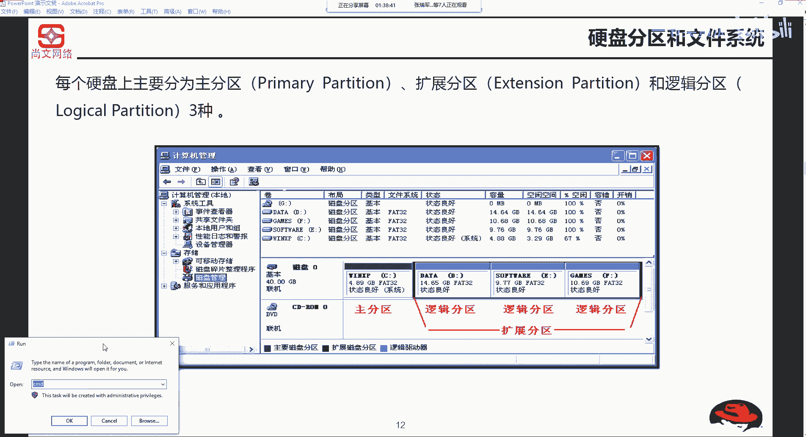

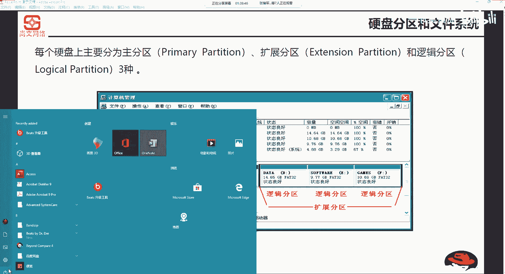

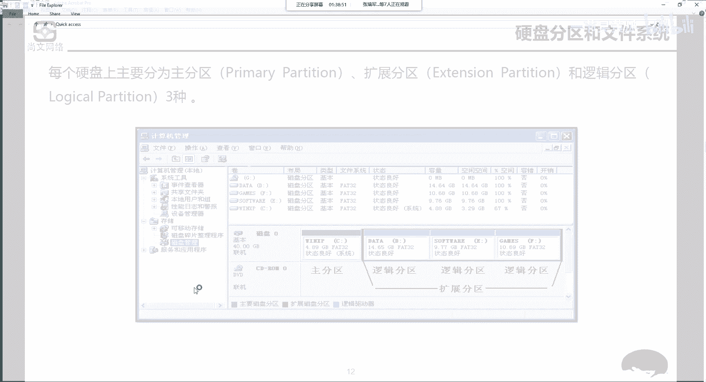

啊，或者是这个windows加2。然后你敲1个CMD。是吧啊或敲一个这个CMD或者是你直接敲一个命令叫diskMGMT点MC。

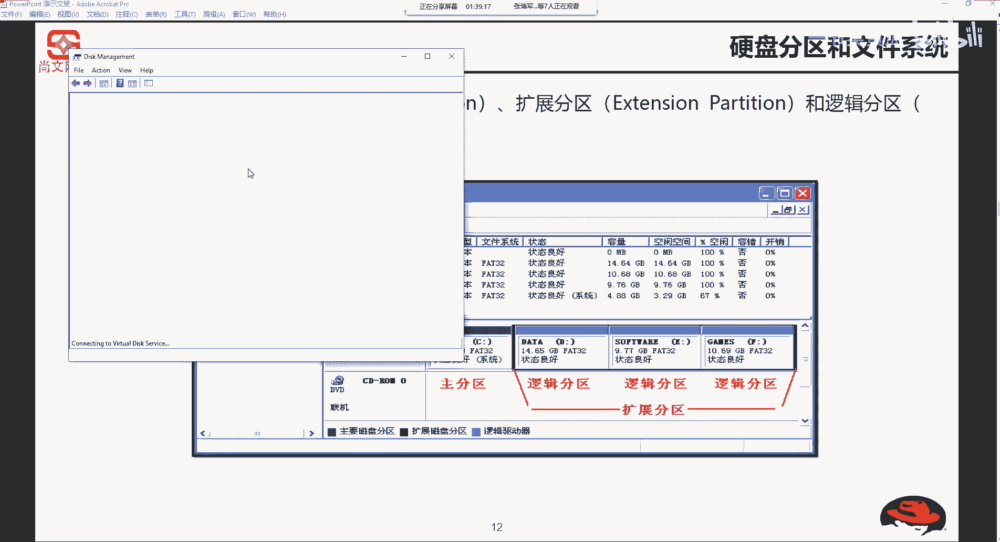

第四个MGMT点MIC。这个呢就是说基于windows。打开。任务。管理器。呃，打开是磁盘管理器。那就是说开始是吧，点开始，然后。运行。这个dis啊MG。

di个MGMT啊DMC啊是windows打开自盘管理机。

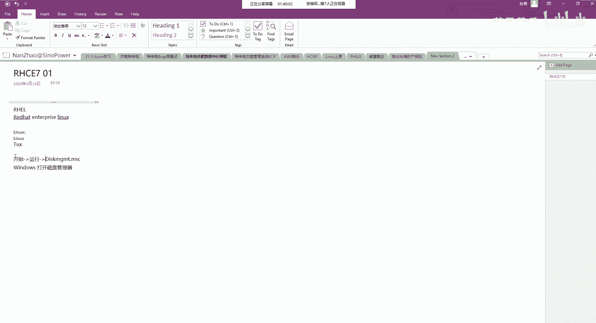

啊，是这样来做。那么打开了之后呢啊就出现了。当然我就是英文了是吧？啊，打开了之后我们就能看到。

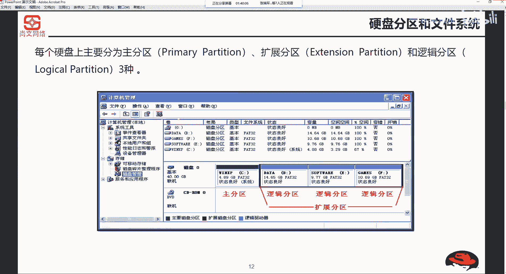

你的磁盘有几块磁盘，di个0dic个一。当然我这我现在是di个零是我的一个主盘是吧？disc个一是我的一个存储卡啊，是一个存储卡。那么D四个零，你会翻到C盘D盘E盘。🤧而且你会发现。

什么有primary partition啊，primary partition就是指的是我们的这个。呃，主分区是吧，然后这边还有一个primarypartition。

这边还有一个primary partition。也就是说我这块磁盘一共就三个分区啊，前面的我就不看了啊，加上EFI的这recover的partition就不看了。CDE啊都是主分区。

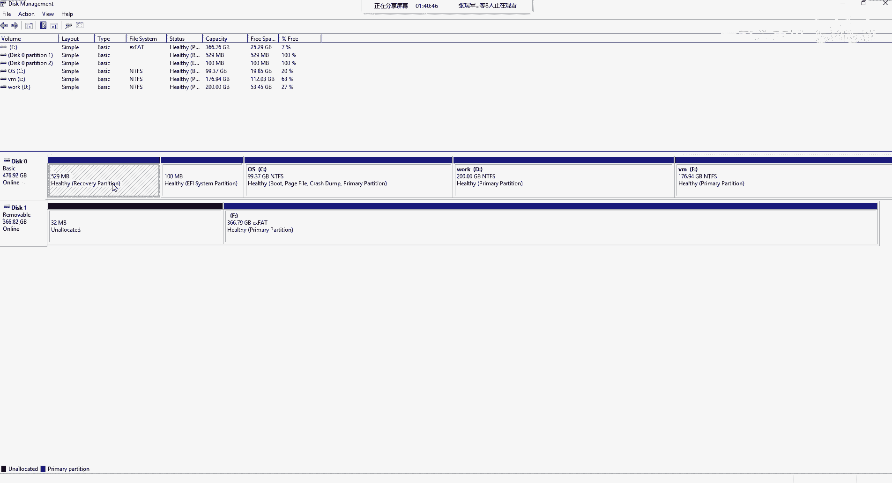

好。那么。一块磁盘。咱们来说常规的啊一块磁盘。U2磁盘它最多可以画几个主分区。应该来说，一块磁盘最多可以画4个主分区。

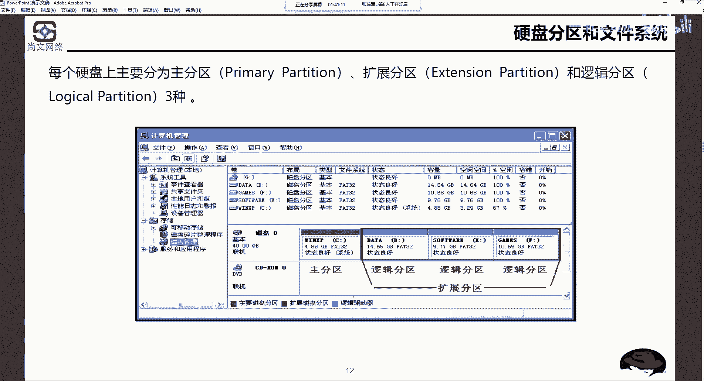

就我们就以这个为例是吧？如果如果我的磁盘是我现在是500G的那个SSD。如果我比如说我是ET的，那么我剩下的一些空间，我是不是可以依然画划分区。那么也就是说对于这一块盘来说。

我最多可以画CDE不是说F啊，最多可以再画一个主分区。我是因为我现在有1233个主分区了，对吧？我最多才能画一个主分区，我可不可以再画两个主分区了，肯定是不可以了。对吧那好。

我们说我们我们我们我们比如说把这个啊这个游戏啊放在专门放在一个分区上。我们把工作的东西放在一个分区上，我们把学习的单独放在一个分区上。我们把这个这个这个比如说这个啊文档的啊放在另外一个分区上。

也就是说我们可能会有5个甚至6个分区的这种需求。

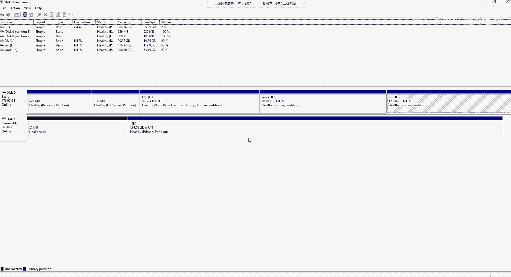

那。我们。刚才说了一个磁盘最多有4个主分区。那么你如果想要突破4个分区的这种打破它怎么办？我们这个时候就需要用到。个分区和。逻辑分区。的概念啊进行介入。大家看这个图，C盘。主分区。

然后DEF是什么三个逻辑分区。当然，逻辑分区的前提先决条件是什么？是扩展分区，对吧？啊，扩展分区。啊，这是个人问觉。从这个图上我们能看啊从能看到扩展分区呃，主分区也好，逻辑分区也好。

它是不是都有所谓的盘符。你看主分区是不是有C冒号，逻辑分区123有DEF冒号，也就是说C也好，D也好，EF也好，这个是什么叫逻辑驱动器，逻辑驱动器的符号啊，也叫盘符啊，你这么理解，但是这个扩展分区。

你发现。他有没有盘服？他没有排除，对吧？所以说你如果我我想要6个分区也好，我是不是可以先建一个主分区C盘，这是一定的。然后DEF。G。H这吧我6月份去的需求啊，DEFGH。

后面的5个分区都可以是逻辑分区，但是逻辑分区前提是一定要什么建立在扩展分区的啊之上。罗辑分宽敞分区是是是是一个先决条件。这块应该没什么问题是吧啊，这块没问题，这是硬盘的一个一个一个知识。那么。

刚才说为什么说一个分硬盘最多能画四个主分区啊，为什么会这个样呢？我们稍后来说啊，稍后来说。

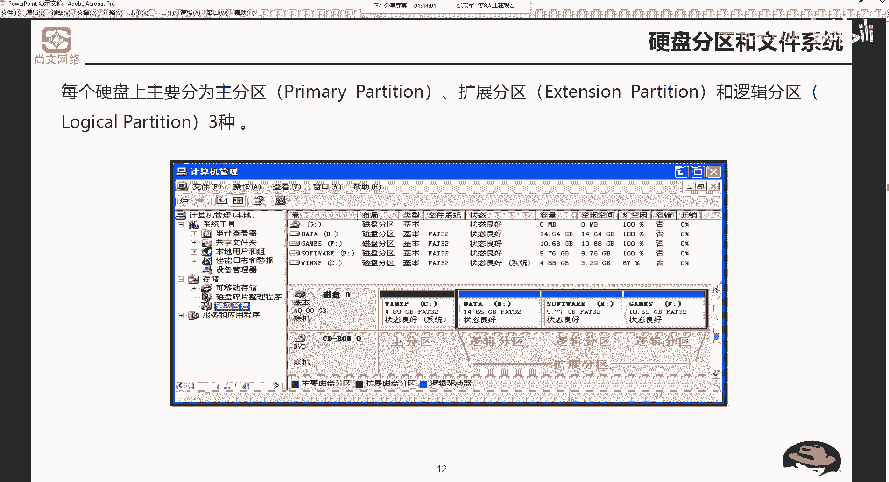

好，我们来看这个这张PPT。左边这个图啊，windows中的分区示意图是吧？啊，左边这个图是windows的啊示意图。然后呢，这个windows的示示意图，它这个什么呃C盘是一个主分区，有分区。

有盘弧C然后DEF。是依附在快闪分区之下啊，是有盘符的，快散分区是没有盘符的，这是windows中的示意图。那我们来看这个说明啊linux如果是lininux系统的话，使用设备名称加分区号码。

标明硬盘的各个分区。使用设备名称加分区号码啊。对于主分区或扩展分区啊，对于主分区或扩展分区，它的编号为1到4。逻辑分区从五开始，我们看右右下角这个右边这个图。🤧。主分区。说了是用设备名称加分区号码。

我们先不用管设计设备名称，分区号码我们都能看得懂，是吧？12345。这边有个一，这边有个5，这边有6，这边有7。但是大家注意看。左边的windows分区和右边的linux分区在有哪些不同？

除了我们说这个设备名称分区编码不同之外，还有哪个地方是不同的。你能看得到吗？是不是对于windows来讲，扩展分区，你看它没有什么盘符，比如说F盘H盘C盘，对吧？它没有盘符。

但是你到了右边的linux序分区的示意图里面，扩展分区它是不是有一个所谓的盘符。啊，所谓的一个标识嘛，比如说二看到了吗？啊，这个呢就是和windows之间一个一个最大的一个区别。我们再回来。

再看这个这一段话啊。对于主分区或者是扩展分区，它的号码编号为1到4。也就是说。主分区。我一块盘有4个手分区。二。234是吧，或者说我有一个主分区。然后我接下来要去做扩展文区。啊。

那么扩散分区的编号是什么？就是2。也就是说主分区和扩散分区它的编号共用。一到4。啊，共用胰岛4。然后逻辑分区就从五开始，就是我甭管前面有多少个主分区。对吧。如果我说我我我前面有三个主分区。

那么前三个主分区是123。那么我第四个的话是一个括尔虚，那就是4。如果说我前面只有一个主分区，只有一。那么跨人文区，那就是2。但是我的三和四这个编号是空着的对吧？啊，三和四是空着了。

那么逻辑分区的第一个分区一定是从五开始。就我不管你主分区块分区有没有把1到4给填满，我第一个逻辑分区，它的编号一定是从。我开始。这块儿。大家要注意。windows和linux的一个区别就是。

对一块两个区。他是有自己的number号的。

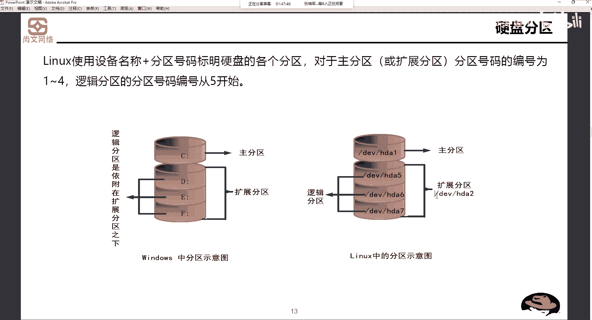

啊，是有自己的号码。