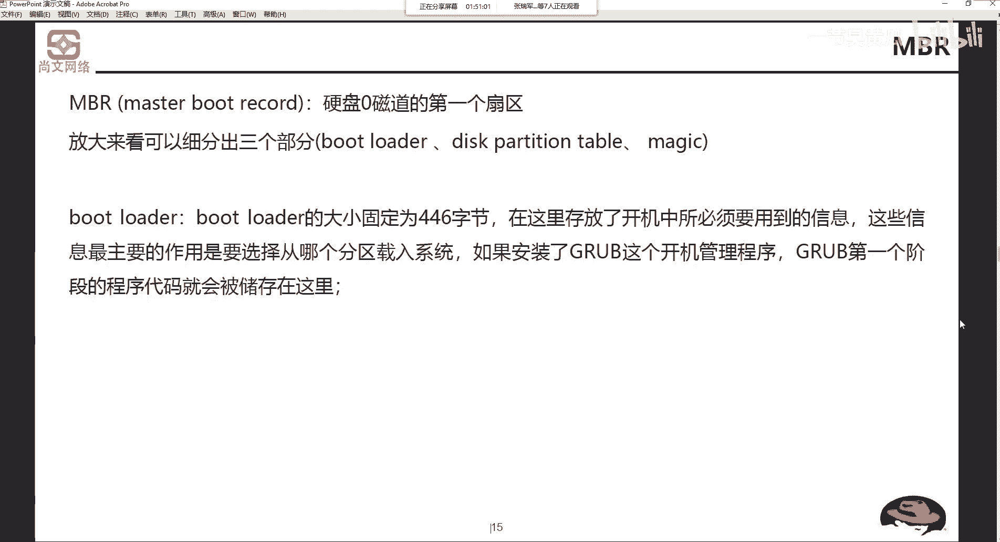
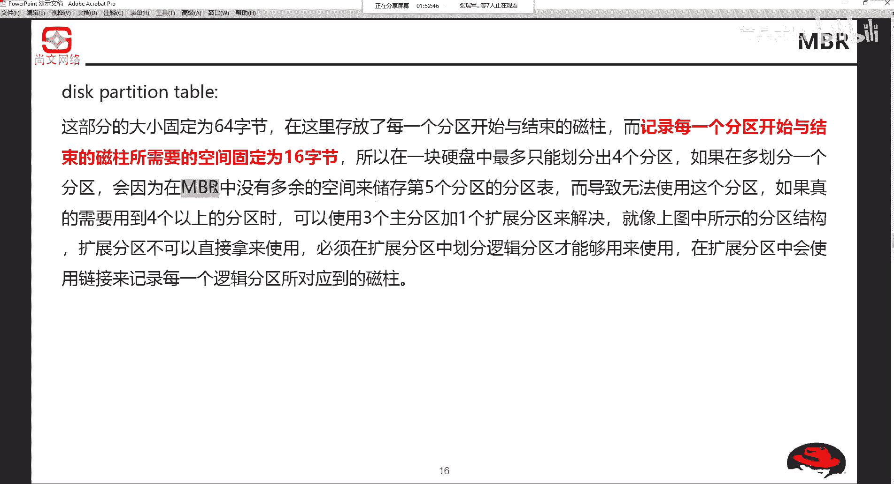
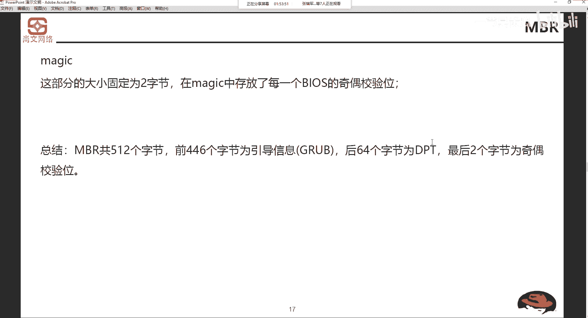
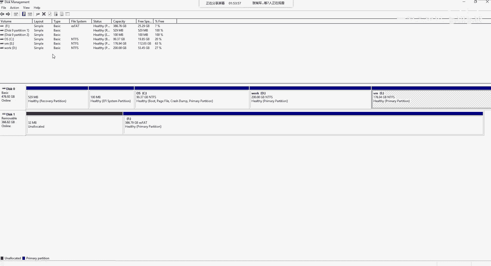
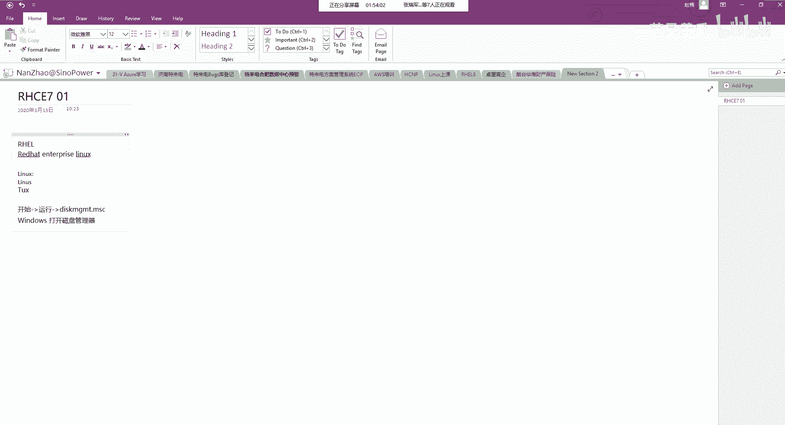
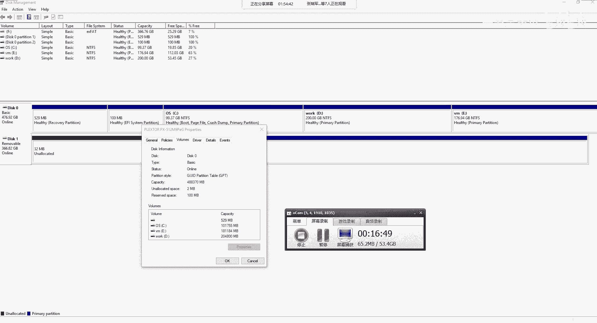
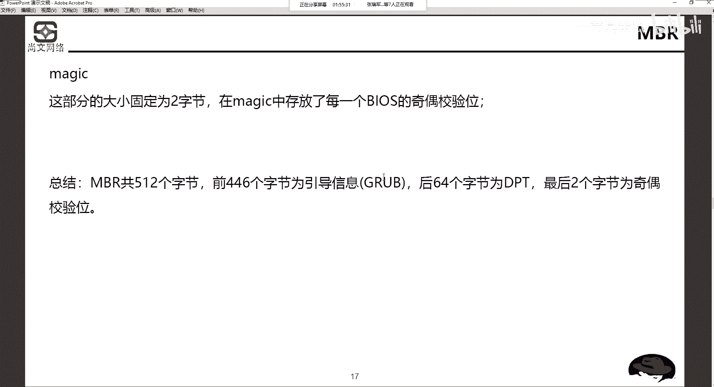
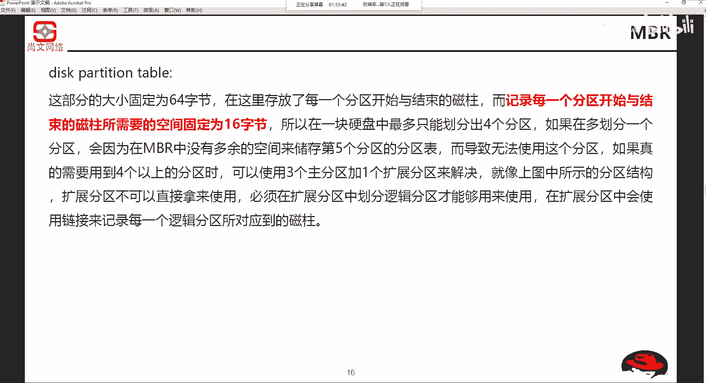

# Unix&Linux快速入门超详细教程-7天通关RHCE - P7：02-3-2 硬盘分区模式讲解 - 尚文IT教育 - BV1JC4y187nr

其中顺序。啊，启动顺序。然后这个我们来看这个启动顺序啊。启中顺序首先去这个通过bios啊进行这个初始化啊，bios我们应该都知道是吧？🤧每一个每一台机器它等于有一个bios啊，叫基本的输入输出系统。

basicinput output system。Bos。不要是干什么事呢？首先检测硬件是吧，检测硬件。然后第二个呢是这个选择引导的设备是吧啊，选择引导的设备。🤧嗯。然后选择这个引导的设备。

我们是检测啊，第三步呢是检测硬盘零次到了第一个山区。叫MB2。啊，他叫MBR，叫master do to record啊MBR。这个MB2呢啊master boot叫主master啊。

主boat引导record是记录啊，叫主引导记录。磁盘零啊磁盘零领持到了第一个上区啊，叫MB2。那么把MB2把它放大来看呢，有三个部分，第一个叫boot loader。啊，boot loader。启动。

引导项是吧？启动引导者啊这么翻译的这么直接啊，启动引导者。然后第二个呢叫dispart升体保啊，磁盘分区表是吧？磁盘区表。第三个就magine啊，就魔术或者说校验。

那么bootloader的大小为固定446个字节啊，它的大小是固定的。他主要是干什么用呢？开机存放了开机所必需要的信息。呃，相信大家可能以前不知道大家有没有装过双系统。啊装个双系统。

比如说我装个win7，再来个W10吧啊。然后我们再这重启开机之后，我们会有一个让你选的那么一个界面，高量的那么一个选的界面。那么这个选择了这个启动的界面，呃，它它需要用到一些开机啊。

启动的一些信息就是放在这个boot loader里面。比如说我们从哪个分区载入系统是吧？比如说我们C盘装了win7，D盘装了winI10啊，这是有可能的啊，所以说我们从两个分区载入系统。

如果安装了gb啊，这个开机管理程序grab啊第一个啊阶段的程序代码就会被存储给了。GRUBgrab是linux的一个东西。G部这瓜部呢也是用来负责开机管理的一个东西啊，一个一个一个城市啊。

程序代码就会不存在这种。大家记住的是不多点的大小为446个字节。大小为446个字。好。那么第二个部分呢叫DPT。

Disk partition table。磁盘分区表啊磁盘分析表。同样的，它的固定的大小为64个字节。那么这里面是放什么呢？在这里存放了每一个分区开始与结束的词柱。

而每记录每一个分区开始以结束磁柱所需要的空间为16个字节。大家算一算啊，数学肯定没问题，64除以16等于几，是不是等于4？所以说在一块硬盘中，最多最多只能画出4个主分区。啊，最终画画出4个主分区。

如果说我多画一个分区。那么在NBR中。在MBR中就没有多余的空间来存储第五个分析的分析表。所以说这个时候我们又要需要用什么扩展文区。来引申出逻辑分趣。啊，逻辑去。那么如果真的用到4个以上的分区数。

可以使用三个主分区加一个扩展分区来解决，或者是什么呢？一个主分区加一个扩展分区来解决都可以，对吧？你主分区少，那你后面的逻辑分区就少，对不对啊，就是这么一个意思。

那么在扩展分析中会使用链接来记录每一个逻辑分区所使用的词。所以你就明白了。为什么说我们一块盘？不管多大的盘。最多只能放四个主动区，原因就是在这是因为什么？我们是基于MB2的模式。基于MB2的磁盘模式。

好，最后一个magic是用了固定的呢，是两个字节，是存放了每一个bios的基术教易问。我们对MBR做一个总结。一共512个字节，有它会不会超，会不会大，会不会说会不会到一兆，不会。

它固固定就是512个字节。🤧K。前面446个字节是引导信息，bo，你叫它bo load也好，或者是linux叫grab也好啊。OK第二个64个字节为DPT叫disk partition推广。

对吧开存放了开始到结束的呃，这个词柱的空间是每一个啊是16个字己。所以说64除以16等于4啊，那么在MB2下最多可以画4个主分区。那么最后两个呢是基构校验位啊，记构校验位这是MB2。好。

那么除来MB2的话。有没有其他的磁盘模式，或者说我们怎么样去确定我们的磁盘模式是MBR是吧？这个我们来看一下啊，我们先在windows上来看一下。

嗯，这个呢是那个磁盘管理器是吧？啊，我刚才打开了磁盘管理器，怎么打开了呢？通过开始运行，叫这个这个地方是小写啊，这个地方小写。

dis MGMT点MC打开磁盘管理器，然后我找到一个盘，比如说叉点右键点properties啊或者点属性啊，中文翻译过的就是属性是吧？啊，确定。然后在这个这个。

valueumes啊在valueums这个地方啊，也就是说如果中文的话就是一个卷是吧？券，大家看啊partition style分区类型，什么叫GUID啊，partition table叫GPT。啊。

叫GPD。大家可以看看自己的这个侧盘模式，这个分区的style。啊，有可能是什么叫。

有可能就是。这个。看到了吧？啊，哎可有可能直接就显示这个MBRma boot to record。mus book旅就在这个地方。所以说除了MBR之外，是不是还有一种style叫什么叫GPT。

GPT呢就打破了这种所谓的主分区，主分区什么就是没有这种限制了啊，就没有这种限制了。它最多呢可以画128个磁盘。120128个分区。那么。

一般这个苹果系统啊苹果系统会可能会用到这个GPT比较多一点啊比较多啊，叫GUIDpart。这个地方大家要注意啊，这个地方要注意啊，NB2。那么我们MBR还是用的比较多的。所以所以就是我们要知道。

就是这个MBR就为什么说一个一个一块盘，我们之前都么说一块盘最多画4个主分，就是因为在MB2的模式下会这种情况。

