# Unix&Linux快速入门超详细教程-7天通关RHCE - P8：02-3-3 硬盘接口介绍 - 尚文IT教育 - BV1JC4y187nr

OK好，如果这个MBR说完了，我们再来看一看。一些常见的这个硬盘的接口啊，接口我们都知道是吧？接口我们把盘和我们的主板上的一些这个接口啊。就主板上我给你一个slot啊，SLOT啊slot。

我们通过硬盘怎么样把它接在一起，这个东西就需要通过接口是吧啊，通过接口。首先第一个呢最老的啊叫IDE啊IDE。叫集成电子驱动器啊，集成电子。integrate集成的意思是吧？drive是啊那个那个。

这个盘。驱动盘啊磁盘。electrons是电子的，就是实际上就是说什么意思？我的接口，大家看右边这个图啊，我的接口这都是针脚的是吧啊，我的接口和我的盘。的空气和盘体是集成在一起。你要坏一块坏。

你要换一块换是吧？我相信大家可能都。呃，都那个可能都去去自定义去去买一个硬盘盒子，然后接上硬盘。对吧当一个这个移动硬盘来使。

所以说这个这个这个这个IDE这个东西就是说我的盘的盒子盘体的控制器和我的盘是是集中在一起的啊，这叫IDE。那么它的特点就是价格低廉，兼容性强啊，性价比高，数据传输慢，而且不支持热插拔。什么叫热插拔呢？

不是说它有温度的时候，你就没有温度的时候，你就不能拔了啊，有温度的时候不是这个意思。也就是说它正在运，就是它的盘正在加着电，正在工作的时候，我们依然可以把它拔下来。这个东西叫热插拔。

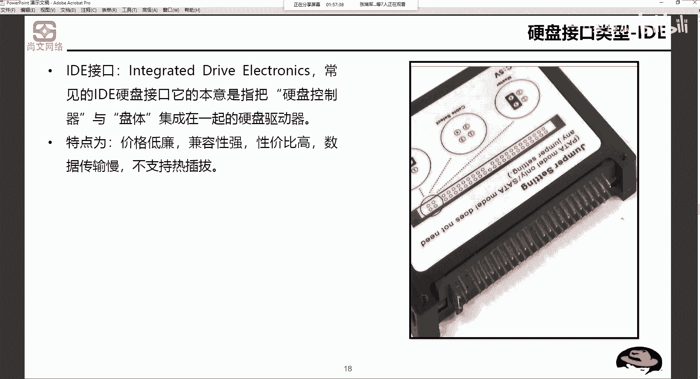

热潮吧。第二个接口，C加C啊，SCSSC加C。small computer system interface小型的计算机的系统的接口啊，小型计算机系统接口CRCRC呢我们可能不常见啊。

这就是我们平时我们生活中可能不常见。但是我们在在工作中啊，如果你是。呃，传统IT基础架构的一个数据的搬运工是吧？啊，你做这个实施的一些集成的项目，你你他那个盘你可能会会见得到啊，叫C咖C。

那么是一种用于小型机上的一个高速数据传输技术。这个大家看这个图就是它没有什么针脚，它就一一根下来了，是吧？它的特点就是数传输速率高，读写性能好，可连接多个设备。而且。理论上啊理论上是支持热插吧。啊。

理论上是支持的是吧。

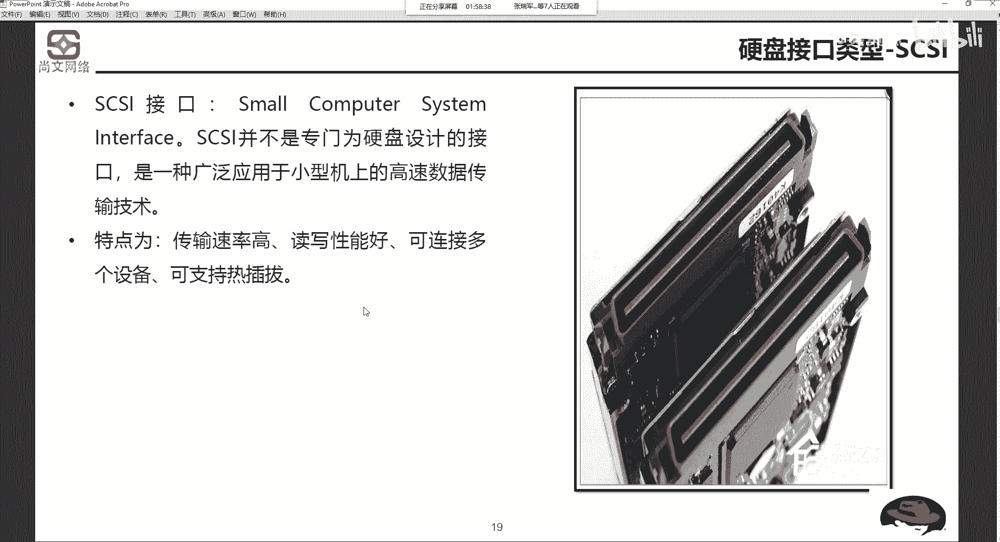

这是第二个接口啊，第三个接口SAT啊，这个我们经常常见。你下来你的笔记本儿。还是你的台式机都是这个口是吧？SAT啊s塔。串行的啊高级啊指令。串型的啊，高级指令，它能够对传输的指令不仅仅是数据进行检查。

而且它会发现可以如果发现错误了，可以进行自动的校正。那么很大的程度上去提高了数据传输的可靠性。特点串新接口结构简单，而且是支持啊这种认插网。从这个地方就能看它的一些就它有数据线的。🤧金属值。

而且还有电源线的。这种啊金属指。

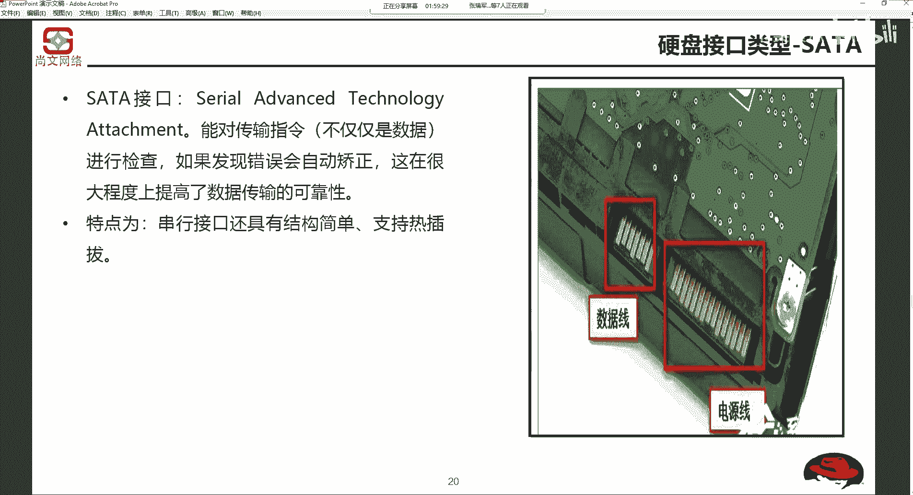

还有一种接口叫SASss。再一种呢就是服务器啊，服务器上你会见的非常多叫zas。这个sars呢实际上就是串行的attoach的啊。是基于CRC协议向下完全兼容sta在物理层sars和sta口完全兼容。

所以说为什么现在有很多的服务器？他是支持他既支持sars接口，还支持s塔接口。啊，这是支持混插的。而且它的速率要比萨塔哥要快很多。萨ars如果是。

因为呃它的这个传输速率啊呃老一点的服器一般上都是6个GB啊，就是6个GB这种。

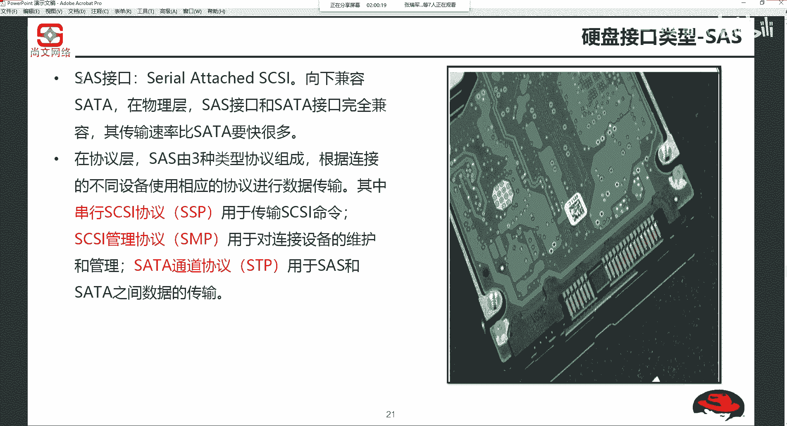

上死了。速率一般有老了就是6GB。然后现在有12啊GB，一般我们就是常用这6GB啊或者是12GB。

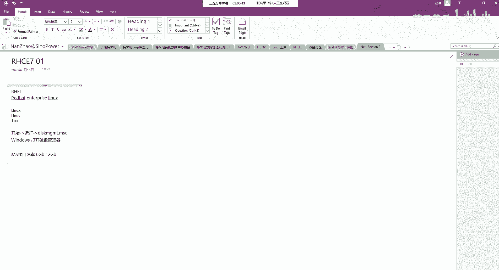

就这种。那么呃ss呢在协议层是由三种类型组成，其中有一个协议叫SSP啊，叫串意型的CRC啊，这个用来传输CRC的一个指令。然后SMP是用来进行管理啊，对于连接设备的维护和管理，以及我们要去传输数据是吧？

叫STP啊，通道协议啊，用于sas和sar塔之间的数据的传输，而且sas一定支持。

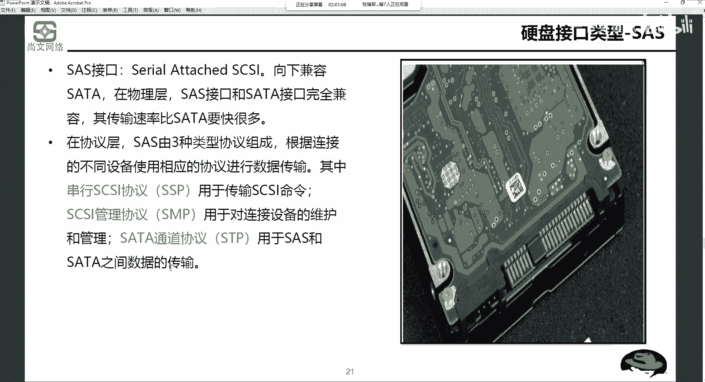

啊，下次是一定。一定支持热插吧啊一定支持热插吧。大家要记住啊，一定要支持这插板。

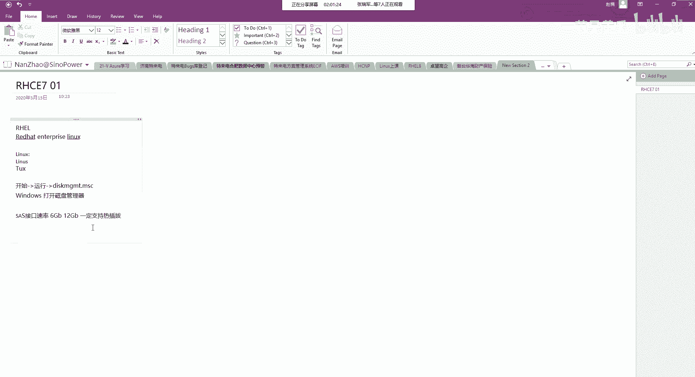

呃，还有一种接口啊，最后一种接口是叫。M点2啊19M。2。M点2大家要注意啊，MD2是一种新型的接口。你上我的笔记本。啊，像我的这个笔记本，它就是一个啊。M。2的硬盘啊，就是接口为M。2的一个硬盘。

就是很小是吧？上面比如冬芝的这个这个这个颗粒是吧，焊在这上面。那么这个这个接口就是M点2，那么M点2呢是一种接口，是用来推出M萨塔的一种规范接口。

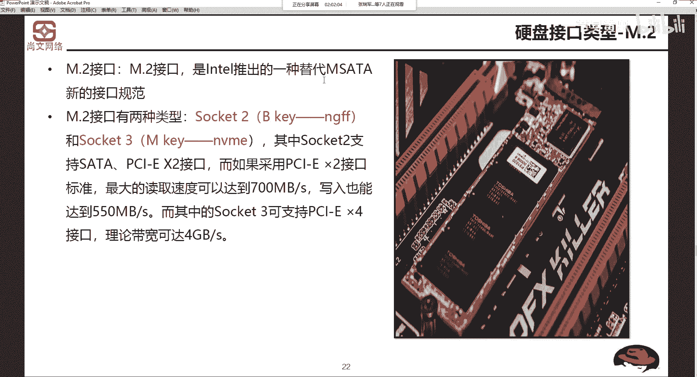

我们说啊沙糖，你看。12345678这么多的这种进数值。那么还有一种叫M萨塔，M飒塔就是迷你型的沙塔接口就很小啊就很小。那么M。2呢就是说用来替代M萨塔的这种接口规范。但是呢大家要注意啊。

M。2呢它是一个接口。啊，它有两种类型。第一个叫基于scket to，就是叫NGFF啊，NGFF是。The next generation。这个这个factor啊，就是下一代的硬盘的接口啊。

下一代的硬盘接口。还有一个socket3是NVME啊NVME我相信大家可能会会会会会会会经常会看听到这个叫NVME。其中呢s two也就是NGFF是支持沙塔接口的。那么如果是NV呃。

如果是采用这个这个PCIE的话啊，它的速度啊，大家想想PCIE我们知道PCIE也是一种接口是吧？啊，是插了什么？你看这个地方就是1个PCIE啊，可以这么理解啊。

这就是个PCI红色的就是1个PCIEPCIE分什么？4速8速16速，对不对啊，每一个速度不同，它的带宽啊，可达到了这个理论带宽也是不一样的啊，好，我们来看一下啊。我找一个。这个啊。然后有一个工具叫。

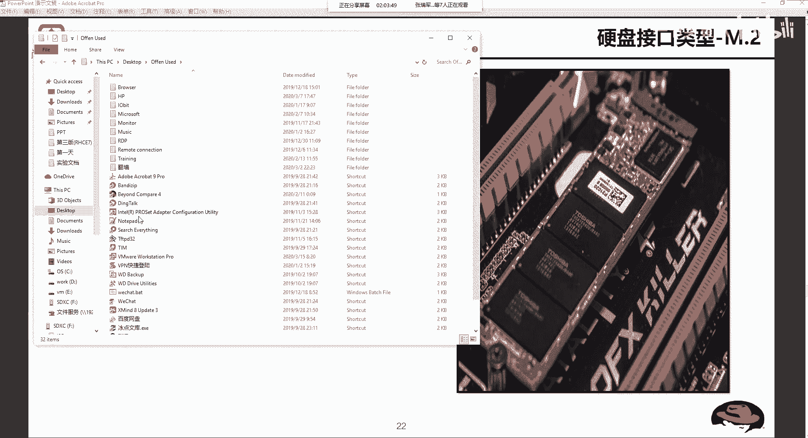

这个地方没有。我找一下在这个地方透s。然后磁环工具。啊，有一个这个啊叫SSD杠Z啊，大家看一下。这个工具呢我会看到会把我的这个磁盘的一些信息列出来。首先第一个扑克特啊这。

这个这个这个厂牌这个这个厂家叫博克特啊，而且呢它是一个interface，看叫NVME看到了吧啊NVME也就是说NVME它走的是PCIE的协议。啊，他走的是PCE的协议。

大家要刚才我要强调的一点就是什么呢？M点2是一种接口，它支持两种类型或两种协议。第一个叫NVME。

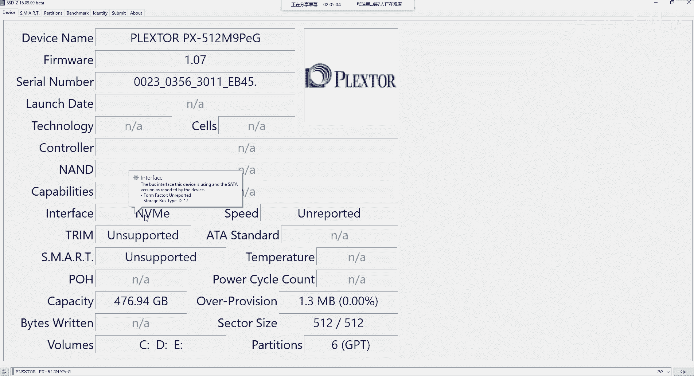

啊，第二个叫NGFFNGFF是支持SATA的协。啊，SAT的协议。那么NVME呢是PCIE的这种通道啊，它走的是NVME的通道。所以说NVME肯定要比萨塔要快快好多啊啊。

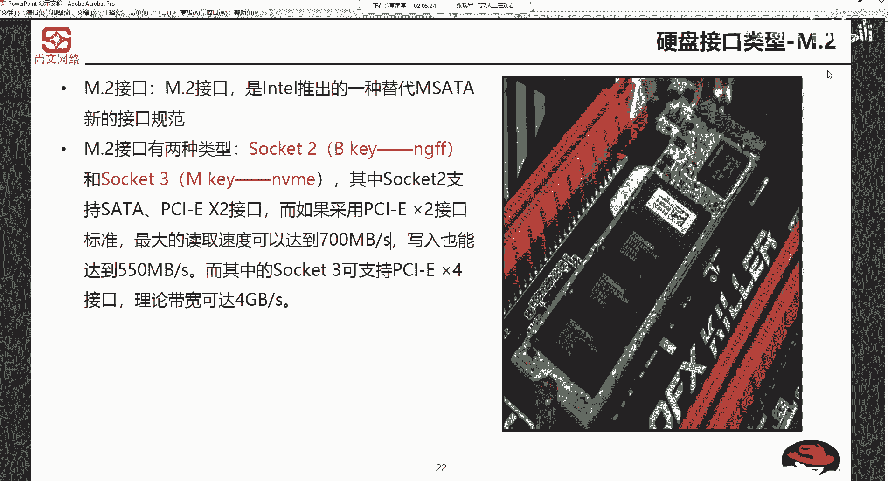

呃，这个时候我们就可以到时候做一些这个smart就是做一些这个测试是吧啊，测试。那么现在一些一般一些出厂的这个笔记本厂商。啊，他基本上是什么呢？

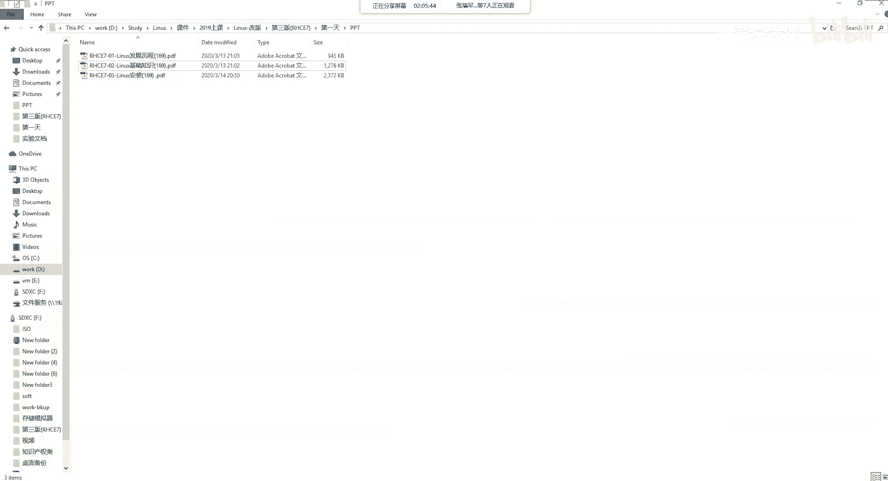

他也是MDR的接口，但是他走的给你给你的是什么？就是他肯定不是不会花那么大的这个成本是吧？因为我这个硬盘是我后期换下来的，那么出厂的的话，一般都是基于撒卡的。M点2的硬盘明白我的意思吧？

也就是说s塔的可定要比什么都NVME的要要慢一些。这个大家要注意，就是特别的因为这是一种新型的这种这种接口。大家要注意啊，你在采购的时候在。选的时候要注意。

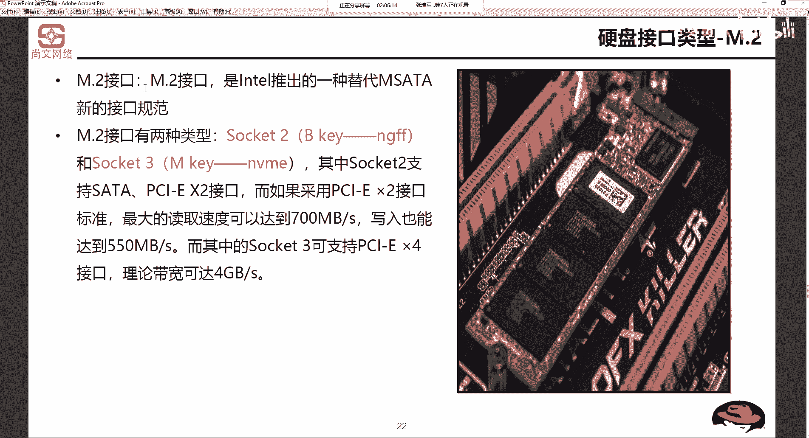