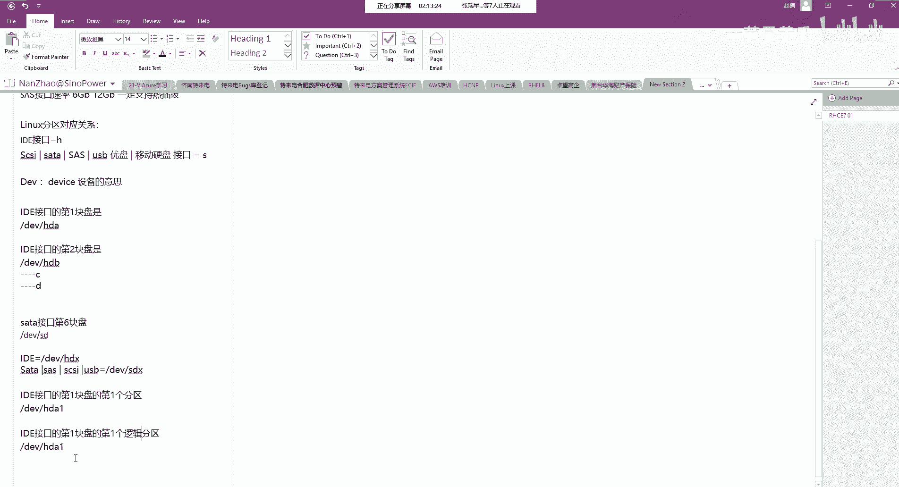
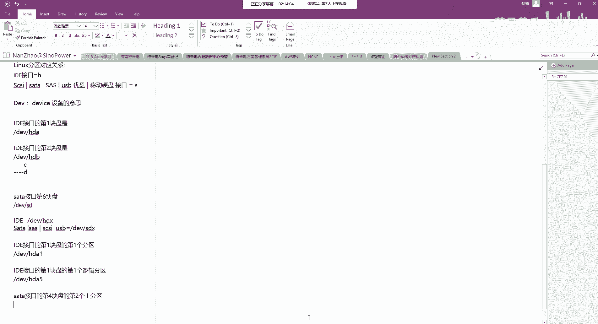
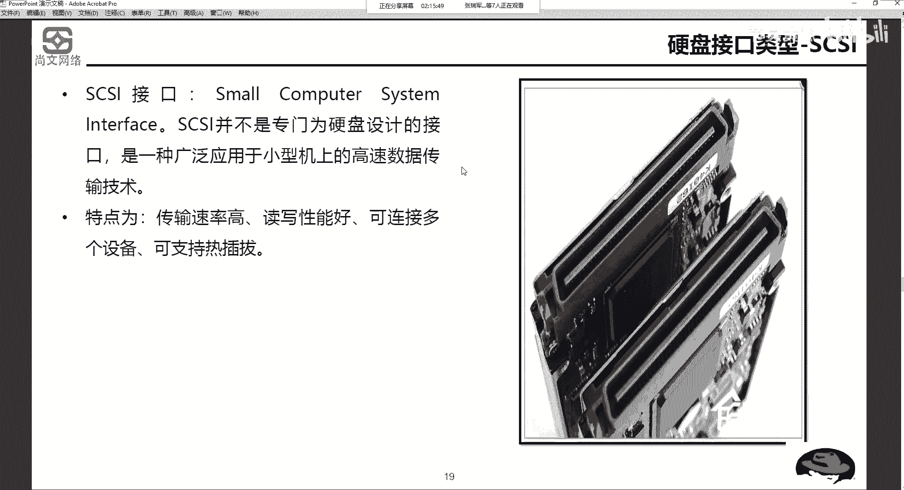

# Unix&Linux快速入门超详细教程-7天通关RHCE - P9：02-3-4 Linux系统硬盘分区对应标识 - 尚文IT教育 - BV1JC4y187nr

好。那我们刚才那个什么就是把硬盘的分区说了一下，然后把我们的这个。MB2啊说了一下，把我们接口说了一下。

把我们接口说了一下。那么接下来的话，我们就要看啊我们要看。对应的一个分区的关系。啊，对应的分区关系，这个是linux的分区啊，对应的一个关系。我们来看啊。首先我们知道了这个你的硬盘接口有什么？

有IDE有有sta，有srs，有这个这个M点2。对位啊，UC拉C啊，差不多就是能见得到的就是这一些。好，那么如果你是你的一个硬盘，因为我要去装leaings是吧？你的一个硬盘，如果是IDE接口的话。

也就是那个最老的那种IDE接口。我们要用H来表示。看到了这个地方有个H了吧，啊，H来表示。那如果你是一个sy的。啊，我们这样来写一下啊来写一下。

linux的分区。对应用关系。如果你是。如果是IDE。这直接写IDE。那么我们要用。H来表示，如果是C加C。或者是这个这个s塔。或者是424。那么。我们要用S来表示。有的人可能会问，哎。

如果你可不可以在U盘或者是移动硬盘上去装，因为它是USB接口，我们统一把它认为是什么S。比如说USB。U盘。或者是。移动硬盘我们都用S啊来进行表示。也就是说，除了IDE用H来表示之外啊，我们说的是接口。

对吧？IDE接口我们写的详细点，如果ID接口。对吧有如个接口。我们同呃我们去用这个S啊来进行这个表示啊，这个没问题啊，这个没问题。

好。

那么我们再回到刚才那个PPT说了啊呃。linux呢是使用设备名称，设备名称设备名称就是这个DEV啊DEV。

DEV是什么？DEVICE。设备的。是吧啊，这个意思，所以说。我们来举一个例子，比如说我一块盘。我一块盘。是。他定E接口。那我们对它进行这个分区的时候叫斜杠DEV。HD。明白吧啊。谁是地。

那如果我的一块盘是。我们就说。沙头。啊，那。他就叫斜杠DEV。SD。啊，这一块没问题。啊，SD好，接下来我们就要去解决你是你一个这个服务器也好，或者你一个主板上插了是有几块IDE的接口的硬盘。

插了有几块沙塔的口。比如说我有2块IDE的盘，那么第一块。们再来啊第一块。第一块。盘是IDE接口。啊。或者我们这么写啊，IDE的接口的。的第一块盘。角DEV下了HDA。那如果是IDE的。第2块盘。

第EV下的HD。B啊角1是DB。这样用用数字吧第一块盘。好了，以此类推，第3块牌呢叫HD。HD什么C是吧，然后第4块完了HDD。对吧啊，这么理解。同样的，如果我是s塔接口的。如果是s塔接口的。第。

第6块盘吧。那就是ABCDEF差不多就是SDF啊SDF。O吧。那么如果我我我插了一个U盘，插了一个U盘，USBU盘是吧？那也叫SD。多少啊叫SD叉叉。好，所以我们就是说IDE。叫DV下的HDX。

那么其他的啊沙塔也好，SATA也好。30也好，10也好。USB也好。你约一下吧SDX。这块应该也没问题了是吧？就是我第几块盘的某个接口，我就叫DEV下的什么地啊，比如说我第一块啊。

我第一块IDE的硬盘对吧？第一块IDE接口硬盘叫DEV下的HDA。那么我第3块啊C接口的硬盘叫DEV小的SDC啊SDC。那么这个盘我们也搞明白了。最后一个就是说我们都知道是吧？我们刚才说了。

我一块盘画主分区域，画逻辑分区域，划括儿分区域。如果我是第1个IDE接口的，我们还是来以它为例。第一个ID呃I第1块IDE接口的盘的。的第一个分区，那你说它叫什么？第一块盘是不是叫HDA。

那么第一个分区呢叫HDA1。没问题吧啊，叫HDE。那如果是。打家看第一个。逻辑分区。啊，第一个逻辑分区。

叫什么？我们看。

逻辑分区的号码是从五开始。所以说我不管你前面有几个主分区，有什么扩展分区，我的第一个逻辑分区一定是叫HD15。好。我们说。沙塔。接口的D。4块盘的地。2个。主。分曲。这个应该是什么？

沙塔接口的第4块盘的第二个组分区。

首先我们看是第几块盘是吧？啊，DEV是是固定的，我们就不变了。然后这个第几块盘第4块盘是吧？首先把四写上它。然后我们再写打个写上，然后第几个组分区。呃，不是不是4，然，第4块我们把这个D打上它是吧。

ABCD。然后是第几个主分区，第二个主分区，那是什么接口？是不是这个s塔接口，我们就用S来表示。对吧所以说第4块盘的第二个主工区啊叫SDE2。SD。呃，D2啊SDD2是这样来写。

这是linux的一个分区的一个这个这个。

标识啊，所以说我们为什么刚才要把。

呃，这个MBR的这些东西说出来，然后要把这个接口的类型把它说出来是吧？就是因为这个原因啊，因为这个原因好，我们来看IDE第一个硬盘的第一个主分区。首先第一个硬盘A对不对？

用 a。然后IDEHDA第一个主分区一。再来IDE第一个硬盘的。啊，第一个逻辑分区刚才也说了。第一个逻辑分析一共是什么？用从五开始啊，一定是从五开始。那么se的啊第一个硬盘的第二个组分区。

首先se肯定是S，对吧？然后第一个硬盘是A对吧？叫SDA第二个组分区呢是2啊，所以说叫DEV下的SDA2。

这是。啊，硬盘分区。文件系统啊文件系统文件系统是操作系统一个重要的部分。所以我们我们应该就是说整个的流程对吧？都有一块盘。

然后。按照我们之前理解是吗？首先要分区。分区就是我们刚才说了是吧，我们要画几个分区，你比如画三个分区，画6个分区，我们要进行分区。分区完了之后，我们要进行这个什么格式化。做方卖是吧。

for外那么个式化的目的到底是什么呢？为什么就如说为什么要做个式化呢？啊，为什么要做根化？就是因为我要们要要没有我们要把数据。给删除了吗啊，就是做个化的意义，实际上就是说要赋予。

某个分区的文件系统的格式。这个文件系统的格式，如果是win的。windows的话，首先FAT。32不是fat fat16。或者是32。或者是64。然后再一个什么呢？NTFS。如果是linux的话。

有什么呢？比如说E叉T。3啊。是。XFS。啊，这是。这是这个linux。那么不管是你fat也好，NT也好，E叉T也好，叉S等等。这呢就是说它不叫文件系统啊，这些东西叫文件系统的格式。

文性这种格式。每种操作系统都有自己的文件系统，比如windows所用的有fat1632和NT。然后这个linux系统用了E叉T234叉FS。那我们再来看。

我们怎么样确定我们一个分区的格式，文件系统的格式呢？是不是啊？我们打开我的电脑是吧？比如说这个啊D盘点击右键点属性。

是不是看F system叫NTFS对吧？啊，NTFS啊，这个呢就是你的一个文件系统的格式。就是你文件系统格式只有在格式化之后。

的同时啊你说话，然后它同时赋予你文件系统的格式。这就是格式化的意义啊，为什么要去做格式化？我们一般这个装装机的时候不都是按照这个这个这个流程来嘛，是吧？找到盘，然后分区格式化赋予文件系统格式。

然后这时候就可以去去用它了，是吧？啊，就可以用它了。

至于这个文件系统的格式，比如linux的这些1叉T234叉S，它们之间有什么区别啊，我们我们先暂时略过啊，我们会专门有一个有一节是专门来讲这个什么呢？讲这个存呃磁盘的这磁盘管理的这一块啊。

我们会详细的说他们之间有什么区别。啊，那么你ft16feNT的话，这个我相信大家也都知道是吧？fet的话就是你比如说s2，你你一个文件单个文件你不能超过4G啊进行传输啊，要不然就不行。

第二个呢就是NTF它是有自然配额啊这种一个功能。叫NTFS。那么文件系统有了。文件系统是干什么用的呢？是用来负责和我们的设备驱动和我们的应用程序之间进行一个负责一个文件访问的请求啊。

它就是相当于是我们的应用程序，比如说QQ。微信。和我们的设备驱动之间。对吧所以你你有了设备驱动，你才能认到一个是盘嘛。对吧有驱动，你才能源老盘。那么文件系统就是负责和。应用程序和存储设备或者是驱动啊。

之前做一个中间人的这么一个关系。嗯。好，那么我们刚才说了，为什么说要对磁盘进行这个格式化？啊。

我们这个地方也写了是吧，他的为什么要做格化？就是为了赋予某个分区的文件系统的格式。

一会磁盘在怎样的情况下，最多可以画4个总分区。肯定是在MB2的模式下是吧？啊，在MB2模式下最多可以画4个总合区。然后linux系统下扩展分区。有没有相应的标识号，有对不对？

我们刚才这个PPT就说就说了。

是不有标识号，使用设备名称，斜杠DEV啊，加上分机号码。

123456啊等等等等啊，来进行这个区分。

好。平时我们家里用到了一些这个。笔记本儿。或者是硬盘的接口，一般都是什么接口？咱们家里一般就是可能za沓会比较多是吧？啊，zata比较多。那么像我刚才我也给大家举例了，我的一个笔记本的硬盘接口，它是M。

2的，但是它它用的是什么？是通过NVME走的PCIE的这个通道。具体你是PCIE是是四速乘4的，乘8的还是乘16的，这个你就要看。这个不同品牌的这个它的这个参数啊，当然你从乘八的要比重事的速度更快。

是吧？但是同时你要注意什么呢？越小的东西，它的散热量越高，我们一定要注意散热。你像我之前就是这个博克特啊，我之前用的是惠普的啊，它是没有散热散热片的。所以。啊，再加上他的一些主控芯片的一些问题，可能。

这个时间时间使用时间长了，可能就。它主控芯片被烧了啊，所以说这次我们我换了一个普克特的，是它是带这个散热芯片的啊。啊，我们要注意啊我们要注意这个东西。

