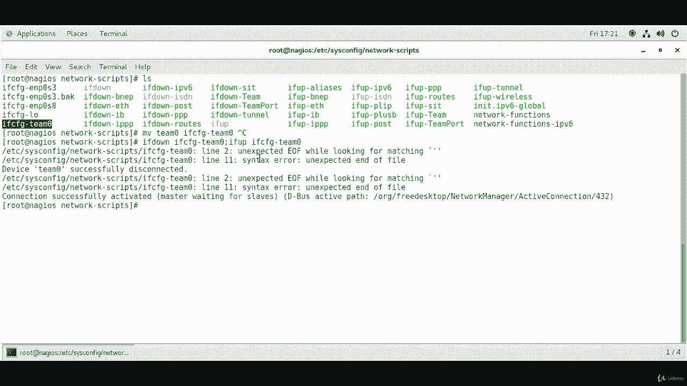
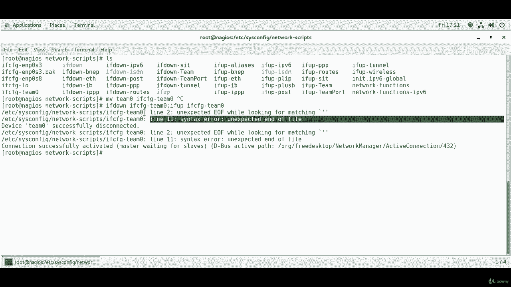
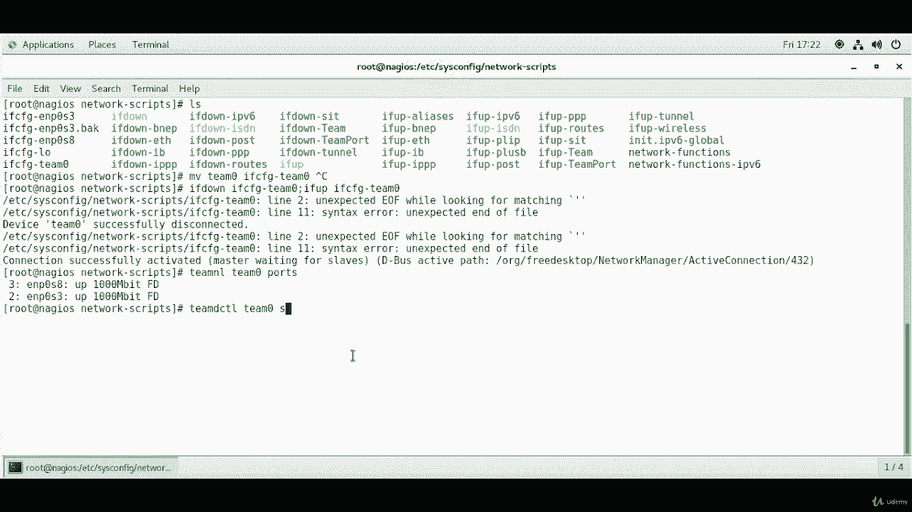
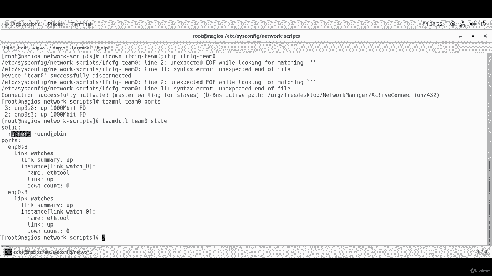
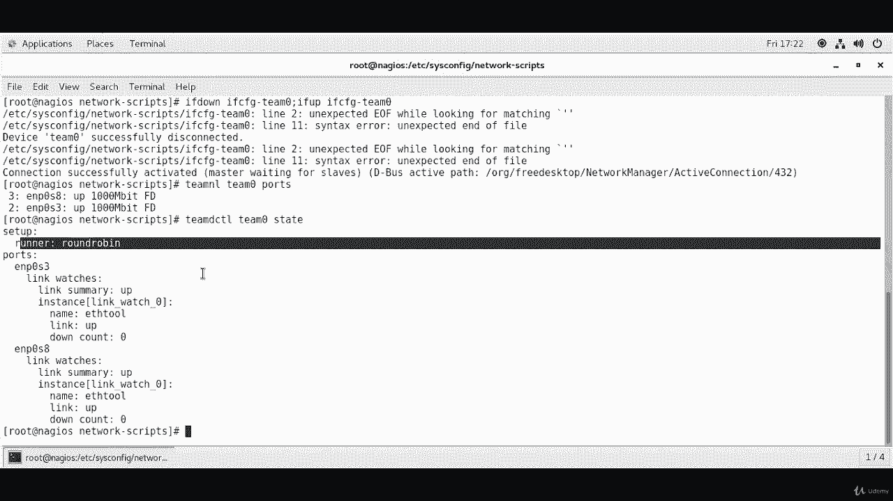

# [FreeCourseSite.com] Udemy - Red Hat Certified Engineer (RHCE) - 2018 - P10：2. Network Interface Teaming (Bonding)-----8. Team testing - 我吃印度飞饼 - BV1jJ411S76a

Okay， our next step is actually to restart the interfaces so they can take the new configuration。

 so the command for that is if down。And then， our interface is。

I've actually let me show you what I have done is we created a file called Team0。

 but in order to matchsh the rest of them， I have changed。

 I have moved the contents of it to ifFCfG hyphen Team0。

 So just do a move command if you have created a Team0 file and move Team 0 to ifFCf。G海if。Team zero。

 you just do that and remove everything from that file to this one。And。So。

What I'm going to do is if down。I F FG， dash。Team  zero。And then colon。And then if up。IFC of G。Team0。

That's going to stop and start the interfaces。 This's talking about a syntax error on line W 11。

 There is no line 11 in the file IFC IFCG dash team 0。 So I'm just going to ignore this error。

 I don't know what it's talking about。

Okay， the bottom line is our connection was successful。And。And that's all we care about。

Now we're going to go ahead and check the status and the command for that is Team and L。Team0 ports。

And both of our reports that we have changed。The two slaves。They are showing active and current。

And the next command I'm going to use is team。Team D CTL。Team 0。

State。And if you run this command， it'll show you the runner is round Robin。

The ports are the ENP0 3 and0 8。And the bottle links are up。And that's about it。

