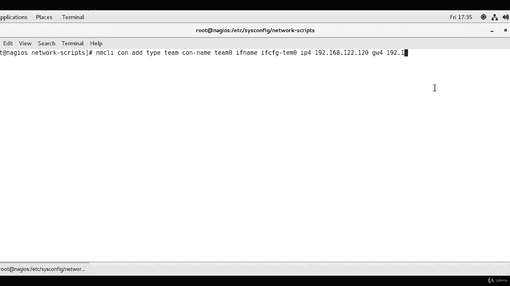
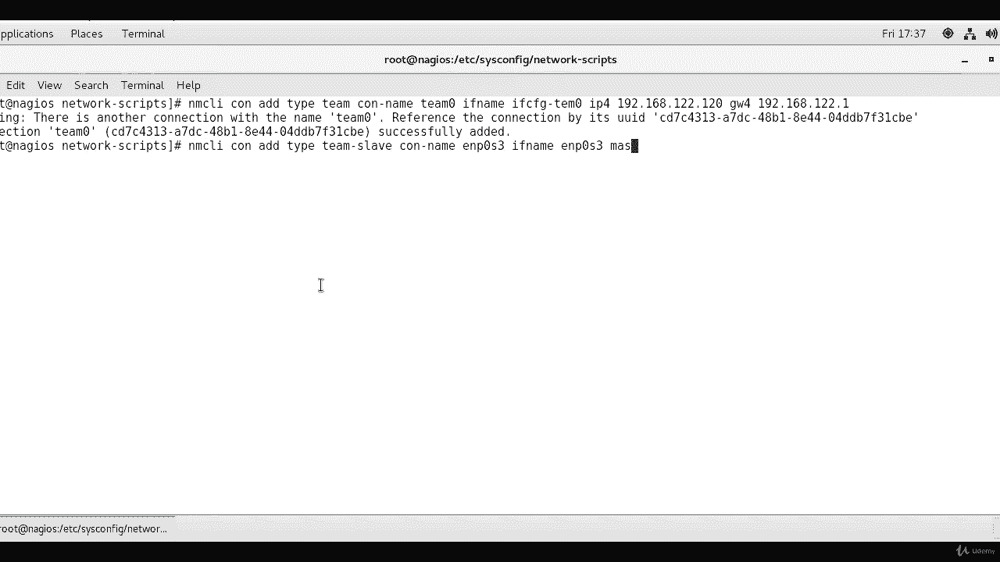
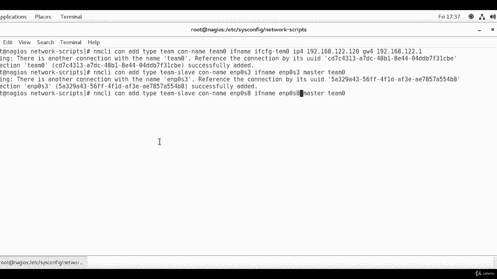
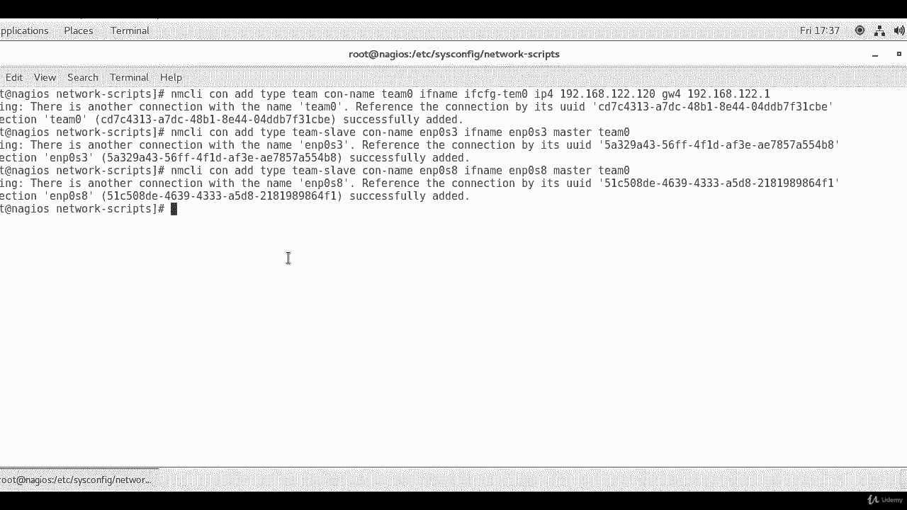

# [FreeCourseSite.com] Udemy - Red Hat Certified Engineer (RHCE) - 2018 - P11：2. Network Interface Teaming (Bonding)-----9. Using nmcli to create teaming - 我吃印度飞饼 - BV1jJ411S76a

Okay， so one last thing before we end this course is you can use NMCLI， which is network Manager CLI。

Tool to create teaming also， and you can add Team0 interface with IP address and a gateway。

 So we're going to do this in just one command line， So N MC CI。And M Ci。Carhan。Addd。Type。Tim。Kan。

Name。Team 0。If name。IFC of G。Tam zero。IP 4。1，92 dot 1，68， dot 1，22 dot 1，20。

And then the gateway configuration is going to be。G W 4。One night，2 do。1，68 dot 1，22， dot 1。

Is giving me a warning because I have already added Team0， but is still successfully added it。

 so the proper way to do it is to remove the one I added previously and then added from NMCLI。Okay。

 now we're going to add the two interfaces。N M， C， L， I con， add type。听。Team hyphen slave。Khan。Nam。

Yian p。0， S 3。If name。Yanping。😔，0， S 3。Master。

Team 0。Case can successfully add， but it gave me a reference again that。

I need to remove the previous one， and here I'm going to just change this to8。And。😔，Change this to 8。

And let me see if I need to change anything else on this。Thing rest。All looks good。

Okay， this one is created as well。So this command added the two interfaces as slaves to team zero。

And the file E I F C H G， E， N P S 0 S 3 and 0 S 8。And they are in the specific folder。

 the scripts folder that we are in right now。

So this is how you can either configure bonding or you can configure teaming。

Which is a new thing starting from centos 7 and RL 7， so you have now you have a choice。

 but the bond configuration is going to be deprecated eventually and so it's a good idea to use the team D demon and use the teaming configuration from here on。

Thank you。

