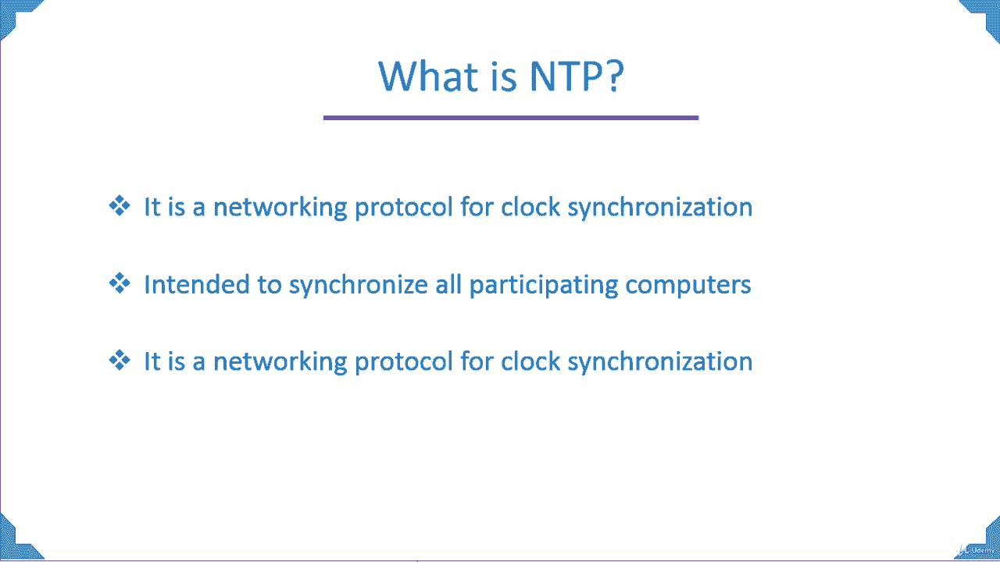
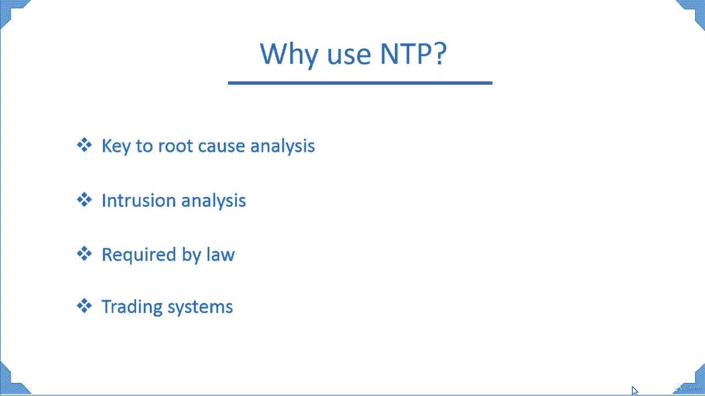

# [FreeCourseSite.com] Udemy - Red Hat Certified Engineer (RHCE) - 2018 - P12：3. NTP - Network Time Protocol-- 1. Introduction - 我吃印度飞饼 - BV1jJ411S76a

Hello students and welcome to NTP Network Time protocolcol in Red Hat Linux。

In this course， first we're going to discuss what is NTPR network Time protocol。

It is a networking protocol for clock synchronization。

What that means if you have more than one computer。In an organization。

 it is very important that the time is synchronized between those systems。

And this is the main reason why we need an NTP server in the environment。Or sometimes more than one。

NTP backup server。It is intended to synchronize all participating computers。

Because a lot of the tasks that these computers are going to be running that has that have to be run at the same time。

And if the time is not synchronized， one system might be running something。

 but the other one could be behind or ahead of that computer。And that can break stuff。

 That can break scripts， that can break crime jobs， backups。So that's why it's very important。

That an NTP。And in most cases， an in house NP server。Is installed in an organization。

It's a networking protocol for clock synchronization and it's one of the oldest networking protocol that has been around。

Currently， we are at version 4 of NTP。And got started back in the 80s That's when the first protocol call came in or the first version of NDP came in。

Why we use NTP？Is the key to root cause analysis。If you are in a support environment and issues happen with the system。

Your customers will come back to you and say， well， the system is back up。

 So thanks for doing a great job in bringing it back up。 But now we want to know why it happened。

So we can prevent it from happening next time in the future。

And they want a root cause analysis for that issue that occurred。And in that。

 one of the most important factors is at what time it occurred？So that way you can correlate it。

With any previous event。Or to check and see if something was done to the system around that time by the customer or by the support organization or something down the line may be one of the devices malfunctioned。

 One of the interface cards filled。And。Load balancing didn't occur properly。

 and there was a break in the service。 So these are the kind of things that are part of the root cause analysis that a customer would require and you have to come up with this and the time plays a big part in it。

Intrusion analysis， if your system has been attacked。

By an outside intruder or even an inside intruder。You have to know exactly at what time it occurred。

And that's also going to be。Very， very useful in troubleshooting it and preventing it from happening again。

It is required by law。 There are a lot of organizations， for instance， FDA that require companies。

To have a network time protocol or NTP server， and they get audited if they don't have it in place。

Another very important reason is the use with trading systems。Suppose if you have a stock market。

 let's say， for instance， Wall Street， it is trading not millions， probably billions of transactions。

Every second。And if you don't have the time synchronized on the systems that are running these transactions。

Your。Transaction are the trade。Could be delayed and because of that delay， it can cost thousands。

 probably even millions of dollars worth of loss。To a client。So that's why for trading systems。

 it's extremely important to have a network time protocol server in place。

