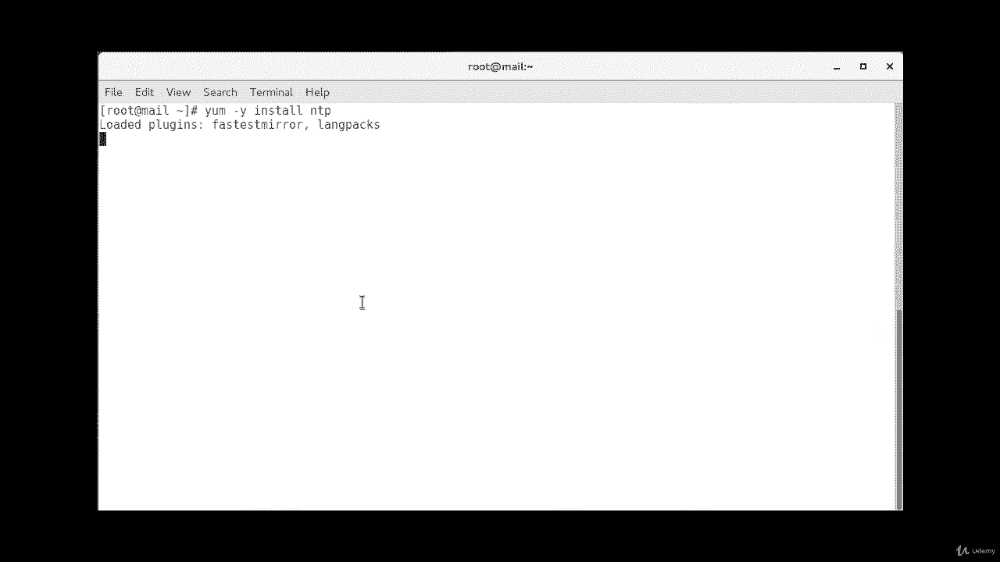
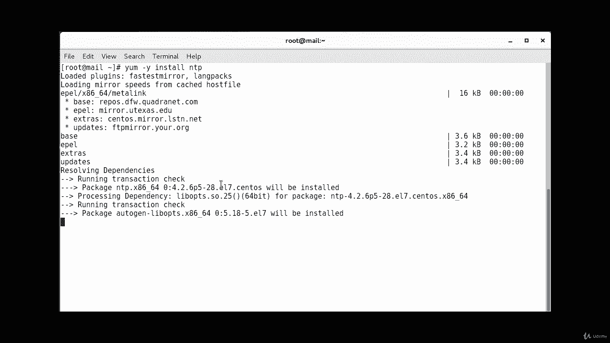
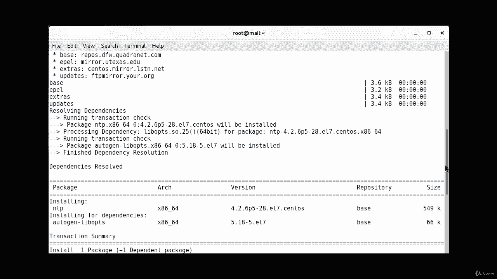
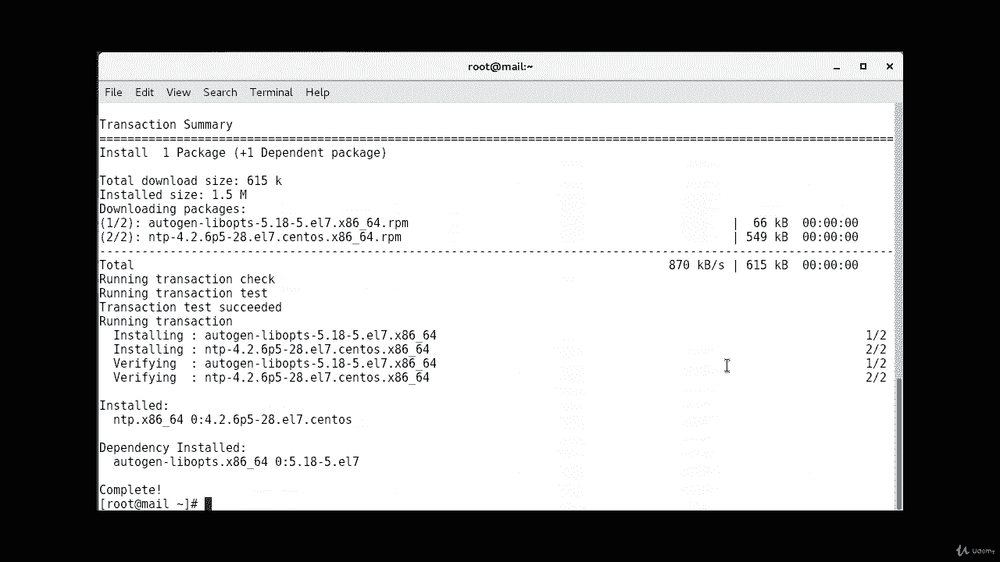
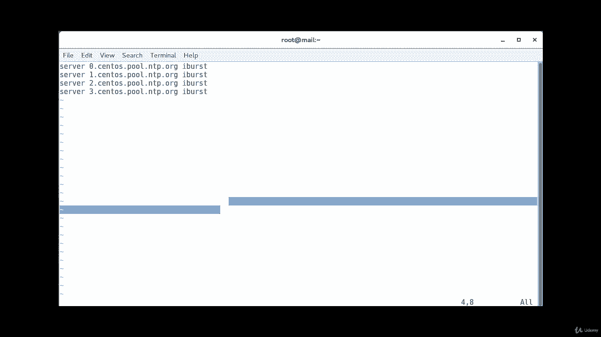
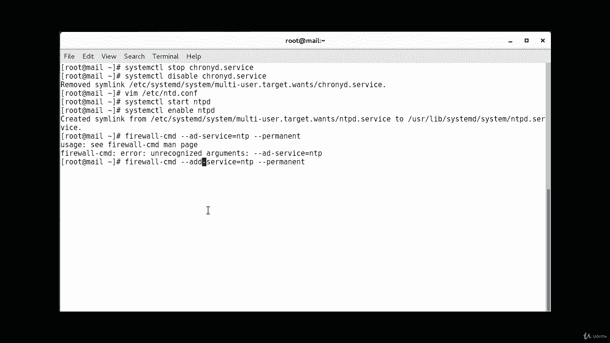
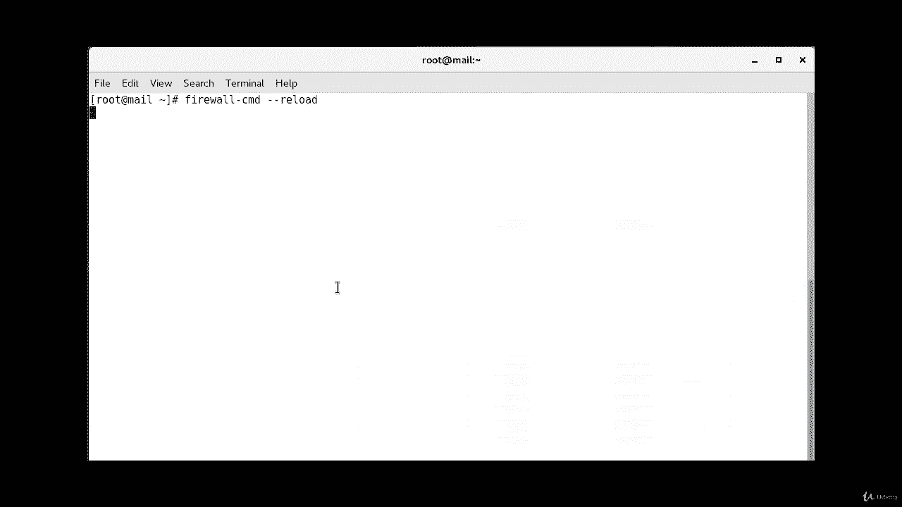
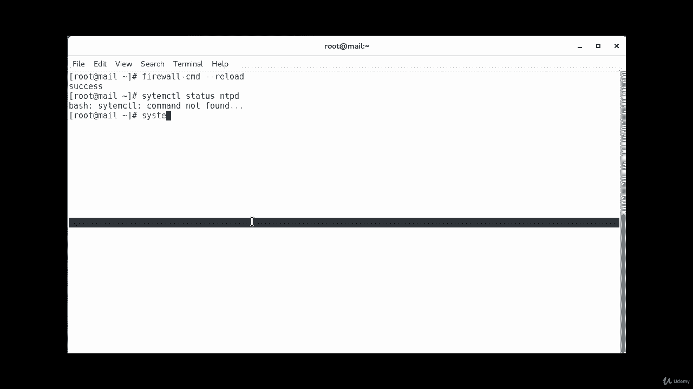
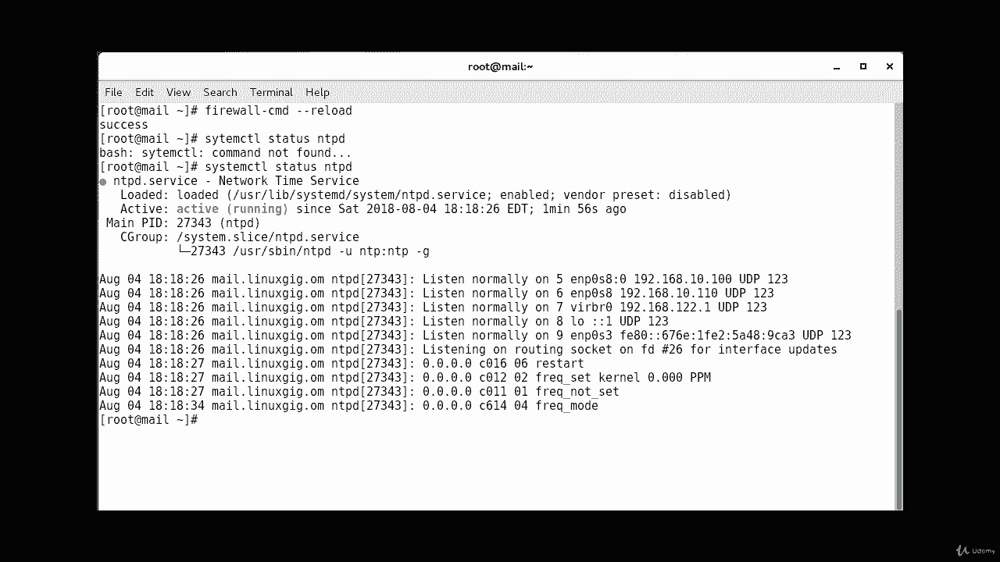

# [FreeCourseSite.com] Udemy - Red Hat Certified Engineer (RHCE) - 2018 - P13：3. NTP - Network Time Protocol--2. Configuration - 我吃印度飞饼 - BV1jJ411S76a

Okay， so now we are logged into our sentos server and we're going to start the installation。Of NTP。

First thing we want to do is check the currentest status of it。System CTL status。And T。Pili。And it'。

 as you can see， it's not found。 So that means it's not installed in the system。

K installing it is pretty simple。We'll do a yum。Dash why。Install。NTp。

Okay， it's already complete。

We clear this。Centos 7 comes with a package called Cony D。

And we don't want that to interrupt our NTP installation。 So we want to disable that。 So system。C TL。

Stop。Chronyd dot service。Okay， that is stopped and we want to disable the service as well。

System CTtL。Disable。Crony D。Dot service。Okay， says the link has been removed。

Now we're going to go to the configuration file of NTP， which is B I am' going to use BIM Ed。V I am。

Esy。NT P。Doc。Com。And we're going to put the service that we need in there。

So I'm going to put the servers that are available on the internet right now。

 I am not using any internal server。So， sentos dot。Pu。😔，Dot NTP。torg。And use a switch called Ibu。

And then we'll put server number。Second server， but it's numbered as one。Sentosos dot。Pool dot NTP。

Dot org。Okay， I'm going to escape and I'll do a YY P to copy it， and then。Just change this to two。

Then I'll do the same thing again。Copy this and we're going to go one more。

And replace this with the three。This is of our file。

The configuration file that's going to be read。Okay， now we're going to enable and start NTP。

The way you do it is system CTL。Start。NTPd。Started。System CTL。Enable。NTPD。

So that way it will sustain even after reboot。And we want to allow。NTP in the firewall as well， so。

Farwall。Dash cd。Dash， dash， add。Dash service。Dash。Equals Np。Dash， dash。Oh， I'm missing 1 D。

 that's why。

Okay， that was successful。Now， since you've made a change， we're going to reload the firewall。

 so firewall。CmD。Dash， dash， reload。

And then you can verify the status of it。S。

And as you can see， it is active。And running。

