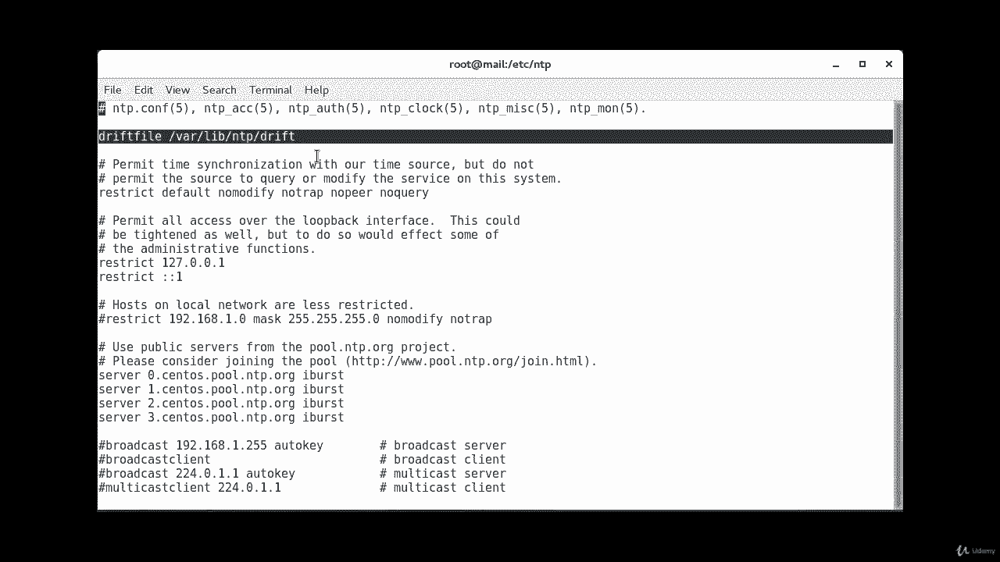
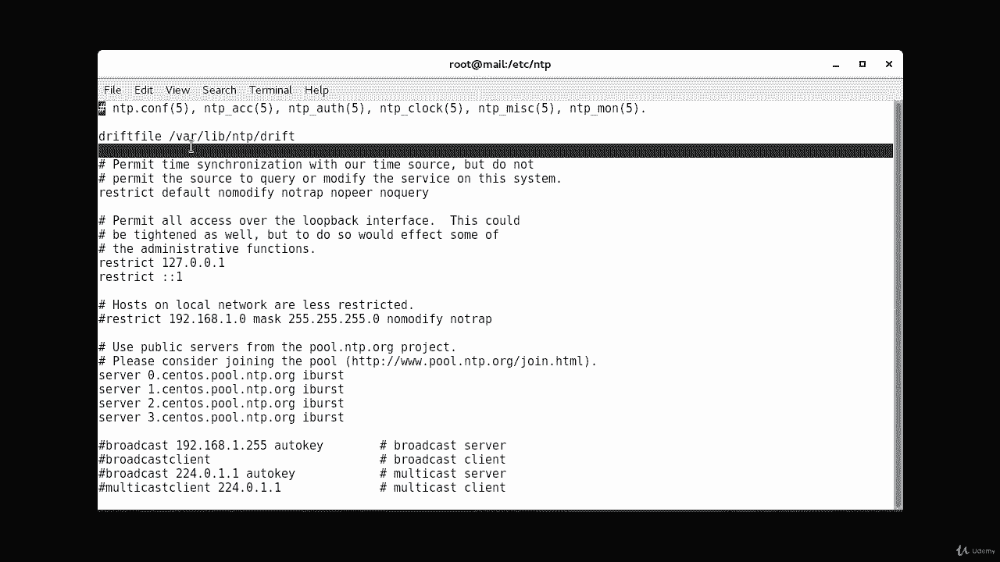
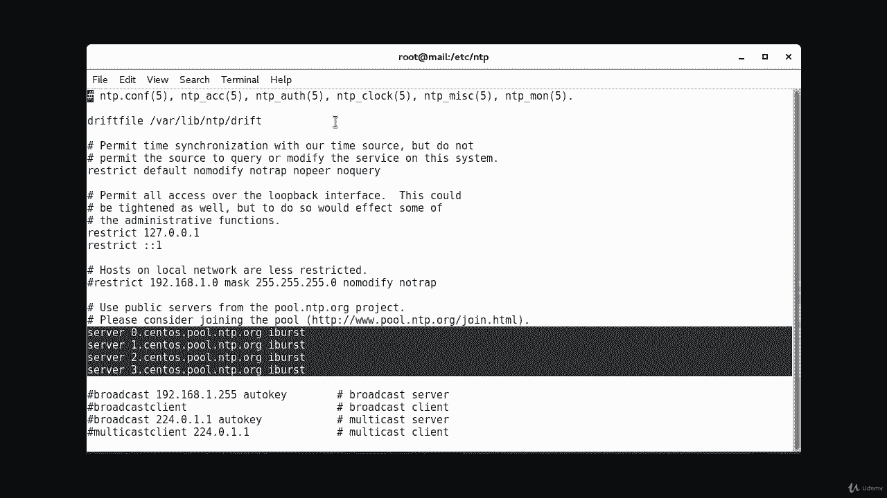
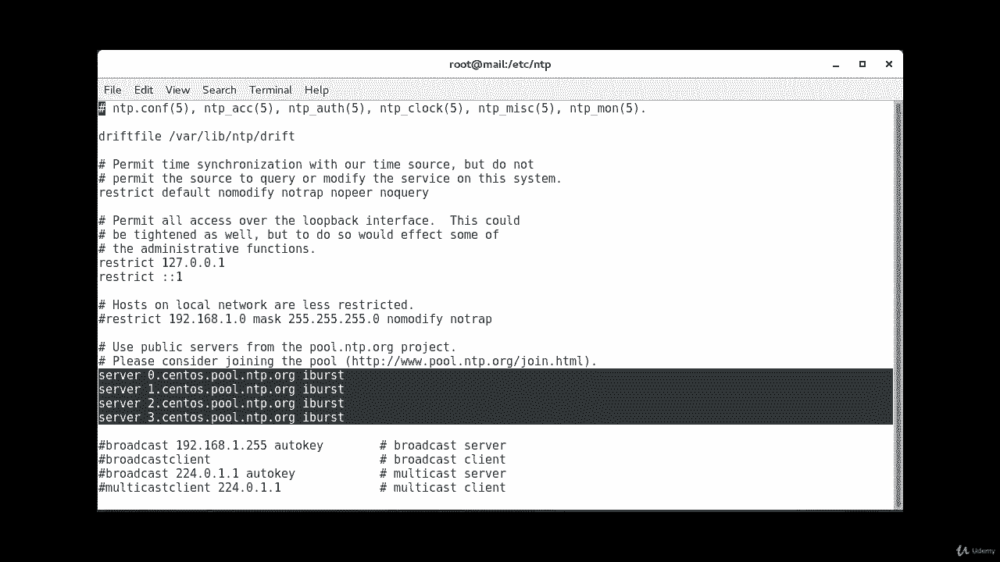
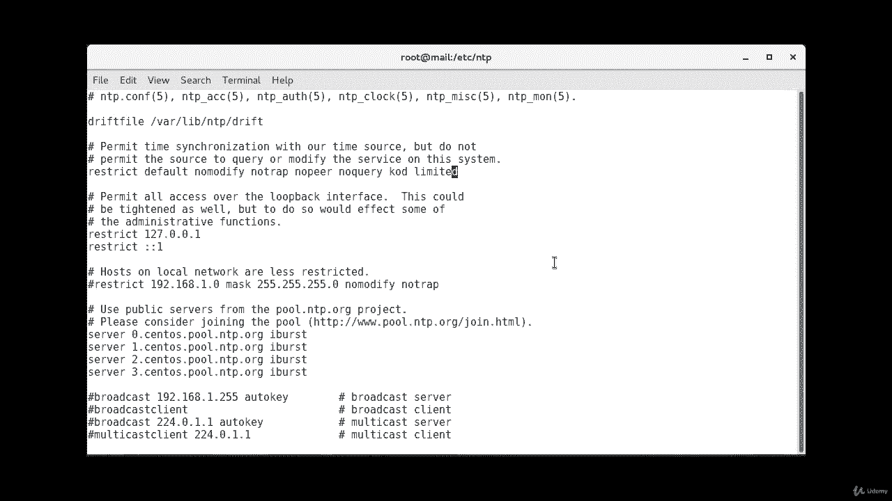
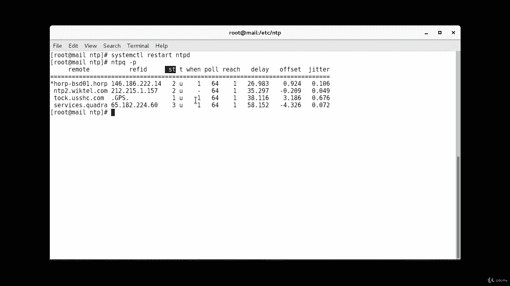

# [FreeCourseSite.com] Udemy - Red Hat Certified Engineer (RHCE) - 2018 - P14：3. NTP - Network Time Protocol--3. Configuration continued - 我吃印度飞饼 - BV1jJ411S76a

Hello students。 So in the。At the NTP。com file， make sure there's a line that says driftfiile/V/libe/ nTP/ drift。

A drift file stores the frequency offset between the system clock or running at its normal frequency and the frequency required to remain in synchronization with correct time。

 it helps to achieve a stable and accurate time and you should find this at the top of your configuration file and default installation so I have the default installation I haven't changed much except adding these servers here。

 so that's why it should be there if not then make sure you add it there。

If there are any default servers in there already， make sure to remove those before you put new servers in。

And。One of the things that we have used in here is called eyebut。

So we use the IBt option， which is right here， IBrst option for each server part the NTP pool recommendation。

And that way the server is unreachable， this will send a burst of eight packets instead of the usual one packet using the burst option in the NTP pool project is considered abuse as it will send those eight packets every pool interval。

 whereas iBs send the eight packets only the first time， so that's the difference。Also。

 you'll find a line that will say restrict is also should be there by default。

So what that does is you have to make sure that the default configuration does not allow management queries。

 so if you don't， your server could be used in NTP reflection attacks or could be used for vulnerable to NTPQ and NTP DCC queries that attempt to modify the state of the server。

So you may have to make sure you check that there is。Right here。

There is a no query option is added to the default。

 and also make sure you add the options K O D and limited as they restrict to eagerly asking clients and force rate limiting so we don't have those。

 We can add those K O D and。Limited。调啲。Liiting。Okay， and after this。

 we're going to go ahead and save and quit。

Clear this。And now we're going to restart the NTP service and let our time server synchronize this clock to the upstream service that we just configured。

 So the command for that is system， CT TL， restart。In。TPd。So after a few minutes。

 we're gonna check the health of the time server with the。NTPQ command。With the dash。The option。

So in here， the remote column tells you the host name of the servers that NTP demon is using。

 So this is the server。 or these are the servers and the。

Refi this field right here column tells you the source the services are using。

Case of the IP address that's the source。So for Stratum1 servers。

 the reffi field should show GPS and PP。A T S or PTB。

 and Stratus 2 and higher servers will show the IP address of the upstream server。The S T column。

 which is this right here， shows di stratum and delay offset and jitter。

 It tells you about the quality of the time source。LL values are better for these three peels。

