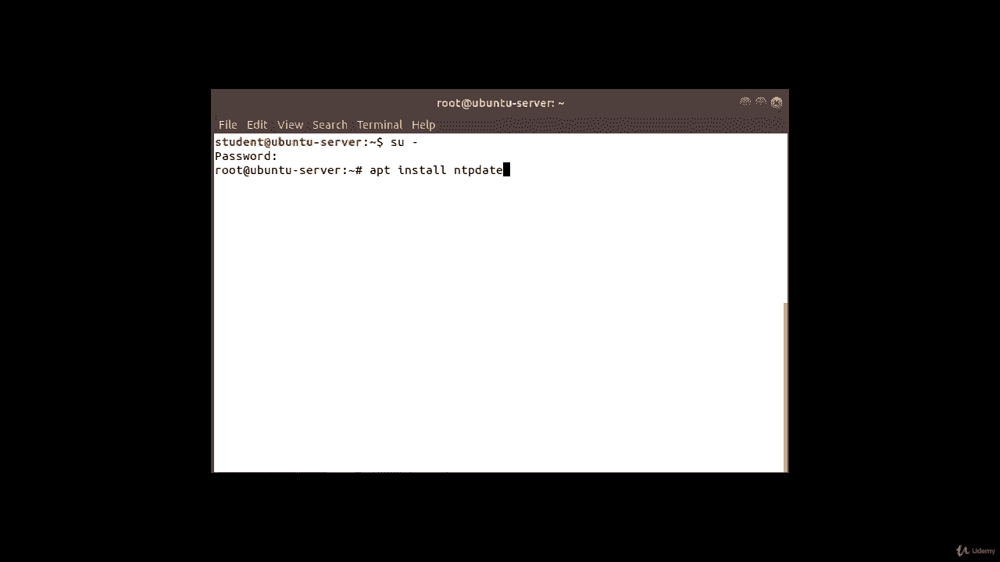
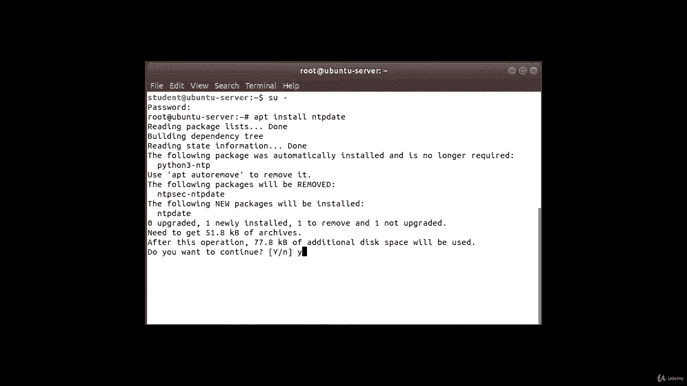
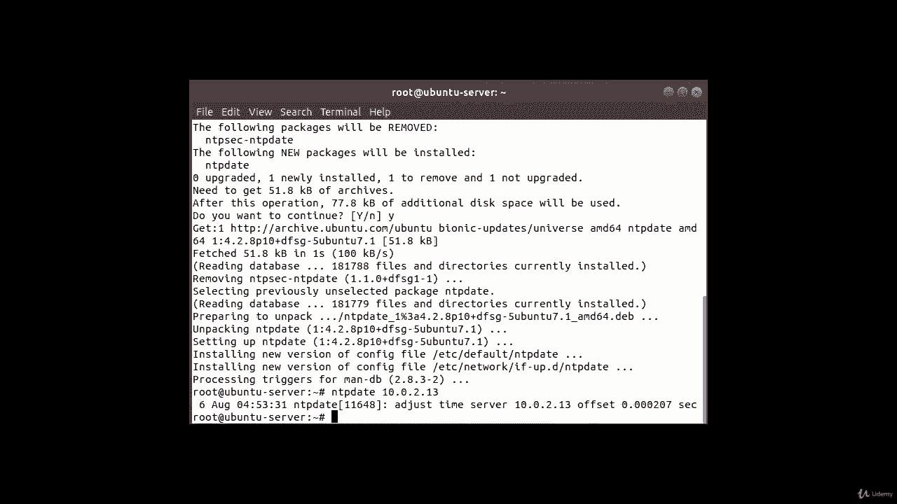
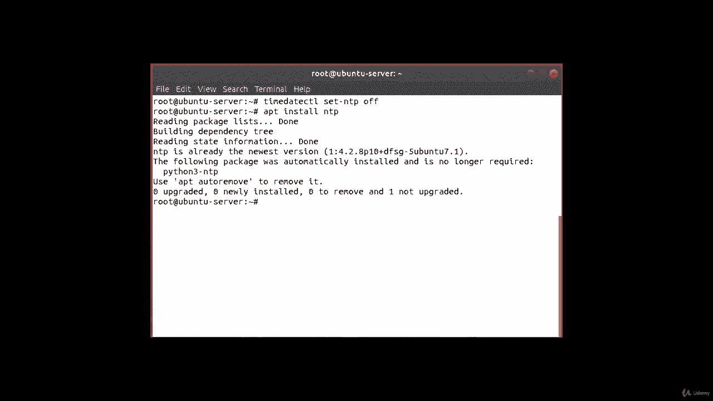
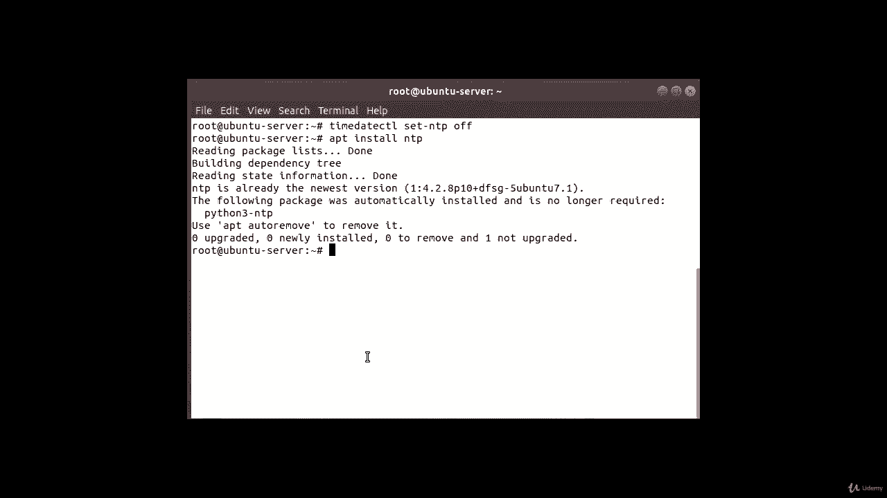
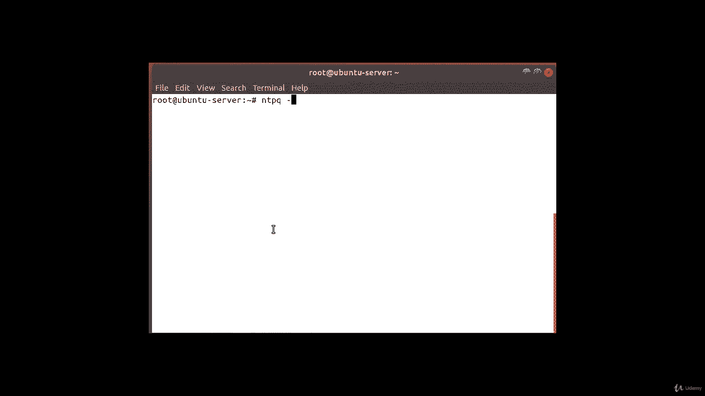
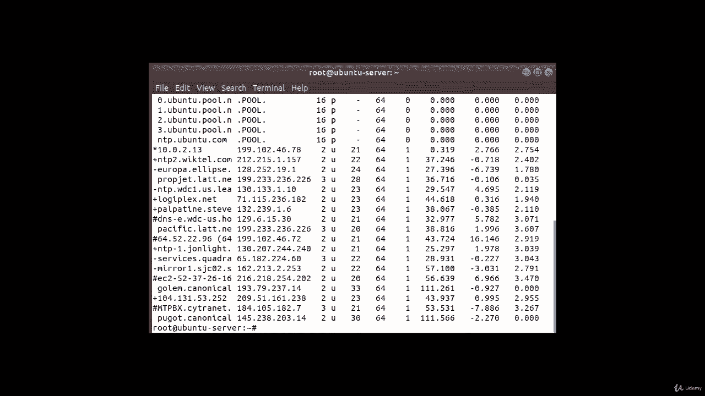
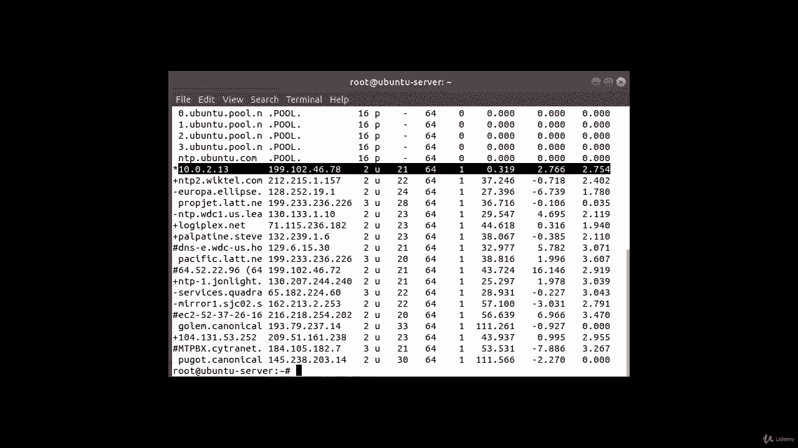

# [FreeCourseSite.com] Udemy - Red Hat Certified Engineer (RHCE) - 2018 - P15：3. NTP - Network Time Protocol--4. Client configuration - 我吃印度飞饼 - BV1jJ411S76a

Okay， now in this section， we are going to install an Uuntu client and which is going to sync it time with our centos。

AndT P server。Okay so in order to do that， first we can install a software。

 most probably solid installing my system， but I'll show you。

 you can either use Suu on Utu or if you have S are super user configured。

 then you can use that in order to log in。And then。Apt。Install。NTP date。

That's the application you need to install。I don't have it installed， though。

mna say， yes。Okay， it is installed now。And now I'm going to try to sync with my NTP server and since I don't have DNS installs。

 I'm going to use the IP address instead of the host name of the machine。

And the command for that is NTP date。And then my I P address，10 dot0 do2 dot13 is the I P address。

And I'm going to try to sync it with my server。And as you can see。

 it has it's showing the NTP update and just a time server is this， and this is the offset value。

Okay， the next step is to disable the default Uuntus system D time sync de service。

 and the way you do it is first let's clear this and then were going to do time。

Date。Ctl。Set。NTp。off。With the Time syncy D disabledable。

 we will now install NTP De and set our own configured NTP server as a preferred NTP server for the time synchronization。

In order to do that， will first。Install。NTP。it's already we have the newest version。

 so I guess it came default on the open to server。Next。

 what we're going to do is configure NTP demon to use our previously configured NTP server resolved via the NTP host name Okay so the following Linux command will set NTP。

As a preferred NP time synroization service。 So the way we do that is。

Hash， oh， sorry。Ro hash。Bash。Dash sea。Echo。Server。10 dot，0， dot，2 dot。13。Prefer。I burst。

And we're going to direct it to。Let's see。NTP dot。Kong。Okay， done。

 And we're going restart the service。 So service。NTp。Restar。And then we're going to use NTP。

 Now we're going to use the NTp Q command to list the NTp time synchronization queue。

 and its command is NTP。Q。Dash P。

And as you can see， our sub is here。The 10 do0。2。13 that we just configured。

Along with the list of all the other service。But it's got a star right next to it。

 That means that's our preferred server。

