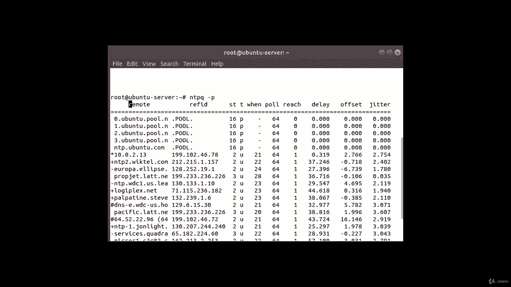
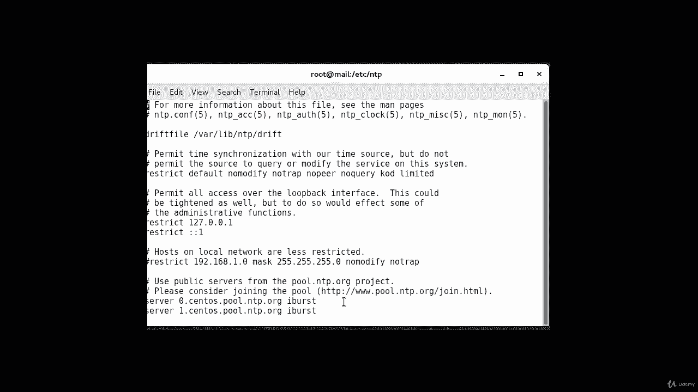
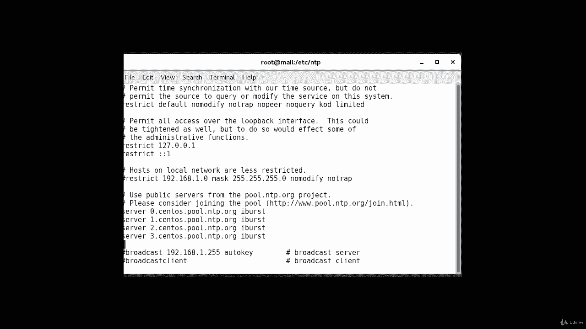
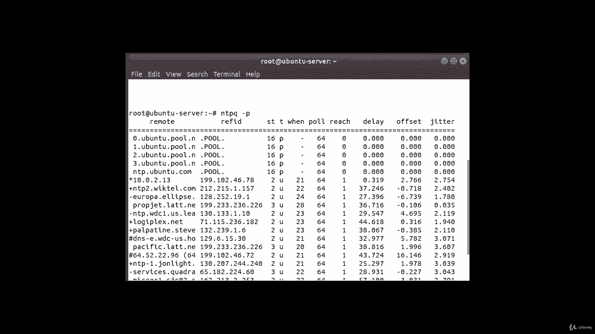

# [FreeCourseSite.com] Udemy - Red Hat Certified Engineer (RHCE) - 2018 - P16：3. NTP - Network Time Protocol--5. ntpq command output interpretation - 我吃印度飞饼 - BV1jJ411S76a

Okay， so in this lecture， I am going to go over these values here。

So you can better understand these commands， the NTPQ command column output。

And so we'll start off with remote。The remote， which is right here。

 is the remote service you wish to synchronize your clock with。In our case， that's my sentos server。

Then the next one is RefID。And that's the upstream stratum to the remote server for stratum。

 one server， this will be the stratum 0 source。 So if you remember， we had in our。Sent us machine。

 let's take a look over that。

So， these are the。Upstream stratum that we are talking about the server0cents。pool。nttp。

org and goes from zero all the way to three in my case。

But I can add one more after that。

Now the third column here is ST thats the stratum level， which goes from 0 through 16。Okay， so0，1，2。

3 goes all the way up to 16。T is the type of connection， can be U for UniIcast or Mancast。

 B for broadcast， T or multicast。And I for local reference clock， S for symmetric Pi。

 a for manycast server。And B for a broadcast server or M for a multicast server。

And since the first four are belong to a pool， that's why you're seeing P over here。

The next one is when， when the last time in the server was queried for the time and the default is seconds。

 or M will be displayed for minutes， H for hours and D for days。Again。

 the next one is poll how often the survey is queried for the time with a minimum of 16 seconds to a maximum of 36 hours。

It's also displayed as a value for a power of two， typically between 64 seconds and 10 24 seconds。

Okay next one is reach this is an8 bit left shift octa value that shows the success and failure rate of communicating with the remote server SX means the bit is set。

 failure means the bit is not set 377 is the highest value。Next one is delay。

 this study is displayed in milliseconds and shows the round trip。Time or RTT off your computer。

 communicating with the remote server。Next one is offset。

 this value is displayed in milliseconds using root mean squares and shows how far off your clock is from the reported time。

The server gave you it can be positive or negative。Okay， so for the first five， as you can see。

 there is no difference， so there is no offset and then on some of the server is higher and some it's negative。

And the last value is a jitter， This number is an absolute value in milliseconds showing the root mean squared deviation of your offsets。

