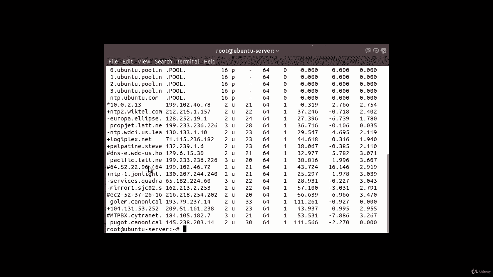
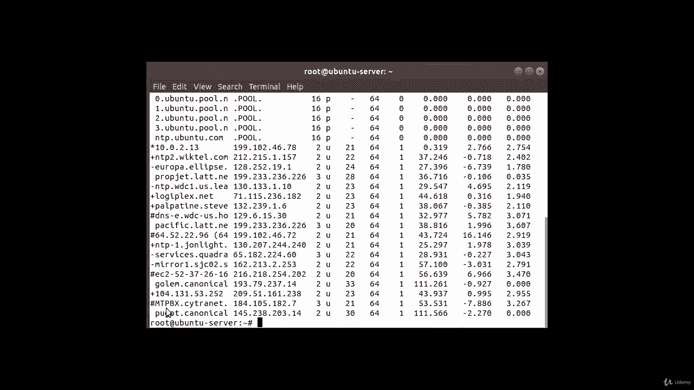

# [FreeCourseSite.com] Udemy - Red Hat Certified Engineer (RHCE) - 2018 - P17：3. NTP - Network Time Protocol--6. ntpq command output interpretation continued - 我吃印度飞饼 - BV1jJ411S76a

So in this lecture， we are going to talk about these things right here at the leftmost side。

 these symbols that youre seeing， the alpha are the characters that you see here。

And we're going to start off with the asteriskx， as this one is the asterisk and it says the current system here。

 that's what it means the current system here， the Comp is using this remote server as its time source to synchronize the clock because I made sure that this was the preferred server because that's my centized server。

That we can configured earlier as an NTP server。

The plus sign we see here right here is included in the combined algorithm。

 this is a good candidate your current server we are synchronizing with is discarded for any reason so you can think of it as a backup server if this one doesn't work。

 then this one is automatically going to take over。

Then we're going to look at this dash R negative。

The symbol is discarded by the。Cluster algorithm。

So it's not getting counted。

The next one is the hash sign。 The hash sign is a good remote server to be used as an alternative backup。

 This is only shown if you have more than 10 remote servers， and you obviously have more than 10。

And there are a couple of others you might see an O which is a pulse server second or PP peer。

 this is generally used with GPS time sources， although any time source delivering a PP will do this telecode and the previous telecode which is asterisk will not be displayed simultaneously。

 that's why we are seeing the asterisk but not the zero。

You may also see an X。And which means discarded by the intersection algorithm。

