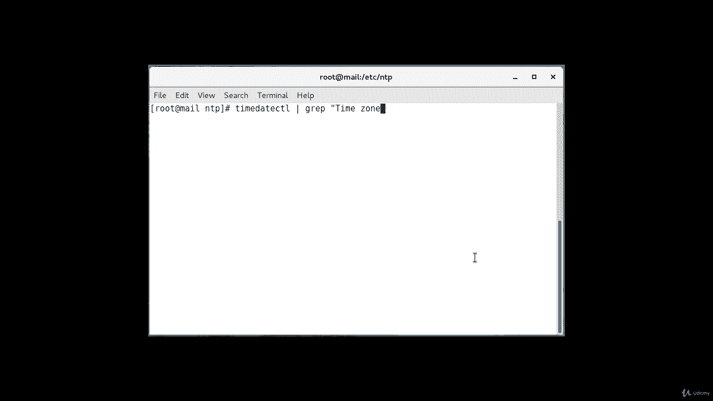
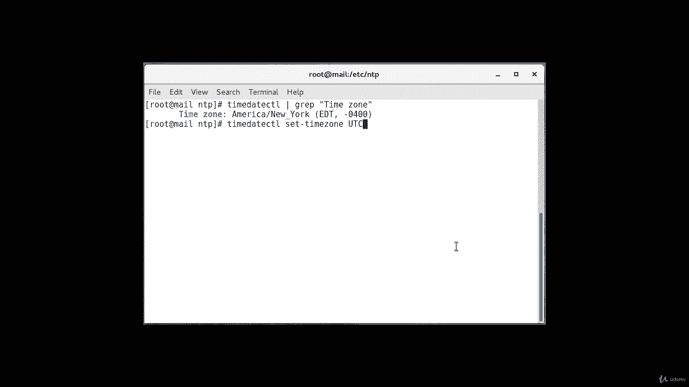
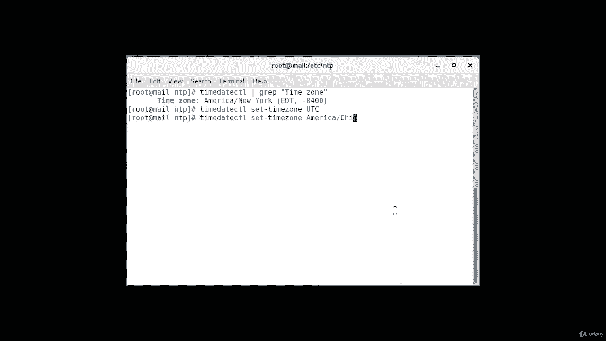
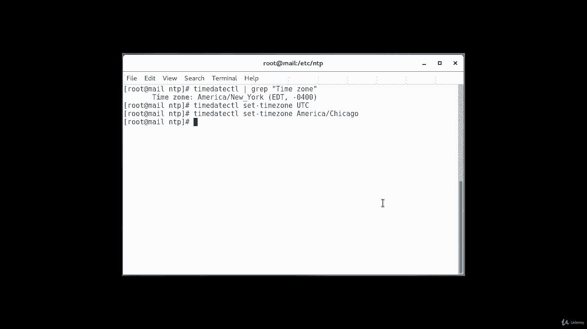
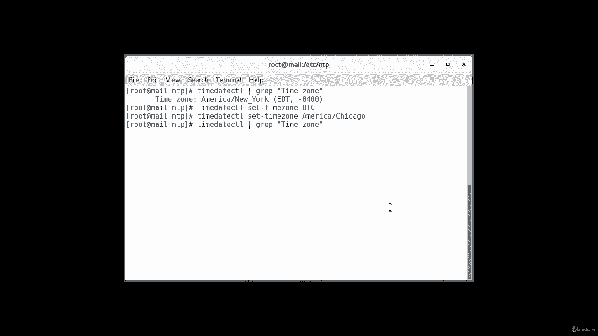
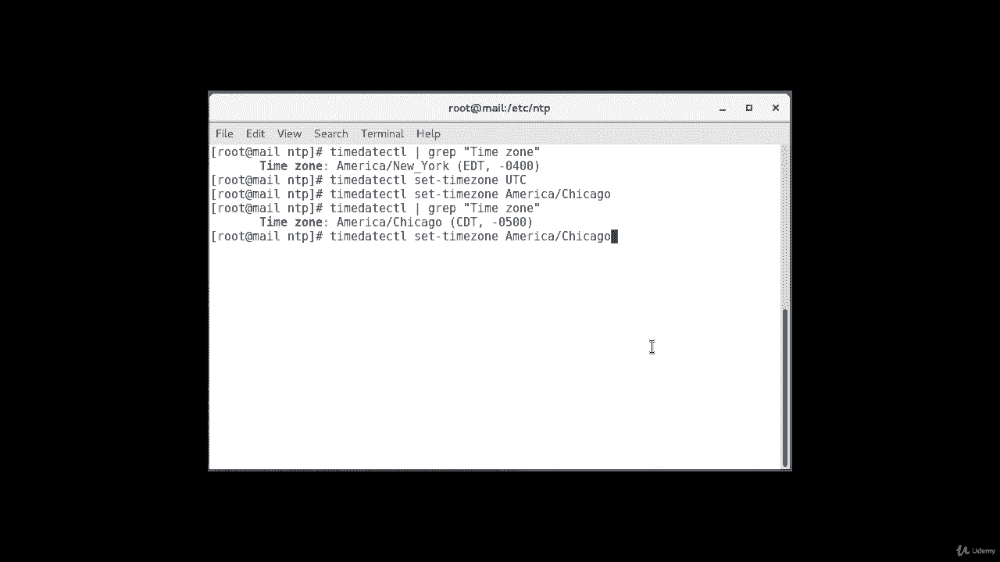
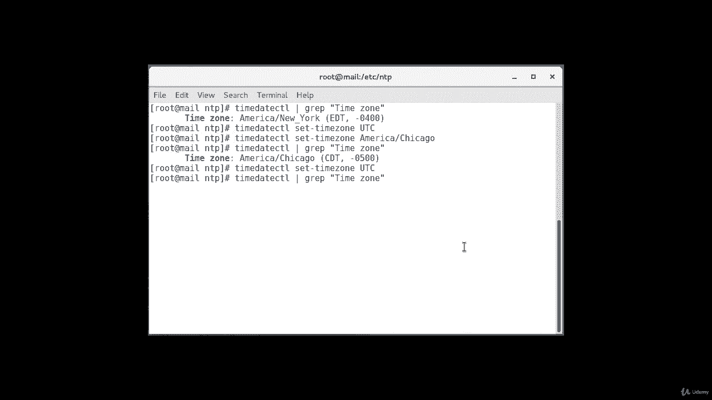

# [FreeCourseSite.com] Udemy - Red Hat Certified Engineer (RHCE) - 2018 - P18：3. NTP - Network Time Protocol--7. Times Zones - 我吃印度飞饼 - BV1jJ411S76a

Hello students， so first thing before that you need to do before installing and configuring NTP server is to set up correct time zone。

By using the time zoneone CTL command that you can get information about your current time zone。

And the way we do it is time。Date， CTL。TheG。And then encodes time。Zong。

And it'll give you the time zone that that is currently set up like on my machine。

 it is although it's incorrect， I'm not in that time zone。

 but that's what's set up by default when you install a new sentos machine。

So you need to decide which time zone you want to use I as stronglyly。

 I would recommend using UTC or universal time clock as a time zone。

 Some servers are configured to a particular time zone like mine is right now。But you should use UTC。

That has more accurate time。And so it will have some downsides。

 especially when you have to translate output update date command to your local time zone。

 then of course you have to switch。Or subtract hours or add hours depending on where you are in order to translate to where your local time is。

So in order to set the time zone as UTC， we're going to execute this command。Time， date， C， T， L set。

Tanzong。And then all caps UTC。

If you want to stick to your local time zone， you can use replaceplace UTC in command。

To one of the options from from this command。 So like you'll read。You'll type a date。Time date， C TL。

Set。Time zone。In my case， I will do。America。Slash。Chicago。I'm in the central time zone。

Okay， now my time zone is set。

And if I were to run。This command again， you can see my time zone is set to Chicago。

But I want to go back to the UTC time zone。

And let's check again。

And I'm you now。