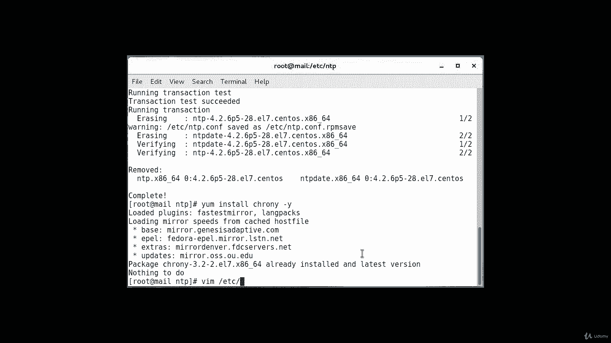

# [FreeCourseSite.com] Udemy - Red Hat Certified Engineer (RHCE) - 2018 - P19：3. NTP - Network Time Protocol--8. Using chrony - 我吃印度飞饼 - BV1jJ411S76a

Hello students， so one more option that we have beside NTP。Is to use cronies which is CHRO and。

And it's also one of the tools that you can configure time synchronization with on a server。

 One thing you have to make sure about that you have to remove NTP if it's already running on your system。

 So in this lecture， we are going to do just that。And the way I do it is yum。Remove。NTP。NTP date。

Dash why。And it's going to remove the current installationulation of NTP。

It's complete， so once you' show you don't have NTP installed， make sure that cronny is installed。

It should be installed by default but it's nice to check if it's there。Yum， install。

Cnie。Dashhu。

Okay， packet is already installed， there is nothing that we need to do now we need to configure pooling from external NTP server and just like we did in the previous examples。

 we're going to use the pool。nttp。 ag for that purpose。Okay， so in the previous example。

 the way we use et C s NTP dot com in this one， we're going to use slash ETc s crny do com。

 So let's log into that。B I am。At sea。

Cronny dot com。Okay and。I have my。Sentos pools which are already configured here。

 but you can replace it and so。

Let's go ahead and delete these。

And I'll put in server。0， dot。Pu。Dot。And T P。Dot4 Rg。I burst。

And then I'm gonna just w wipe up， sorry。

Yyp。YY p。I want just four servers， why why。

YY P just copies basically。 And what I'm going to do is then go back and change these numbers here。

R 1， R replaces it， R 2。R 3。

Okay， and。You're going to save and quit。

And once that part is done， then just like any other service， you have to restart it。 So system。

 C TL start。Or let's do a restart。Cronny。D dot。Service。And I also want to enable it。So that way。

 at boot time， it'll start automatically。 I don't have to manually go in and do it。Okay。

 that's created。And now we have just configured using it crony D。

And the way you can check are the status of the server is like this。There are a couple of commands。

 You can run。

Crony。And this will give you your current。Reference ID， the stratum number three。And reference time。

 system time。Frequency。Rude delay， leap status。Update interval is 1。4 seconds。

And another thing that you can check is。Cronny sea sources。

Dash v。I'll give you the sources that we have available。

These are the。These are the I addresses， name and I。

