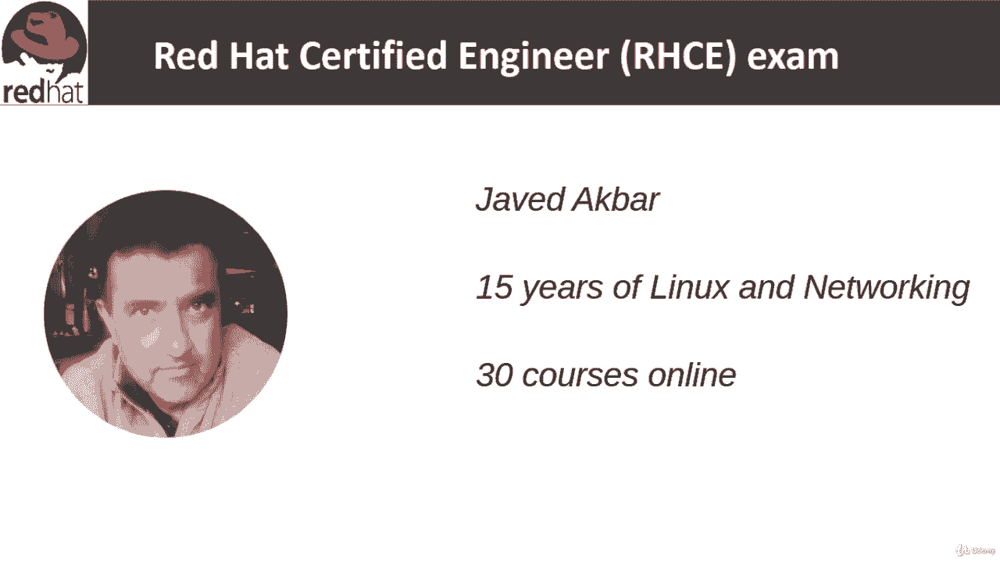
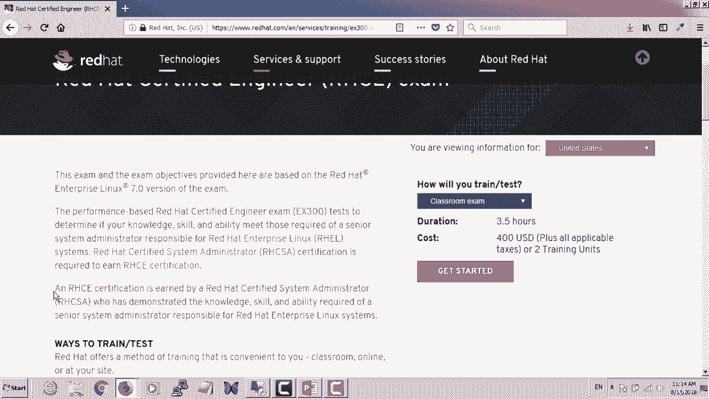

# [FreeCourseSite.com] Udemy - Red Hat Certified Engineer (RHCE) - 2018 - P1：1. Introduction-----1. Instructor and course introduction - 我吃印度飞饼 - BV1jJ411S76a

Hello and welcome to Red Ha Ctified Engineer course。 My name is Ja Dkbar。

 and I will be your instructor in this course。 I have over 15 years of Linux and networking experience。

😊，And I have over 30 courses online。

I'm currently logged into Red Hat's website， which has the information about the exam。

This is a performance based exam， and the duration is three and a half hours cost as of August 2018 is 400 USD。

And the test number is EX 300。In the test， it determines if your knowledge。

 skill and ability meet those required of a senior system administrator responsible for red hat。

Enterprise Linux。 So this is a senior level course。 You are expected to have passed RHCSA。

 which is the certification prior to this one。 And I have a course on that as well here on youudemy。

 RH CSSA。And you have to have passed this and of course you're going to learn a lot that itself is a pretty challenging exam RHCSA。

 and then RHCE is a little bit more。Challenging。Compared to art CSA。

 because you are expected to be a senior level system administrator。 So in this course。

 I'll do my best to make sure that you have all the tools that you need in order to pass this exam。

And we're going to go over all the exam objectives in the next couple of slides。

