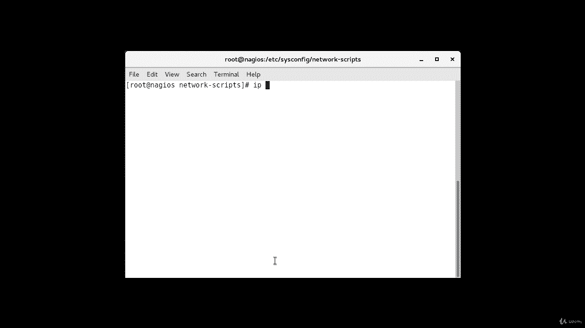
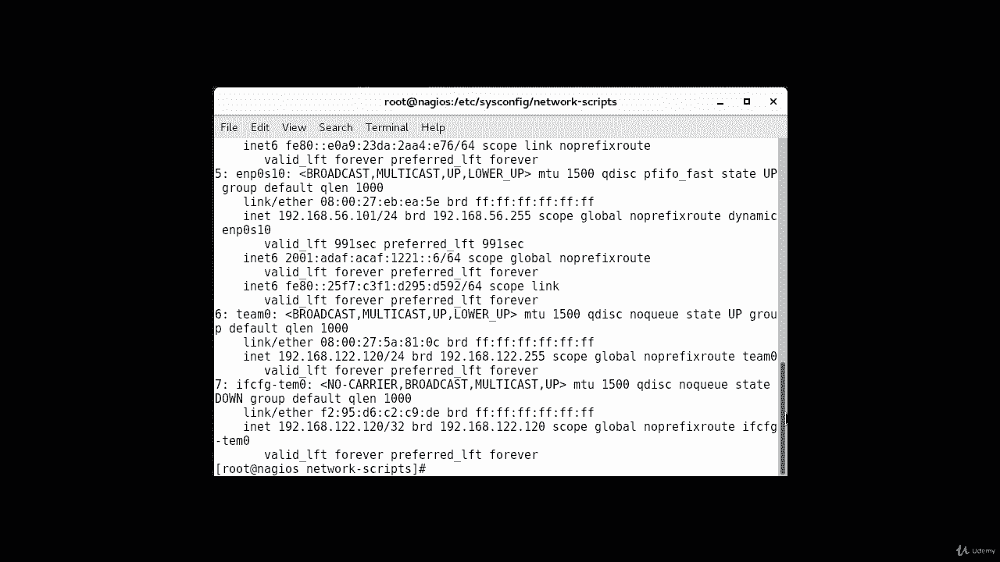
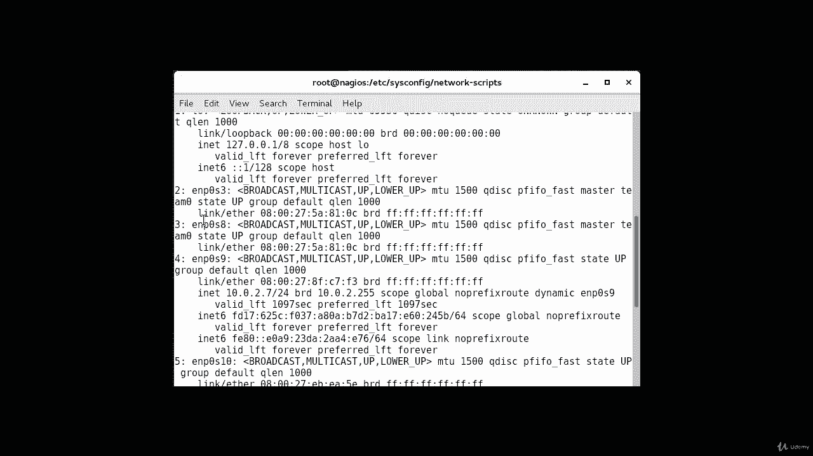
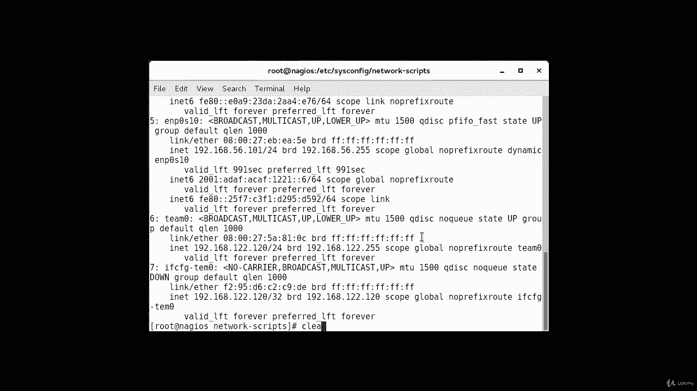
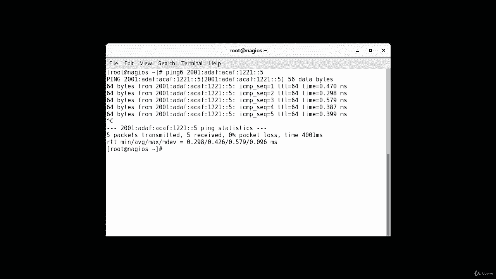

# [FreeCourseSite.com] Udemy - Red Hat Certified Engineer (RHCE) - 2018 - P20：4. IPV6----1. IPv6 using nmcli - 我吃印度飞饼 - BV1jJ411S76a

Hello students， in this lecture I am going to configure IPV6 addresses on two machines and then we're going to check our connection by pinging each other each of those machines。

So the first thing I'm going to do is check the current IP addresses。

And these are the dies that are currently configured on my machine。

I'm going to use E and P 0， S 8。

For this。So， let's start。

The command I'm going to use is network manager CI。Connection。

And I'm just taping it to complete the commandal。The system already knows connection name。

 and let's call it test。Interface name。And EN P0 S 8， in my case。Type。Eternet。IP 6。

And then the actual IPV 6 address， I'm just going pick one random one， AD D A F。Coin a AF。Colon，1221。

 Col colon。Let's see this one is。5。Slash 64。K successfully added， the next command is NMCLI。Device。

Connect。E and P，0， S 8。Okay， that is also connected， and the last command is NMCL I connection。

Connection。U。Test。Okay， that is connected now we're going to go to the other machine。

And we can run similar commands there also。So， NmCI。Connection。Add。Connection。Name。Test。If name。

Yanpe。0 S 8。Type。Eternet。IP 6。2001。Colon A D， A F， Col A AF。Colon。1221。Cun cornn。7，64。Connected。

Nm CI。Device。Connect E， N P，0， S 8。And the last command is NM CI。Connection。Up test。Okay。

 that connected now。Let's see if I can p from here。Ping。2001， colon。A A F。Colln af。Colon 1221。

 Co corn， and the other machine is 5。 Okay， now we' gonna go ahead and just。

Test with a pink men to make sure that we can pink。The the machine。So on my first machine。

 I'm going to type， I always make this mistake supposed to be ping6。

 Otherwise it's not going to work。 It's going to give you an error。 And then our IP address is 2001。

 Col， AD D AF colon。Af。Colon 1221。Colin， Col 7。That's the IP address。 And as you can see。

 it's successfully pingy。Now， from the other machine， were going go ahead and。Ping。5。2001。2001。

 colon。A， D， A F， column， A A F。Colon 12，21， colon。five。And you can p。 We can p both ways。

So in this lecture， we have showed you how to use。Network Manager CLI to configure IPV6 addresses。

 and we have tested them once they' are configured。

