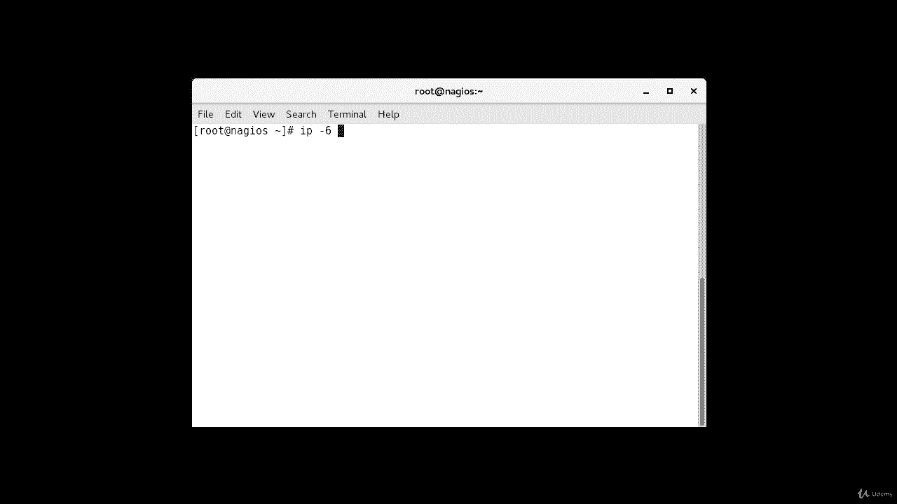
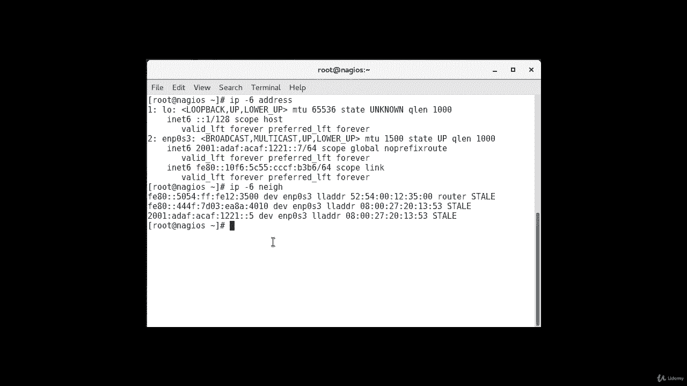
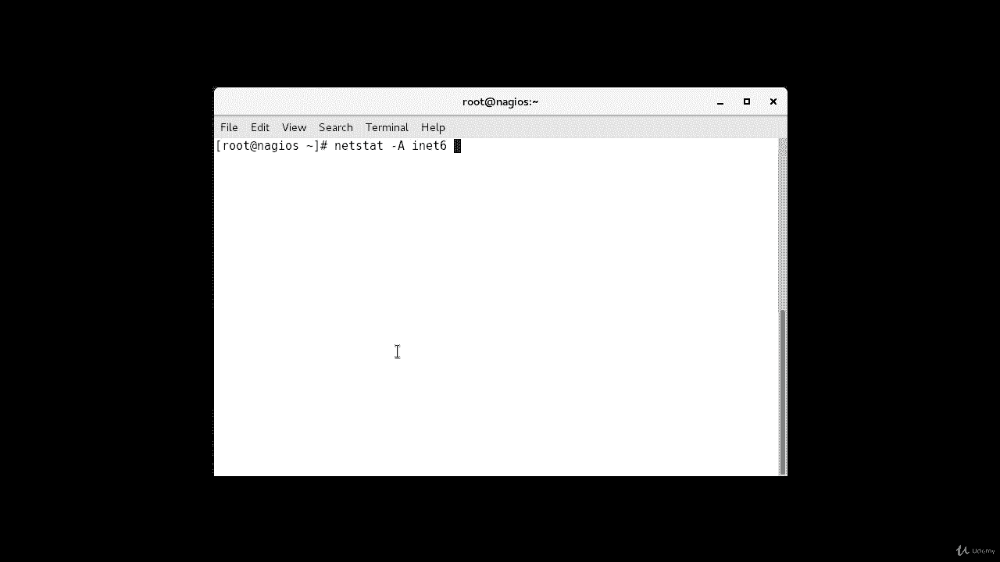
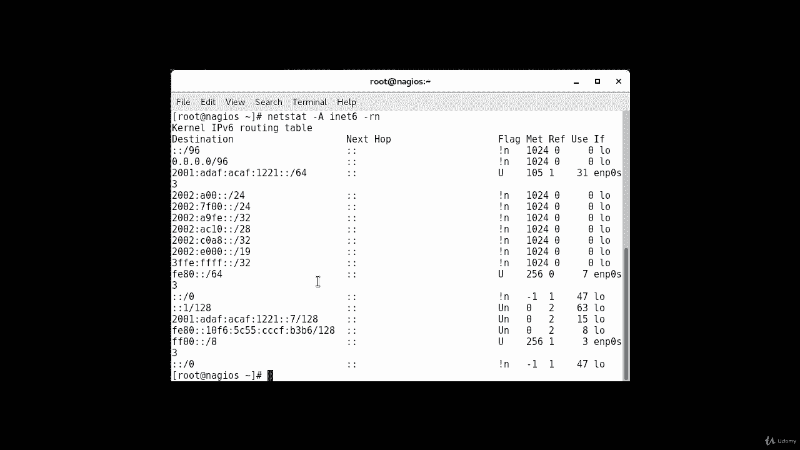
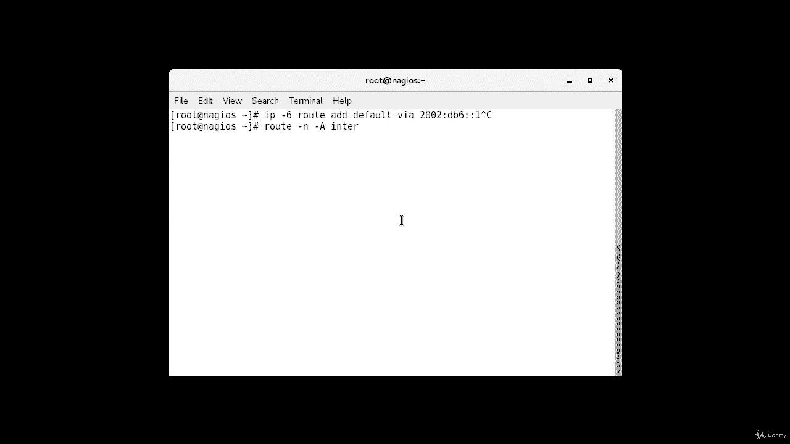
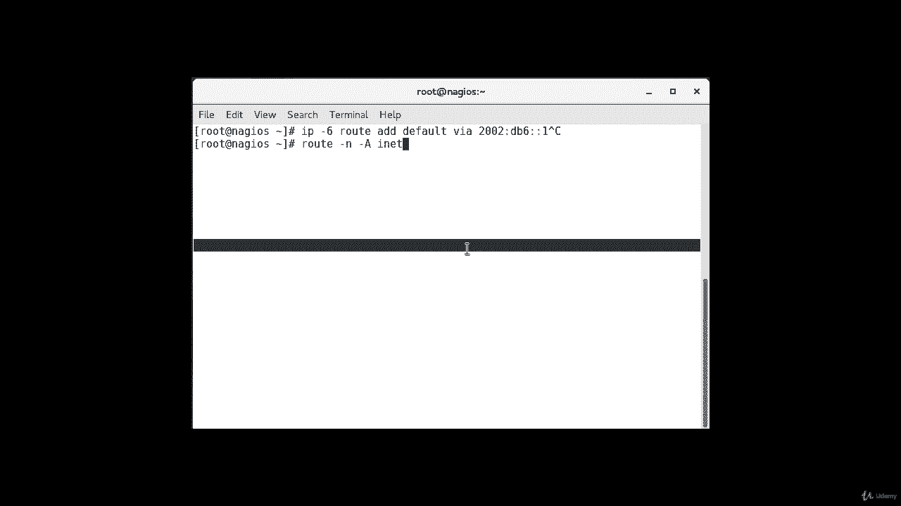
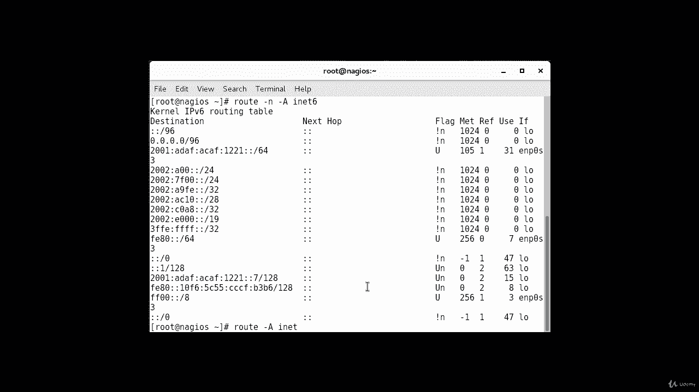
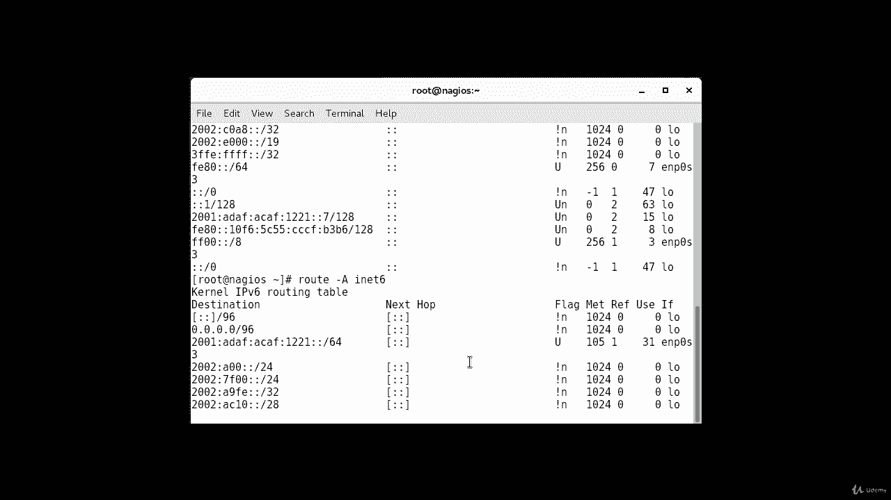
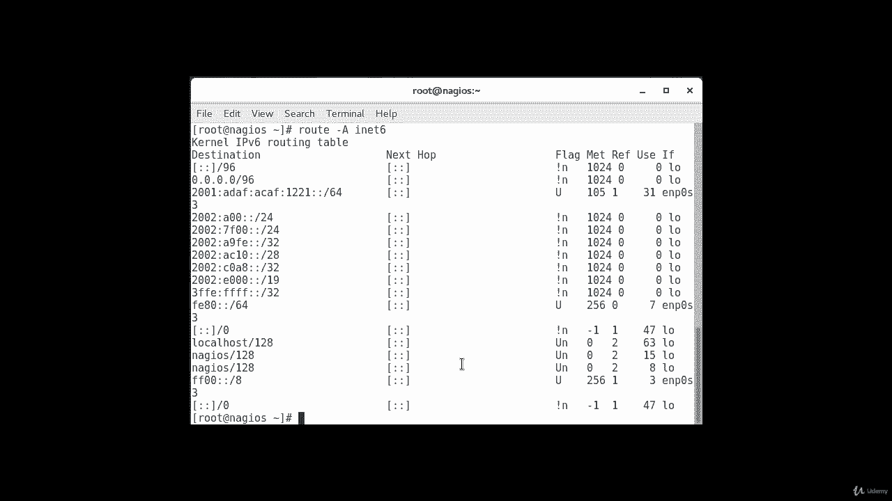

# [FreeCourseSite.com] Udemy - Red Hat Certified Engineer (RHCE) - 2018 - P21：4. IPV6----2. Misc commands for ipv6 troubleshooting - 我吃印度飞饼 - BV1jJ411S76a

Now， after we have configured IPV6 on both of our machines。

 I would like to show you some of the commands， which are slightly different from the regular IP command。

So if I want to show the IP address on this machine， which is version 6。

 I'll type in IPspace hyphen 6 or dash 6。

Addres。And instead of showing me all the interfaces， it'll only show the interface。

 it'll showing glue back as well as the interface， which has the IPV 6 address configured。

 which is this one right here that we configured earlier。Okay， and another useful command。

 It's kind of similar to Cisco's CDP command。 if you're familiar with that。

 it shows the neighbors that are connected to this one device so。If I do this。So one。

 there are some other ones also， but the ones that I'm interested in is our other machine。

That we configure， because it has。A field of five at the end。 So it's showing that as a neighbor。

Another command is to view IPV6 connections to local interfaces。

And just like we have Netat command in Linux。For I P B 4， we have one for IB 6 as well。系呢。6。

Dash R in。It'll show you all the local interface connections。

If we want to run pink man through a particularly。Okay。

 you can also use sniffing tools like TCP dump。Ip。6。

And this will start the traffic monitoring or traffic capture on the interface。Okay。

If you want to configure。The default route。IP。Hyhen dash 6。IPhone 6， route。Add。Default。Vre。And then。

 you can give。The default ro， Db6。Call colon1， S that that's our default route。That's the command。

If I'll do it， then I'll probably lose connectivity because that's not my default route。

If you just want to view the routes that are configured on the machine， you can do。Route。Dash in。

Dash a。Ain it。

6。It shows routes set for your network interfaces。If you want to run a trace route， you can do trace。

Route。Dash 6。And then the address that you are tracero to。To check the configuration。Can do route。

Dash a。Inet。

6。

Okay。They'll show you the check the current configuration。

