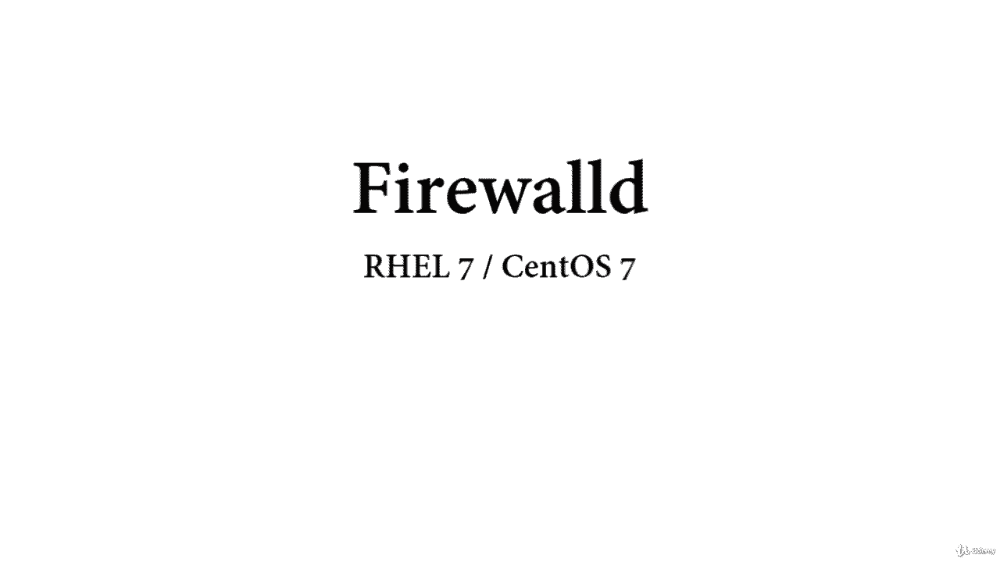
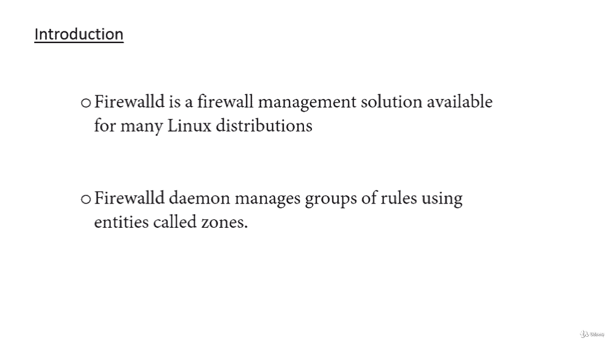
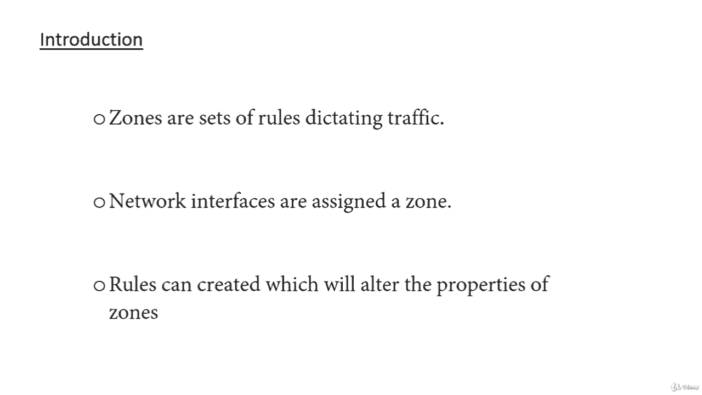
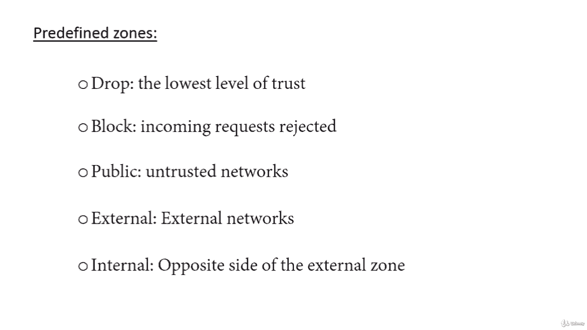
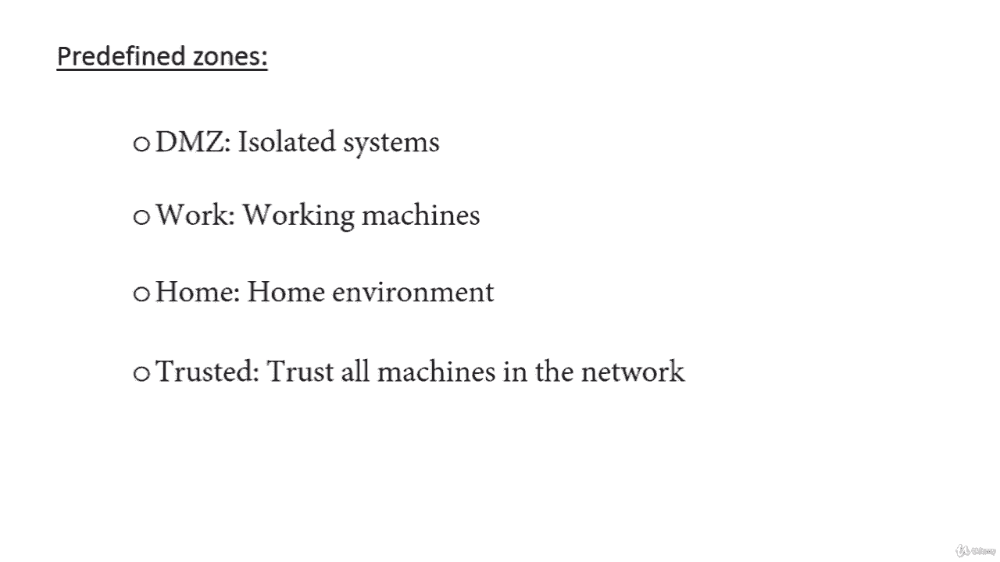

# [FreeCourseSite.com] Udemy - Red Hat Certified Engineer (RHCE) - 2018 - P22：5. Firewalld--1. Introduction - 我吃印度飞饼 - BV1jJ411S76a

Hello， students and welcome to Firewall D。 In this course， we are going to discuss the deployment。

 configuration and troubleshooting of Firewall D。

On red hat 7 and sent 7。A little bit of introduction。

 Firewall D is a firewall management solution available for many Linux distributions。

 which act as a front end for the IP tables packet filtering system provided by the Linux kernel。

In this course， we will cover how to set up a firewall for your server and show you the basics of managing the firewall with the Firewall Hy CMD administrativeist tool。

Before we begin talking about how to actually use the firewall hyphen CMD utility to manage your firewall configuration。

 we should get familiar with a few basic concepts that the tool introduces。

So the first concept one of the most important one comes to firewall is zones。The firewall D。

 De manages groups of rules。Using entities called zones。

Zs are basically sets of rules dictating what traffic should be allowed depending on the level of trust you have in the networks your computer is connected to。

Network interfaces assigned a zone to dictate the behavior that the firewall should allow。

For the computers that might move between networks frequently like laptops。

 this kind of flexibility provides a good method of changing your rules depending on your environment。

 you may have strict rules in place prohibiting host traffic or most traffic when operating on a public Wifi network while allowing more relaxed restrictions when connected to your home network。

For a server， these zones are not as immediately important because the network environment really。

 if ever， changes。Regardless of how dynamic your network in。

 maybe it is useful to be familiar with the journal idea behind each of the predefined zones for firewall G。

In order for the least trusted to most trusted， we are going to discuss the predefined zones in Firewall D。

The very first one is drop。 This is the lowest level of trust。

 All incoming connections are dropped without reply， and only outgoing connections are possible。

Second one is block。 It's similar to drop， but instead of simply dropping connections。

 incoming requests are rejected with an ICMP host prohibited or ICMP 6。ADM prohibited message。

The third one is public。 It represents public or untrusted networks。 You don't trust other computers。

 but may allow selected incoming connections on a case by case basis。Next one is external。

 and just like the name suggests， external networks in the event that you are using the firewall as your gateway。

 it is configured for network address translation or net masquerading。

 so you your internal network remains private but reachable。Next one is internal。

 the other side of the external zone says the opposite of external。

Used for the internal portion of a gateway。The computers are fairly trustworthy among each other。

 and some additional services are available。

Next one is DMZ or demilitarized zone。Used for computers located in DMZ。

 isolated computers that will not have access。Do the rest of your network。

 So it's a network within your network， which is isolated even within your own network。

Next one is work is use for working machine。 They trust most of the computers in the network。

 A few more services may be allowed。Next one is home。

 a home environment generally implies that you trust most of the data computers and a few more services will be accepted。

Next one is trust， trust all of the machines in the network。

 the most open of the available options and should be used sparingly。To use the firewall。

 we can create rules and alter the properties of our zones and then assign our network interfaces to whichever our zones are most appropriate。

Rule performance。 if we were to discuss it in firewall D rules can be designated as either permanent or immediate。

 If a rule is added or modified by default， the behavior of the currently running firewall is modified。

 At the next boot， the old rules will be reverted。 Most firewall CD operations can take the permanent flag to indicate that the non eemeral or eemeral firewall should be targeted。

 This will affect the rule set that is isolated upon boot。

This separation means that you can trust rules in your active firewall instance and then reload if there are problems。

 You can also use the permanent flag to build out an entire set of rules over time that will be applied at once when the reload command is issued。

