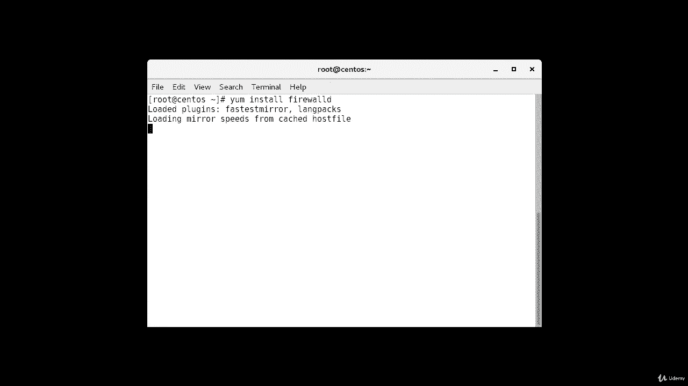
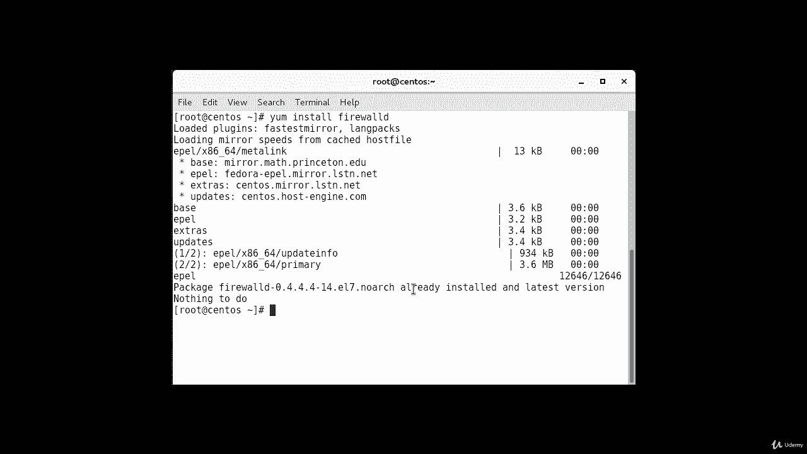
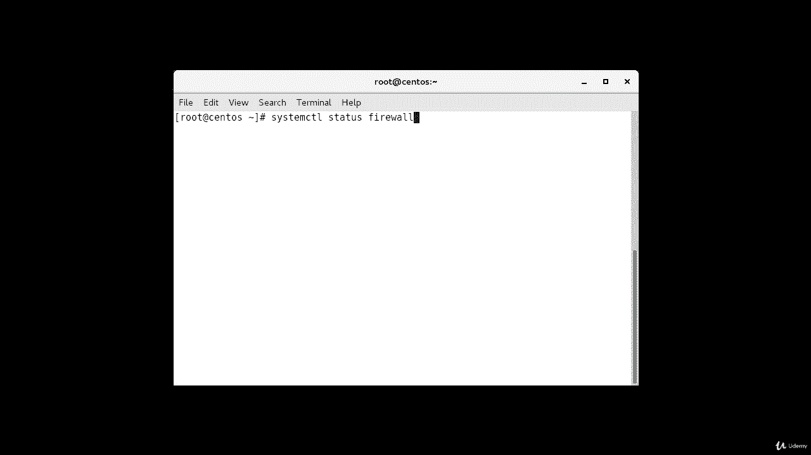
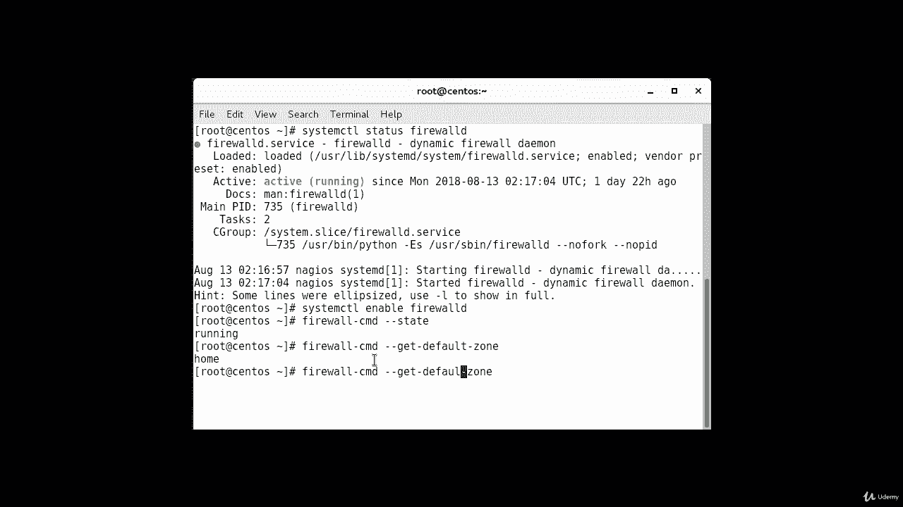
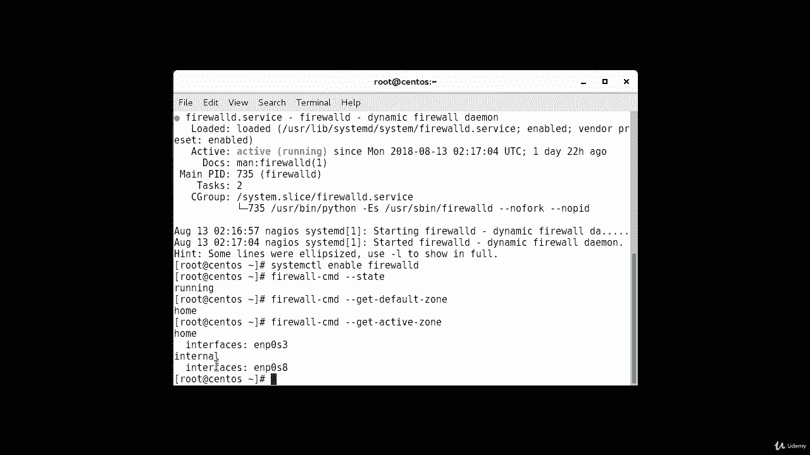
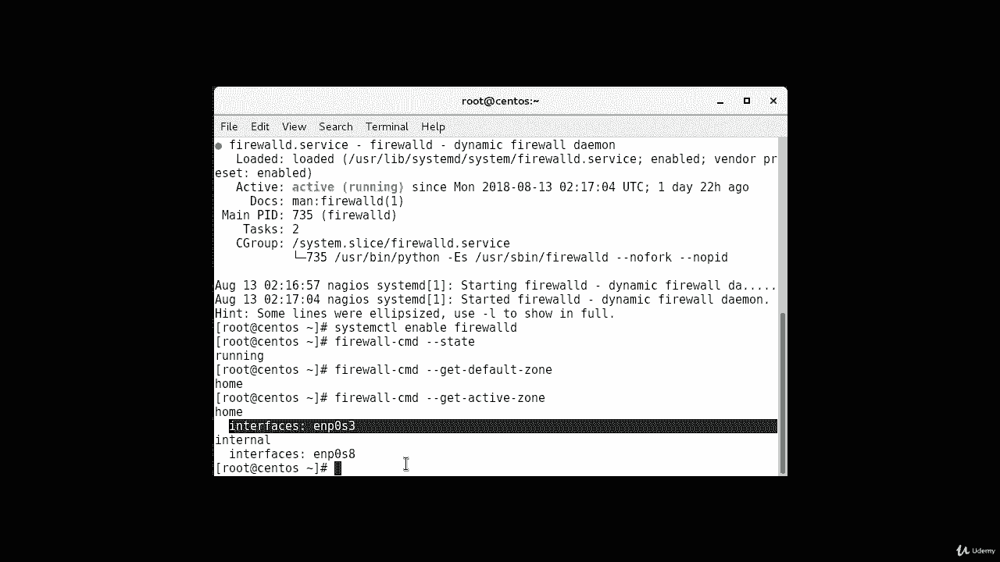
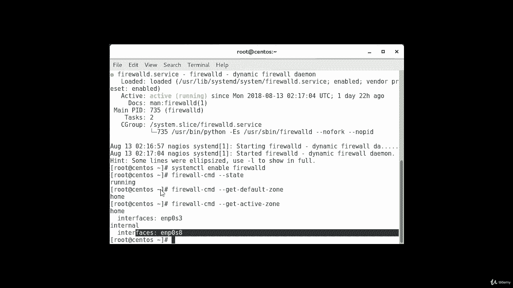
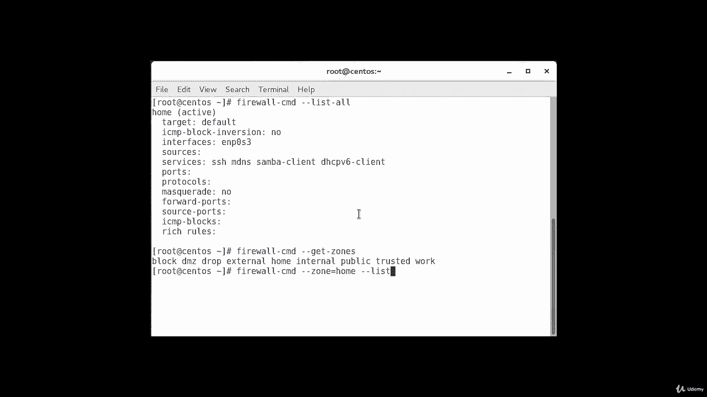
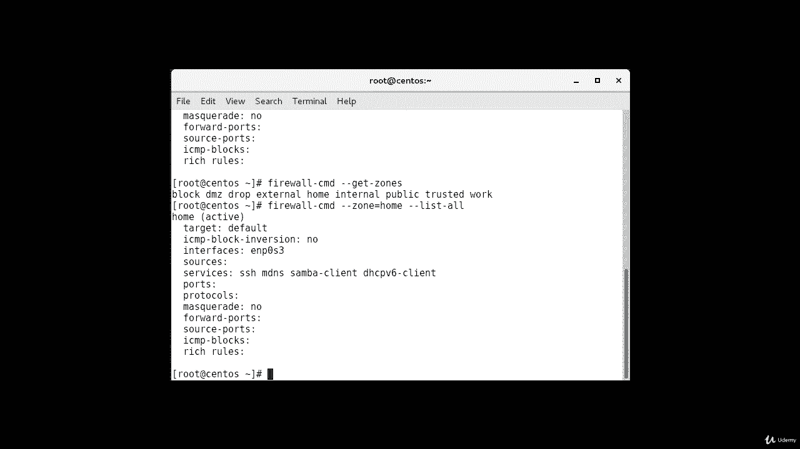
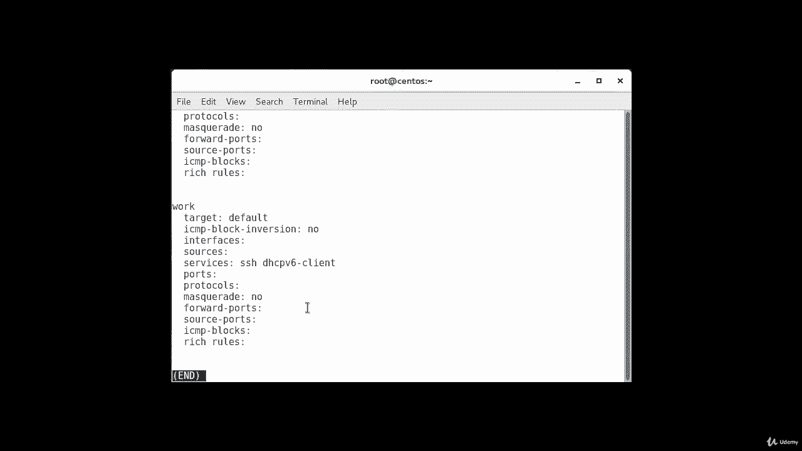

# [FreeCourseSite.com] Udemy - Red Hat Certified Engineer (RHCE) - 2018 - P23：5. Firewalld--2. Exploring defaults - 我吃印度飞饼 - BV1jJ411S76a

So by default， Firewall D is installed on some Linux distribution。

 including many images of the centas 7。 however， it may be necessary for you to install Firewall D yourself。

 so in my case it is already installed， but I'm going to show you how to do it anyways。

The command is y install。Firewall D， in my case， it's going to come back and say it's already installed and there's nothing to do。

But if you don't have it install in your system， all you have to do is just say yes and it will go ahead and install it。

Okay， as you can see， it says package firewall D and this version is already installed in latest version and there's nothing to do。

 Okay， so I'm going to clear it。

And。So after you install your Firewall D you can enable the service and reboot your service keep in mind that enabling Firewall D will cost this a service to start up at boot time It is best practice to create your firewall rules and take the opportunity to test them before configuring this behavior in order to avoid potential potential issues。

And the way you do this is。System CTL。By the way， if you want to check the status of watch your farwall status is right now。

Firewall D。

And as you can see， in my case， it's showing active and is running。Now。

 if I want to enable it so that weight will start at boot time， all I have to do is type。System。CTl。

Enable。Firewall D。And this will make sure that it is enabled at the time of boot or reboot。

One more way that you can verify the current status of the firewall is firewall。Dash CMD。Dash。

 dash state。That it is running。So before we begin to make modifications。

 we should familiarize ourselves with the default environment and rules provided by the demon。

 So in order to export the defaults， we can run。Prewall。Theres CMD。Dash， dash， get。Default。Zone。

And as you can see， in our case， it says， the zone is currently home。

Since we haven't given Firewallty any commands to deviate from the default zone and none of our interfacepas are configured。

To bind to another another zone， that zone will also be only active zone。

And a zone that is controlling the traffic for our interfaces。We can verify that by typing。

The same command， but instead of default， we're going to change that to active。

Okay， and these are the two interfaces that are currently active。

This is internal and then there's a home and the two interfaces that are attached to it。

So how do we know what rules are associated with our home zone， though。

 If we want to print out the default zone configuration， we can do this by。

Tibping。Firewall。CMD。Dash dash list， all。And this is our home， which is that current active。

Target is default， ICMP block， inversion， no interface。

 This is the interface services that are available。 Samba client， DP 6 client， SS H。

And these are the only things that N masquerade is not configured on it， other than that。

 nothing else is configured。So now we have a good idea about the configuration for the default and active zones。

 we can find out information about other zones as well and to get a list of them。

 we can type firewall。CmD。Dash， dash， get。Zs。And these are all the zones。

These are the other zones that can be configured， but so far they are not。

We can see the specific configuration associated with a zone by including the dash dash zone equals parameter in our dash dash listhen all command。

And the way you do it is firewall。Dash CMD。Dash dash zone。Equals home。Dash， dash list。

Dash all。You can output all of the zone definitions by using the dash list zones option。

 you will probably want to pipe the output into a pager for easier viewing。

So you can output all of the zone definitions by using the dash dash list。

 dash all dash zones option， you'll probably want to pipe the output into a pager for easier viewing。

And the way you do it is firewall， dice CMD。Dash， dash list。Dash all。 dash zones。

And you pipe it to less。And。It gives you all the details about the own definitions。And we can。

Keep hitting the space bar and it'll keep going through all the definitions because's not going to shop in one screen。

 that's why it's a good idea to pipe it。

