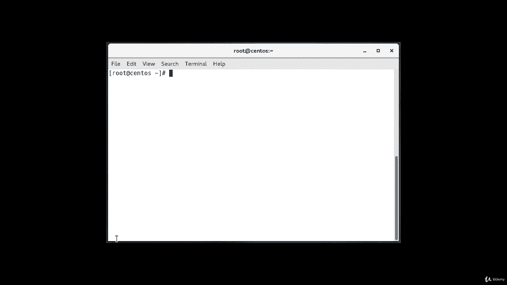
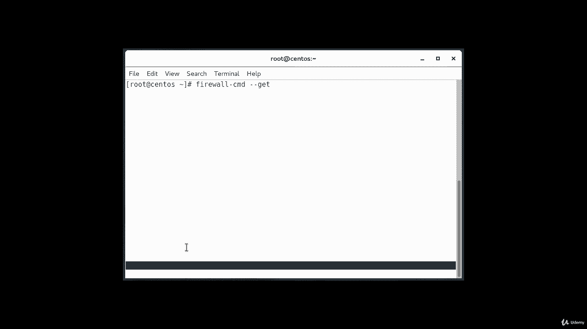
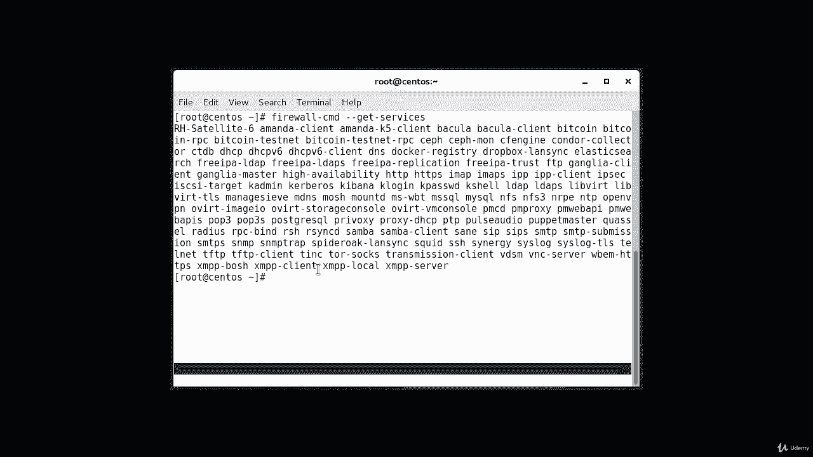
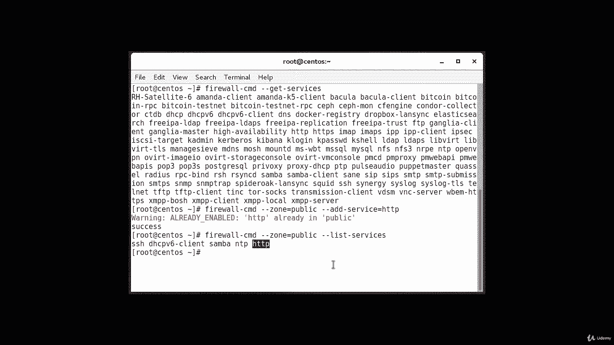
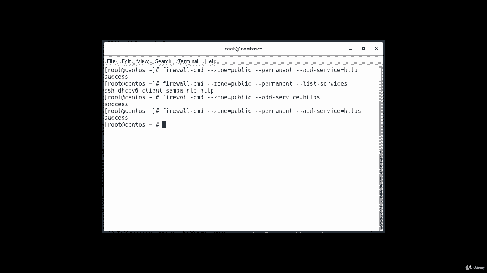

# [FreeCourseSite.com] Udemy - Red Hat Certified Engineer (RHCE) - 2018 - P24：5. Firewalld--3. Setting rules for applications - 我吃印度飞饼 - BV1jJ411S76a

So the basic way of defining farwall exceptions for the services you wish to make available。

Is fairly easy。And adding a service to your zone， the easiest method is to add the service or ports you need。

To the zones you're using。

And。First， we're going to see what services are running that we can apply firewall rules on。

And it's going to be a very long and messy list， but I just want to show you that it is available。

There you go， these are all the services that I have running on this machine that we can apply firewall rules on。

So suppose if I want to allow HTTP traffic for my public network， how do I do that？Type it firewall。

Cmd。Dash dash zone。Equals public。Add。Service。Equals HttP。Okay， in my case， it's already running。

But it at the same time， if you look at the bottom of it， it does say it was successful。

 So if youre not， if it's not running on your machine， which chances are most probably it's not。

 if it's a new machine， then this red message you' not going to show up。 that's solidly installed。

You can leave out the dash dash zone equal if you wish to modify the default zone。

 we can verify the operation by if it was successful or not by using the list all our list services operations。

 so the way you do it is firewall。D CMd。Dash dash zone。Equals public。Dash dash list。Dash services。

And as you can see， we have just。Configure our allowed HtTP traffic， so this service is enabled。

So once you have tested that everything is working as it should。

 you'll probably want to modify the permanent firewall rules so that your service will still be available after a reboot。

You can make our public zone change permanent and the way you do it is firewall。CmG。Dash dash zone。

Equals public。Dash， dash。Permanent。Dash dash， add。Dash service。Equals HtTP。Was successful？

And you can verify this was successful by adding the dash dash Per flag to the list services operation。

So the way we do that is firewall。That's CMD。Dash dash the zone。Equals public。Dash dash permanent。

Dash dash list。Dash services。And as you can see， our service is HtTP and is there。

So your public zone will now allow HTTP traffic on port 80 if your browservisor is configured to use SSL or TLS。

 you'll also want to add the HTTPS service， which is the secured HTTP。

We can add that to the current session and the permit rule set。

And we can do that by typing this command firewall dash CMd。Dash dash zone。Equals public。Dash dash。

 add。Dash service。Equal HtTPS。Aon。And firewall。D CMD。Dash dash zone。Equals public。

Dash dash permanent。Dash dash， add， dash service。Equals HttPS。

 so that way it will be there permanently。

