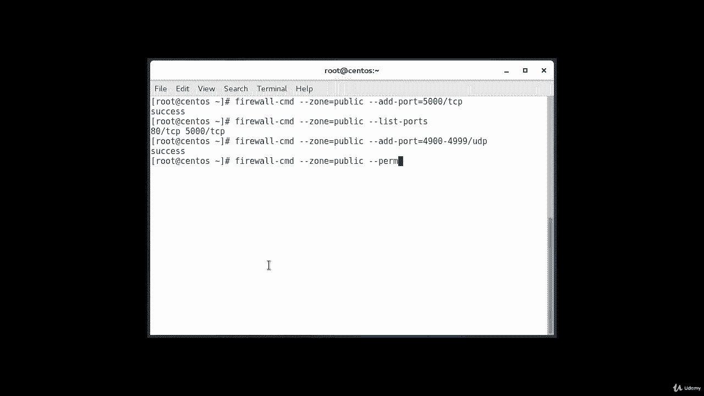

# [FreeCourseSite.com] Udemy - Red Hat Certified Engineer (RHCE) - 2018 - P25：5. Firewalld--4. Adding ports to firewall rules - 我吃印度飞饼 - BV1jJ411S76a

So the firewall services that are included with the firewall de installation represent many of the most common requirements。

For applications that you may wish to allow access to。However。

 there will likely be scenarios where these services do not fit your requirements。In that situation。

 you have two options。Either you can open a port for your zones。Or。You can define a service。

So we're going to go through each one of them， one by one。

 we're going to start with opening a port for your zones。

 the easiest way to add support for your specific application is to open up ports that it uses in the appropriate zone this is as easy as specifying the port or port range and associated protocol for the ports you need to open。

For instance， if our application runs on port 5000 and uses TCP instead of UDP。

 we could add this to the public zone for this session using the add dash port equal parameter。

And protocols can either be TCP or UDP。So if I were to type in this command，' be。

Firewall。Cm d。Dash de zone。Equals public。Dash， dash， add。Dash port。Equals 5000。Slash TCp。

Okay， and we can verify this was's successful going to the list port operation and the way you do that is firewall。

 CMD。Dash dashed his own。Equals public。Dash dash list。Dash ports。

And we already have 80 open， and now we got 5，000 open。

It is also possible to specify a sequential range of ports by separating the beginning and ending port in the range with the dash。

For instance， if our application uses UDP ports 4990 to 4999， we can open up these on public。

By typing。Firewall。

Cmd。Dash dash zone。Equals。Public。Dash， dash， add。Dash port。

Equals。4900。Throughru。49，99。

And suppose these are UDP ports。Okay， after testing。

 we would likely want to add these to the permanent firewall and you can do this by doing this firewall。

That's CMD。Dash dash zone。Equals public。

Dash， dash， permanent。

Dash， dash， add。Dash port。Equals 5000。

TCP， this is the first example that we did。And the second one will be firewall。That CD。

Dash does zone。Equals public。Dash， dash， permanent。

Dash dash， add， dash port。

Equals 4900。

To 4999。UDP。

And the last one is firewall。

That CMD。Dash that th。

Equals public。

Dash， dash per。Min。Dash dash list， this is going to list our ports。

Just to verify that we are getting it correctly。

List。Hyhen ports。

So these are the three ports that we have configured so far 80。5000 and range from 4900。To 49，99。

