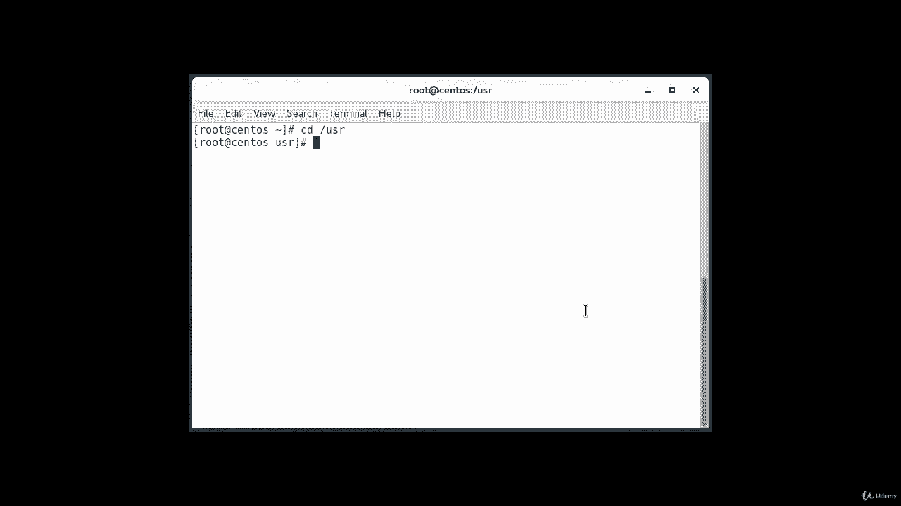
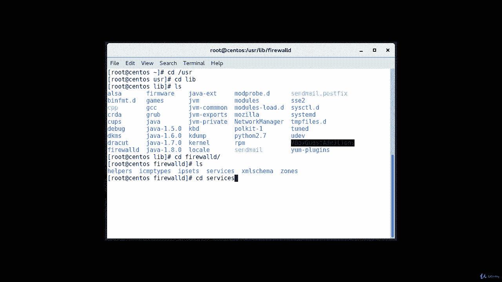
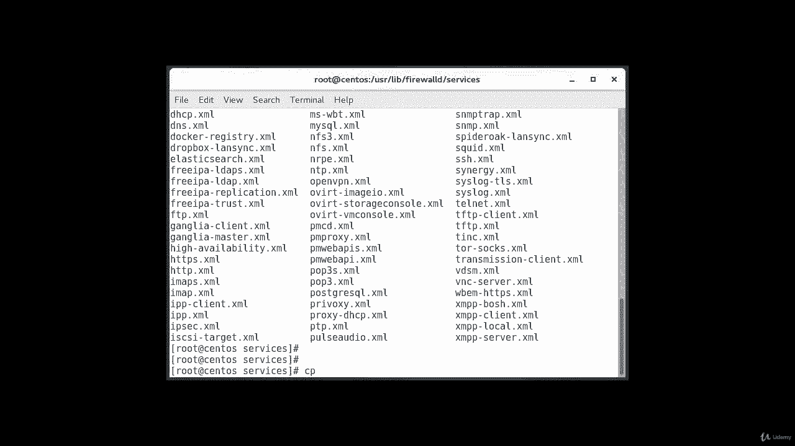
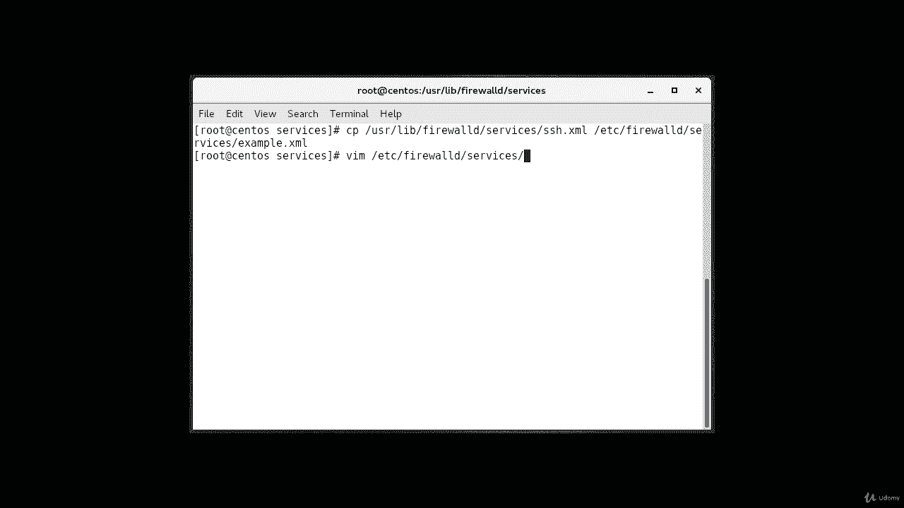
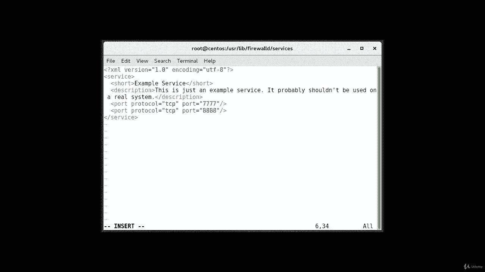
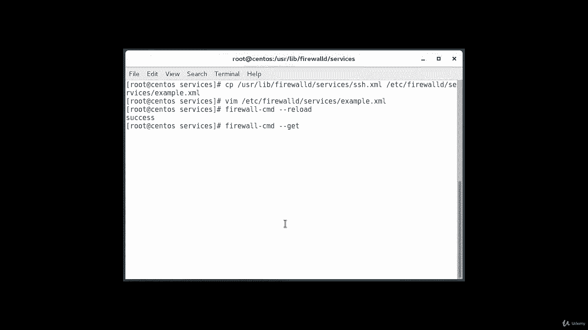
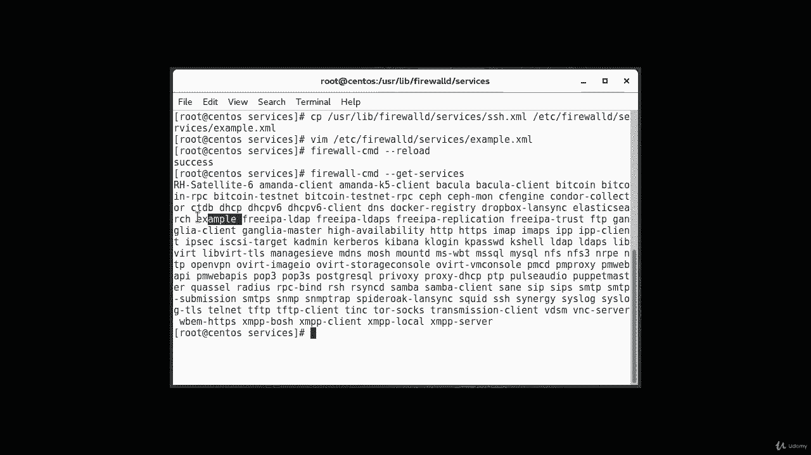

# [FreeCourseSite.com] Udemy - Red Hat Certified Engineer (RHCE) - 2018 - P26：5. Firewalld--5. Defining services - 我吃印度飞饼 - BV1jJ411S76a

So in this lecture， we're going to talk about defining a service Opening ports for your zones is easy。

 but it can be difficult to keep track of what each one is for。

If you ever say put a system out of service。You may have a hard time remembering which ports that have been opened are still required。

 So to avoid the situation， it is possible to define a service instead of a port。

 Services are simply collections of ports。With an associated name and description。

 using services is easier to administer than ports， but requires a bit of work。

 The easiest way to start that is to copy an existing script， and the script is located in。User。

The library。Firewall D。Services。Directory and。Services。

And this is where all the scripts are located。For instance。

 we could copy the SSH service definition to use for example。A far of example service definition。

And the file name minus the dot XMl office will dictate the name of the service within the firewall service list。

So， let's copy。

User let me actually clear it so we can be on the top of the screen。So， copy。User。Lbe。Firewall D。

Services。S，SH dot XM L。2， ETC。Fre。Firewall d。Services。Example dot Xm。Xml。

Now we can adjust definition found in the file that we just copied。B I am。Etsy。Firewall。D。Services。

Example dot Xml。So to start， the file will contain the SS definition that we just copied。

The majority of these definitions actual metadata。 You'll want to change a short name for the service within the short tags。

 This is a human readable。Name for your service。 You should also add a description so that you have more information if you ever need to audit the service。

 the only configuration you need to make that actually affects the functionality of the service will likely be the port definition where you identify the port number and port you wish to open and this can be specified multiple times for our example service。

 imagine that we need to open a port 77，77 for TCP and 88，88 for UDP by entering insert mode。

By pressing I， we can modify the existing definition。And here's how we do it。So。

I'm in the file right now， and when it says short， I'm going。Delete this and then insert example。

Service。Okay， escape， then I'm going to come down to description。

And delete everything that's in between。It's a lot of stuff。

And I'm going to type in my own description here。Okay。Press I to insert， and then type in。

This is just。And。Example。Service。It。Probably。S。Shouldn't。Bi。Use。Oh know。Real system。And。This period。

And on the next two lines， we have the ports。So TCP， we're going to change that to。And Sir。7，7，7，7。

Then I'm going to do a YYP。And then change this one。2。8，8，8，8。

And then save it and exit。And now we're going to reload our firewall。

 So the command for that is firewall。CMD， dash dash reload。Was successful。

You can see that it is now among the list of available services。So if I can do if I do a firewall。

Dash CMD。Dash， dash， get。Dash services。

And we can see this in among our services。And if you look at this output here。

 this is our example service showing right here。

