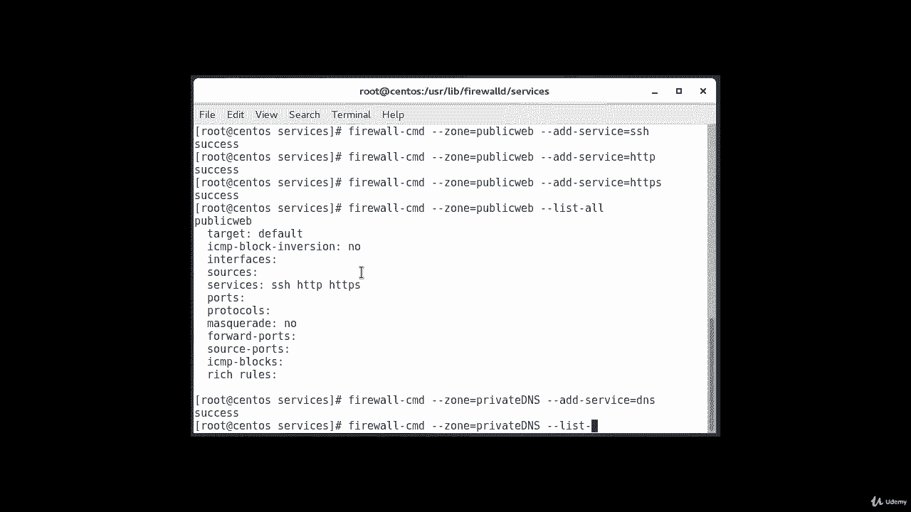

# [FreeCourseSite.com] Udemy - Red Hat Certified Engineer (RHCE) - 2018 - P27：5. Firewalld--6. Creating customer zones - 我吃印度飞饼 - BV1jJ411S76a

So while the predefined zones will probably be more than enough for most users。

 it can be helpful to define your own zones that are more descriptive of their function。

 for instance， you might want to create a zone for your web server called public web。However。

 you might want to have another zone configured for the DNS service you provide on your private network。

You might want a zone called private DNS for that， so when adding a zone you must add it to the permanent firewall configuration。

You can then reload to bring the configuration into your running session。For instance。

 we could create the two zones we discussed。And I'll show you the command for those。

For the first one。It's firewall， dash CMD。Dash， dash。Her。Permanent。Dash dash new。That zone。Equals。

Public web。Okay， that was successful。 Then we're going to do the same。

 and this time we're going to call it。Private DNS。DN。

And you can verify that these are present in your permanent configuration。By typing firewall。

There is CMd。Dash， dash。Permanent。Dash， dash， get。Don't。And as you can see。

 this public web right here and this private DNs here。And as we said before。

 these won't be available in the current instance of the firewall yet。 So in order to do that。

We'll do firewall。Dash CMD。Dash dash， get。Zones。And we're going to do the firewall reload firewall。

Thats CMD。Dash， dash， reload。Mis Val the re load。And was successful？

And then we get thes Gd zones command again。And as you can see now。

 we can see this private DNS and public web in there。

And now what you can do is you can begin assigning the appropriate services and ports to your zones。

 It's usually a good idea to adjust the active instance and then transfer those changes to the permanent configuration after testing。

 For instance， for the public web zone， you might want to add the SSH HtTP and HtTPS service。

And we're going to do it here。Firewall， die CD。Zone。Equals。Public web。Addd。Service。Equals S H。

What's done Next one， I'm just going to do an arrow up。And。Here I'm going to type H TTP。

And then one more time， I'll do uparrow and HtTPS。Okay， and then。I'm going to list them all。List。

Dash or。

And these are all of our services that are listed here。And just like that。

 we can also add the DNS service to our private DNS zone。In order to do that， we'll type firewall。

Theres CMT。Dash dash zone。Equals private。DN S， dash， dash， add。Dash service。Equals DNS。

And then you're going to list them all。Lost all。

Okay， and this is going to list the DNS service that we just configured。

 and now we can change our interfaces over to these zones to test them out。So firewall。Dash CMD。

Dash dash zone。Equals。Public。Web。Dash， dash， change。Dash interface。Equals。

E and P0 S 3 we'll use for this one。The interface under control of network manager settings on to public。

 Okay， so we'll disable。System CTL。Okay， so that was successful。

 And the next one we're going to do for our private DNS。And it's going to be on。E and P0 S 8。

And I'm going to change this to。Private DNS。Okay， that was successful。 So at this point。

 you have the opportunity to test your configuration。 If these values work for you。

 you will want to add the same rules to the permanent configuration。

 and you can do that by reapplying the rules with the permanent flag。K， the way we do this is。

Firewall， dash， CMT。Ded as zone。Equals public web。Dash dash permanent。Dash， dash， add。Dash service。

Equals S， S H。Then I'm going to uparrow。And change this to HtTP。Then again， change this tool。HttPS。

And then， change。This one，2。DNS。At the same time， from public web to。Private DNs。

So after permanently applying these rules， you can restart your network and reload your filewall service。

So that'll be system， CTL。Restar。Network。

Okay， so our。Reting the network is failing， so I'll go ahead and reboot it。

You can look at actually System CTL status network service。This command。

See if it gives us any meaningful information。Filure to start LSB， bring up or down。

 I've seen this before it and it fix it gets fixed by rebooting the machine。 So we're going do that。

So now we' begin to validate that the current zones are assigned and for that the command is firewall。

Dash CMD。Dash dash jet， dash active zones。And our home and interface。E and P0 S3 are assigned。

 we should have a second interface also。So after my reboot one of the interfaces got turned off。

 so that's why it wasn't showing up， but now it is showing up to private DNS on ENP08 and the home interface is ENP03。

Which is also the public interface that we configured。

And now we're going to validate that appropriate services are available for both of the zones。

So we'll type in firewall。Dash CMD。Dash dash zone。Equals public。Webb。Dash， dash， list。Dash services。

SSH， HtTP and HtTPS。And。Then we're going to do the same， except。I'm going to change this to。

Private Ds。And that's a Dus。 So now you have successfully set up your own zones。

 If you want to make one of these zones， the default for the other interface。

 remember to configure that that the behavior with the dash， dash default。

 dash zone equals parameter。And they can do that by typing firewall。There is CD。Dash just set。

Dash default。TheZone equals。Public。Web。

It successful。