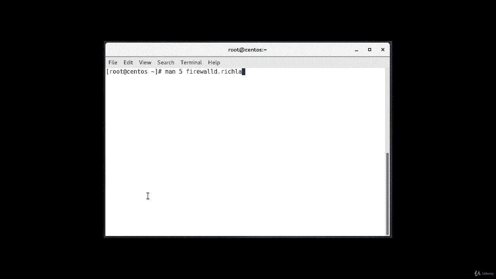
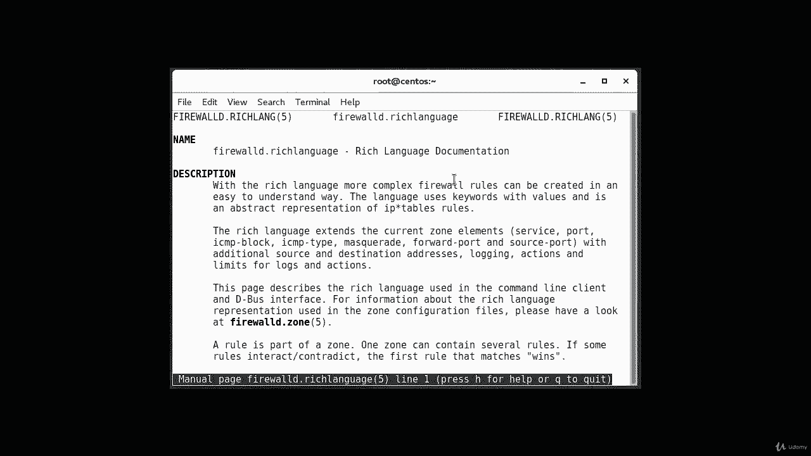
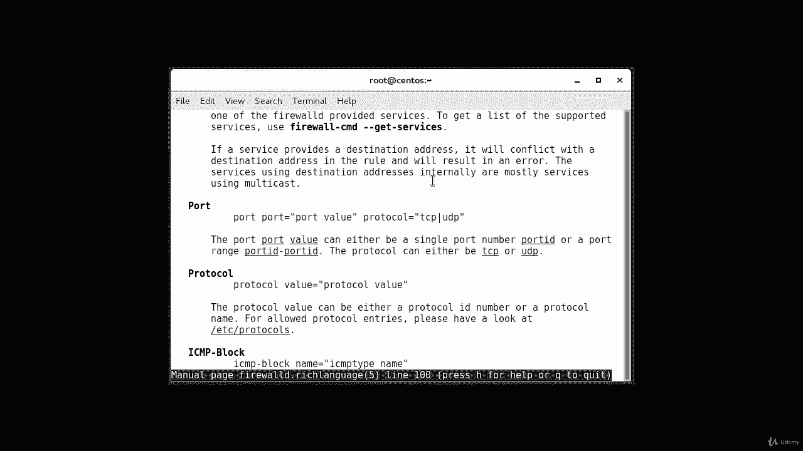
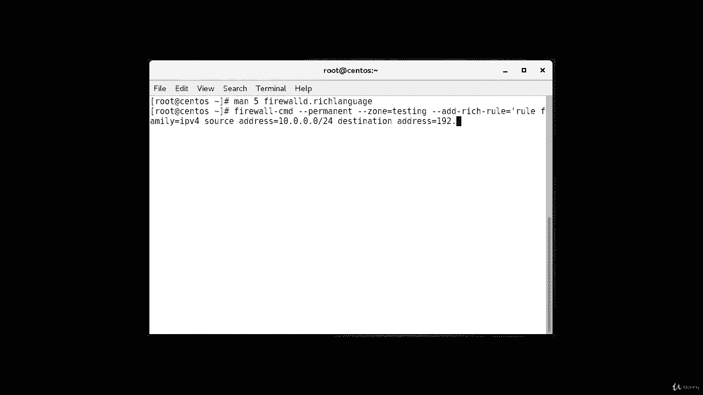
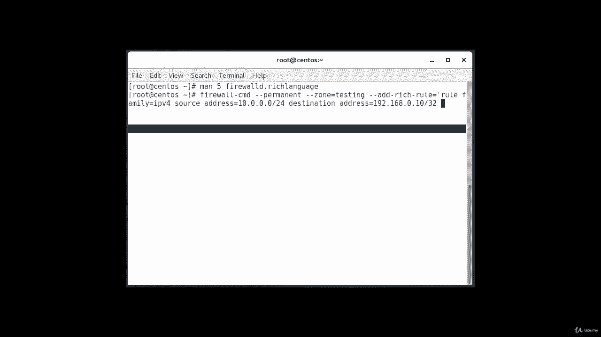
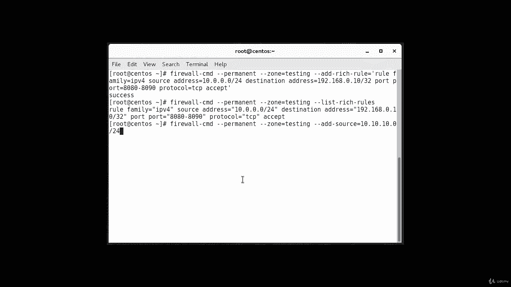
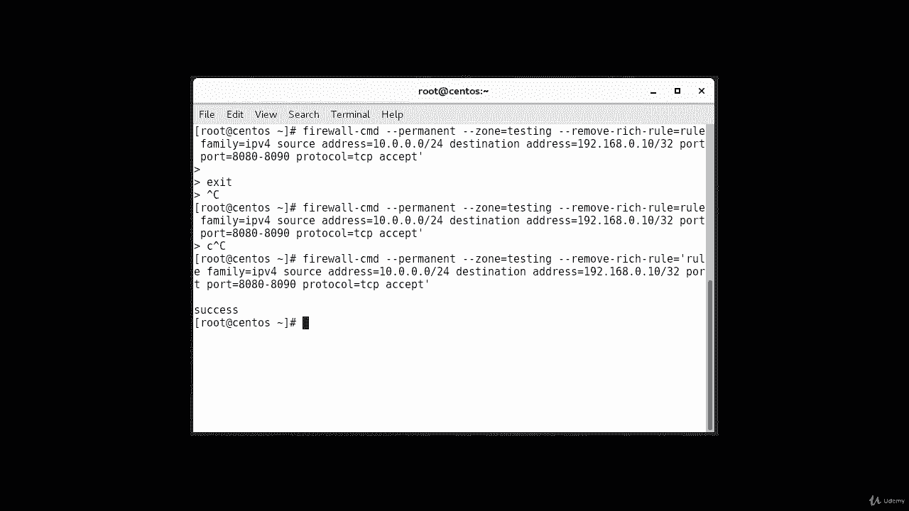

# [FreeCourseSite.com] Udemy - Red Hat Certified Engineer (RHCE) - 2018 - P28：6. Firewall rich rules--1. Adding rich rules - 我吃印度飞饼 - BV1jJ411S76a

Hello， in this lecture， we going to talk about firewall D rich rules。

 Rich rules provide a much greater level of control through more system granular options。

 Rich rules can also be used to configure logging， masquerading， port forwarding and rate limiting。

For further information on the syntax of rich rules and examples， you can see the manual page。

 man page。Man 5。Firewall。D dot rich language。

And this will give you more up the syntax and more。

Information about。Your rituals。

Okay。This will be a useful resource if you are taking like say RHCE or LFCCE。

 if main pages are allowed， then this is something you can take a look at。

So once multiple rules are in place， they will be processed in a certain order。

 Port forwarding and masquerading rules will be applied first， followed by any logging rules。

 then any allow rules， and finally， any deny rules。

 A packet will use the first rule it applies to to it。In in disorder order。

 if it does not match a rule， it will hit the default deny I。And we're going to use some examples。

So in our first example， we're going to add the rich rule to add a specified rule here allowing traffic from the range like say。

 10。0。0 slash24 into only 192。168。0。10 slash32。Through TCP ports，80，80 through 80，90。 Okay。

 and here's how you do it。Firewall。Ds CMD。Dash， dash， permanent。Dash dash zone。

Equals less color testing。Dash， dash， add。Dash rich。Dash rule。Equals。Ru。Family。Equals IPV 4。And then。

 we're going to have。Source address。Source address。Equals10 dot 0 dot 0 do 0， slash 24。

Destination address。Equals。192 dot 1，68 dot0 do 10 slash 32。

And then we're going to provide the port information。

Would the range。Support is port。Port equals。80，80。Through。80，90。Ptocol。Equals TCP。Except。

And the command we are using is firewall CMD permanent zone equals testing。

 make sure you have created this zone before。 Okay， otherwise it's going to give you an error。

And then you add this rich rule， add a rich rule equals to rule family equals IPV4 source IP address is this destination IP address is this。

 and port is equal to port 8080 through 8090， Port is equal to TCP， and accept。Okay。

 it was successful。Okay， and now we're going to list the rituals。 So firewall。Thats CMD。Dash， dash。

Permanent。Dash， dash zone。Equals testing。Dash dash listing。Sorry， list。Dash。Rich rules。

And this is our rule right there， when you listed。Okay。

 suppose if you want to go and remove this list or remove this rule。Then。Are we you gonna。

MeI'm trying to get back to that command so that if I don't have to type the whole command again。

Oh， let me go ahead and type in。It's going to be firewall。Dash CMD。Dash， dash， permanent。

Dash dash zone。Equals testing。Dash dash remove。Dash rich。Dash rule。Equals rule。Family。Equals IP beef。

f。Source。Address。Equals 10 do 0 do 0 do0 slash。24。Destination。Address。Equals 1，92 do 168。Dot 0， dot。

Dot 0。Dot10。Slash 32。And next is。The port command。Port。And then， port。Equals。80，80。2。80，90。Protocol。

Equals。TCP。Except。Okay， so one thing that I was missing is I did not start the coat。

 And I just had the end code。 And that's why I was getting an error are not an error。

 but I wasn't getting a success prompt。 So I just had to add that。

 And now we are back on the prompt and it was successful。

 So now we have successfully removed the ritual。

