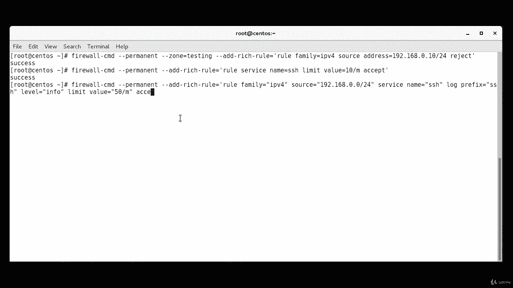
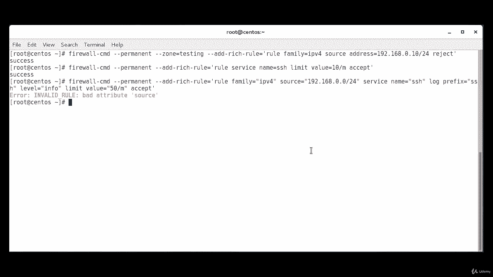
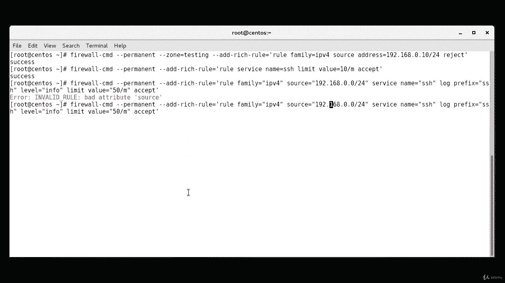
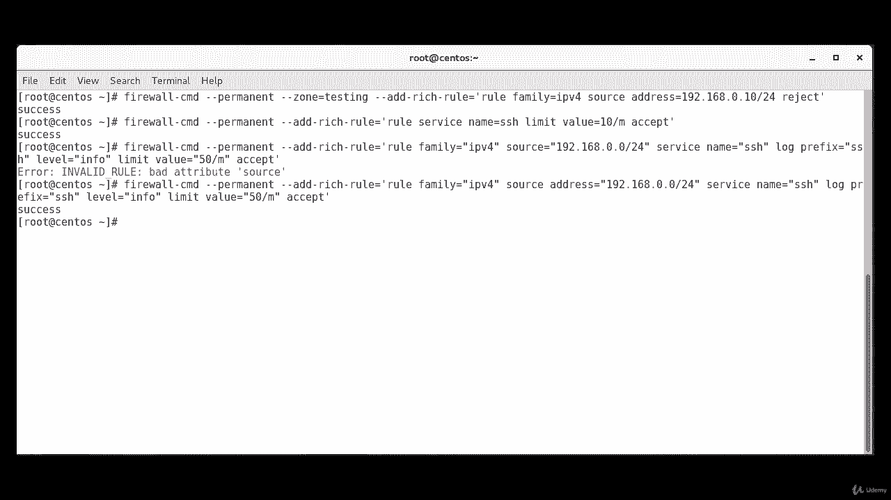

# [FreeCourseSite.com] Udemy - Red Hat Certified Engineer (RHCE) - 2018 - P29：6. Firewall rich rules--2. Reject using rich rules - 我吃印度飞饼 - BV1jJ411S76a

Okay， now we're going to create a rule， a rich rule to reject any traffic that comes from a particular IP address。

And the way we're going to do it is with the firewall command。That CMD。Dash dash。

 going to be a permanent rule。Dash dash zone。Testing。That was our zone name。Dash， dash， add。

Dash rich。Yeah sure。Equals。Rule。Family。Hopefully you're getting a hang of this whole syntax of how the ritual rules are laid out IP PV4 source。

Addres。Equals。192。 168， we're going to reject the traffic coming from this IP。Dot10， slash。24。

Remember， before we use accept here， now we're going to say reject。Okay， successful。

So reject will reply back with an ICMP packet。Noting the rejection。

 while a drop will just silently drop the traffic。And。Do nothing else。

 So a drop may be referable in terms of security as a reject response confirms the existence of the system as it is rejecting the request。

It's also important to note that if source or destination addresses are used with a rich rule。

 the family must be specified as either IPV4。R IP P V 6。

 depending on the addressing in use for the rule， rich rules can also be used to rate limit traffic。

 Here， we limit incoming SS connections to 10 minutes。Okay， and this shall we do it firewall。

Theres CMD。Dash， dash， permanent。Dash dash， add。Dash rich。Dash。Ru。Equals。Ru。Service。Name。Equals S H。

And then， we're gonna to use the。The limit command is gonna be。Limit。Value。Equals。10。Per minute。

Except。Successful。So rich rules can also be used to send messages to a log file。

 and this logging can also be rate limited Here we log SS connections from 192168。0。0 s24。

 but at a rate of no more than 50 log entries per minute。

 only logs of level info are more important would be logged。 So this shall we do it。Firewall。

Theres CMD。Dash dash， permanent。Dash， dash， add。Dash rich。Dash rule。Equals。Ru。Family。Bgus。Iv。f。

Source。Equals。1，92 dot 1，68 dot0 dot 0， slash。24。Service。Name。Equals S H。

Should be under quotes as well。S H， log。Prefix。Equals。S a S。Level。Equals。Info。Limit。Beu。Equals。50。

Per minute。Except。

In the code。Okay， so。We are probably missing a code somewhere because it has a lot of those。Okay。

 I think I see the problem。 So if I。

Up arrow， bring the whole command again。And it's supposed to be source address。

 So I just put in source。 I didn't say address here。

So this supposed to be space。Address。Equals。Let's see if it goes through now。Success。

