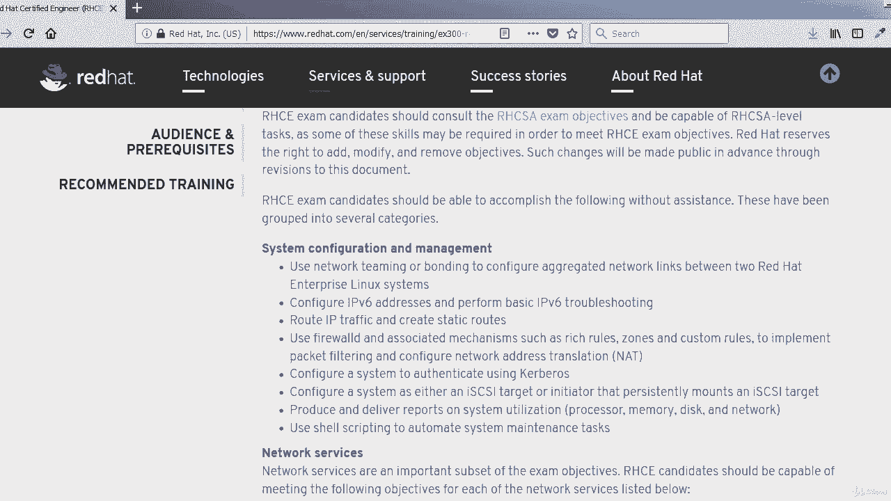

# [FreeCourseSite.com] Udemy - Red Hat Certified Engineer (RHCE) - 2018 - P2：1. Introduction-----2. Exam Objectives - 我吃印度飞饼 - BV1jJ411S76a

Hello， welcome back， students。In this lecture， we're going to talk a little bit more in detail about the exam objectives for the RHCE exam。

So the candidates should consult the RHCSA exam objectives and be capable of RHCSA level tasks。

 as we discussed in the previous lecture that you are supposed to it's required that you should have passed RHCSA exam before attempting this one。

And not only that you have the certificate， but also it'll be a great idea to refresh everything that you had learned in RHCSA before you sit for RHCE。

A little bit about the exam objectives。

There are three main categories， system configuration and management。

The second one is network services。

And the third one is database services。And then， of course。

Under each of these， there are subcategories。Like for system configuration。

 we have network teaming or bonding， IPV 6， routing IP traffic， Firewall D， very important subject。

Authenticating using curbos。Ice guy。Configuration and system utilization reporting。Also。

 a little bit about shelf scripting that you should have knowledge of。

Under Neverse services， you should know what SC Linux is。

How the packages install packages on a Linux system， on a red hat Linux system。

I see Linux port labeling。Services how to configure them so they start at boot time and you don't have to start them every time the system is started。

Configure the service for basic operation， host based and user based security。

Then， Apache。Vb server， configuration， CGI application， security of the server。DNS。

Beg to configure a caching only server， troubleshoot， DNS client issues。Network file system。

 I'm sure you're already aware of it。 Are'm gonna go a little bit more in detail in this， Samba。

S And B。It provides sharing between Linux and Windows machines。

So there'll be installation configuration of that SMTP， the mail server。

SSH secure， I'm sure you have come across that in your previous experience with RHCSA and if you are working as a Linux system administrator already。

 then this is something you use on a daily basis。We're going to talk about synchronizing time。

Using NTP。Facility， and then at the end， we're going talk about database services and specifically Maria DB and how to back up and restore database。

 simple database schema and perform simple SQL queries。

