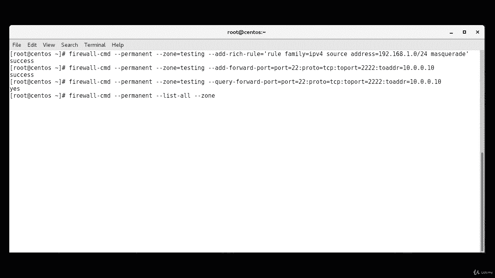
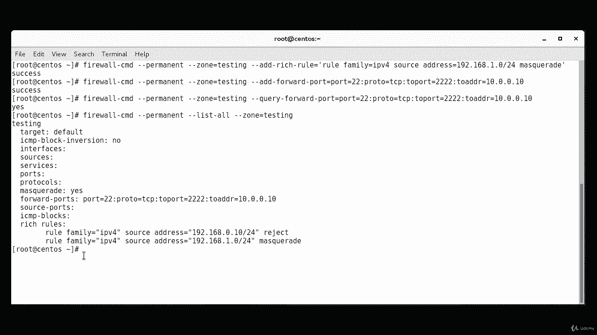
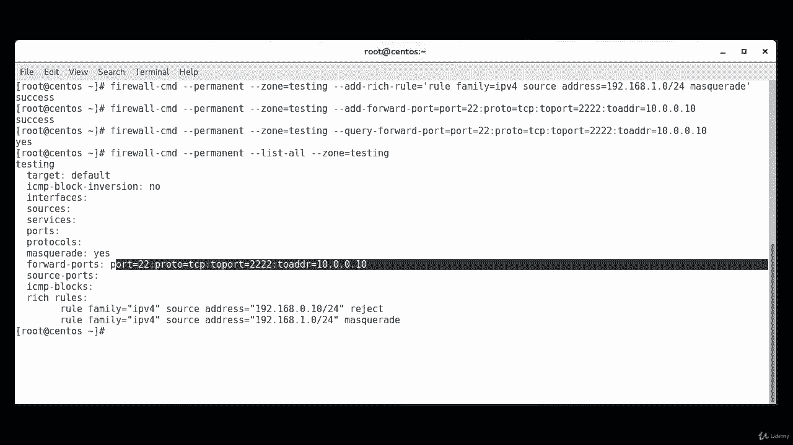
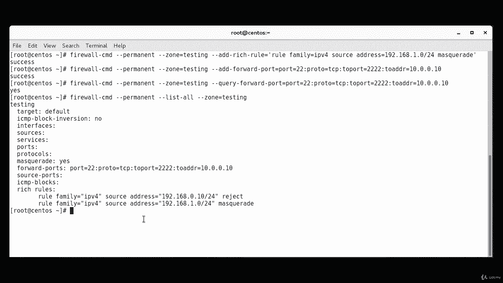
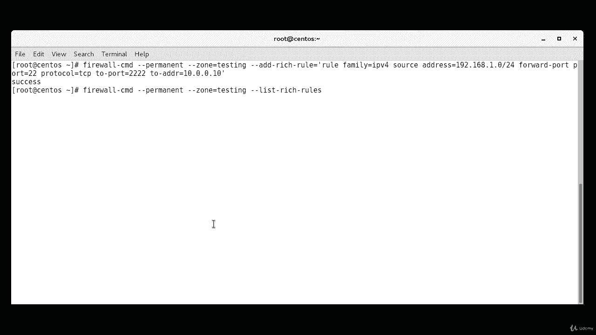
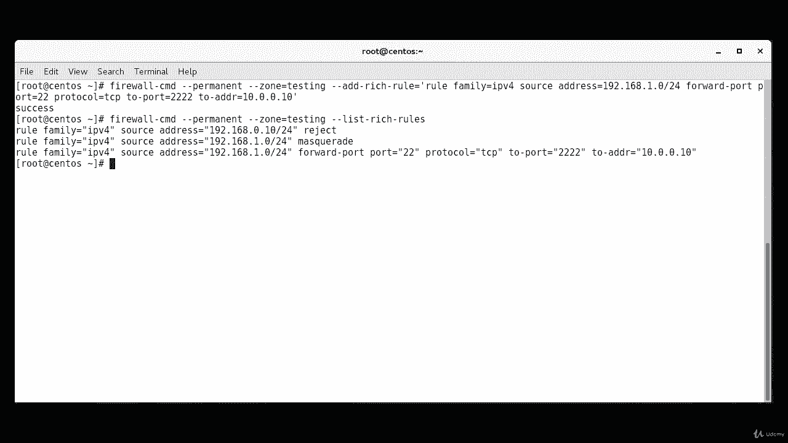

# [FreeCourseSite.com] Udemy - Red Hat Certified Engineer (RHCE) - 2018 - P30：6. Firewall rich rules--3. NAT and port forwarding - 我吃印度飞饼 - BV1jJ411S76a

So in this lecture， we're going to talk about Net or network address translation net can be done with firewall D with either masquerading or pork forwarding。

 both of which can be configured with Firewall D Firewall CMD command。

 It is important to note that masquerading can only be done with IPV4 and not IPV 6。So first。

 we going to discuss masquerading with firewall D masquerading with forward packets that are not directed to an I address associated to the system itself On to the intended destination。

The source IP address of the packets that are sent through our system。

Will be changed to the IP address of our system rather than the IP address of the original traffic source。

Responses to these packets will then go through our system and the destination address will be modified so that the traffic will be sent back to the original host that initiated the traffic。

Masquerad can be enabled on a zone with the use of dash dash， add masquerade。Directive。

 so this saw you do it， Firewall。There is CMD。Dash， dash。Permanent。Dash dash zone。Equals。Testing。

Dash dash， add。Dash masquerade。K， it's been added successfully。

 We can confirm that the masquerading has been successfully enabled with dash dash query。

 dash masquerade。 In this case， we want to query the permanent configuration as this is what to be modified。

 and we have not yet performed a reload yet。 So firewall。😊，That is CMD。Dash， dash permanent。

Dash dash query。Dash masquerade。So so far， it says no。

So we're going to use an example in which any packet sent to an address defined in the zone testing will be masqueraded。

Rich rules can be used for more granular。Control。So， firewall。There CMD。Dash dash permanent。

Dash dash his own。Equals testing。Dash just add。Dash rich rule。Equals。Ru。Family。Equals。IPV 4。Source。

Address。Equals 1，92 dot 1，68 dot 1 dot0， slash。24。Masquerade。Okay， success。So in this example。

 anything coming from the source， 192168。1。0/24 specifically will be masqueraded。

Now we're going to talk about port forwarding with firewallD as the name implies pour forwarding with forward all traffic destined to a specific port to either a different port on the local system or to some port on an external system。

 not that if you are forwarding to an external system。

 you'll also need to enable masquerading as covered before。

In the example below the local system will forward all traffic sent to port 22 to 10。0。0。

10 colon 2222， so any traffic sent to this server on port 22 will be forwarded to the external system 10。

0。0。10 on TCP 2222 In this instance the port forwarding rule will only apply to sources specific in the test zone。

Cancecil。Firewall dash CD。Dash， dash， permanent。Dash dash zone。Equals testing。Dash， dash， add。

Dash forward。Dashport。Equals port。Equals 22。Kolin。Protocol。Equals TCP。Kolen。😔，2。Poorrk。Equals2，2，2，2。

Ken。😔，To address。Equals 10 dot 0 do 0 do 10。Okay successful。

 we can perform that mass grading we can confirm that mass grading has been successfully enabled with the use of query。

D dash query， dash forward dash port。Okay， which will be。Zone testing。So， I'm gonna。

Delete part of it。Up to here。 we are fine。And then I'm going to do dash dash。Qurry。Dash forward。Por。

Equals port。Equals 22 colon。Proto。Equals TCP。Holen。😔，To port。Equals2，2，2，2。Kowwen。To address。

Equals 10 dot 0 dot0 dot10。It says yes。Is being confirmed。

This doesn't seem to be that useful as it only seems to match if you put in the full entry that was used when adding the port forwarder。

 a better option is to use dash dash list dash all as we have demonstrated previously as this will show any forwarded ports。

 so that command would be firewall。Theres CMD。Dash， dash permanent。Dash dash list。Dash all。

Dash dash zone。

Equals testing。Okay， here you can see of a forwarded port。

This is also another way of seeing if masquerading has been enabled。

 which rules can be can again be used for more granular control。

 so in this instance we can specify a specific source address within the test zone rather than the whole zone。

And the way we do it is。Where we have source address。One does your。We can also。After the address。

Let make sure that I have the rest of the command correctly。Family IPV4 source address 192168。

And then after that， we're going to increase the we're going to。

We're going to add on or the rest of our command here。By typing in forward。Poor。Poor。Equals。22。

Ptocol。Equals TCP。2。😔，Poor。Equals 2，2，2，2。2。Addres。Equals 10。Dot zero， dot zero， dot10。

And end of code， and then I'm going to delete the rest of it。

successful and also we can use the optional2 address parametermeter in which case the port forwarding will take place entirely on local host。

 We can view the rich rules in place with the dash dash list， dash rich dash rules。So firewall。

Theres CMD。Dash dash， permanent。Dash dash zone。Equals。Testing。Dash， dash list。Dash。Rich。Ruleles。

And these are rituals。So by using the Firewall CMD command we have been able to create basic rules in Firewall D as well as rich rules with very specific custom options。

 we have also been able to make use of masquerading and port forwarding in order to send traffic elsewhere by performingNe。

