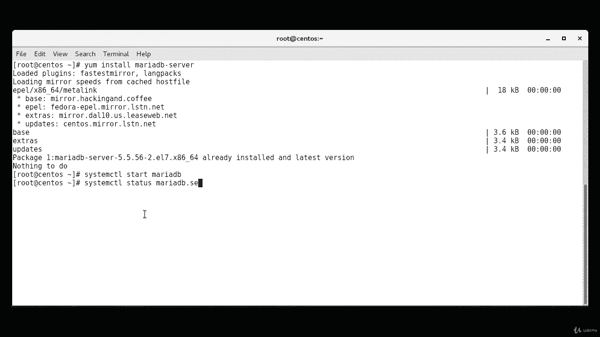
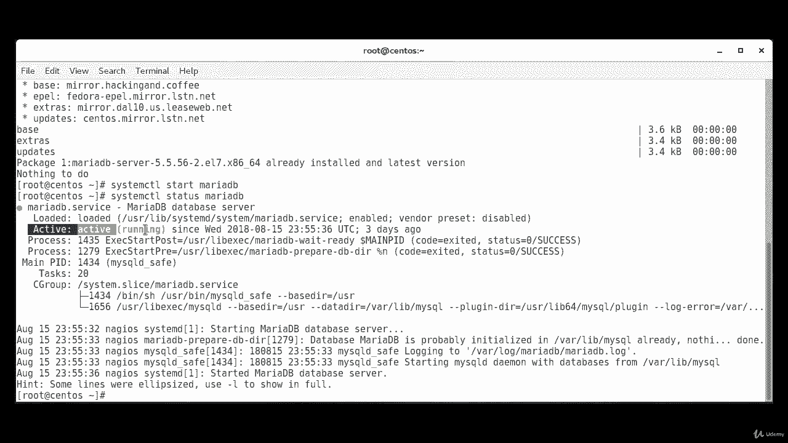
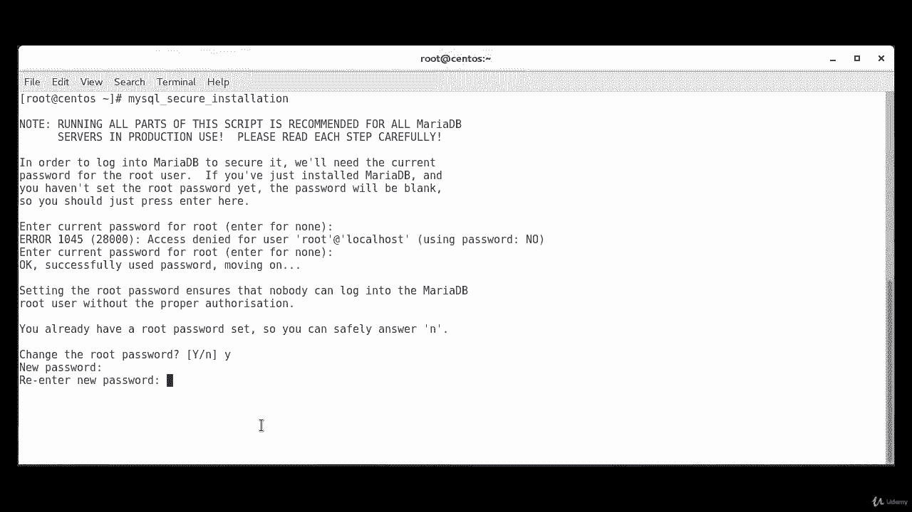
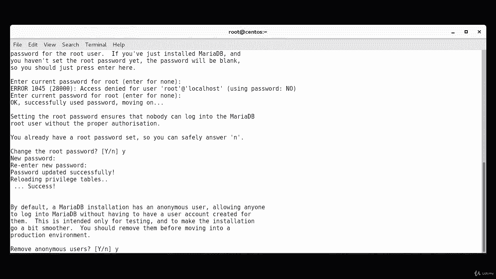
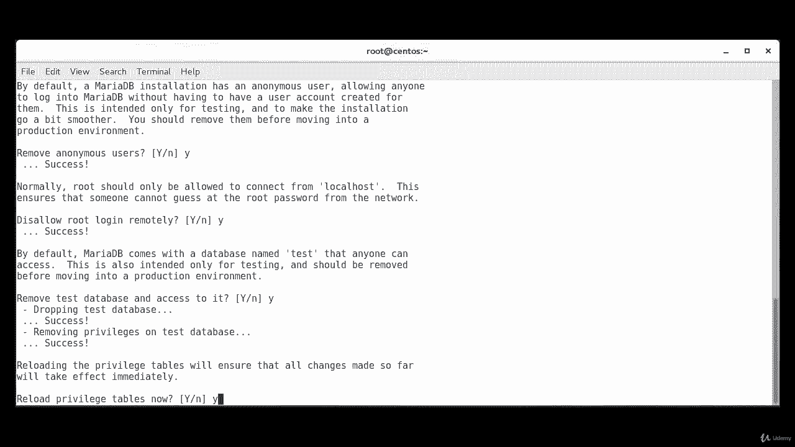
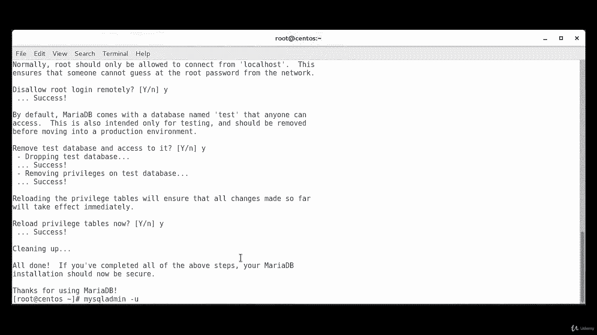
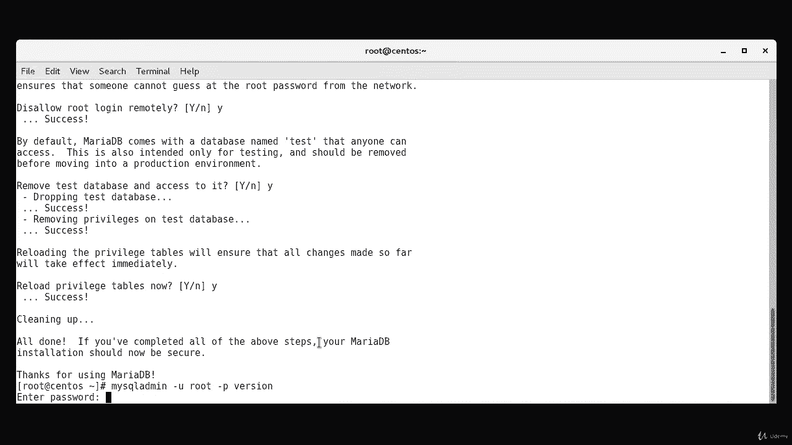
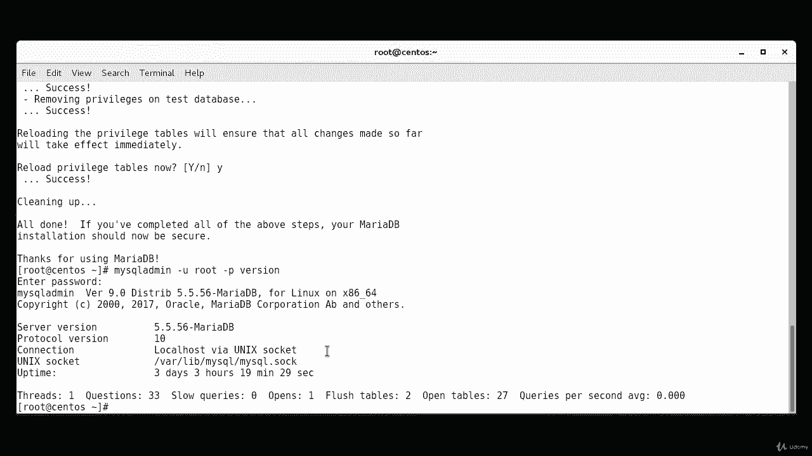
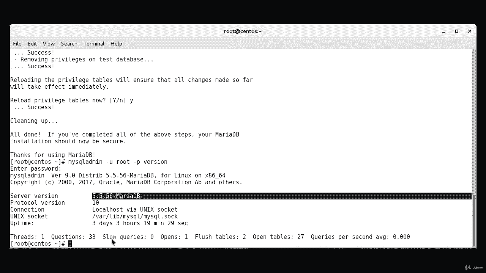

# [FreeCourseSite.com] Udemy - Red Hat Certified Engineer (RHCE) - 2018 - P31：7. Maridb--1. Installation and verification - 我吃印度飞饼 - BV1jJ411S76a

Hello students and welcome In this lecture， we are going to install Maria Db on our Sos 7 machine。

So the first step is yum install。Maria。Dbi。Dash server。Okay on， my machine is already installed。

But if it's not installing your machine， then it'll go ahead and ask you if it's ready it found the package and if it's okay to install it。

 and you'll just press yes and it should install。 So one， once it is installed， then we need to。

I started。Okay， and the way you start demon is system CTtL。Start。Maria。Dbi。

Okay it is started now we're going to check the status。So system CTL。Status。

Maria Deby。And as you can see， it is active and running。

Now， just like any other service， we want to make sure that Maria Db starts at boot time。

 so we have to make sure that it is enabled。System CTL。Enable。Maria D B。Okay。

 and that creates a link that makes sure that it does start at boot time。

So Maria Db includes a security script to change some of the less secure default options for things like remote route logins and sample users。

 so we're going to use command to run the security script。Command is my S QL。Undersco secure。

Undersco installation。You want to set the current password， will enter yes。Change the roof password。

 Yes I want to change it。

And then we'll accept all the security suggestions by pressing yes。

Okay， everything is done finally that we have secured the installation。Will verify that it's working。

 So the way you test it is。By typing my。S，QL。Admin。Dash you。

Root。Dash P。Version。

And I'm going to provide it the password。

And as you can see， this is providing us the subversion。And。Also the poor call version。

 the connection， Uni socket and all that， so this proves that our installation was successful。

