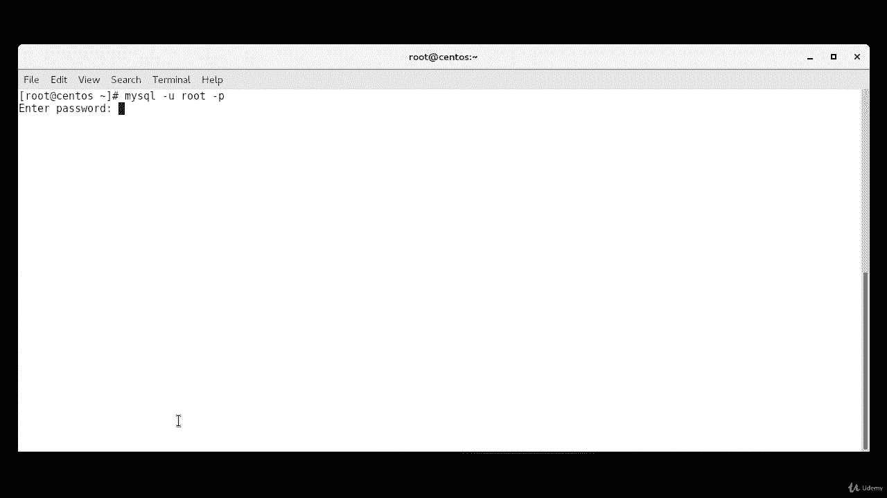
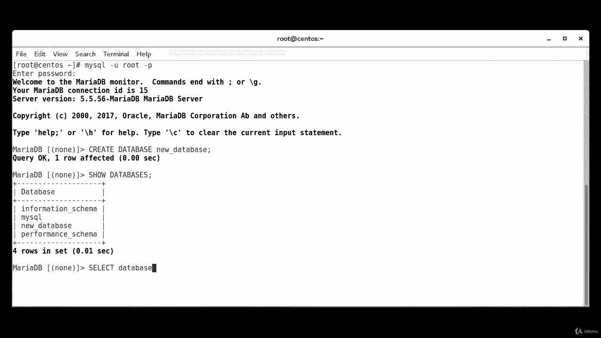
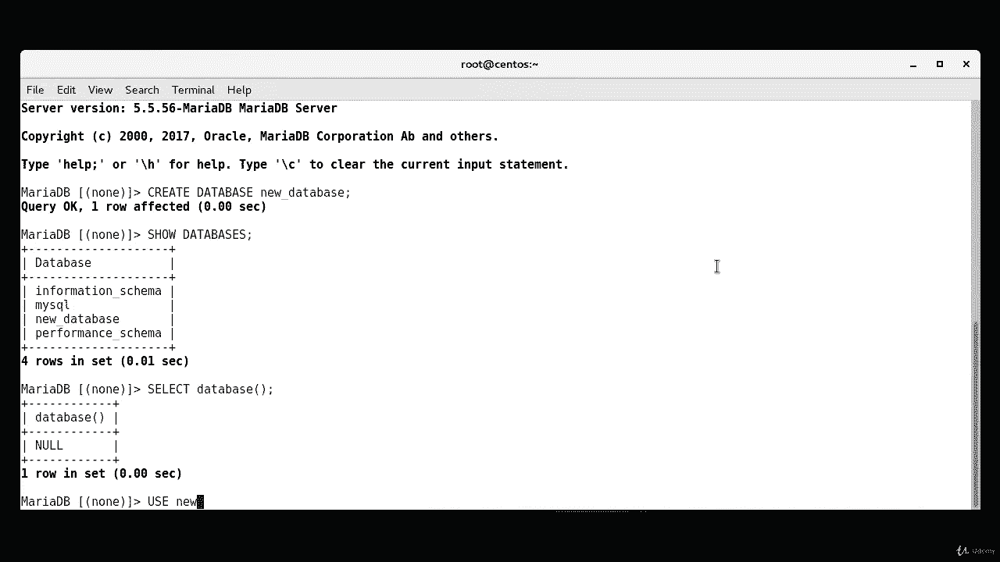
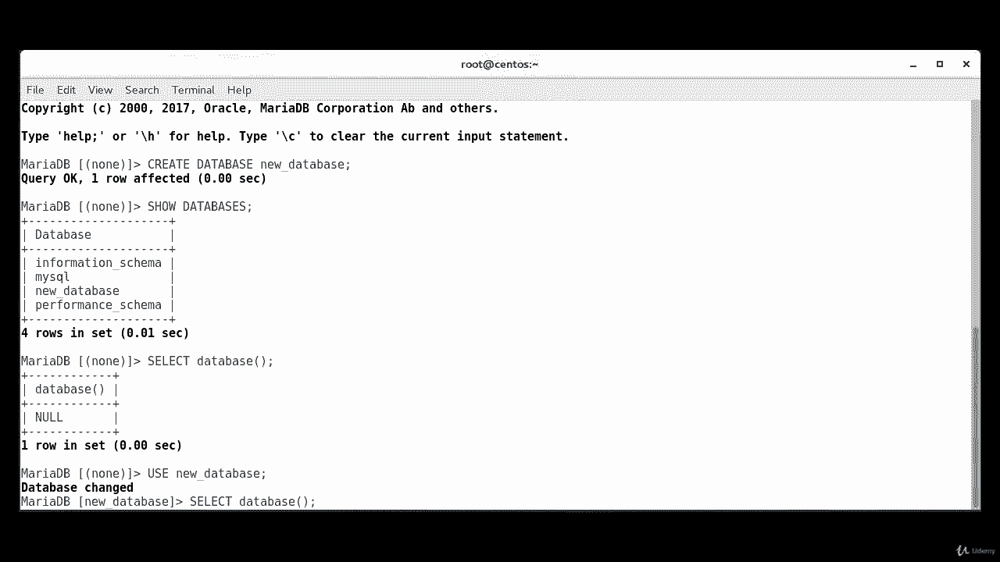
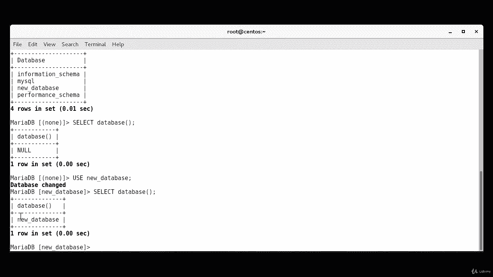
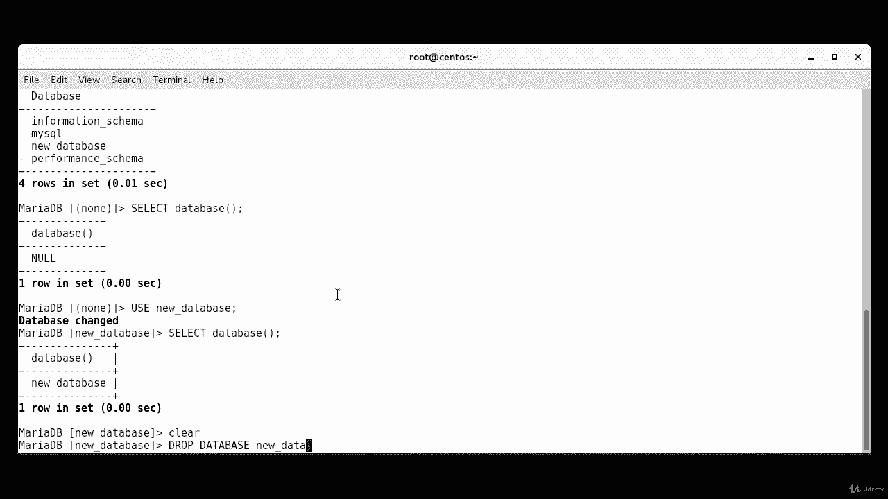
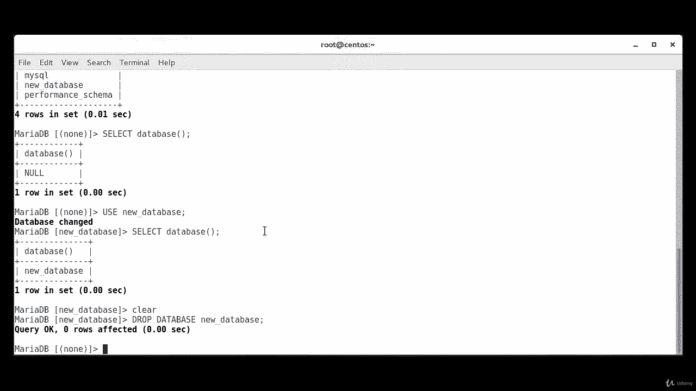

# [FreeCourseSite.com] Udemy - Red Hat Certified Engineer (RHCE) - 2018 - P32：7. Maridb--2. Create and manage a database - 我吃印度飞饼 - BV1jJ411S76a

Okay， now we're going to learn how to create a database in Maria Db。 and the way we do it is first。

 we actually log into the。Database， of SQl。Dash you。Root。Dash P。

It's going to ask for the root password。Okay， now we are logged in。

And we're going to start with create。Database。And we're going to call it new。Database。

 that's the name。And we can end with a colon。And the response you should get is query OK。

 one row affected。Now， the way you。Look at databases。Is show。Databases。Colon。

It'll give you the databases that are already。Configured in the system。

So any operations performed without explicitly specifying a database will be performed on the currently selected database。

In order to find out which database is currently selected， we type select。Daabase。

And as you can see， we have received a result of null。

 this means that no database is currently selected。

To select a database to use for subsequent operations， we're going to use this command。Use。

New the one that we just created。

Database。Daabase changed。So we can see that the database has been selected by reissuing the command we ran previously。

So， now。If we were to type select。Data。😔，Vase。

Enter。And our new database， instead of nowll， now it says new database。

Okay， how do we delete a database in Maria Ding？And it's drop。Database。New。

 that's our database that we want to drop。

Qureoke is euros affected。This operation cannot be reversed。

 so you have to make sure that you wish to delete before pressing enter。

If this command executed on a database that does not exist， then it'll say can drop database。

 new database database doesn't exist。

