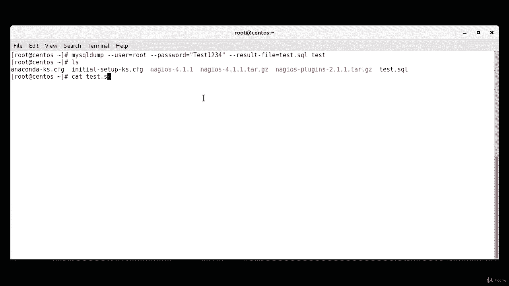
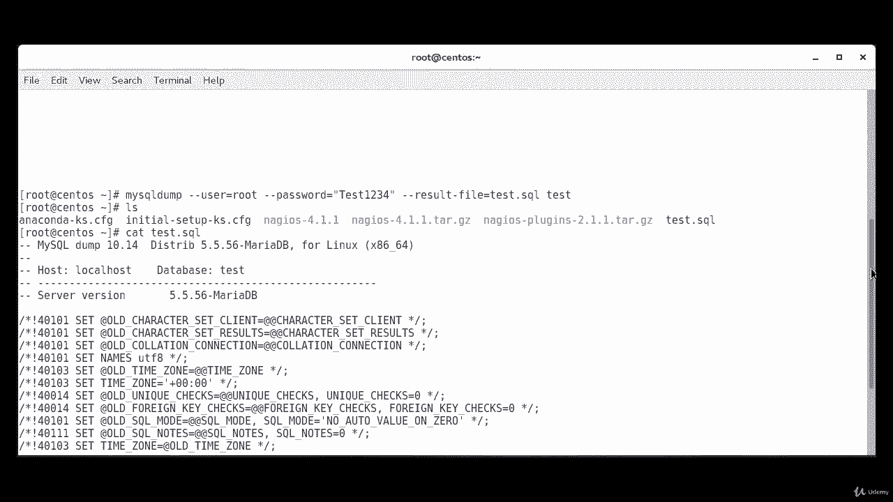
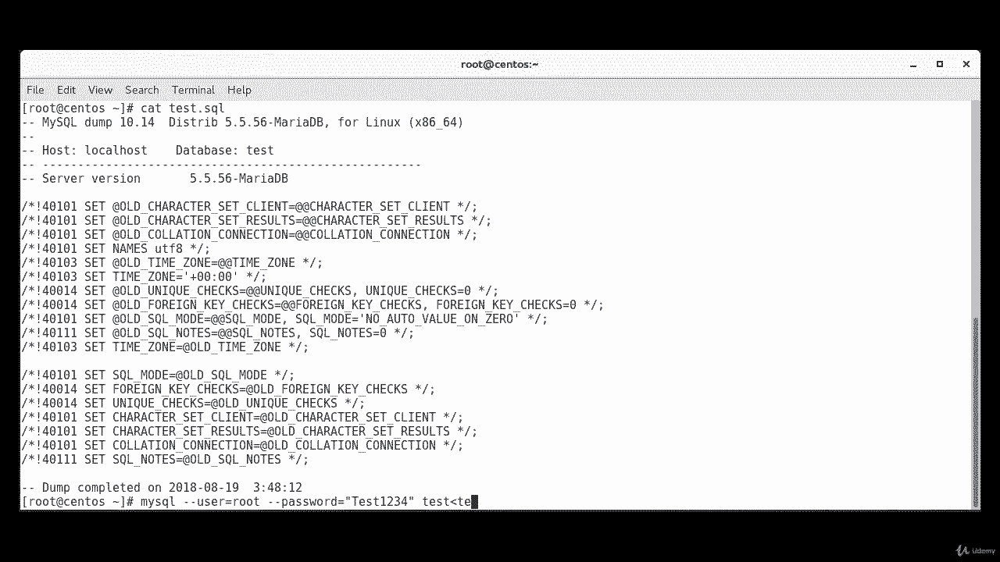
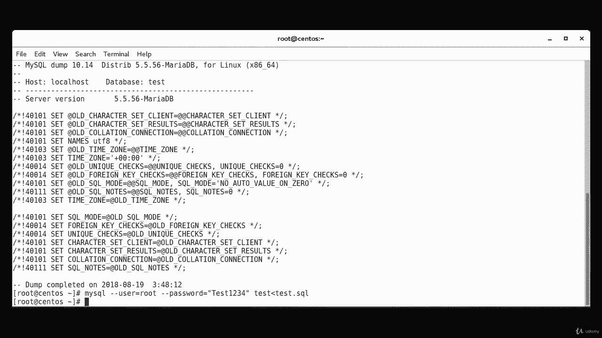

# [FreeCourseSite.com] Udemy - Red Hat Certified Engineer (RHCE) - 2018 - P33：7. Maridb--3. Backup and recover - 我吃印度飞饼 - BV1jJ411S76a

Okay now we're going to create a test database and then we're going to try to back it up and restore it。

So you start off with my SQL。Dash you。Root。Dash P。Okay。And then we're going to create。Database。

 and we're gonna call it test。K's created。Okay， now we're going to use。

MMS My SQL dump command in order to back up our test database。My SQl。Dump。Dash dash user。Equals root。

Dash dash password。Equals。My password。I just give it。Test。😔，2，3，4。Dash dash result。Dash file。

Equals test。DotsQl。And。Space test。So as you can see， we get a file called test。sql here。

And if we look inside the file。

We'll see stuff like this。That has been backed up。

Okay， now we're going to use a command to go ahead and restore it。 So my SQL。Dash dash user。

Equals root。Dash， dash。Password。Equals。My password。Test。And direct it to。

Test dot Sql。The content of the SQL file here called Testta SQL automatically。

Deals with table recreations。 So if you restore the database in a server where it doesn't already exist。

 you'll need to create it before。The S file doesn't recreate the database itself。

