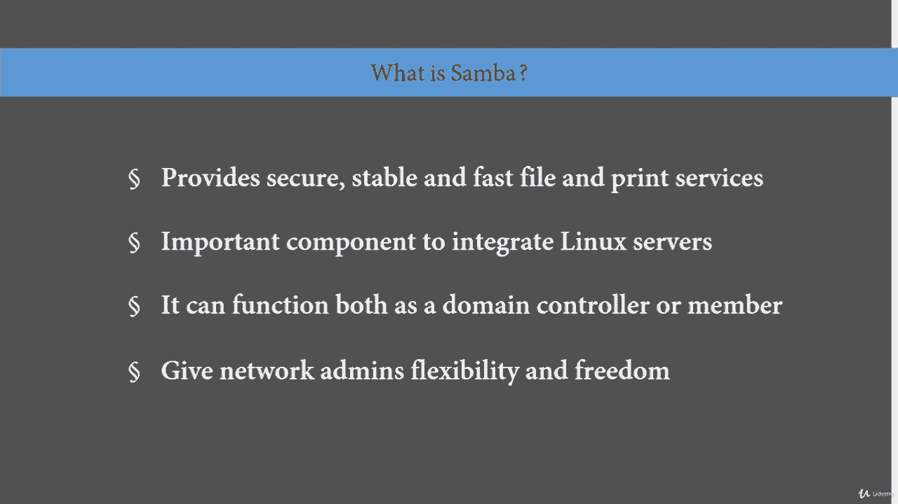
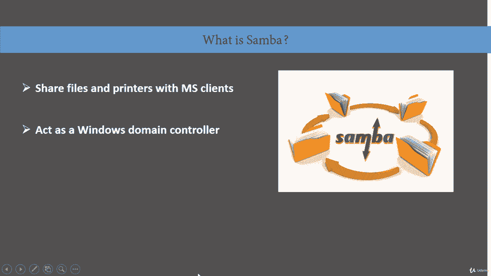
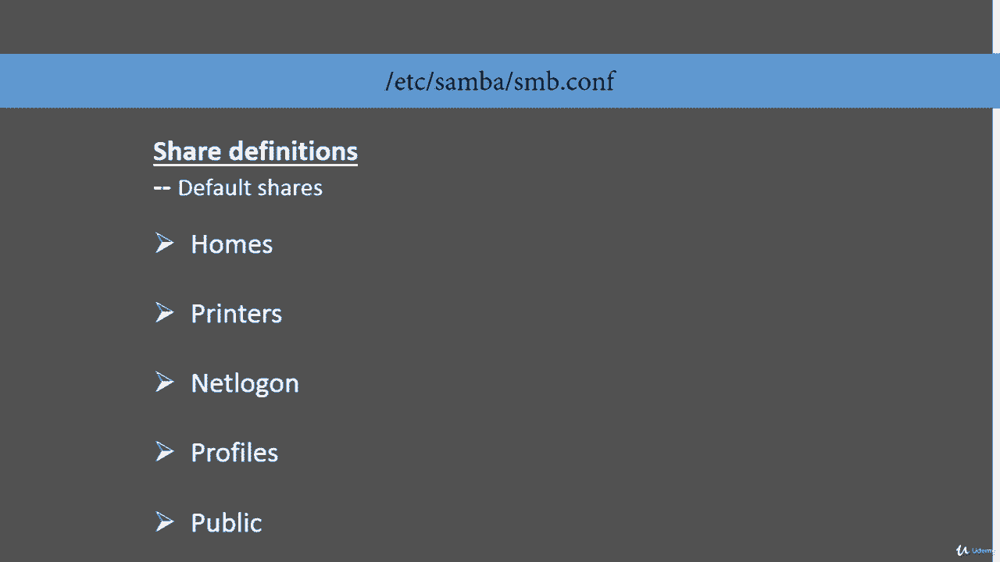

# [FreeCourseSite.com] Udemy - Red Hat Certified Engineer (RHCE) - 2018 - P34：8. Samba File sharing---1. Introduction - 我吃印度飞饼 - BV1jJ411S76a

Hello students and welcome。 This lecture is going to be on Sammba。So what is Ss。

 Sba is the standard Windows interoperability suite of programs for Linux and Uni。It provides secure。

 stable and fast file and print services for all clients using the SMB or SFs protocol。

 such as all versions of DoOS and Windows， OS2， Linux， and many others。

It is an important component to seamlessly integrate Linux or Uni servers and desktops into active directory environments。

 It can function both as a domain controller or as a regular domain member。

It is a software package that gives network administrators flexibility and freedom in terms of setup。

 configuration and choice of systems and equipment。

 because of all that it offers SAMba has great popularity， it is used quite extensively。

So what is SAmba and what is it used for used for sharing files and printers。

 so youre can have probably in a typical setting you'll have one Sammba server。

Running on some flavor of Linux。And then you'll have different Windows clients。Sayme Windows 7。

 Windows 8，10。And you might have a printer attached。

 printer or two attached to the same setup as well。And that's what typically is used for。

And it acts at Windows domain control also， but it's not always necessary。

 it could be a Windows domain member as well。Okay， and。

There are two files that are mainly going to be our concern in this。

Section about Sammba， one is called SB do com is typically located under slash ETC s Samba。

 That's the default location。And this is the file that we get in order to configure our setup。

And the second file that is going to be configured indirectly will be SMB password file。

And what that does basically synchronizes。S about password with Linux passwords。

So the SMba configuration file has two account file that's the file that we physically go in and configure so it has two parts to it。

 the first one is called the global options and the second one is shared definitions so in the global options the first one is network options This is where you set up the work group。

And the host name and the interfaces。The second one is logging options。

 this is where you configure what size of your logs are going to be。

And what the log rotation is going to be， What is the location for your log server。

 Is it local or is it remote。The next one is standalone server options， that is the authentication。

 what kind of authentication you're going to use， you're going to configure it in this section。

Doomain member options is。The information about users on this share。

It's the backend where the user's information is stored and domain controller is actually where it's physically stored。

 so the domain controller is going to have the domain member options in it。

And browser control options is browser control gives you a visual of what your network looked like。

 and this is when we talk about browser， it's not your Internet Explorr Fireworks。

 This is network browser。Name resolution is netbuers configuration in Sammba。

Print options or printing options are how the drivers are going to be handled。

 how the printing is going to be queued， how many printers are going to be installed。

 This is where that goes。 fileile system options this somebody does provide extended file system options。

 And if you're going to use file systems， then this section is。Okay。

 now let's talk about the share definitions， so share definitions are like the bottom half of the SMmb。

com file， we're still in the same file。And let's start with homess。

 Home is where you're going to have the home directories of the users。Printers。

 that's where you're going to have the printer definitions。

 printer drivers and all the printer related。Information。Net log on is。

Net log on is going to be your network log on and that's where you're going to configure that profiles if you're setting up something like say net roaming profiles。

 So this is where you're going to configure a profile that you can use throughout as a template。

And public， if you have read only file systems that you want to share。

 you will assign it in the public section of this file。

